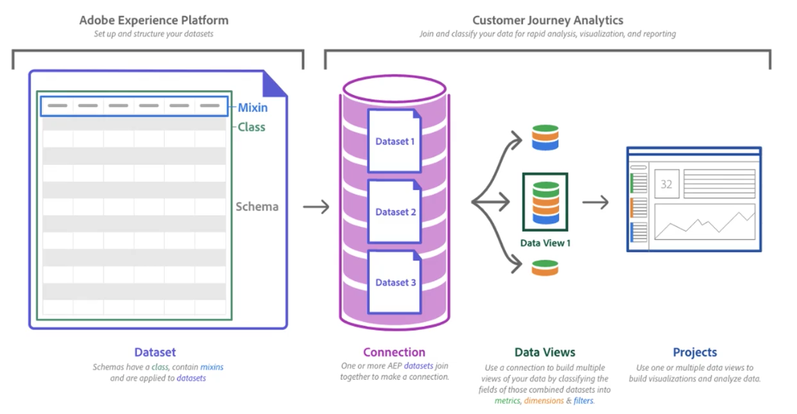

# Panoramica sull’acquisizione dei dati

Esistono diverse opzioni per acquisire dati in Customer Journey Analytics. Alcuni di essi presuppongono la migrazione dei dati tradizionali di Adobe Analytics, altri presuppongono l’utilizzo di dati acquisiti direttamente in Adobe Experience Platform.

>[!IMPORTANT]
>
>In tutti gli scenari, i dati che desideri _use_ in Customer Journey Analytics _acquisito_ in Adobe Experience Platform.

Vedi l’architettura dei Customer Journey Analytics di alto livello mostrata in precedenza in [Panoramica](https://experienceleague.adobe.com/docs/analytics-platform/using/cja-overview/cja-overview.html?lang=it):

Il set di dati nell’architettura di cui sopra può provenire da una varietà di fonti: dati batch, dati in streaming, dati provenienti da una distribuzione Adobe Analytics corrente, dati provenienti dal tracciamento del sito web/app mobile tramite l’SDK Adobe Experience Platform Web/Mobile o dati provenienti da un provider di dati di terze parti per il quale l’Adobe fornisce un connettore sorgente. E potete avere molti di questi set di dati.

Questa sezione della documentazione fornisce guide rapide per diversi scenari.

## Acquisizione e utilizzo di dati da Adobe Analytics tradizionale

Adobe Analytics è già stato implementato e desideri acquisire questi dati in Adobe Experience Platform e utilizzarli, combinarli e analizzarli con dati di altri canali e origini dati nel Customer Journey Analytics.

Vedi [Acquisizione e utilizzo di dati da Adobe Analytics tradizionale](./analytics.md) per ulteriori informazioni.

## Inserire e utilizzare i dati tramite Adobe Experience Platform Web SDK e Edge Network

Vuoi analizzare il tuo sito web con la tecnologia Adobe, potenzialmente migrando da un’altra soluzione o iniziare a monitorare il comportamento del visitatore. Segui le best practice di Adobe per l’implementazione, che utilizza gli SDK Adobe Experience Platform e la rete Edge di , per acquisire i dati. Puoi quindi utilizzare, combinare e analizzare i dati acquisiti con i dati provenienti da altri canali e origini dati nel Customer Journey Analytics.

Vedi [Inserire e utilizzare i dati tramite Adobe Experience Platform Web SDK e Edge Network](./aepwebsdk.md) per ulteriori informazioni.

## Acquisizione e utilizzo di dati batch

Sono disponibili dati batch rilevanti che forniscono dettagli utili per comprendere meglio il comportamento dei clienti e analizzare le interazioni dei clienti. Esempi di tali dati batch sono file flat in formato CSV, JSON o Parquet da un sistema CRM, un’applicazione fedeltà o un’altra soluzione per la quale l’Adobe attualmente non fornisce un connettore di origine. L’inserimento di questi dati batch in Adobe Experience Platform consente di utilizzarli, combinarli e analizzarli con dati provenienti da altri canali e origini dati nel Customer Journey Analytics.

Vedi [Acquisizione e utilizzo di dati batch](./batch.md) per ulteriori informazioni.

## Inserire e utilizzare i dati in streaming

Hai un’origine dati rilevante come un sistema CRM, un sistema ERP o qualsiasi altra origine che fornisce dettagli che possono aiutarti a comprendere meglio il comportamento dei clienti e ad analizzare le interazioni dei clienti. Tale origine dati è in grado di comunicare tramite l’infrastruttura di streaming cloud HTTP o pubblico, ma per la quale attualmente Adobe non fornisce un connettore sorgente. L’inserimento in tempo reale di questi dati in streaming in Adobe Experience Platform consente di utilizzarli, combinarli e analizzarli con dati provenienti da altri canali e origini dati nel Customer Journey Analytics.

Vedi [Inserire e utilizzare i dati in streaming](./streaming.md) per ulteriori informazioni.

## Inserire e utilizzare i dati utilizzando i connettori sorgente

Sono disponibili dati da un&#39;origine supportata da un connettore di origine. I connettori sorgente sono configurazioni configurabili che consentono di acquisire dati da applicazioni di Adobe, prime e terze parti in Adobe Experience Platform. Vedi [Panoramica dei connettori sorgente](https://experienceleague.adobe.com/docs/experience-platform/sources/home.html?lang=it) per una panoramica dei connettori sorgente disponibili. Utilizzando il connettore di origine è possibile acquisire facilmente i dati dall’origine in Adobe Experience Platform e quindi utilizzarli, combinarli e analizzarli con i dati di altri canali e origini dati del Customer Journey Analytics.

Vedi [Inserire e utilizzare i dati utilizzando i connettori sorgente](./sources.md) per ulteriori informazioni.

