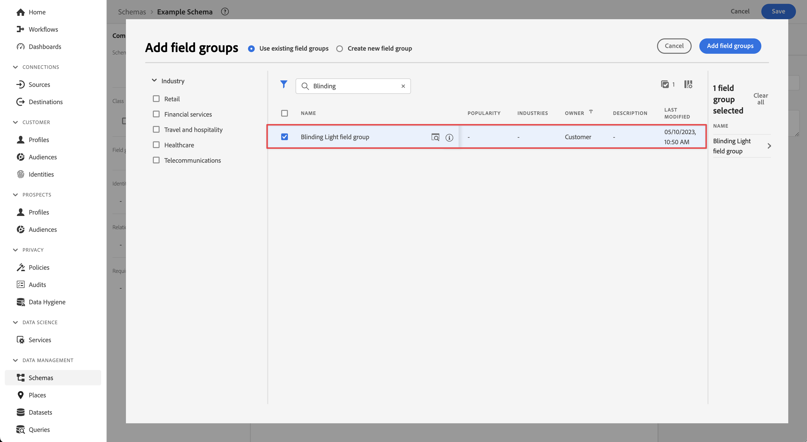
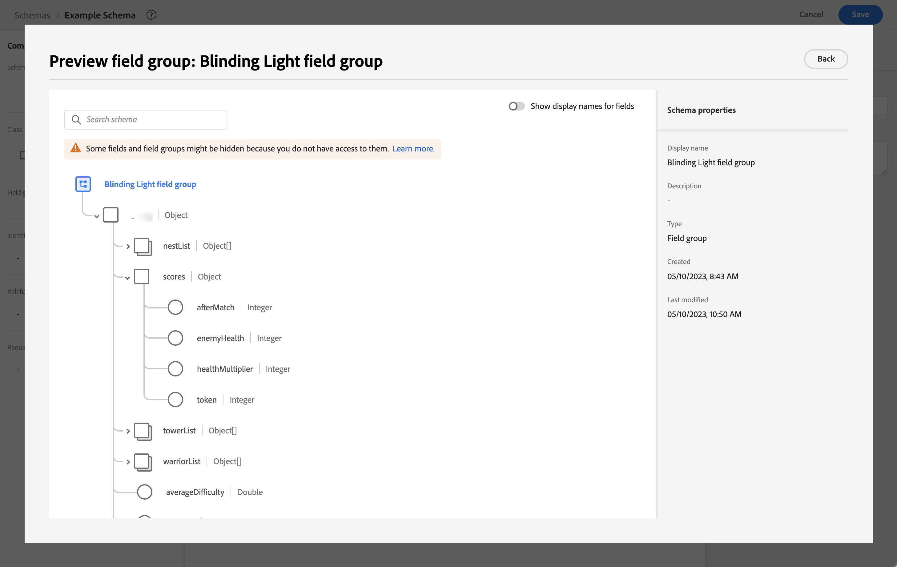
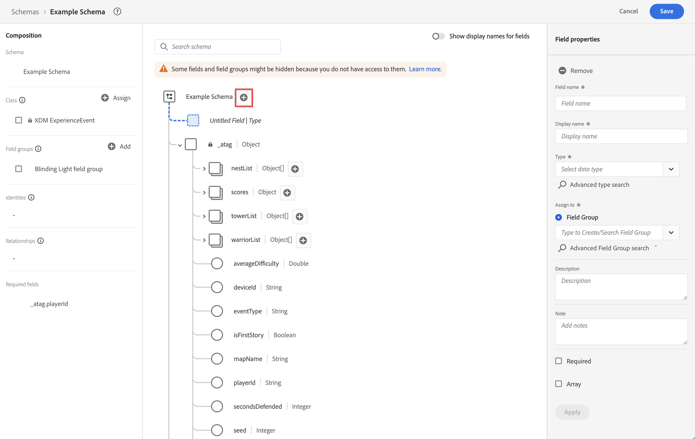
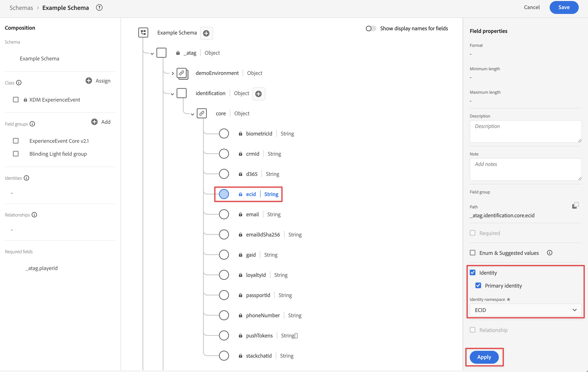
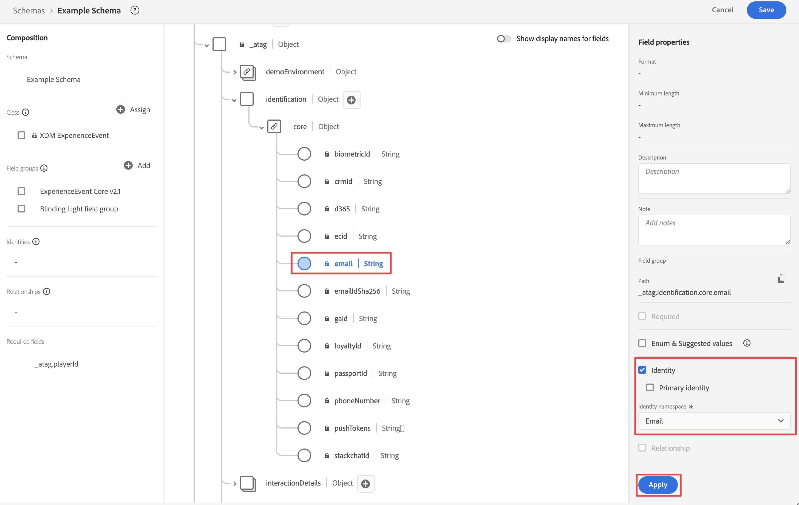

# Acquisire dati tramite API server di Edge Network

Questa guida rapida spiega come acquisire i dati di tracciamento da dispositivi come dispositivi IoT, set-top box, console di gioco e applicazioni desktop direttamente in Adobe Experience Platform utilizzando l’API server di Adobe Experience Platform Edge Network e Edge Network. Quindi utilizza tali dati in Customer Journey Analytics.

A questo scopo, devi:

- **Configurare uno schema e un set di dati** in Adobe Experience Platform per definire il modello (schema) dei dati da raccogliere e dove raccogliere effettivamente i dati (set di dati).

- **Configurare un flusso di dati** per configurare la rete Edge di Adobe Experience Platform in modo che i dati raccolti vengano indirizzati al set di dati configurato in Adobe Experience Platform.

- **Utilizza l&#39;API server** per inviare dati direttamente dall&#39;applicazione o dal gioco in esecuzione su un desktop, una console di gioco, un dispositivo IoT o un set-top box allo stream di dati.

- **Distribuire e convalidare**. Crea un ambiente in cui puoi eseguire iterazioni sullo sviluppo; una volta convalidato tutto, pubblicalo live nell’ambiente di produzione.

- **Impostare una connessione** in Customer Journey Analytics. Questa connessione deve includere almeno il set di dati di Adobe Experience Platform.

- **Configurare una visualizzazione dati** in Customer Journey Analytics per definire le metriche e le dimensioni da utilizzare in Analysis Workspace.

- **Configurare un progetto** in Customer Journey Analytics per generare rapporti e visualizzazioni.

>[!NOTE]
>
>Questa guida rapida è una guida semplificata su come acquisire in Adobe Experience Platform i dati raccolti da un’applicazione o un gioco in esecuzione su un dispositivo IoT, un set-top box, una console di gioco o un desktop e utilizzarli in Customer Journey Analytics. Ti consigliamo vivamente di esaminare le informazioni aggiuntive quando vi fai riferimento.


## Configurare uno schema e un set di dati

Per acquisire i dati in Adobe Experience Platform, devi innanzitutto definire quali dati desideri raccogliere. Tutti i dati inseriti in Adobe Experience Platform devono essere conformi a una struttura standard e denormalizzata affinché vengano riconosciuti e utilizzati dalle capacità e funzionalità a valle. Experience Data Model (XDM) è il framework standard che fornisce una struttura sotto forma di schemi.

Una volta definito uno schema, utilizza uno o più set di dati per memorizzare e gestire la raccolta di dati. Un set di dati è un costrutto di archiviazione e gestione per una raccolta di dati (in genere una tabella) che contiene uno schema (colonne) e dei campi (righe).

Tutti i dati inseriti in Adobe Experience Platform devono essere conformi a uno schema predefinito prima di poter essere memorizzati come set di dati.

### Configurare uno schema

Desideri tenere traccia di alcuni dati minimi dai profili che giocano al tuo gioco su una console, ad esempio identificazione, punteggi, avanzamento e altre informazioni.
Devi innanzitutto definire uno schema che modella questi dati.

Per configurare lo schema:

1. Nell&#39;interfaccia utente di Adobe Experience Platform, nella barra a sinistra, seleziona **[!UICONTROL Schemi]** in [!UICONTROL GESTIONE DATI].

1. Seleziona **[!UICONTROL Crea schema]**.
.
1. Nel passaggio Selezionare una classe della procedura guidata Crea schema:

   1. Seleziona **[!UICONTROL Evento esperienza]**.

      

      >[!INFO]
      >
      >    Per modellare il _comportamento_ di un profilo (come nome di scena, premere il pulsante per aggiungere al carrello) viene utilizzato uno schema evento esperienza. Per modellare gli _attributi_ del profilo (come nome, e-mail, genere) viene utilizzato uno schema Individual Profile.

   1. Seleziona **[!UICONTROL Avanti]**.


1. Nel [!UICONTROL passaggio Nome e revisione] della procedura guidata [!UICONTROL Crea schema]:

   1. Immetti un **[!UICONTROL nome visualizzato dello schema]** per lo schema e (facoltativo) una **[!UICONTROL Descrizione]**.

      

   1. Seleziona **[!UICONTROL Fine]**.

1. Nella scheda Struttura dello schema di esempio:

   1. Selezionare **[!UICONTROL + Aggiungi]** in [!UICONTROL Gruppi di campi].

      

      I gruppi di campi sono raccolte riutilizzabili di oggetti e attributi che consentono di estendere facilmente lo schema.

   1. Nella finestra di dialogo [!UICONTROL Aggiungi gruppi di campi], seleziona il gruppo di campi **[!UICONTROL Luce accecante]** dall&#39;elenco. Questo gruppo di campi è stato creato per tenere traccia dei progressi degli utenti durante l&#39;esecuzione di un gioco fittizio intitolato Blinding Light su una console.

      

      Puoi selezionare il pulsante di anteprima per visualizzare un’anteprima dei campi che fanno parte del gruppo di campi, ad esempio `scores > afterMatch`.

      

      Seleziona **[!UICONTROL Indietro]** per chiudere l&#39;anteprima.

   1. Seleziona **[!UICONTROL Aggiungi gruppi di campi]**.

1. Seleziona **[!UICONTROL +]** accanto al nome schema.

   

1. Nel pannello [!UICONTROL Proprietà campo], immetti `identification` come [!UICONTROL Nome campo], **[!UICONTROL Identificazione]** come [!UICONTROL Nome visualizzato], seleziona **[!UICONTROL Oggetto]** come [!UICONTROL Tipo] e seleziona **[!UICONTROL Core ExperienceEvent v2.1]** come [!UICONTROL Gruppo campi].

   >[!NOTE]
   >
   >Se tale gruppo di campi non è disponibile, cercane un altro contenente campi di identità. Oppure [crea un nuovo gruppo di campi](https://experienceleague.adobe.com/docs/experience-platform/xdm/ui/resources/field-groups.html?lang=it) e [aggiungi nuovi campi di identità](https://experienceleague.adobe.com/docs/experience-platform/xdm/ui/fields/identity.html?lang=it#define-a-identity-field) (come `ecid`, `crmId` e altri di cui hai bisogno) al gruppo di campi e seleziona il nuovo gruppo di campi.

   

   L’oggetto di identificazione aggiunge funzionalità di individuazione dello schema. Nel tuo caso, vuoi identificare i profili che giocano al tuo gioco utilizzando l’ID Experience Cloud e l’indirizzo e-mail che utilizzano per accedere alla loro console di gioco. Sono disponibili molti altri attributi per tenere traccia dell’identificazione della persona.

   Seleziona **[!UICONTROL Applica]** per aggiungere questo oggetto allo schema.

1. Seleziona il campo **[!UICONTROL ecid]** nell&#39;oggetto di identificazione appena aggiunto, quindi seleziona **[!UICONTROL Identità]** e **[!UICONTROL Identità primaria]** e **[!UICONTROL ECID]** dall&#39;elenco [!UICONTROL Spazio dei nomi identità] nel pannello di destra.

   

   Stai specificando l’Experience Cloud Identity come identità principale che il servizio Adobe Experience Platform Identity può utilizzare per combinare (unire) il comportamento dei profili con lo stesso ECID.

   Seleziona **[!UICONTROL Applica]**. Nell’attributo ecid viene visualizzata l’icona di un’impronta digitale.

1. Seleziona il campo **[!UICONTROL email]** nell&#39;oggetto di identificazione appena aggiunto, quindi seleziona **[!UICONTROL Identity]** e **[!UICONTROL Email]** dall&#39;elenco [!UICONTROL Identity namespace] nel pannello [!UICONTROL Field Properties].

   

   Stai specificando l’indirizzo e-mail come un’altra identità che il servizio Adobe Experience Platform Identity può utilizzare per combinare (unire) il comportamento dei profili.

   Seleziona **[!UICONTROL Applica]**. Nell’attributo e-mail viene visualizzata l’icona di un’impronta digitale.

   Seleziona **[!UICONTROL Salva]**.

1. Seleziona l&#39;elemento principale dello schema con il nome dello schema, quindi seleziona l&#39;opzione **[!UICONTROL Profilo]**.

   Viene richiesto di abilitare lo schema per il profilo. Una volta abilitato, quando i dati vengono inseriti in set di dati basati su questo schema, tali dati vengono uniti su Real-Time Customer Profile.

   Per ulteriori informazioni, consulta la sezione [Abilitare lo schema per l’utilizzo in Real-Time Customer Profile](https://experienceleague.adobe.com/docs/experience-platform/xdm/tutorials/create-schema-ui.html?lang=it#profile).

   >[!IMPORTANT]
   >
   >    Una volta salvato uno schema abilitato per il profilo, non è più possibile disattivarlo per il profilo.

   

1. Seleziona **[!UICONTROL Salva]** per salvare lo schema.

Hai creato uno schema minimo che modella i dati che puoi acquisire dal gioco. Lo schema consente di identificare i profili utilizzando Experience Cloud Identity e l’indirizzo e-mail. Attivando lo schema per il profilo, puoi garantire che i dati acquisiti dal gioco da console vengano aggiunti al Profilo cliente in tempo reale.

Oltre ai dati sul comportamento, puoi anche acquisire i dati degli attributi del profilo dalla console (ad esempio i dettagli dei profili connessi alla console).

Per acquisire i dati del profilo:

- Crea uno schema basato sulla classe di profilo individuale XDM.

- Aggiungi il gruppo di campi Profile Core v2 allo schema.

- Aggiungi un oggetto di identificazione basato sul gruppo di campi Profile Core v2.

- Definisci l’ID Experience Cloud come identificatore principale e l’e-mail come identificatore.

- Abilitare lo schema per il profilo

Per ulteriori informazioni sull’aggiunta e la rimozione di gruppi di campi e singoli campi a uno schema, consulta la sezione [Creare e modificare schemi nell’interfaccia utente](https://experienceleague.adobe.com/docs/experience-platform/xdm/ui/resources/schemas.html?lang=it).

### Configurare un set di dati

Con lo schema, hai definito il modello dati. Ora devi definire il costrutto per memorizzare e gestire tali dati utilizzando i set di dati.

Per configurare il set di dati:

1. Nell&#39;interfaccia utente di Adobe Experience Platform, nella barra a sinistra, seleziona **[!UICONTROL Set di dati]** in [!UICONTROL GESTIONE DATI].

2. Seleziona **[!UICONTROL Crea set di dati]**.

   

3. Seleziona **[!UICONTROL Crea set di dati dallo schema]**.

   

4. Seleziona lo schema creato in precedenza e seleziona **[!UICONTROL Successivo]**.

5. Assegna un nome al set di dati e (facoltativamente) fornisci una descrizione.

   

6. Seleziona **[!UICONTROL Fine]**.

7. Selezionare l&#39;opzione **[!UICONTROL Profilo]**.

   Viene richiesto di abilitare il set di dati per il profilo. Una volta abilitato, il set di dati arricchisce i profili dei clienti in tempo reale con i relativi dati inseriti.

   >[!IMPORTANT]
   >
   >    Puoi abilitare un set di dati per il profilo solo quando lo schema a cui aderisce il set di dati è abilitato anche per il profilo.

   

Per ulteriori informazioni su come visualizzare, visualizzare in anteprima, creare, eliminare un set di dati, consulta la sezione [Guida all’interfaccia utente dei set di dati](https://experienceleague.adobe.com/docs/experience-platform/catalog/datasets/user-guide.html?lang=it). E come abilitare un set di dati per Real-Time Customer Profile.

## Configurare un flusso di dati

Un flusso di dati rappresenta la configurazione lato server durante l’implementazione degli SDK Adobe Experience Platform Web e Mobile e dell’API server di Adobe Experience Platform Edge Network. Durante la raccolta dei dati con gli SDK di Adobe Experience Platform e le API server di Edge Network, i dati vengono inviati a Adobe Experience Platform Edge Network. È il flusso di dati che determina a quali servizi vengono inoltrati i dati.

Nella configurazione, desideri che i dati raccolti dal gioco vengano inviati al set di dati in Adobe Experience Platform.

Per impostare il flusso di dati:

1. Nell&#39;interfaccia utente di Adobe Experience Platform, seleziona **[!UICONTROL Datastreams]** da [!UICONTROL DATA COLLECTION] nella barra a sinistra.

2. Seleziona **[!UICONTROL Nuovo flusso di dati]**.

3. Assegna un nome e una descrizione al tuo flusso di dati. Seleziona lo schema dall&#39;elenco [!UICONTROL Schema evento].

   

4. Seleziona **[!UICONTROL Salva]**.

5. Selezionare **[!UICONTROL Aggiungi servizio]**.

6. Nella schermata [!UICONTROL Aggiungi servizio]:

   1. Selezionare **[!UICONTROL Adobe Experience Platform]** dall&#39;elenco [!UICONTROL Service].

   2. Assicurarsi che **[!UICONTROL Enabled]** sia selezionato.

   3. Seleziona il set di dati dall&#39;elenco [!UICONTROL Set di dati evento].

      

   4. Lascia le altre impostazioni e seleziona **[!UICONTROL Salva]** per salvare lo stream di dati.

Il flusso di dati è ora configurato per inoltrare i dati raccolti dal gioco al set di dati in Adobe Experience Platform.

Per ulteriori informazioni su come configurare un flusso di dati e come gestire i dati sensibili consulta la sezione [Panoramica dei flussi di dati](https://experienceleague.adobe.com/docs/experience-platform/datastreams/overview.html?lang=it).

## Utilizzare l’API server di Edge Network

Durante lo sviluppo del gioco, puoi aggiungere chiamate pertinenti all’API server di Adobe Experience Platform Edge Network, se necessario.

Ad esempio, per aggiornare il punteggio del lettore, puoi utilizzare:

```
curl -X POST "https://server.adobedc.net/ee/v2/interact?dataStreamId={DATASTREAM_ID}"
-H "Authorization: Bearer {TOKEN}"
-H "x-gw-ims-org-id: {ORG_ID}"
-H "x-api-key: {API_KEY}"
-H "Content-Type: application/json"
-d '{
   "event": {
      "xdm": {
         "identityMap": {
            "Email_LC_SHA256": [
               {
                  "id": "0c7e6a405862e402eb76a70f8a26fc732d07c32931e9fae9ab1582911d2e8a3b",
                  "primary": true
               }
            ]
         },
         "eventType": "game.scoreUpdate",
         "{sandbox}": {
            "scores": {
               "afterMatch": 132391",
            }
         },
         "timestamp": "2021-08-09T14:09:20.859Z"
      }
   }
}'
```

Nell&#39;esempio di richiesta POST, `{DATASTREAM_ID}` punta all&#39;identificatore dello stream di dati di esempio configurato in precedenza. `{sandbox}` è il nome univoco della sandbox che identifica il percorso del gruppo di campi Luce accecante personalizzato.

Per ulteriori informazioni sull&#39;utilizzo dell&#39;API server di Edge Network, vedere [Raccolta dati interattiva](https://experienceleague.adobe.com/docs/experience-platform/edge-network-server-api/data-collection/interactive-data-collection.html?lang=it) e [Raccolta dati non interattiva](https://experienceleague.adobe.com/docs/experience-platform/edge-network-server-api/data-collection/non-interactive-data-collection.html?lang=it).

## Configurare una connessione

Per utilizzare i dati di Adobe Experience Platform in Customer Journey Analytics, crea una connessione che include i dati risultanti dalla configurazione dello schema, del set di dati e del flusso di lavoro.

Una connessione consente di integrare set di dati da Adobe Experience Platform in Workspace. Per creare rapporti su questi set di dati, devi prima stabilire una connessione tra i set di dati in Adobe Experience Platform e Workspace.

Per creare la connessione:

1. Nell&#39;interfaccia utente di Customer Journey Analytics, seleziona **[!UICONTROL Connessioni]**, facoltativamente da **[!UICONTROL Gestione dati]**, nel menu principale.

2. Seleziona **[!UICONTROL Crea nuova connessione]**.

3. Nella schermata [!UICONTROL Connessione senza titolo]:

   Denomina e descrivi la connessione in [!UICONTROL Impostazioni connessione].

   Selezionare la sandbox corretta dall&#39;elenco [!UICONTROL Sandbox] in [!UICONTROL Impostazioni dati] e selezionare il numero di eventi giornalieri dall&#39;elenco [!UICONTROL Numero medio di eventi giornalieri].

   

   Seleziona **[!UICONTROL Aggiungi set di dati]**.

   Nel passaggio [!UICONTROL Seleziona set di dati] in [!UICONTROL Aggiungi set di dati]:

   - Seleziona i set di dati creati in precedenza e/o altri set di dati rilevanti che desideri includere nella connessione

   - Seleziona **[!UICONTROL Avanti]**.

   Nel passaggio [!UICONTROL Impostazioni set di dati] in [!UICONTROL Aggiungi set di dati]:

   - Per ogni set di dati:

      - Seleziona un [!UICONTROL ID persona] dalle identità disponibili definite negli schemi di set di dati in Adobe Experience Platform.

      - Selezionare l&#39;origine dati corretta dall&#39;elenco [!UICONTROL Tipo origine dati]. Se si specifica **[!UICONTROL Altro]**, aggiungere una descrizione per l&#39;origine dati.

      - Imposta **[!UICONTROL Importa tutti i nuovi dati]** e **[!UICONTROL Recupera i dati esistenti del set di dati]** in base alle tue preferenze.

   - Seleziona **[!UICONTROL Aggiungi set di dati]**.

   Seleziona **[!UICONTROL Salva]**.

Per ulteriori informazioni su come creare e gestire una connessione e come selezionare e combinare i set di dati, consulta la sezione [Panoramica delle connessioni](../connections/overview.md).

## Configurare una visualizzazione dati

Una visualizzazione dati è un contenitore specifico di Customer Journey Analytics che consente di determinare come interpretare i dati da una connessione. Specifica tutte le dimensioni e le metriche disponibili in Analysis Workspace, e da quali colonne tali dimensioni e metriche ottengono i loro dati. Le visualizzazioni dati sono definite in preparazione alle attività di reporting in Analysis Workspace.

Per creare la visualizzazione dati:

1. Nell&#39;interfaccia utente di Customer Journey Analytics, seleziona **[!UICONTROL Visualizzazioni dati]**, facoltativamente da **[!UICONTROL Gestione dati]**, nel menu principale.

2. Selezionare **[!UICONTROL Crea nuova visualizzazione dati]**.

3. Nel passaggio [!UICONTROL Configura]:

   Selezionare la connessione dall&#39;elenco [!UICONTROL Connessione].

   Assegna un nome e (facoltativamente) una descrizione alla connessione.

   

   Seleziona **[!UICONTROL Salva e continua]**.

4. Nel passaggio [!UICONTROL Componenti]:

   Aggiungi qualsiasi campo schema e/o componente standard da includere nelle caselle dei componenti [!UICONTROL METRICS] o [!UICONTROL DIMENSIONS].

   Seleziona **[!UICONTROL Salva e continua]**.

5. Nel passaggio [!UICONTROL Impostazioni]:

   

   Lasciare le impostazioni immutate e selezionare **[!UICONTROL Salva e termina]**.

Consulta [Panoramica delle visualizzazioni dati](../data-views/data-views.md) per ulteriori informazioni su come creare e modificare una visualizzazione dati, quali componenti sono disponibili per l&#39;utilizzo nella visualizzazione dati e come utilizzare le impostazioni di segmenti e sessioni.


## Configurare un progetto

Analysis Workspace è uno strumento basato su browser flessibile che consente di creare rapidamente le analisi e condividere i dati rilevati sulla base dei tuoi dati. Usa i progetti Workspace per combinare componenti dati, tabelle e visualizzazioni per sviluppare analisi da condividere con altri nella tua organizzazione.

Per creare il progetto:

1. Nell&#39;interfaccia utente di Customer Journey Analytics, seleziona **[!UICONTROL Progetti]** nel menu principale.

2. Seleziona **[!UICONTROL Progetti]** nel menu di navigazione a sinistra.

3. Seleziona **[!UICONTROL Crea progetto]**.

   

   Seleziona **[!UICONTROL Progetto vuoto]**.

   

4. Seleziona la visualizzazione dati dall’elenco.

   .

5. Per creare il primo rapporto, inizia a trascinare dimensioni e metriche sulla [!UICONTROL tabella a forma libera] nel [!UICONTROL pannello].

Per ulteriori informazioni su come creare progetti e generare analisi utilizzando componenti, visualizzazioni e pannelli, consulta la sezione [Panoramica di Analysis Workspace](../analysis-workspace/home.md).

>[!SUCCESS]
>
>Hai completato tutti i passaggi. A partire dalla definizione dei dati da raccogliere (schema) e della posizione in cui memorizzarli (set di dati) in Adobe Experience Platform. Hai configurato un flusso di dati in Edge Network per garantire che i dati possano essere inoltrati a tale set di dati. Poi hai utilizzato l’API server di Edge Network per inviare tali dati allo stream di dati. Hai definito una connessione in Customer Journey Analytics per utilizzare i tuoi dati di gioco e altri dati. La definizione della visualizzazione dati ti consente di specificare la dimensione e le metriche da utilizzare; infine, hai creato il tuo primo progetto per visualizzare e analizzare i dati del gioco.
