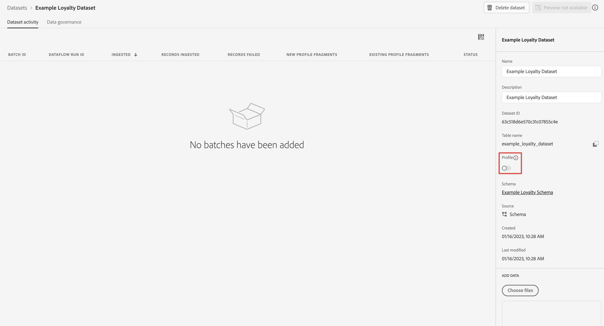

# Inserire e utilizzare i dati in streaming

Questa guida rapida spiega come inserire dati in streaming in Adobe Experience Platform e utilizzarli in Customer Journey Analytics.

A questo scopo, devi:

- **Configurare uno schema e un set di dati** in Adobe Experience Platform per definire il modello (schema) dei dati da raccogliere e dove raccogliere effettivamente i dati (set di dati).

- **Usa connettore di origine API HTTP** per inviare facilmente i dati nel set di dati configurato in Adobe Experience Platform.

- **Impostare una connessione** in Customer Journey Analytics. Questa connessione deve includere almeno il set di dati Adobe Experience Platform.

- **Configurare una visualizzazione dati** in Customer Journey Analytics per definire le metriche e le dimensioni da utilizzare in Analysis Workspace.

- **Configurare un progetto** in Customer Journey Analytics per generare rapporti e visualizzazioni.


>[!NOTE]
>
>Questa è una guida semplificata su come inserire dati in streaming in Adobe Experience Platform e utilizzarli nel Customer Journey Analytics. Si consiglia vivamente di studiare le informazioni aggiuntive quando si fa riferimento a.

## Configurare uno schema e un set di dati

Per acquisire i dati in Adobe Experience Platform, devi innanzitutto definire quali dati desideri raccogliere. Tutti i dati acquisiti in Adobe Experience Platform devono essere conformi a una struttura standard e denormalizzata per essere riconosciuti e utilizzati dalle funzionalità e funzionalità a valle. Experience Data Model (XDM) è il framework standard che fornisce questa struttura sotto forma di schemi.

Una volta definito uno schema, utilizza uno o più set di dati per memorizzare e gestire la raccolta di dati. Un set di dati è un costrutto di archiviazione e gestione per una raccolta di dati, in genere una tabella, che contiene uno schema (colonne) e dei campi (righe).

Tutti i dati acquisiti in Adobe Experience Platform devono essere conformi a uno schema predefinito prima di poter essere mantenuti come set di dati.

### Configurare uno schema

Per questo avvio rapido, desideri raccogliere alcuni dati relativi alla fidelizzazione, ad esempio ID fedeltà, punti fedeltà e stato di fidelizzazione.
A questo scopo, devi innanzitutto definire uno schema che modelli questi dati.

Per impostare lo schema:

1. Nell’interfaccia utente di Adobe Experience Platform, nella barra a sinistra, seleziona **[!UICONTROL Schemas]** entro [!UICONTROL DATA MANAGEMENT].

2. Seleziona **[!UICONTROL Create schema]**. Seleziona **[!UICONTROL XDM Individual Profile]** dall’elenco delle opzioni.

   

   >[!INFO]
   >
   >    Per modellare il profilo viene utilizzato uno schema di profilo individuale _attributes_ (come nome, e-mail, genere). Viene utilizzato uno schema Evento esperienza per modellare _comportamento_ di un profilo (come visualizzazione pagina, aggiungi al carrello).


3. In [!UICONTROL Untitled schema] schermo:

   1. Immetti un nome visualizzato per lo schema e (facoltativo) una descrizione.

      

   2. Seleziona **[!UICONTROL + Add]** in [!UICONTROL Field groups].

      

      I gruppi di campi sono insiemi riutilizzabili di oggetti e attributi che consentono di estendere facilmente gli schemi.

   3. In [!UICONTROL Add fields groups] seleziona la finestra di dialogo **[!UICONTROL Loyalty Details]** gruppo di campi dall&#39;elenco.

      

      Per visualizzare un’anteprima dei campi che fanno parte del gruppo di campi, seleziona il pulsante Anteprima .

      

      Seleziona **[!UICONTROL Back]** per chiudere l&#39;anteprima.

   4. Seleziona **[!UICONTROL Add field groups]**.

4. Seleziona **[!UICONTROL +]** accanto al nome dello schema nel [!UICONTROL Structure] pannello.

   

5. In [!UICONTROL Field Properties] pannello, immetti `Identification` come nome, **[!UICONTROL Identification]** come [!UICONTROL Display name], seleziona **[!UICONTROL Object]** come [!UICONTROL Type] e seleziona **[!UICONTROL Profile Core v2]** come [!UICONTROL Field Group].

   

   Questo aggiunge funzionalità di identificazione allo schema. Nel tuo caso, vuoi identificare le informazioni sulla fidelizzazione utilizzando l’indirizzo e-mail nei tuoi dati batch.

   Seleziona **[!UICONTROL Apply]** per aggiungere questo oggetto allo schema.

6. Seleziona la **[!UICONTROL email]** nell&#39;oggetto di identificazione appena aggiunto e selezionare **[!UICONTROL Identity]** e **[!UICONTROL Email]** dal [!UICONTROL Identity namespace] in [!UICONTROL Field Properties] pannello.

   

   Stai specificando l’indirizzo e-mail come identità che il servizio Adobe Experience Platform Identity può utilizzare per combinare (unire) il comportamento dei profili.

   Seleziona **[!UICONTROL Apply]**. L’attributo e-mail contiene un’icona relativa all’impronta digitale.

7. Seleziona il livello principale dello schema (con il nome dello schema), quindi seleziona il **[!UICONTROL Profile]** interruttore.

   Viene richiesto di abilitare lo schema per il profilo. Una volta abilitati, quando i dati vengono acquisiti in set di dati basati su questo schema, tali dati vengono uniti nel Profilo del cliente in tempo reale.

   Vedi [Abilitare lo schema per l’utilizzo nel profilo cliente in tempo reale](https://experienceleague.adobe.com/docs/experience-platform/xdm/tutorials/create-schema-ui.html?lang=en#profile) per ulteriori informazioni.

   >[!IMPORTANT]
   >
   >    Una volta salvato uno schema abilitato per il profilo, non è più possibile disattivarlo per il profilo.

   

8. Seleziona **[!UICONTROL Save]** per salvare lo schema.

Hai creato uno schema minimo che modella i dati fedeltà che puoi acquisire in Adobe Experience Platform . Lo schema consente l’identificazione dei profili tramite l’indirizzo e-mail. Attivando lo schema per il profilo, assicurati che i dati della tua origine di streaming vengano aggiunti al Profilo del cliente in tempo reale.

Vedi [Creare e modificare schemi nell’interfaccia utente](https://experienceleague.adobe.com/docs/experience-platform/xdm/ui/resources/schemas.html) per ulteriori informazioni sull&#39;aggiunta e la rimozione di gruppi di campi e singoli campi in uno schema.

### Configurare un set di dati

Con lo schema, hai definito il modello dati. Ora devi definire il costrutto per memorizzare e gestire tali dati. Questo avviene tramite i set di dati.

Per impostare il set di dati:

1. Nell’interfaccia utente di Adobe Experience Platform, nella barra a sinistra, seleziona **[!UICONTROL Datasets]** entro [!UICONTROL DATA MANAGEMENT].

2. Seleziona **[!UICONTROL Create dataset]**.

   

3. Seleziona **[!UICONTROL Create dataset from schema]**.

   

4. Seleziona lo schema creato in precedenza e seleziona **[!UICONTROL Next]**.

5. Denomina il set di dati e (facoltativo) fornisci una descrizione.

   

6. Seleziona **[!UICONTROL Finish]**.

7. Seleziona la **[!UICONTROL Profile]** interruttore.

   Viene richiesto di abilitare il set di dati per il profilo. Una volta attivato, il set di dati arricchisce i profili dei clienti in tempo reale con i relativi dati acquisiti.

   >[!IMPORTANT]
   >
   >    Puoi abilitare un set di dati per il profilo solo quando lo schema, a cui aderisce il set di dati, è abilitato anche per il profilo.

   

Vedi [Guida all’interfaccia utente dei set di dati](https://experienceleague.adobe.com/docs/experience-platform/catalog/datasets/user-guide.html?lang=it) per ulteriori informazioni su come visualizzare, visualizzare in anteprima, creare, eliminare un set di dati. E come abilitare un set di dati per il profilo cliente in tempo reale.


## Configurare una connessione streaming API HTTP

L&#39;applicazione di origine invia in streaming i dati conformi allo schema creato e al relativo aspetto.

```json
{
    ...
    "_demosystem4": {
        "identification": {
            "core": {
                "email": "abrocking0@blog.com",
                "loyaltyId": "793406",
            }
        }
    },
    "loyalty": {
        "loyaltyID": [
            "793406"
        ],
        "points": 82.16,
        "status": "Silver"
    }
    ...
}
```

Per eseguire lo streaming di questi dati nel set di dati creato, devi definire un endpoint di streaming a cui inviare i dati. A tale scopo, definisci un connettore di origine API HTTP.

Per creare un connettore di origine API HTTP:

1. Nell’interfaccia utente di Experience Platform, seleziona **[!UICONTROL Sources]** sotto [!UICONTROL CONNECTIONS] nella barra a sinistra.

2. Seleziona **[!UICONTROL Streaming]** dall&#39;elenco [!UICONTROL CATEGORIES].

3. Seleziona **Configurazione** in [!UICONTROL HTTP API] piastrelle.

   

4. In [!UICONTROL Authentication] fase [!UICONTROL Add data] schermo:

   Immetti un nome e una descrizione per la connessione API HTTP.

   Seleziona **[!UICONTROL XDM compatible]** per indicare che i dati in streaming sono compatibili con uno schema XDM esistente.

   Seleziona **[!UICONTROL Connect to source]**. Dopo una connessione riuscita, visualizzerai [!UICONTROL Connected].

   

   Seleziona **[!UICONTROL Next]** per continuare.

5. In [!UICONTROL Dataflow detail] fase [!UICONTROL Add data] schermo:

   Seleziona **[!UICONTROL Existing dataset]**, seleziona il set di dati dall’elenco dei set di dati e dai un nome al [!UICONTROL Dataflow name].

   

   Seleziona **[!UICONTROL Next]**.

6. La [!UICONTROL Review] fase [!UICONTROL Add data] La schermata fornisce una panoramica della connessione API HTTP.

   

   Seleziona **[!UICONTROL Finish]**.

7. Viene visualizzata la definizione finale dell’endpoint di streaming API HTTP.

   

Puoi copiare l’URL dell’endpoint di streaming e usarlo per configurare la tua applicazione fedeltà per lo streaming dei dati nel set di dati fedeltà di Adobe Experience Platform.

Vedi [Creare una connessione in streaming API HTTP utilizzando l’interfaccia utente](https://experienceleague.adobe.com/docs/experience-platform/sources/ui-tutorials/create/streaming/http.html?lang=en) per un tutorial molto più completo che spiega come utilizzare l’autenticazione, come mappare i dati quando i dati in arrivo non sono compatibili con lo schema XDM e come creare un nuovo set di dati come parte della configurazione del connettore streaming.


## Impostare una connessione

Per utilizzare i dati Adobe Experience Platform nel Customer Journey Analytics, crea una connessione che include i dati risultanti dalla configurazione dello schema, del set di dati e del flusso di lavoro.

Una connessione consente di integrare set di dati da Adobe Experience Platform in Workspace. Per creare rapporti su questi set di dati, è innanzitutto necessario stabilire una connessione tra i set di dati in Adobe Experience Platform e Workspace.

Per creare la connessione:

1. Nell’interfaccia utente del Customer Journey Analytics, seleziona **[!UICONTROL Connections]** nella navigazione superiore.

2. Seleziona **[!UICONTROL Create new connection]**.

3. In [!UICONTROL Untitled connection] schermo:

   Assegnare un nome e descrivere la connessione in [!UICONTROL Connection Settings].

   Seleziona la sandbox corretta dal [!UICONTROL Sandbox] elenco in [!UICONTROL Data settings] e seleziona il numero di eventi giornalieri dal [!UICONTROL Average number of daily events] elenco.

   

   Seleziona **[!UICONTROL Add datasets]**.

   In [!UICONTROL Select datasets] passo [!UICONTROL Add datasets]:

   - Seleziona il set di dati creato in precedenza (`Example Loyalty Dataset`) e qualsiasi altro set di dati da includere nella connessione.

      

   - Seleziona **[!UICONTROL Next]**.
   In [!UICONTROL Datasets settings] passo [!UICONTROL Add datasets]:

   - Per ogni set di dati:

      - Seleziona una [!UICONTROL Person ID] dalle identità disponibili definite negli schemi di set di dati in Adobe Experience Platform.

      - Seleziona l’origine dati corretta dal [!UICONTROL Data source type] elenco. Se si specifica **[!UICONTROL Other]**, quindi aggiungi una descrizione per l’origine dati.

      - Imposta **[!UICONTROL Import all new data]** e **[!UICONTROL Dataset backfill existing data]** secondo le tue preferenze.

      

   - Seleziona **[!UICONTROL Add datasets]**.
   Seleziona **[!UICONTROL Save]**.

Vedi [Panoramica delle connessioni](../connections/overview.md) per ulteriori informazioni su come creare e gestire una connessione e come selezionare e combinare i set di dati.

## Configurare una visualizzazione dati

Una visualizzazione dati è un contenitore specifico di Customer Journey Analytics che consente di determinare come interpretare i dati da una connessione. Specifica tutte le dimensioni e le metriche disponibili in Analysis Workspace, e da quali colonne tali dimensioni e metriche ottengono i loro dati. Le visualizzazioni dati sono definite in preparazione alle attività di reporting in Analysis Workspace.

Per creare la visualizzazione dati:

1. Nell’interfaccia utente del Customer Journey Analytics, seleziona **[!UICONTROL Data views]** nella navigazione superiore.

2. Seleziona **[!UICONTROL Create new data view]**.

3. In [!UICONTROL Configure] passo:

   Seleziona la connessione dal [!UICONTROL Connection] elenco.

   Nome e (facoltativamente) descrizione della connessione.

   

   Seleziona **[!UICONTROL Save and continue]**.

4. In [!UICONTROL Components] passo:

   Aggiungi qualsiasi campo dello schema e/o componente standard che desideri includere nel [!UICONTROL METRICS] o [!UICONTROL DIMENSIONS] caselle dei componenti.

   

   Seleziona **[!UICONTROL Save and continue]**.

5. In [!UICONTROL Settings] passo:

   Impostazioni della 

   Lascia le impostazioni così come sono e seleziona **[!UICONTROL Save and finish]**.

Vedi [Panoramica delle visualizzazioni dati](../data-views/data-views.md) per ulteriori informazioni su come creare e modificare una visualizzazione dati, quali componenti sono disponibili per la visualizzazione dati e come utilizzare le impostazioni di filtro e sessioni.


## Configurare un progetto

Analysis Workspace è uno strumento browser flessibile che ti consente di creare rapidamente analisi e condividere informazioni basate sui tuoi dati. Puoi utilizzare i progetti Workspace per combinare componenti dati, tabelle e visualizzazioni per creare le tue analisi e condividerle con altri utenti della tua organizzazione.

Per creare il progetto:

1. Nell’interfaccia utente del Customer Journey Analytics, seleziona **[!UICONTROL Projects]** nella navigazione superiore.

2. Seleziona **[!UICONTROL Projects]** nella navigazione a sinistra.

3. Seleziona **[!UICONTROL Create project]**.

   

   Seleziona **[!UICONTROL Blank project]**.

   

4. Seleziona la visualizzazione dati dall’elenco.

   .

5. Inizia a trascinare dimensioni e metriche sul [!UICONTROL Freeform table] in [!UICONTROL Panel] per creare il primo rapporto. Ad esempio, trascina `Program Points Balance` e `Page View` come metriche e `email` come dimensione per ottenere una rapida panoramica dei profili che hanno visitato il tuo sito web e che fanno parte del programma fedeltà che raccoglie punti fedeltà.

   

Vedi [Panoramica di Analysis Workspace](../analysis-workspace/home.md) per ulteriori informazioni su come creare progetti e generare analisi utilizzando componenti, visualizzazioni e pannelli.

>[!SUCCESS]
>
>Hai completato tutti i passaggi. A partire dalla definizione dei dati fedeltà da raccogliere (schema) e del punto in cui memorizzarli (set di dati) in Adobe Experience Platform, hai configurato un connettore di origine API HTTP per lo streaming dei dati fedeltà direttamente nel set di dati. La definizione della visualizzazione dati ti consente di specificare la dimensione e le metriche da utilizzare e infine hai creato il tuo primo progetto per la visualizzazione e l’analisi dei dati.
