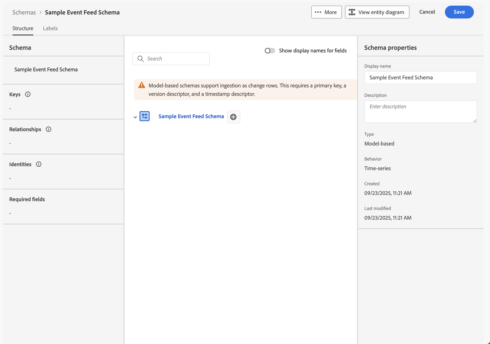
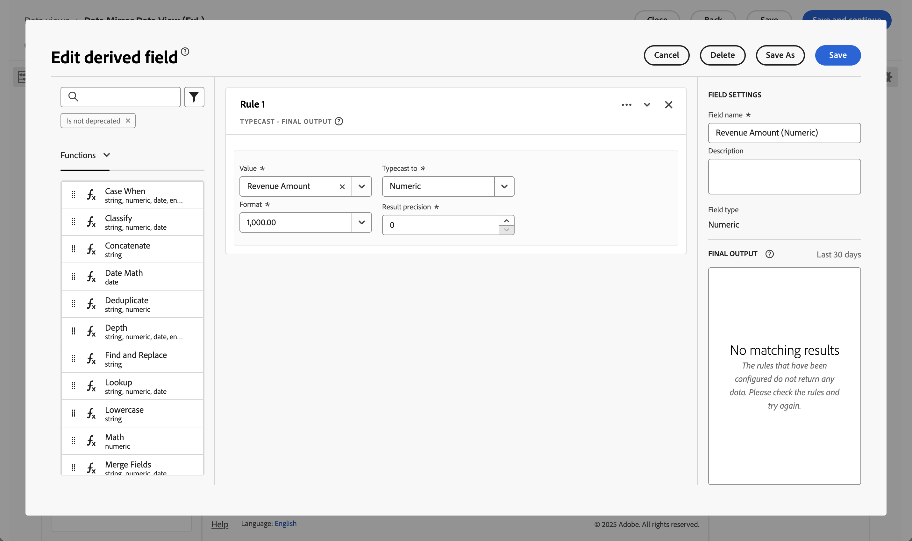

# Eseguire il mirroring e utilizzare i dati relazionali

{{release-limited-testing}}

Questa guida rapida spiega come utilizzare [Experience Platform Data Mirror per Customer Journey Analytics](data-mirror.md) per eseguire il mirroring dei dati relazionali da una soluzione nativa di data warehouse in Adobe Experience Platform. E poi usate quei dati in Customer Journey Analytics.

Per eseguire questo caso d’uso, è necessario:

* **Utilizzare una soluzione nativa di data warehouse** per memorizzare i dati di cui si desidera eseguire il mirroring in Experience Platform. E poi utilizzare quei dati in Customer Journey Analytics per generare rapporti e per analizzarli.

* **Imposta uno schema** in Experience Platform per definire il modello (schema) dei dati di cui vuoi eseguire il mirroring.

* **Utilizza un connettore di origine** in Experience Platform per ottenere i dati con mirroring in un set di dati.

* **Impostare una connessione** in Customer Journey Analytics. Questa connessione deve (almeno) includere il set di dati relazionali di Experience Platform.

* **Configurare una visualizzazione dati** in Customer Journey Analytics per definire le metriche e le dimensioni da utilizzare in Analysis Workspace.

* **Configurare un progetto** in Customer Journey Analytics per generare rapporti e visualizzazioni.

Experience Platform Data Mirror per Customer Journey Analytics richiede schemi relazionali.


>[!NOTE]
>
>Questa guida rapida è una guida semplificata su come specchiare i dati relazionali in Adobe Experience Platform e utilizzarli in Customer Journey Analytics. Ti consigliamo vivamente di esaminare le informazioni aggiuntive quando vi fai riferimento.

{{relational-model-based}}

## Utilizzare una soluzione nativa di data warehouse

Questa guida rapida utilizza [[!DNL Google BigQuery]](datawarehouse.md#google-bigquery) come soluzione nativa del data warehouse. Altre [soluzioni supportate](datawarehouse.md) sono [[!DNL Snowflake]](datawarehouse.md#snowflake) e [[!DNL Azure Databricks]](datawarehouse.md#azure-databricks).

All&#39;interno di [!DNL Google BigQuery], i seguenti dati di esempio vengono memorizzati e aggiornati regolarmente in una tabella denominata **[!UICONTROL eventdata]**.

+++ Dettagli dei dati evento di esempio

| timestamp | id | pagename | personid | trackingcode | ordini | importo ricavi |
| :---                      |  ---: | :---              | :---            | :---          |   ---: | :---           |
| 06/03/2025 T19:15:39+00:00 | 10001 | pagina home | person-1abc123 | abc123 |        |                |
| 06/03/2025 T19:15:39+00:00 | 10002 | pagina di conferma | person-1abc123 |               | 1 | 174,25 |
| 06/03/2025 T19:15:39+00:00 | 10003 | pagina home | person-2def123 | def123 |        |                |
| 06/03/2025 T19:15:39+00:00 | 10004 | pagina home | person-3ghi123 | ghi123 |        |                |
| 06/03/2025 T19:15:39+00:00 | 10005 | pagina di conferma | person-3ghi123 |               | 1 | 149,25 |
| 06/03/2025 T19:15:39+00:00 | 10006 | pagina home | person-4abc456 | abc456 |        |                |
| 06/03/2025 T19:15:39+00:00 | 10007 | pagina home | person-5def456 | def456 |        |                |
| 06/03/2025 T19:15:39+00:00 | 10008 | pagina home | person-6ghi456 | ghi456 |        |                |
| 06/03/2025 T19:15:39+00:00 | 10009 | pagina di conferma | person-6ghi456 |               | 1 | 159,25 |
| 06/03/2025 T19:15:39+00:00 | 10010 | pagina home | person-7abc789 | abc789 |        |                |
| 06/03/2025 T19:15:39+00:00 | 10011 | pagina home | person-8def789 | def789 |        |                |
| 06/03/2025 T19:15:39+00:00 | 10012 | pagina home | person-9ghi789 | ghi789 |        |                |
| 06/03/2025 T19:15:39+00:00 | 10013 | pagina di conferma | person-9ghi789 |               | 1 | 124,25 |
| 06/03/2025 T19:15:39+00:00 | 10014 | pagina home | person-10abc987 | abc987 |        |                |
| 06/03/2025 T19:15:39+00:00 | 10015 | pagina home | person-11def987 | def987 |        |                |
| 06/03/2025 T19:15:39+00:00 | 10016 | pagina home | person-12ghi987 | ghi987 |        |                |
| 06/03/2025 T19:15:39+00:00 | 10017 | pagina home | person-13abc654 | abc654 |        |                |
| 06/03/2025 T19:15:39+00:00 | 10018 | pagina home | person-14def654 | def654 |        |                |
| 06/03/2025 T19:15:39+00:00 | 10019 | pagina home | person-15ghi654 | ghi654 |        |                |
| 06/03/2025 T19:15:39+00:00 | 10020 | pagina di conferma | person-15ghi654 |               | 1 | 174,25 |

+++

I dati vengono memorizzati in una tabella di database con uno schema associato. Per esaminare la tabella del database:

1. Accedi a Google BigQuery.
1. Seleziona **[!UICONTROL BigQuery]** > **[!UICONTROL Studio]**.
1. Seleziona il progetto, il set di dati e la tabella. Nella scheda **[!UICONTROL Schema]** è disponibile una panoramica dello schema per i dati dell&#39;evento.

   

Per esaminare i dati:

1. Seleziona **[!UICONTROL Query]**.
1. Eseguire una query di esempio nell&#39;editor delle query, dove `project` è il nome del progetto e `datasets` è il nome dei set di dati:

   ```sql
   SELECT * FROM `project.datasets.eventdata` LIMIT 100
   ```

   

In Experience Platform Data Mirror per Customer Journey Analytics, le tabelle nella soluzione nativa del data warehouse devono essere abilitate per la cronologia delle modifiche. Per verificare che la tabella sia abilitata per la cronologia modifiche:

1. Eseguire l&#39;istruzione SQL seguente nell&#39;editor delle query per verificare l&#39;impostazione, dove `project` è il nome del progetto e `datasets` è il nome dei set di dati:

   ```sql
   SELECT
      table_name,
      MAX(CASE WHEN option_name = 'enable_change_history' THEN option_value END) AS enable_change_history
   FROM `project.datasets.INFORMATION_SCHEMA.TABLE_OPTIONS`
   WHERE table_name = 'eventdata'
   GROUP BY table_name
   ORDER BY table_name;
   ```

1. Se il risultato non è **[!UICONTROL TRUE]**, utilizzare la seguente istruzione SQL per abilitare la cronologia delle modifiche, dove `project` è il nome del progetto e `datasets` è il nome dei set di dati:

   ```sql
   ALTER TABLE `project.datasets.eventdata` 
   SET OPTIONS (enable_change_history = TRUE);
   ```

I dati nella tabella nella soluzione nativa del data warehouse sono pronti per Experience Platform Data Mirror per Customer Journey Analytics.


## Configurare uno schema

Per eseguire il mirroring dei dati in Experience Platform, devi innanzitutto definire lo schema per i dati. Tutti i dati di cui vuoi eseguire il mirroring in Experience Platform e che utilizzano Experience Platform Data Mirror for Customer Journey Analytics devono essere conformi a uno schema relazionale.

Definisci uno schema che modella questi dati. Per configurare lo schema:

1. Nell&#39;interfaccia utente di Adobe Experience Platform, nella barra a sinistra, seleziona **[!UICONTROL Schemi]** in **[!UICONTROL Gestione dati]**.

1. Seleziona **[!UICONTROL Crea schema]**.
1. Dal menu a discesa, selezionare **[!UICONTROL Relazionale]**.
1. Se viene visualizzata una finestra a comparsa con l&#39;opzione di selezionare tra **[!UICONTROL Crea manualmente]** o **[!UICONTROL Carica un file DDL]**:
   1. Selezionare **[!UICONTROL Crea manualmente]**.

      

   1. Seleziona **[!UICONTROL Avanti]**.
1. Nell&#39;interfaccia **[!UICONTROL Schemi]** > **[!UICONTROL Crea schema relazionale]**:
   1. Immettere un nome visualizzato per lo schema ****. Ad esempio: `Sample Event Feed Schema`.
   1. Immetti una **[!UICONTROL Descrizione]**. Ad esempio: `Sample event feed schema for a relational schema`.
   1. Seleziona **[!UICONTROL Serie temporali]** come **[!UICONTROL Comportamento schema]**. Selezionare **[!UICONTROL Serie temporali]** per i dati basati su serie temporali e **[!UICONTROL Record]** per i dati basati su record. Il comportamento definisce la struttura dello schema e le proprietà incluse.

      Experience Platform Data Mirror per Customer Journey Analytics viene utilizzato principalmente per i dati delle serie temporali (ad esempio, i dati degli eventi).

      

   1. Seleziona **[!UICONTROL Fine]**.

1. Nell&#39;interfaccia **[!UICONTROL Schemi]** > **[!UICONTROL Schema feed eventi di esempio]** viene visualizzato un avviso che indica che gli schemi relazionali supportano l&#39;acquisizione come righe di modifica.

   

   L’acquisizione come righe di modifica è nota anche come Change Data Capture (CDC). Per supportare l’acquisizione dei dati di modifica, lo schema richiede:

   * Chiave primaria.
   * Descrittore della versione.
   * Descrittore della marca temporale per i dati della serie temporale.

1. Seleziona  accanto a **[!UICONTROL Schema feed evento di esempio]** per iniziare ad aggiungere campi allo schema. Aggiungi i campi seguenti con tipo di dati e attributi aggiuntivi allo schema.

   | Nome campo: | Nome visualizzato | Tipo | Attributi aggiuntivi |
   |---|---|---|---|
   | `id` | `Id` | **[!UICONTROL Numero intero]** | Descrittore di versione  |
   | `orders` | `Orders` | **[!UICONTROL Numero intero]** | |
   | `pagename` | `Page Name` | **[!UICONTROL Stringa]** | |
   | `personid` | `Person Id` | **[!UICONTROL Stringa]** |  Chiave primaria<br/> Identity<br/>Selezionare CRMID per lo spazio dei nomi Identity. |
   | `revenueamount` | `Revenue Amount` | **[!UICONTROL Doppio]** | |
   | `timestamp` | `Timestamp` | **[!UICONTROL DataOra]** |  descrittore timestamp |
   | `trackingcode` | `Tracking Code` | **[!UICONTROL Stringa]** | |


   * Il campo **[!UICONTROL id]** è configurato come **[!UICONTROL Descrittore versione]**.

     

   * Il campo **[!UICONTROL personid]** è configurato insieme a **[!UICONTROL timestamp]** come **[!UICONTROL chiave primaria]**. Selezionare  **[!UICONTROL Crea chiave primaria composita]** per creare una chiave composita.

     

     Anche il campo **[!UICONTROL personid]** è configurato come **[!UICONTROL Identity]**, con **[!UICONTROL CRMID]** come **[!UICONTROL Identity namespace]**.

     

   * Il campo **[!UICONTROL timestamp]** è configurato insieme al campo **[!UICONTROL personid]** come **[!UICONTROL chiave primaria]**. Anche il campo **[!UICONTROL timestamp]** è configurato come **[!UICONTROL descrittore timestamp]**. È sufficiente definire un campo come **[!UICONTROL descrittore marca temporale]** per i dati relazionali della serie temporale.

     


   Se hai definito correttamente **[!UICONTROL la chiave primaria]**, **[!UICONTROL il descrittore della versione]** e **[!UICONTROL il descrittore della marca temporale]**, l&#39;avviso nella definizione dello schema scompare.

1. Seleziona **[!UICONTROL Salva]** per salvare lo schema.


## Utilizzare un connettore di origine

Utilizza un connettore di origine per collegare la soluzione nativa di data warehouse ad Experience Platform.

Nell’interfaccia di Experience Platform:

1. Seleziona **[!UICONTROL Origini]**.
1. Seleziona o cerca **[!UICONTROL Google BigQuery]**.
1. Seleziona **[!UICONTROL Aggiungi dati]**.

La procedura guidata Aggiungi dati illustra i passaggi seguenti per connettere i dati dalla tabella in [!DNL Google BigQuery] ad Experience Platform.

### Autenticazione

Nel passaggio **[!UICONTROL Autenticazione]**, seleziona:

* **[!UICONTROL Account esistente]** quando si dispone già di un account configurato per Google BigQuery. Procedi al passaggio [Seleziona dati](#select-data).
* **[!UICONTROL Nuovo account]** quando è necessario connettersi a Google BigQuery.
   1. Specificare un **[!UICONTROL nome account]** e (facoltativo) **[!UICONTROL descrizione]**.
   1. Seleziona il **[!UICONTROL tipo di autenticazione]**: **[!UICONTROL Autenticazione di base]** o **[!UICONTROL Autenticazione del servizio]**. In base alla selezione, fornisci l’input richiesto.
   1. Seleziona **[!UICONTROL Connetti all&#39;origine]**

      

      Verifica della connessione. Un  **[!UICONTROL Connesso]** ha indicato una connessione riuscita.

   1. Seleziona **[!UICONTROL Avanti]**.

  Consulta la documentazione di Experience Platform per informazioni dettagliate su come connettersi e autenticare quando utilizzi il connettore [Azure Databricks](https://experienceleague.adobe.com/en/docs/experience-platform/sources/connectors/databases/databricks) o [Snowflake](https://experienceleague.adobe.com/en/docs/experience-platform/sources/connectors/databases/snowflake).


### Selezionare i dati

Nel passaggio **[!UICONTROL Seleziona dati]**:

1. Selezionare la tabella dall&#39;elenco delle tabelle. Ad esempio: **[!UICONTROL eventdata]**.

   

   Viene visualizzato un esempio dei dati per la verifica.

1. Seleziona **[!UICONTROL Avanti]** per continuare.


### Dettagli del flusso di dati

Nel passaggio **[!UICONTROL Dettagli flusso di dati]**:

1. Selezionare **[!UICONTROL Abilita rilevamento modifiche dati]**. Viene visualizzata una finestra di informazioni **[!UICONTROL Modifica requisito acquisizione dati]** con ulteriori informazioni.
1. Seleziona **[!UICONTROL Nuovo set di dati]** per **[!UICONTROL Set di dati di destinazione]** per creare un nuovo set di dati contenente i dati con mirroring.
1. Immetti un **[!UICONTROL nome set di dati di output]**. Ad esempio: `event-data-mirror`.
1. Seleziona lo schema relazionale creato in precedenza dal menu a discesa **[!UICONTROL Schema]**. Ad esempio: **[!UICONTROL Esempio di schema feed eventi]**.

   

1. Specifica altri dettagli.
1. Seleziona **[!UICONTROL Avanti]**.


### Mappatura

Nel passaggio **[!UICONTROL Mappatura]**:

1. Mappa i campi. Dallo schema di Google BigQuery (**[!UICONTROL Dati Source]**) ai campi dello schema definiti in Experience Platform (**[!UICONTROL Campi Target]**).

   

1. Se tutti i campi sono mappati correttamente, selezionare **[!UICONTROL Avanti]** per continuare.


### Pianificazione

Nel passaggio **[!UICONTROL Pianificazione]**:

1. Specifica **[!UICONTROL Frequenza]** e **[!UICONTROL Intervallo]** per pianificare la sincronizzazione dei dati con mirroring.
1. Specifica l&#39;**[!UICONTROL ora di inizio]** per la pianificazione.

   

1. Seleziona **[!UICONTROL Avanti]** per continuare.


### Rivedi

Nel passaggio **[!UICONTROL Rivedi]**.

1. Controlla la configurazione del connettore di origine.

   

1. Seleziona **[!UICONTROL Fine]**. Viene visualizzato il flusso di dati configurato.

   


## Configurare una connessione

In questa guida rapida puoi creare una nuova connessione per utilizzare i dati con mirroring da Experience Platform. In alternativa, è possibile aggiungere i dati con mirroring a una connessione esistente.

Nell’interfaccia di Customer Journey Analytics:

1. Selezionare **[!UICONTROL Connessioni]** dal menu **[!UICONTROL Gestione dati]**.
1. Selezionare **[!UICONTROL Crea nuova connessione]**.
1. Specifica il **[!UICONTROL nome connessione]**, **[!UICONTROL Sandbox]**, **[!UICONTROL numero medio di eventi giornalieri]** e altri parametri facoltativi richiesti.
1. Seleziona **[!UICONTROL Aggiungi set di dati]**.

   1. Nel passaggio **[!UICONTROL Seleziona set di dati]** di **[!UICONTROL Aggiungi set di dati]**:

      1. Seleziona il set di dati contenente i dati con mirroring. Ad esempio: **[!UICONTROL event-data-mirror]**. Il set di dati ha **[!UICONTROL Relazionale]** come **[!UICONTROL Tipo di set di dati]**.

         

      1. Aggiungi eventuali set di dati aggiuntivi rilevanti per la connessione.
      1. Seleziona **[!UICONTROL Avanti]**.

   1. Nel passaggio **[!UICONTROL Impostazioni set di dati]** di **[!UICONTROL Aggiungi set di dati]**:

      Per il set di dati relazionali **[!UICONTROL event-data-mirror]**

      1. Seleziona **[!UICONTROL Evento]** come **[!UICONTROL Tipo set di dati]**.
      1. Selezionare il campo **[!UICONTROL PersonId]** come **[!UICONTROL ID persona]**.
      1. **[!UICONTROL Timestamp]** viene popolato automaticamente come **[!UICONTROL Timestamp]**.
      1. Selezionare **[!UICONTROL Altro]** come **[!UICONTROL Tipo di origine dati]**.
      1. Immettere `Google BigQuery Event Data` come **[!UICONTROL descrizione origine dati]**.
      1. Specifica altri dettagli, ad esempio **[!UICONTROL Importa tutti i nuovi dati]** e **[!UICONTROL Recupera tutti i dati esistenti]**.

         

      Facoltativamente, specifica i dettagli per altri set di dati.

   1. Seleziona **[!UICONTROL Aggiungi set di dati]**.
1. Seleziona **[!UICONTROL Salva]**.

Dopo aver creato una [connessione](/help/connections/overview.md), puoi eseguire varie attività di gestione. Ad esempio [selezione e combinazione di set di dati](/help/connections/combined-dataset.md), [controllo dello stato dei set di dati di una connessione e dello stato di acquisizione dei dati](/help/connections/manage-connections.md) e altro ancora.


## Configurare una visualizzazione dati

Per creare la visualizzazione dati:

1. Nell&#39;interfaccia di Customer Journey Analytics, seleziona **[!UICONTROL Visualizzazioni dati]**, facoltativamente da **[!UICONTROL Gestione dati]**, nel menu principale.

2. Selezionare **[!UICONTROL Crea nuova visualizzazione dati]**.

3. Nel passaggio **[!UICONTROL Configura]**:

   1. Selezionare la connessione dall&#39;elenco **[!UICONTROL Connessione]**.

   1. Assegna un nome e (facoltativamente) una descrizione alla connessione.

   1. Seleziona **[!UICONTROL Salva e continua]**.

4. Nel passaggio **[!UICONTROL Componenti]**:

   1. Aggiungi qualsiasi campo schema e/o componente standard da includere nelle caselle dei componenti **[!UICONTROL METRICS]** o **[!UICONTROL DIMENSIONS]**. Assicurati di aggiungere campi rilevanti dal set di dati che contiene i dati con mirroring. Per accedere a questi campi:

      1. Seleziona **[!UICONTROL Set di dati evento]**.
      1. Seleziona **[!UICONTROL Campi ad hoc e relazionali]**.
      1. Trascina i campi dagli schemi relazionali su **[!UICONTROL METRICS]** o **[!UICONTROL DIMENSIONS]**.

         

   1. Definire i campi derivati per i campi che non hanno il tipo corretto, non sono nel formato corretto o che si desidera modificare per altri motivi. Ad esempio, per **[!UICONTROL Importo ricavi]**.

      1. Seleziona **[!UICONTROL Crea campo derivato.]**
      1. Nell’editor campi derivati:
         1. Definisci un nuovo campo `Revenue Amount (Numeric)`, come indicato di seguito.

            

         1. Seleziona **[!UICONTROL Salva]**.
      1. Trascina il nuovo campo derivato **[!UICONTROL Revenue Amount (Numeric)]** e rilascia il campo in **[!UICONTROL METRICS]**.

         

   1. Seleziona **[!UICONTROL Salva e continua]**.

5. Nel passaggio **[!UICONTROL Impostazioni]**:

   Lasciare le impostazioni immutate e selezionare **[!UICONTROL Salva e termina]**.

Per ulteriori informazioni su come creare e modificare una visualizzazione dati, vedere [Panoramica delle visualizzazioni dati](../data-views/data-views.md). Quali componenti sono disponibili per l’utilizzo nella visualizzazione dati e come utilizzare le impostazioni di segmenti e sessioni.


## Configurare un progetto

Analysis Workspace è uno strumento di browser flessibile che consente di creare analisi rapidamente e condividere informazioni basate sui dati. Usa i progetti Workspace per combinare componenti dati, tabelle e visualizzazioni per sviluppare analisi da condividere con altri nella tua organizzazione.

Per creare il progetto:

1. Nell&#39;interfaccia di Customer Journey Analytics, seleziona **[!UICONTROL Workspace]** nel menu principale.

2. Seleziona **[!UICONTROL Progetti]** nel menu di navigazione a sinistra.

3. Seleziona **[!UICONTROL Crea progetto]**. Nel popup:


   1. Selezionare **[!UICONTROL Progetto Workspace vuoto]**.

   1. Seleziona **[!UICONTROL Crea]**.


4. Nell&#39;area di lavoro **[!UICONTROL Nuovo progetto]**, verifica che la [visualizzazione dati](#set-up-a-data-view) sia selezionata. La visualizzazione dati è collegata alla [connessione](#set-up-a-connection) che contiene i dati con mirroring.

5. Per creare il primo rapporto, trascina dimensioni e metriche sulla **[!UICONTROL Tabella a forma libera]** nel pannello **[!UICONTROL Forma libera]**. Ad esempio, trascina **[!UICONTROL Importo ricavi (numerico)]** in **[!UICONTROL _Trascina qui una metrica_]**. Trascinare **[!UICONTROL PersonId]** e rilasciare il campo nell&#39;intestazione della prima colonna. Effettua altre regolazioni che ritieni opportune.

   Il risultato finale è una panoramica dei profili e dei relativi ricavi basati su dati con mirroring provenienti da una tabella BigQuery di Google.

   

Per ulteriori informazioni su come creare progetti e generare analisi utilizzando componenti, visualizzazioni e pannelli, consulta la sezione [Panoramica di Analysis Workspace](../analysis-workspace/home.md).

>[!SUCCESS]
>
>Hai completato tutti i passaggi. Per iniziare, definisci quali dati di mirroring desideri raccogliere (schema) da una soluzione nativa di data warehouse. E dove memorizzare tali dati (set di dati) in Experience Platform. Hai configurato il connettore di origine appropriato per fornire i dati con mirroring in Experience Platform. Hai definito una connessione in Customer Journey Analytics per utilizzare i dati dell’evento con mirroring e (facoltativamente) altri dati. La definizione della visualizzazione dati ti consente di specificare la dimensione e le metriche da utilizzare dai dati con mirroring. E infine hai creato il tuo primo progetto visualizzando e analizzando i tuoi dati con mirroring.
