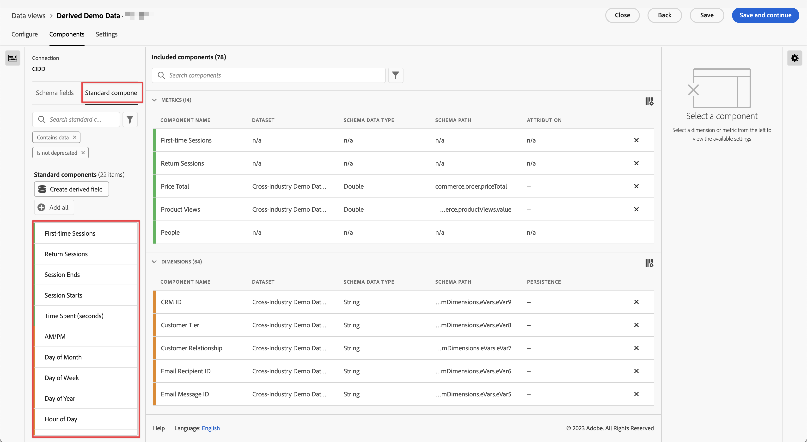

# Documentazione dei componenti standard

La maggior parte delle dimensioni e delle metriche in Customer Journey Analytics si basa sugli elementi dello schema del set di dati di Adobe Experience Platform. Tuttavia, sono disponibili diversi componenti da aggiungere a una visualizzazione dati indipendentemente dalla connessione utilizzata.

[!UICONTROL I componenti standard] sono componenti che non sono generati dai campi dello schema del set di dati, ma che sono invece generati dal sistema. Alcuni componenti di sistema sono necessari per facilitare le funzionalità di reporting in Analysis Workspace, mentre altri componenti di sistema sono facoltativi.

## Componenti standard richiesti {#required}

Per impostazione predefinita, questi componenti standard richiesti vengono aggiunti a ogni visualizzazione dati. Sono essenziali per le funzionalità di reporting offerte dal Customer Journey Analytics.

### Dimensioni standard

{{standard-dimensions}}

### Metriche standard

{{standard-metrics}}

## Componenti standard opzionali {#optional}

Componenti standard opzionali disponibili in **[!UICONTROL Visualizzazioni dati]** > **[!UICONTROL Modifica visualizzazione dati]** > scheda **[!UICONTROL Componenti]** > scheda **[!UICONTROL Componenti standard]**.

| Nome componente | Dimensione o metrica | Note e valori |
| --- | --- | --- |
| [!UICONTROL AM/PM] | Dimensione suddivisa in base al tempo | Mattina o pomeriggio |
| [!UICONTROL ID batch] | Dimensione | Identificatore per il batch Experience Platform di cui faceva parte un [!UICONTROL evento]. |
| [!UICONTROL ID set di dati] | Dimensione | Identificatore per il set di dati di Experience Platform di cui faceva parte un [!UICONTROL Evento]. |
| [!UICONTROL Giorno del mese] | Dimensione suddivisa in base al tempo | 1-31 |
| [!UICONTROL Giorno della settimana] | Dimensione suddivisa in base al tempo | Lunedì, martedì, mercoledì, giovedì, venerdì, sabato |
| [!UICONTROL Giorno dell&#39;anno] | Dimensione suddivisa in base al tempo | 1-366 |
| [!UICONTROL Ora del giorno] | Dimensione suddivisa in base al tempo | 0-23 |
| [!UICONTROL &#x200B; mese dell&#39;anno] | Dimensione suddivisa in base al tempo | Gennaio - Dicembre |
| [!UICONTROL Prime sessioni] | Metrica | Prima sessione definita da una persona all&#39;interno dell&#39;intervallo di reporting. [Ulteriori informazioni](https://experienceleague.adobe.com/docs/analytics-platform/using/cja-dataviews/data-views-usecases.html?lang=it#new-repeat) |
| [!UICONTROL Sessioni di ritorno] | Metrica | Il numero di sessioni che non sono state le prime sessioni di una persona. [Ulteriori informazioni](https://experienceleague.adobe.com/docs/analytics-platform/using/cja-dataviews/data-views-usecases.html?lang=it#new-repeat) |
| [!UICONTROL ID persona] | Dimensione | Ogni schema di set di dati definito in Experience Platform può avere un proprio set di una o più identità definite e associate a uno Spazio dei nomi identità. Ognuna di queste identità può essere utilizzata come ID persona. Alcuni esempi includono ID cookie, ID unione, ID utente, Codice di tracciamento, ecc. La dimensione [!UICONTROL ID persona] è la base per combinare i set di dati e identificare persone univoche in Customer Journey Analytics.
Eventuali casi d’uso includono:<ul><li>Crea un segmento su un valore ID persona specifico per segmentare tutto in base al comportamento dell’utente.</li><li>Debug: accertati che siano presenti i dati per un ID cookie specifico (o un ID cliente specifico).</li><li>Identificazione degli utenti che hanno effettuato l&#39;accesso a un call center.</li></ul> |
| [!UICONTROL Spazio dei nomi ID persona] | Dimensione | Quale tipo di ID è costituito dall&#39;[!UICONTROL ID persona]. Alcuni esempi: `email address`, `cookie ID`, `Analytics ID` |
| [!BADGE B2B Edition]{type=Informative url="https://experienceleague.adobe.com/it/docs/analytics-platform/using/cja-overview/cja-b2b/cja-b2b-edition" newtab=true tooltip="Customer Journey Analytics B2B Edition"} [!UICONTROL ID account globale] | Dimensione | L&#39;[!UICONTROL ID account globale], quando utilizzi il contenitore Account globale nella tua connessione. |
| [!BADGE B2B Edition]{type=Informative url="https://experienceleague.adobe.com/it/docs/analytics-platform/using/cja-overview/cja-b2b/cja-b2b-edition" newtab=true tooltip="Customer Journey Analytics B2B Edition"} [!UICONTROL ID account] | Dimensione | L&#39;[!UICONTROL ID account], quando si utilizza il contenitore Account nella connessione. |
| [!BADGE B2B edition]{type=Informative url="https://experienceleague.adobe.com/it/docs/analytics-platform/using/cja-overview/cja-b2b/cja-b2b-edition" newtab=true tooltip="Customer Journey Analytics B2B Edition"} [!UICONTROL ID opportunità] | Dimensione | L&#39;[!UICONTROL ID opportunità], quando si utilizza il contenitore Opportunità nella connessione. |
| [!BADGE B2B edition]{type=Informative url="https://experienceleague.adobe.com/it/docs/analytics-platform/using/cja-overview/cja-b2b/cja-b2b-edition" newtab=true tooltip="Customer Journey Analytics B2B Edition"} [!UICONTROL ID gruppo acquisti] | Dimensione | L&#39;[!UICONTROL ID gruppo di acquisto], quando si utilizza il contenitore Gruppo di acquisto nella connessione. |
| [!UICONTROL Trimestre dell’anno] | Dimensione suddivisa in base al tempo | Q1, Q2, Q3, Q4 |
| [!UICONTROL Ripeti sessione] | Metrica | Il numero di sessioni che non sono state le prime sessioni di una persona. [Ulteriori informazioni](https://experienceleague.adobe.com/docs/analytics-platform/using/cja-dataviews/data-views-usecases.html?lang=it#new-repeat) |
| [!UICONTROL Tipo di sessione] | Dimensione | Questa dimensione ha due valori: 1. [!UICONTROL Prima volta] e 2. di ritorno. L&#39;elemento riga [!UICONTROL Prima volta] include tutti i comportamenti (metriche rispetto a questa dimensione) di una sessione che è stata determinata come prima sessione definita da una persona. Tutto il resto è incluso nella riga [!UICONTROL Restituzione] (supponendo che tutto appartenga a una sessione). Se le metriche non fanno parte di alcuna sessione, rientrano nel bucket “Non applicabile” per questa dimensione. [Ulteriori informazioni](https://experienceleague.adobe.com/docs/analytics-platform/using/cja-dataviews/data-views-usecases.html?lang=it#new-repeat) |
| [!UICONTROL Tempo trascorso per evento] | Dimensione | Intervalli della metrica [!UICONTROL Tempo trascorso] in [!UICONTROL Evento] bucket. |
| [!UICONTROL Tempo trascorso per sessione] | Dimensione | Intervalli della metrica [!UICONTROL Tempo trascorso] in [!UICONTROL Sessione] bucket. |
| [!UICONTROL Tempo trascorso per persona] | Dimensione | Bucket la metrica [!UICONTROL Tempo trascorso] in [!UICONTROL Persona] bucket. |
| [!UICONTROL Fine settimana]/[!UICONTROL Giorno feriale] | Dimensione suddivisa in base al tempo | Fine settimana o giorno feriale |

{style="table-layout:auto"}

>[!MORELIKETHIS]
>
>[Insight più approfonditi sulla clientela con la funzione Profondità evento](https://experienceleaguecommunities.adobe.com/t5/adobe-analytics-blogs/discover-deeper-customer-insights-with-adobe-customer-journey/ba-p/753947?profile.language=it#M576)
>