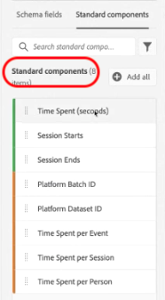

# Documentazione dei componenti standard

La maggior parte delle dimensioni e delle metriche in CJA si basa sugli elementi dello schema del set di dati di Adobe Experience Platform. Tuttavia, sono disponibili diversi componenti da aggiungere a una visualizzazione dati indipendentemente dalla connessione utilizzata.

[!UICONTROL Standard components] sono componenti che non sono generati dai campi dello schema del set di dati, ma che sono invece generati dal sistema. Alcuni componenti di sistema sono necessari per facilitare le funzionalità di reporting in Analysis Workspace, mentre altri componenti di sistema sono facoltativi.

## Componenti standard richiesti {#required}

Per impostazione predefinita, questi componenti standard richiesti vengono aggiunti a ogni visualizzazione dati. Sono essenziali per le funzionalità di reporting offerte dal Customer Journey Analytics.

| Nome componente | Dimension o metrica | Note |
| --- | --- | --- |
| [!UICONTROL People] | Metrica | In base all’ID persona specificato in un [!UICONTROL Connection]. |
| [!UICONTROL Sessions] | Metrica | In base alle impostazioni di sessione della visualizzazione dati. |
| [!UICONTROL Events] | Metrica | Il numero di righe da tutti i set di dati evento in un [!UICONTROL Connection]. |
| [!UICONTROL Minute] | Dimensione | Il minuto in cui si è verificato un dato evento (arrotondato per difetto). Il primo elemento dimensione è il primo minuto nell’intervallo di date e l’ultimo elemento dimensione è l’ultimo minuto nell’intervallo di date. |
| [!UICONTROL Hour] | Dimensione | L&#39;ora in cui si è verificato un dato evento (arrotondata per difetto). Il primo elemento dimensione è la prima ora nell’intervallo di date e l’ultimo elemento dimensione è l’ultima ora nell’intervallo di date. |
| [!UICONTROL Day] | Dimensione | Il giorno in cui è accaduto un dato evento. Il primo elemento dimensione è il primo giorno dell’intervallo di date e l’ultimo elemento dimensione è l’ultimo giorno dell’intervallo di date. |
| [!UICONTROL Week] | Dimensione | La settimana in cui si è verificato un dato evento. Il primo elemento dimensione è la prima settimana nell’intervallo di date e l’ultimo elemento dimensione è l’ultima settimana nell’intervallo di date. |
| [!UICONTROL Month] | Dimensione | Il mese in cui si è verificato un determinato evento. Il primo elemento dimensione è il primo mese nell’intervallo di date e l’ultimo elemento dimensione è l’ultimo mese nell’intervallo di date. |
| [!UICONTROL Quarter] | Dimensione | Il trimestre in cui si è verificato un dato evento. Il primo elemento dimensione è il primo trimestre nell’intervallo di date e l’ultimo elemento dimensione è l’ultimo trimestre nell’intervallo di date. |
| [!UICONTROL Year] | Dimensione | L&#39;anno in cui si è verificato un dato evento. Il primo elemento dimensione è il primo anno nell’intervallo di date e l’ultimo elemento dimensione è l’anno più recente nell’intervallo di date. |

## Componenti standard opzionali {#optional}

Componenti standard opzionali disponibili in **[!UICONTROL Data views]** > **[!UICONTROL Edit data view]** > **[!UICONTROL Components]** scheda > **[!UICONTROL Standard Components]** scheda .

| Nome componente | Dimension o metrica | Note e valori |
| --- | --- | --- |
| [!UICONTROL AM/PM] | Suddivisione della dimensione in base al tempo | AM o PM |
| [!UICONTROL Batch ID] | Dimensione | Rappresenta il batch di Experienci Platform che un [!UICONTROL Event] faceva parte di. |
| [!UICONTROL Dataset ID] | Dimensione | Rappresenta il set di dati di Experience Platform che un [!UICONTROL Event] faceva parte di. |
| [!UICONTROL Day of Month] | Suddivisione della dimensione in base al tempo | 1-31 |
| [!UICONTROL Day of Week] | Suddivisione della dimensione in base al tempo | Lunedì, martedì, mercoledì, giovedì, venerdì, sabato |
| [!UICONTROL Day of Year] | Suddivisione della dimensione in base al tempo | 1-366 |
| [!UICONTROL Hour of Day] | Suddivisione della dimensione in base al tempo | 0-23 |
| [!UICONTROL  Month of Year] | Suddivisione della dimensione in base al tempo | Gennaio - Dicembre |
| [!UICONTROL New session] | Metrica | Prima sessione definita da una persona all&#39;interno dell&#39;intervallo di reporting. [Ulteriori informazioni](https://experienceleague.adobe.com/docs/analytics-platform/using/cja-dataviews/data-views-usecases.html?lang=en#new-repeat) |
| [!UICONTROL Person ID] | Dimensione | Ogni schema di set di dati definito in Experience Platform può avere un proprio set di una o più identità definite e associate a uno spazio dei nomi identità. Ognuno di questi può essere utilizzato come ID persona. Alcuni esempi includono Cookie ID (ID cookie), Stitched ID (ID di unione), User ID (ID utente), Tracking Code (Codice di tracciamento), ecc. La [!UICONTROL Person ID] La dimensione è la base per combinare i set di dati e identificare i visitatori unici in CJA.
Eventuali casi d’uso includono:<ul><li>Creazione di un filtro per un valore ID persona specifico per filtrare tutto in base al comportamento dell’utente.</li><li>Debug: accertati che siano presenti i dati per un ID cookie specifico (o un ID cliente specifico).</li><li>Identificazione degli utenti che hanno effettuato l&#39;accesso a un call center.</li></ul> |
| [!UICONTROL Person ID namespace] | Dimensione | Quale tipo di ID è [!UICONTROL Person ID] è costituito da. Esempi: `email address`, `cookie ID`, `Analytics ID`, ecc. |
| [!UICONTROL Quarter of Year] | Suddivisione della dimensione in base al tempo | Q1, Q2, Q3, Q4 |
| [!UICONTROL Repeat session] | Metrica | Il numero di sessioni che non sono state le prime sessioni di una persona. [Ulteriori informazioni](https://experienceleague.adobe.com/docs/analytics-platform/using/cja-dataviews/data-views-usecases.html?lang=en#new-repeat) |
| [!UICONTROL Session Starts] | Metrica | Il numero di eventi che sono stati il primo evento di una sessione. Utilizzato in una definizione di filtro (ad esempio &#39;[!UICONTROL Session Starts] esiste&#39;), si filtra fino al primo evento di ogni sessione. |
| [!UICONTROL Session Ends] | Metrica | Il numero di eventi che sono stati l&#39;ultimo evento di una sessione. Simile a [!UICONTROL Session Starts], può anche essere utilizzato in una definizione di filtro per filtrare gli elementi fino all’ultimo evento di ogni sessione. |
| [!UICONTROL Session Type] | Dimensione | Questa dimensione ha due valori: 1) [!UICONTROL First-Time] e 2) Ritorno. La [!UICONTROL First-time] l’elemento riga include tutti i comportamenti (ovvero le metriche rispetto a questa dimensione) di una sessione che è stata determinata come prima sessione definita da una persona. Tutto il resto è incluso nel [!UICONTROL Returning] riga (supponendo che tutto appartenga a una sessione). Se le metriche non fanno parte di alcuna sessione, rientrano nel bucket &quot;Non applicabile&quot; per questa dimensione. [Ulteriori informazioni]([Ulteriori informazioni](https://experienceleague.adobe.com/docs/analytics-platform/using/cja-dataviews/data-views-usecases.html?lang=en#new-repeat)) |
| [!UICONTROL Time Spent (seconds)] | Metrica | Somma il tempo tra due valori diversi per una dimensione. |
| [!UICONTROL Time Spent per Event] | Dimensione | Intervalli [!UICONTROL Time Spent] metrica [!UICONTROL Event] secchi. |
| [!UICONTROL Time Spent per Session] | Dimensione | Intervalli [!UICONTROL Time Spent] metrica [!UICONTROL Session] secchi. |
| [!UICONTROL Time Spent per Person] | Dimensione | Intervalli [!UICONTROL Time Spent] metrica [!UICONTROL Person] secchi. |
| [!UICONTROL Weekend]/[!UICONTROL Weekday] | Suddivisione della dimensione in base al tempo | Fine settimana o Giorno feriale |

