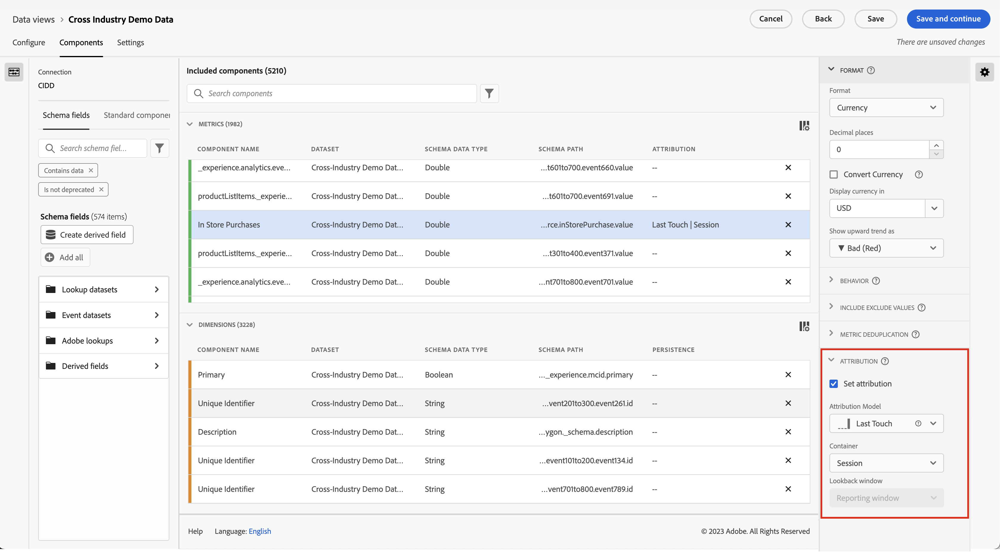
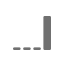

# Impostazioni dei componenti di attribuzione

Attribution consente di personalizzare il modo in cui i valori delle dimensioni ottengono credito per gli eventi di successo. Ad esempio:

1. Un visitatore del sito fa clic su un collegamento di ricerca a pagamento a una delle pagine dei tuoi prodotti. Aggiunge il prodotto al carrello, ma non lo acquista.
2. Il giorno dopo, vedono un post di un loro amico sui social media. Fa clic sul collegamento, quindi completa l’acquisto.

In alcuni rapporti, potresti desiderare che l’ordine sia attribuito a Ricerca a pagamento. In altri rapporti, potresti desiderare che l’ordine sia attribuito a Social. Attribution ti consente di controllare questo aspetto del reporting.

Questa impostazione del componente Visualizzazione dati consente di impostare un modello di attribuzione predefinito per una metrica. Puoi sovrascrivere il modello di attribuzione di una data metrica mentre lavori in Analysis Workspace.

Se l’organizzazione richiede che una metrica abbia più impostazioni di attribuzione, puoi effettuare una delle seguenti operazioni:

* Copia la metrica nella visualizzazione dati con ogni impostazione di attribuzione desiderata. Puoi includere la stessa metrica più volte in una visualizzazione dati, assegnando a ciascuna metrica un’impostazione diversa. Assicurati di etichettare correttamente ogni metrica in modo che gli analisti possano capire la differenza tra queste metriche durante la generazione dei rapporti.
* Sostituisci la metrica in Analysis Workspace. In una metrica di [Impostazioni colonna](/help/analysis-workspace/visualizations/freeform-table/column-row-settings/column-settings.md), seleziona **[!UICONTROL Use non-default attribution model]** per modificare il modello di attribuzione e l’intervallo di lookback della metrica per quel rapporto specifico.

## Modelli di attribuzione

Un modello di attribuzione determina quali elementi dimensionali ricevono credito per una metrica quando vengono visualizzati più valori nell’intervallo di lookback di una metrica. I modelli di attribuzione si applicano solo quando nell’intervallo di lookback sono impostati più elementi dimensionali. Se è impostato un solo elemento dimensionale, a tale elemento viene assegnato un credito del 100% indipendentemente dal modello di attribuzione utilizzato.

| Icona | Modello di attribuzione | Definizione |
| :---: | :--- | --- |
|  | Ultimo contatto | Attribuisce un credito del 100% al punto di contatto più di recente che si verifica prima della conversione. Questo modello di attribuzione è in genere il valore predefinito per qualsiasi metrica in cui un modello di attribuzione non è specificato altrimenti. In genere, le organizzazioni utilizzano questo modello quando il tempo di conversione è relativamente breve, ad esempio con l’analisi delle parole chiave di ricerca interne. |
|  | Primo contatto | Attribuisce un credito del 100% al punto di contatto visualizzato per la prima volta nell’intervallo di lookback dell’attribuzione. In genere, le organizzazioni utilizzano questo modello per comprendere la consapevolezza del brand o l’acquisizione dei clienti. |
|  | Lineare | Attribuisce lo stesso credito a ogni punto di contatto che porta a una conversione. È utile quando i cicli di conversione sono più lunghi o richiedono un coinvolgimento più frequente dei clienti. In genere le organizzazioni utilizzano questo modello di attribuzione per misurare l’efficacia delle notifiche delle app mobili o con prodotti basati su abbonamento. |
|  | Partecipazione | Assegna il 100% di credito a tutti i punti di contatto univoci. Poiché ogni punto di contatto riceve un credito del 100%, i dati delle metriche in genere superano il 100%. Se un elemento dimensionale appare più volte separatamente, portando a una conversione, i valori vengono deduplicati al 100%. Questo modello di attribuzione è ideale nelle situazioni in cui desideri comprendere a quali punti di contatto i clienti sono più esposti. Le organizzazioni di media in genere utilizzano questo modello per calcolare la velocità dei contenuti. Le organizzazioni di vendita al dettaglio in genere utilizzano questo modello per comprendere quali parti del sito sono fondamentali per la conversione. |
|  | Stesso contatto | Attribuisce un credito del 100% allo stesso evento in cui si è verificata la conversione. Se un punto di contatto non si verifica nello stesso evento di una conversione, viene inserito in &quot;None&quot;. A volte questo modello di attribuzione viene equiparato all’assenza totale di un modello di attribuzione. È utile negli scenari in cui non desideri valori da altri eventi che influiscono sul modo in cui una metrica attribuisce credito agli elementi dimensionali. I team di prodotto o di progettazione possono utilizzare questo modello per valutare l’efficacia di una pagina in cui si verifica una conversione. |
|  | A forma di U | Attribuisce il 40% di credito alla prima interazione, il 40% di credito all’ultima interazione e divide il restante 20% in qualsiasi punto di contatto intermedio. Per le conversioni con un singolo punto di contatto, viene assegnato un credito del 100%. Per le conversioni con due punti di contatto, viene assegnato un credito del 50% a entrambi. Questo modello di attribuzione è meglio utilizzato in scenari in cui si attribuisce il maggior valore alla prima e all’ultima interazione, ma non si desidera escludere completamente ulteriori interazioni intermedie. |
|  | Curva J | Attribuisce il 60% di credito all’ultima interazione, il 20% di credito alla prima interazione e divide il restante 20% in qualsiasi punto di contatto intermedio. Per le conversioni con un singolo punto di contatto, viene assegnato un credito del 100%. Per le conversioni con due punti di contatto, viene assegnato il 75% di credito all’ultima interazione e il 25% di credito alla prima. Simile al modello a forma di U, questo modello di attribuzione favorisce la prima e l’ultima interazione, ma favorisce in modo più significativo l’ultima interazione. |
|  | J inversa | Attribuisce un credito del 60% al primo punto di contatto, un credito del 20% all’ultimo punto di contatto e divide il restante 20% in qualsiasi punto di contatto intermedio. Per le conversioni con un singolo punto di contatto, viene assegnato un credito del 100%. Per le conversioni con due punti di contatto, viene assegnato il 75% di credito alla prima interazione e il 25% di credito all’ultima. Simile al modello a forma di J, questo modello di attribuzione favorisce la prima e l’ultima interazione, ma favorisce in modo più significativo la prima interazione. |
|  | Decadimento nel tempo | Segue un decadimento esponenziale con un parametro di mezza durata personalizzato, dove il valore predefinito è 7 giorni. Il valore di ciascun canale dipende dalla quantità di tempo trascorsa tra l’avvio del punto di contatto e l’eventuale conversione. La formula utilizzata per determinare il credito è `2^(-t/halflife)`, dove `t` è il tempo tra un punto di contatto e una conversione. Tutti i punti di contatto vengono quindi normalizzati al 100%. Ideale per scenari in cui desideri misurare l’attribuzione rispetto a un evento specifico e significativo. Più si verifica una conversione dopo questo evento, meno credito viene assegnato. |
|  | Personalizzato | Consente di specificare i valori da assegnare al primo punto di contatto, all&#39;ultimo punto di contatto e a eventuali punti di contatto intermedi. I valori specificati vengono normalizzati al 100% anche se la somma dei numeri personalizzati immessi è inferiore a 100. Per le conversioni con un singolo punto di contatto, viene assegnato un credito del 100%. Per le interazioni con due punti di contatto, il parametro intermedio viene ignorato. Il primo e l’ultimo punto di contatto vengono quindi normalizzati al 100% e il credito viene assegnato di conseguenza. Questo modello è ideale per gli analisti che desiderano un controllo completo sul proprio modello di attribuzione e hanno esigenze specifiche che altri modelli di attribuzione non soddisfano. |
|  | Algoritmica | Utilizza tecniche statistiche per determinare in modo dinamico l’allocazione ottimale del credito per la metrica selezionata. L’algoritmo utilizzato per l’attribuzione è basato sul dividendo Harsanyi dalla teoria del gioco cooperativo. Il dividendo Harsanyi è una generalizzazione della soluzione del valore di Shapley (che prende il nome da Lloyd Shapley, un economista premio Nobel) per la distribuzione del credito tra i giocatori in un gioco con contributi disuguali al risultato. Ad alto livello, l&#39;attribuzione è calcolata come una coalizione di giocatori a cui un surplus deve essere equamente distribuito. La distribuzione del surplus di ciascuna coalizione è determinata in base al surplus creato in precedenza da ogni subcoalizione (o dagli elementi dimensionali partecipanti in precedenza) in modo ricorsivo. Per maggiori dettagli, consulta gli articoli originali di John Harsanyi e Lloyd Shapley: Shapley, Lloyd S. (1953) A value for n-person games. *Contributions to the Theory of Games, 2(28)*, 307-317. Harsanyi, John C. (1963). A simplified bargaining model for the n-person cooperative game. *International Economic Review 4(2)*, 194-220. |

{style="table-layout:auto"}

## Intervallo di lookback

Per intervallo di lookback si intende la quantità di tempo che una conversione deve recuperare nel passato per includere i punti di contatto. Se un elemento dimensione è impostato all’esterno dell’intervallo di lookback, il valore non viene incluso in alcun calcolo di attribuzione.

* **14 giorni**: considera fino a 14 giorni dal momento in cui si è verificata la conversione.
* **30 giorni**: considera fino a 30 giorni da quando si è verificata la conversione.
* **60 giorni**: considera fino a 60 giorni da quando si è verificata la conversione.
* **90 giorni**: considera fino a 90 giorni da quando si è verificata la conversione.
* **Sessione**: considera fino l’inizio della sessione in cui si è verificata una conversione. Gli intervalli di lookback della sessione rispettano il [Timeout della sessione](../create-dataview.md#session-settings).
* **Persona (intervallo di reporting)**: considera tutte le visite fino al primo del mese dell’intervallo date corrente. Ad esempio, se l’intervallo di date del rapporto è dal 15 settembre al 30 settembre, l’intervallo di date del lookback su visitatore considererà il periodo dal 1° al 30 settembre. Se utilizzi questo intervallo di lookback, puoi notare occasionalmente che gli elementi dimensionali sono attribuiti a date al di fuori dell’intervallo di reporting.
* **Ora personalizzata:** Consente di impostare un intervallo di lookback personalizzato da quando si è verificata una conversione. È possibile specificare il numero di minuti, ore, giorni, settimane, mesi o trimestri. Ad esempio, se si verificasse una conversione il 20 febbraio, un intervallo di lookback di cinque giorni valuterebbe tutti i punti di contatto delle dimensioni dal 15 febbraio al 20 febbraio nel modello di attribuzione.

## Esempio

Prendi in considerazione l’esempio seguente:

1. Il 15 settembre, un visitatore arriva sul tuo sito tramite un annuncio pubblicitario di ricerca a pagamento, poi se ne va.
2. Il 18 settembre, il visitatore ritorna sul tuo sito tramite un collegamento social media ricevuto da un amico. Aggiunge diversi articoli al carrello, ma non acquista nulla.
3. Il 24 settembre, il team marketing gli invia un’e-mail con un coupon da utilizzare su alcuni degli elementi nel carrello. Applica il coupon, ma visita diversi altri siti per vedere se sono disponibili altri coupon. Ne trova un altro tramite un annuncio pubblicitario, quindi completa un acquisto dal valore di 50 $.

A seconda dell’intervallo di lookback e del modello di attribuzione definiti, ai canali saranno assegnati crediti diversi. Di seguito sono riportati alcuni esempi significativi:

* Utilizzo di **primo contatto** e un **intervallo di lookback della sessione**, l’attribuzione considera solo la terza visita. Tra e-mail e visualizzazione, e-mail è avvenuta prima, quindi e-mail ottiene 100% di credito per l’acquisto di 50 $.
* Utilizzo di **primo contatto** e un **intervallo di lookback su persona**, l’attribuzione esamina tutte e tre le visite. La ricerca a pagamento è avvenuta prima, quindi ottiene il 100% di credito per l’acquisto di 50 $.
* Utilizzo di **lineare** e un **intervallo di lookback della sessione**, il credito è diviso tra e-mail e visualizzazione. Entrambi questi canali ricevono un credito di 25 $.
* Utilizzo di **lineare** e un **intervallo di lookback su persona**, il credito è diviso tra ricerca a pagamento, social, e-mail e visualizzazione. Ogni canale ottiene un credito di 12,50 $ per questo acquisto.
* Utilizzo di **A forma di J** e un **intervallo di lookback su persona**, il credito è diviso tra ricerca a pagamento, social, e-mail e visualizzazione.
   * Il 60% di credito è assegnato alla visualizzazione, per un valore di 30 $.
   * Il 20% di credito è assegnato alla ricerca a pagamento, per un valore di 10 $.
   * Il restante 20% è suddiviso tra social e e-mail, ovvero 5 $ ciascuno.
* Utilizzo di **Decadimento nel tempo** e un **intervallo di lookback su persona**, il credito è diviso tra ricerca a pagamento, social, e-mail e visualizzazione. Utilizzando la mezza durata predefinita di 7 giorni:
   * Intervallo di zero giorni tra il punto di contatto visualizzazione e la conversione. `2^(-0/7) = 1`
   * Intervallo di zero giorni tra il punto di contatto e-mail e la conversione. `2^(-0/7) = 1`
   * Intervallo di sei giorni tra il punto di contatto social e la conversione. `2^(-6/7) = 0.552`
   * Intervallo di nove giorni tra il punto di contatto ricerca a pagamento e la conversione. `2^(-9/7) = 0.41`
   * La normalizzazione di questi valori determina quanto segue:
      * Visualizzazione: 33,8%, ovvero 16,88 $
      * E-mail: 33,8% ovvero 16,88 $
      * Social: 18,6%, ovvero 9,32 $
      * Ricerca a pagamento: 13,8%, ovvero 6,92 $

Gli eventi di conversione che in genere hanno numeri interi vengono suddivisi se il credito appartiene a più di un canale. Ad esempio, se due canali contribuiscono a un ordine utilizzando un modello di attribuzione lineare, entrambi i canali ottengono 0,5 di tale ordine. Queste metriche parziali vengono sommate tra tutte le persone e quindi arrotondate al numero intero più vicino per il reporting.
