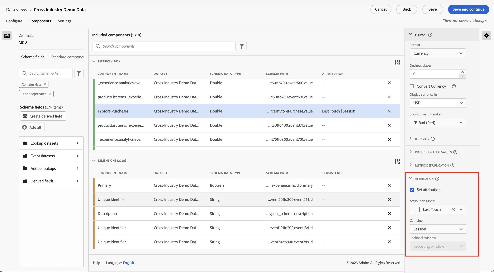

# Impostazioni dei componenti di attribuzione {#attribution-component-settings}

<!-- markdownlint-disable MD034 -->

>[!CONTEXTUALHELP]
>id="dataview_component_metric_attribution"
>title="Attribution"
>abstract="Configura il modello di attribuzione predefinito applicato a una metrica nei report."

<!-- markdownlint-enable MD034 -->

Attribution consente di personalizzare il modo in cui gli elementi dimensionali ricevono credito per gli eventi di successo.

Ad esempio:

1. Un visitatore del sito fa clic su un collegamento di ricerca a pagamento a una delle pagine dei tuoi prodotti. Aggiunge il prodotto al carrello, ma non lo acquista.
2. Il giorno dopo, vede il post di un amico sui social media. Fa clic sul collegamento, quindi completa l’acquisto.

In alcuni rapporti, potresti desiderare che l’ordine sia attribuito a Ricerca a pagamento. In altri rapporti, potresti desiderare che l’ordine sia attribuito a Social. Attribution ti consente di controllare questo aspetto del reporting.

## Impostare il modello di attribuzione di un componente

Puoi modificare il modello di attribuzione predefinito per un determinato componente aggiornando l’impostazione del componente nella visualizzazione dati. In questo modo si sostituisce il modello di attribuzione del componente ogni volta che viene utilizzato in Analysis Workspace.

>[!NOTE]
>
>Quando abiliti un modello di attribuzione non predefinito su una metrica, considera quanto segue:
>
>* **Quando si utilizza la metrica in un report con *una singola dimensione*:** L&#39;attribuzione della metrica ha la precedenza sul modello di allocazione impostato sulla dimensione. Ad esempio, una metrica con attribuzione &quot;primo contatto&quot; sostituisce l’allocazione di dimensione &quot;più recente&quot;.
>
>* **Quando si utilizza la metrica in un report con *più dimensioni*:** L&#39;attribuzione della metrica viene applicata sopra il modello di allocazione per ogni dimensione. Ad esempio, una metrica con attribuzione &quot;primo contatto&quot; viene applicata all’allocazione di una dimensione &quot;più recente&quot;.
>
> Per ulteriori informazioni sull’allocazione, consulta [Impostazioni dei componenti di persistenza](/help/data-views/component-settings/persistence.md).

Per aggiornare il modello di attribuzione predefinito di un componente:

1. Vai alla visualizzazione dati che contiene il componente di cui desideri aggiornare il modello di attribuzione predefinito.

1. Seleziona il componente, quindi espandi la sezione **[!UICONTROL Attribuzione]** sul lato destro dello schermo.

   

1. Seleziona [!UICONTROL **Imposta attribuzione**], quindi seleziona la finestra [modello di attribuzione](#attribution-models), [contenitore](#container) e [lookback](#lookback-window).

1. Seleziona [!UICONTROL **Salva e continua**].

>[!TIP]
>
>Se l’organizzazione richiede che una metrica abbia più impostazioni di attribuzione, puoi effettuare una delle seguenti operazioni:
>
> * Copiare la metrica nella visualizzazione dati con ogni impostazione di attribuzione desiderata. Puoi includere la stessa metrica più volte in una visualizzazione dati, assegnando a ciascuna metrica un’impostazione diversa. Assicurati di etichettare correttamente ogni metrica in modo che gli analisti possano capire la differenza tra queste metriche durante la generazione dei rapporti.
>
> * Sovrascrivere la metrica in Analysis Workspace. Nelle [Impostazioni colonna](/help/analysis-workspace/visualizations/freeform-table/column-row-settings/column-settings.md) di una metrica, seleziona **[!UICONTROL Usa modello di attribuzione non predefinito]** per modificare il modello di attribuzione e l&#39;intervallo di lookback della metrica per quel rapporto specifico.

## Modelli di attribuzione {#attribution-models}

<!-- markdownlint-disable MD034 -->

>[!CONTEXTUALHELP]
>id="dataviews_component_attribution_attributionmodels"
>title="Modello"
>abstract="Seleziona un modello di attribuzione per la metrica."

<!-- markdownlint-enable MD034 -->

{{attribution-models-details}}

## Contenitore

{{attribution-container}}

## Intervallo di lookback

{{attribution-lookback-window}}

## Esempio

{{attribution-example}}
