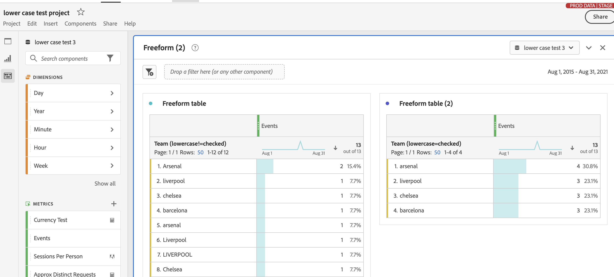

# Impostazioni del componente Comportamento

Le impostazioni del comportamento sono disponibili sia per le dimensioni che per le metriche. Le impostazioni disponibili dipendono dal tipo di componente e dal tipo di dati dello schema.

## Impostazioni del comportamento di Dimension

| Impostazione | Descrizione |
| --- | --- |
| [!UICONTROL Lower case] | Deduplica le righe che hanno lo stesso valore ma con maiuscole e minuscole diverse. Se abilitate, tutte le istanze di una dimensione con lo stesso valore vengono riportate in minuscolo. Ad esempio, i dati contengono i valori `"liverpool"`, `"Liverpool"` e `"LIVERPOOL"` in una dimensione stringa. Se [!UICONTROL Lower case] è attivato, tutti e tre i valori vengono combinati in `"liverpool"`. Se disabilitati, tutti e tre i valori vengono trattati come distinti. |

{style=&quot;table-layout:auto&quot;}

>[!NOTE]
>
>Se si abilita [!UICONTROL Lower case] in una dimensione set di dati di ricerca possono esistere più valori di ricerca per lo stesso identificatore. Se si verifica questo conflitto, CJA utilizza il primo valore di confronto ASCII (i valori in maiuscolo precedono i valori in minuscolo). Adobe consiglia di non utilizzare set di dati di ricerca contenenti lo stesso valore quando [!UICONTROL Lower case] è abilitato.

## Impostazioni del comportamento delle metriche

| Impostazione | Caso di utilizzo/descrizione |
| --- | --- |
| [!UICONTROL Count values] | Visibile sui tipi di dati con schema intero e doppio. Aumenta la metrica della quantità specificata. Ad esempio, aumenta di 50 una metrica se il valore della colonna è `50`. |
| [!UICONTROL Count instances] | Visibile sui tipi di dati con schema intero e doppio. Aumenta la metrica di uno, indipendentemente dal valore. La presenza di qualsiasi valore aumenta la metrica. Ad esempio, aumenta di 1 una metrica se il valore della colonna è `50`. |
| [!UICONTROL Values to count] | Visibile sui tipi di dati di schema booleano. Consente di determinare se la metrica aumenta contando `true`, `false` o entrambi. |

{style=&quot;table-layout:auto&quot;}

Puoi generare sia una metrica “Ordini” che una metrica “Entrate” in Analysis Workspace utilizzando la stessa colonna di set di dati dell’evento con comportamenti diversi. Trascina due volte la colonna del set di dati “Entrate” nella visualizzazione dati e imposta uno su “Valori di conteggio” e l’altro su “istanze di conteggio”. La metrica “Ordini” conta le istanze, mentre la metrica “Entrate” conta i valori.
