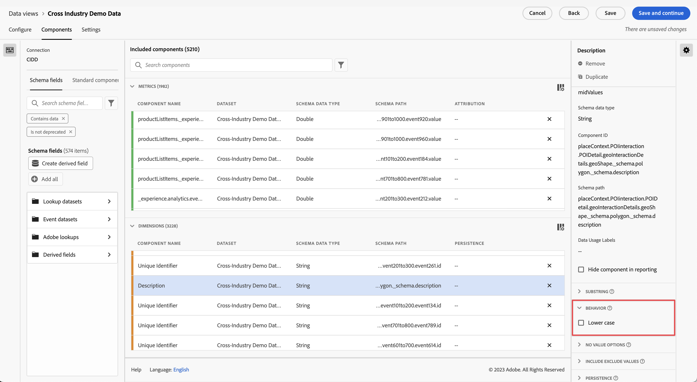
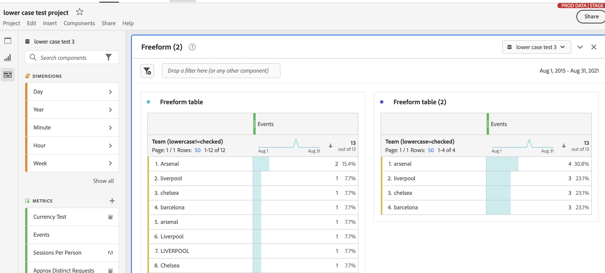

# Impostazioni del componente Comportamento {#behavior-component-settings}

<!-- markdownlint-disable MD034 -->

>[!CONTEXTUALHELP]
>id="dataview_component_dimension_behavior"
>title="Comportamento"
>abstract="Applicabile ai componenti dimensione e metrica. Determina il modo in cui gli elementi riga in questa dimensione vengono aggregati. Specifica se i valori stringa per questa dimensione devono essere minuscoli."

<!-- markdownlint-enable MD034 -->

Le impostazioni del comportamento sono disponibili sia per le dimensioni che per le metriche. Le impostazioni disponibili dipendono dal tipo di componente e dal tipo di dati dello schema.

## Impostazioni del comportamento di Dimension

| Impostazione | Descrizione |
| --- | --- |
| [!UICONTROL Minuscolo] | Deduplica le righe che hanno lo stesso valore ma con maiuscole e minuscole diverse. Se abilitate, tutte le istanze di una dimensione con lo stesso valore vengono riportate in minuscolo. Ad esempio, i dati contengono i valori `"liverpool"`, `"Liverpool"` e `"LIVERPOOL"` in una dimensione stringa. Se [!UICONTROL Minuscolo] è abilitato, tutti e tre i valori vengono combinati in `"liverpool"`. Se disabilitati, tutti e tre i valori vengono trattati come distinti. |

{style="table-layout:auto"}

>[!NOTE]
>
>Se si abilita [!UICONTROL Minuscolo] in una dimensione del set di dati di ricerca, possono esistere più valori di ricerca per lo stesso identificatore. Se si verifica questo conflitto, Customer Journey Analytics utilizza il primo valore di confronto ASCII (i valori in maiuscolo precedono i valori in minuscolo). Adobe consiglia di non utilizzare set di dati di ricerca contenenti lo stesso valore quando [!UICONTROL sono abilitate lettere minuscole].

## Impostazioni del comportamento delle metriche

| Impostazione | Caso di utilizzo/descrizione |
| --- | --- |
| [!UICONTROL Valori di conteggio] | Visibile sui tipi di dati di schema Intero e Doppio. Aumenta la metrica della quantità specificata. Ad esempio, aumenta di 50 una metrica se il valore della colonna è `50`. |
| [!UICONTROL Conta istanze] | Visibile sui tipi di dati di schema Intero e Doppio. Aumenta la metrica di uno, indipendentemente dal valore. La presenza di qualsiasi valore aumenta la metrica. Ad esempio, aumenta di 1 una metrica se il valore della colonna è `50`. |
| [!UICONTROL Valori da contare] | Visibile sui tipi di dati di schema Booleano. Consente di determinare se la metrica aumenta contando `true`, `false` o entrambi. |

{style="table-layout:auto"}

Puoi generare sia una metrica “Ordini” che una metrica “Entrate” in Analysis Workspace utilizzando la stessa colonna di set di dati dell’evento con comportamenti diversi. Trascina due volte la colonna del set di dati “Entrate” nella visualizzazione dati e imposta uno su “Valori di conteggio” e l’altro su “istanze di conteggio”. La metrica “Ordini” conta le istanze, mentre la metrica “Entrate” conta i valori.
