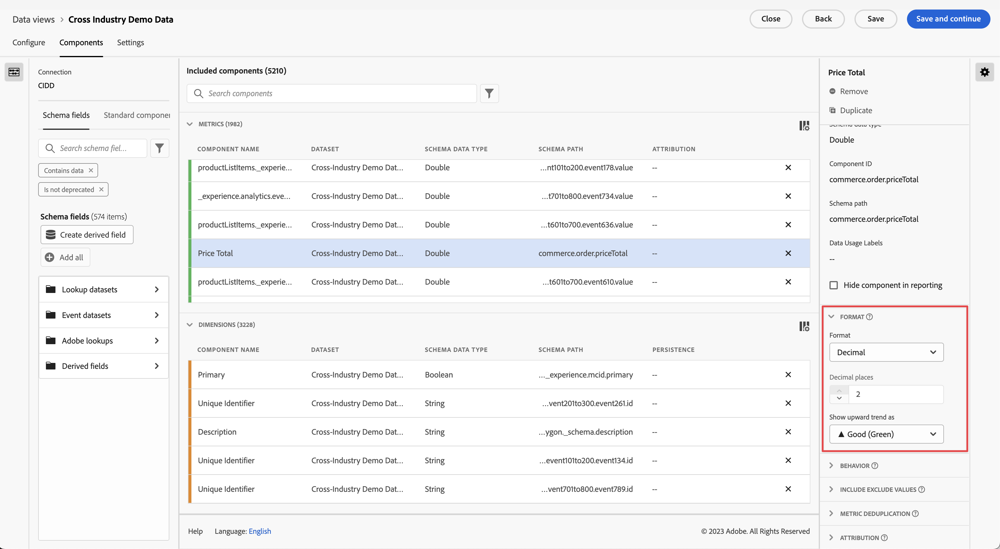

# Formattare le impostazioni dei componenti {#format-component-settings}

<!-- markdownlint-disable MD034 -->

>[!CONTEXTUALHELP]
>id="dataview_component_metric_format"
>title="Formato"
>abstract="Determina come viene visualizzato un componente quando viene utilizzato nei report."

<!-- markdownlint-enable MD034 -->

Il formato consente di determinare come viene visualizzato un determinato componente quando viene utilizzato nei rapporti.

## Configurare le impostazioni di formato per un componente

È possibile determinare la modalità di visualizzazione di un determinato componente regolandone le impostazioni di formato.

1. In Customer Journey Analytics, seleziona la scheda [!UICONTROL **Visualizzazioni dati**].

1. Seleziona la visualizzazione dati che contiene il componente di cui desideri configurare le impostazioni di formato.

1. Seleziona la scheda [!UICONTROL **Componenti**].

1. Seleziona il componente che desideri configurare, quindi espandi la sezione [!UICONTROL **Formato**] sul lato destro della pagina.

   

1. Specifica le seguenti informazioni:

   | Impostazione | Descrizione |
   | --- | --- |
   | **[!UICONTROL Formato]** | Consente di specificare la formattazione di un componente come Decimale, Ora, Percentuale o Valuta. |
   | **[!UICONTROL Decimale]** | Non visibile sui tipi di dati di schema Intero. Consente di specificare il numero di posizioni decimali visualizzate da un componente. |
   | **[!UICONTROL Data]** | Consente di determinare come visualizzare il campo data-ora quando viene utilizzato come dimensione nel reporting. [Ulteriori informazioni](../../use-cases/data-views/data-views-usecases.md#date-and-date-time-use-cases) |
   | **[!UICONTROL Data-Ora]** | Consente di determinare come visualizzare il campo data-ora quando viene utilizzato come dimensione nel reporting. [Ulteriori informazioni](../../use-cases/data-views/data-views-usecases.md#date-and-date-time-use-cases) |
   | **[!UICONTROL Valuta]** | Consente di determinare la valuta in cui visualizzare il componente. 
Se analizzi i dati globali in cui le transazioni si verificano in valute diverse, consulta [Usa conversione valuta](#use-currency-conversion).
 |
   | **[!UICONTROL Mostra tendenza verso l&#39;alto come]** | Consente di specificare se la tendenza verso l’alto per questo componente è positiva (verde) o negativa (rossa). |
   | **[!UICONTROL Valore reale]** e **[!UICONTROL Valore falso]** | Visibile solo sui tipi di dati di schema Booleano. Consente di personalizzare l’etichetta per elemento dimensione per i valori `true` e `false`. |

   {style="table-layout:auto"}

## Usare la conversione valuta {#use-currency-conversion}

<!-- markdownlint-disable MD034 -->

>[!CONTEXTUALHELP]
>id="dataview_component_metric_format_currencyconversion"
>title="Conversione valuta"
>abstract="Seleziona una dimensione del codice valuta per configurare e visualizzare la valuta in base al tipo selezionato."

<!-- markdownlint-enable MD034 -->

La conversione della valuta in Customer Journey Analytics può essere estremamente utile per le aziende che operano a livello internazionale. Eliminando le complessità della conversione manuale della valuta, la conversione della valuta in Customer Journey Analytics porta uniformità e chiarezza ai dati finanziari. La conversione di valuta tiene traccia dei tassi di cambio storici giornalieri e mantiene tali tassi per un periodo di 4 anni.

Ad esempio, se un’azienda di e-commerce opera negli Stati Uniti, nel Regno Unito e nell’UE, i dati di vendita possono essere automaticamente convertiti in USD, garantendo un facile confronto e una comprensione olistica delle prestazioni.

>[!NOTE]
>
>Prima di iniziare a configurare una metrica per la conversione della valuta, considera quanto segue:
>
>* La metrica selezionata per la conversione della valuta deve avere un tipo numerico (Doppio, Lungo, Intero, Corto, Byte).
>* Imposta la connessione Customer Journey Analytics in modo che contenga almeno un set di dati evento che contiene una dimensione di codice valuta per ogni evento contenente una metrica di valuta. La dimensione del codice valuta utilizza un codice valuta alfabetico conforme allo standard [ISO 4217](https://www.iso.org/iso-4217-currency-codes.html) per rappresentare le valute. Questi valori devono essere in formato totalmente maiuscolo, ad esempio USD per $, EUR per €, GBP per £.

Per determinare come vengono visualizzate e convertite le valute per una data metrica:

1. Inizia a configurare la metrica per la quale desideri utilizzare la valuta come formato, come descritto in precedenza, in [Configura le impostazioni di formato per una metrica](#configure-format-settings-for-a-metric).

1. Con la metrica selezionata, effettua le seguenti selezioni nella sezione [!UICONTROL **Formato**], sul lato destro della pagina:

   * Nel campo [!UICONTROL **Formato**], seleziona [!UICONTROL **Valuta**].

   * Nel campo [!UICONTROL **Posizioni decimali**], scegli il numero di posizioni decimali con cui la metrica viene visualizzata.

     Questa opzione è disponibile solo se la metrica ha un tipo numerico “Doppio”.

   * Seleziona l’opzione [!UICONTROL **Converti valuta**].

   * Nel campo [!UICONTROL **Seleziona dimensione codice valuta**], seleziona la dimensione che rappresenta la valuta da cui stai eseguendo la conversione (la valuta su cui si basano i dati). Seleziona ad esempio una dimensione denominata [!UICONTROL **Codice valuta**].

     Se nello schema dati corrente non è presente una dimensione contenente un campo del codice valuta, è possibile creare un nuovo campo del codice valuta utilizzando [Preparazione dati](https://experienceleague.adobe.com/it/docs/experience-platform/data-prep/home.html), [Data distiller](https://experienceleague.adobe.com/it/docs/experience-platform/query/data-distiller/overview.html) o [Campi derivati](/help/data-views/derived-fields/derived-fields.md). Preparazione dati è adatta solo per le nuove implementazioni perché è solo su base di avanzamento. A seconda della configurazione di un’organizzazione, Data Distiller e Campi derivati possono essere utilizzati per accedere ai valori del codice valuta in modo storico.

   * Nel campo [!UICONTROL **Converti e visualizza valuta in**], scegli la valuta in cui desideri convertire i dati.

1. Ripeti questi passaggi se desideri applicare la conversione della valuta ad altre metriche.

### Domande frequenti

+++ Come viene eseguita la conversione della valuta?

Al momento della generazione del rapporto, il valore della metrica e il codice valuta originale vengono convertiti in USD e quindi nella valuta configurata per la visualizzazione. Per questa conversione vengono utilizzati i tassi di cambio giornalieri applicabili al momento dell’evento.

+++

