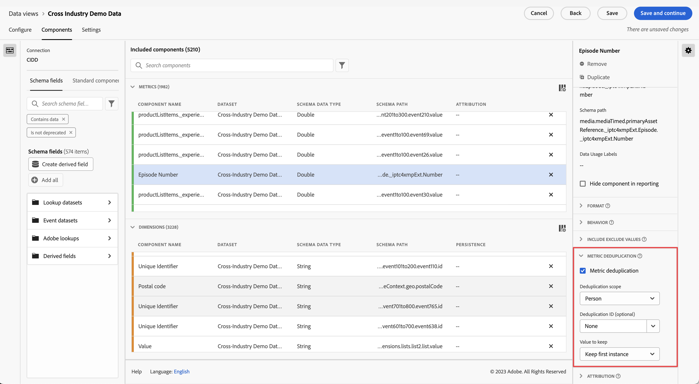

# Impostazioni dei componenti di deduplicazione delle metriche {#metric-deduplication-component-settings}

<!-- markdownlint-disable MD034 -->

>[!CONTEXTUALHELP]
>id="dataview_component_metric_deduplication"
>title="Deduplica delle metriche"
>abstract="Configura una metrica per conteggiare solo i valori che non si verificano in modo ripetitivo."

<!-- markdownlint-enable MD034 -->

La deduplica delle metriche consente di configurare una metrica in modo da conteggiare unicamente i valori in modo non ripetitivo.

| Impostazione | Descrizione |
| --- | --- |
| [!UICONTROL Deduplica delle metriche] | Una casella di controllo che consente di abilitare la deduplicazione delle metriche. Disabilitata per impostazione predefinita. |
| [!UICONTROL Ambito di deduplicazione] | Consente di determinare quanto indietro nel tempo deve effettuarsi la verifica univoca. **[!UICONTROL Conto globale &#x200B;]**: viene conteggiata solo la prima occorrenza metrica nell&#39;intervallo di reporting. **[!UICONTROL Conto]**: viene conteggiata solo la prima occorrenza metrica nell&#39;intervallo di reporting. **[!UICONTROL Opportunità&#x200B;]**: viene conteggiata solo la prima occorrenza metrica nell&#39;intervallo di reporting. **[!UICONTROL Gruppo di acquisto]**: viene conteggiata solo la prima occorrenza metrica nell&#39;intervallo di reporting. **[!UICONTROL Persona &#x200B;]**: viene conteggiata solo la prima occorrenza metrica nell&#39;intervallo di reporting. **[!UICONTROL Sessione]**: viene conteggiata solo la prima occorrenza metrica della sessione.  |
| [!UICONTROL ID deduplicazione] | Invece di applicare la deduplicazione sulla metrica stessa, puoi applicare la deduplicazione metrica in base a una dimensione. Impostazione molto utile per dimensioni quali l&#39;ID acquisto. |
| [!UICONTROL Valore da mantenere] | <ul><li>**Mantieni prima istanza**: utilizza questa opzione nelle situazioni in cui l’istanza iniziale della metrica è quella valida. Ad esempio, per una conferma di acquisto: se l’utente ricarica inavvertitamente la pagina e questo genera un’altra istanza di conferma dell’acquisto, l’evento valido resta comunque quello iniziale.</li><li>**Mantieni ultima istanza**: utilizza questa opzione in situazioni in cui conviene raccogliere l’ultima istanza. Esempio: l’utente aggiorna il suo profilo online. In questo caso sarà necessario contare solo uno di tali aggiornamenti per sessione. Tuttavia, l’utente può aggiornare il profilo più volte durante una sessione. Se si mantenesse la prima istanza, alcune attività potrebbero non essere associate all’evento. In casi simili, conviene mantenere l’ultima istanza.</li></ul> |

{style="table-layout:auto"}

>[!CAUTION]
>
>La deduplica a livello di una _persona_ viene valutata in base a mesi completi nel fuso orario UTC. Se l’intervallo di reporting non comprende mesi completi, potrebbero essere escluse le prime o ultime istanze che si sono verificate entro il mese completo, ma oltre le date di reporting.
