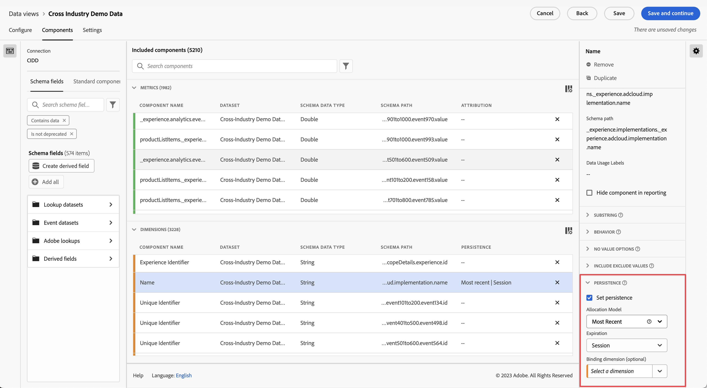

# Impostazioni del componente [!UICONTROL Persistenza] {#persistence-component-settings}

<!-- markdownlint-disable MD034 -->

>[!CONTEXTUALHELP]
>id="dataview_component_dimension_persistence"
>title="Persistenza"
>abstract="Configura il modello di allocazione predefinito applicato a una dimensione. L’allocazione si applica prima dei segmenti nel reporting."

<!-- markdownlint-enable MD034 -->

[!UICONTROL Persistenza] è la capacità di un dato valore di dimensione di attribuire a una metrica oltre l&#39;evento su cui è impostato. Utilizza una combinazione di allocazione e scadenza.

* L’**allocazione** consente di determinare quale valore viene mantenuto quando più elementi dimensionali possono persistere alla volta in una singola colonna.

  >[!NOTE]
  >
  >Se in un report è impostato un [modello di attribuzione non predefinito](/help/data-views/component-settings/attribution.md) per una metrica, il modello di attribuzione ignora l’allocazione impostata sulla dimensione per lo stesso report.
  >
  >Tuttavia, quando si esegue un’[esportazione di tabelle complete](/help/analysis-workspace/export/export-cloud.md) che include più dimensioni, l’attribuzione mantiene i modelli di allocazione applicati a ogni dimensione.

* **Scadenza** consente di determinare per quanto tempo un elemento dimensione persiste oltre l’evento su cui è impostato.

[!UICONTROL La persistenza] è disponibile solo nelle dimensioni ed è retroattiva per i dati a cui viene applicata. Si tratta di una trasformazione immediata dei dati che avviene prima dell’applicazione di segmentazioni o di altre operazioni di analisi.

| Impostazione | Descrizione |
| --- | --- |
| [!UICONTROL Imposta persistenza] | Abilita la persistenza per la dimensione. Se la persistenza non è abilitata, la dimensione si riferisce solo alle metriche esistenti nello stesso evento. Questa impostazione è disattivata per impostazione predefinita. |
| [!UICONTROL Allocazione] | Specifica il modello di allocazione utilizzato su una dimensione per la persistenza. Le opzioni sono:<ul><li>**[!UICONTROL Più recente]**: i valori nella dimensione persistono fino a quando non vengono sovrascritti dai valori successivi</li><li> **[!UICONTROL Originale]**: il primo valore per questa dimensione persiste e non viene sovrascritto dai valori successivi</li><li>**[!UICONTROL Tutti]**: tutti i valori di questa dimensione persistono contemporaneamente</li><li>**[!UICONTROL Primo elemento noto]**: viene utilizzato il primo valore per questa dimensione che verrà applicato a tutti gli eventi precedenti e successivi.</li><li>**[!UICONTROL Ultimo/i noto/i]**: viene utilizzato l&#39;ultimo valore per questa dimensione che verrà applicato a tutti gli eventi precedenti e successivi.</li></ul> |
| [!UICONTROL Scadenza] | Specifica la finestra di persistenza per una dimensione. Le opzioni sono: <ul><li>**[!UICONTROL Sessione]** (impostazione predefinita)</li><li>**[!UICONTROL Persona]**</li><li>**[!UICONTROL Ora personalizzata]**</li><li>**[!UICONTROL Metrica]**</li></ul>. Potrebbe essere necessario poter scadere la dimensione su un acquisto (ad esempio termini di ricerca interni o altri casi d’uso di merchandising). Il tempo di scadenza massimo che puoi impostare è di 90 giorni. Se selezioni un&#39;allocazione di [!UICONTROL Tutti], è disponibile solo la [!UICONTROL Sessione] o la [!UICONTROL Persona]. |

{style="table-layout:auto"}

## Impostazioni [!UICONTROL Allocazione]

Le impostazioni di allocazione disponibili sono:

* **[!UICONTROL Più recente]**: persiste il valore più recente (per marca temporale) presente nella dimensione. Eventuali valori successivi che si verificano all’interno del periodo di scadenza della dimensione sostituiscono il valore persistente precedente. Se su questa dimensione è abilitato “Treat &#39;No Value&#39; as a value” in [Nessuna opzione di valore](no-value-options.md), i valori vuoti sovrascrivono quelli persistenti in precedenza. Ad esempio, considera la seguente tabella con l&#39;allocazione [!UICONTROL Più recente] e la scadenza [!UICONTROL Sessione]:

  | Dimensione | Hit 1 | Hit 2 | Hit 3 | Hit 4 | Hit 5 |
  | --- | --- | --- | --- | --- | --- |
  | Valori del set di dati |  | C | B |  | A |
  | Allocazione più recente |  | C | B | B | A |

* **[!UICONTROL Originale]**: Persiste il valore originale per marca temporale presente nella dimensione per la durata del periodo di scadenza. Se questa dimensione ha un valore, non viene sovrascritta quando viene visualizzato un valore diverso in un evento successivo. Ad esempio, considera la seguente tabella con allocazione [!UICONTROL Originale] e scadenza [!UICONTROL Sessione]:

  | Dimensione | Hit 1 | Hit 2 | Hit 3 | Hit 4 | Hit 5 |
  | --- | --- | --- | --- | --- | --- |
  | Valori del set di dati |  | C | B |  | A |
  | Allocazione originale |  | C | C | C | C |

* **[!UICONTROL All]**: Agisce in modo simile al modello di attribuzione [!UICONTROL Participation] per le metriche. Persiste tutti i valori equamente in modo che ciascuno ottenga il pieno credito per la metrica nel reporting. Ad esempio, considera la seguente tabella con l&#39;allocazione [!UICONTROL All] e la scadenza [!UICONTROL Session]:

  | Dimensione | Hit 1 | Hit 2 | Hit 3 | Hit 4 | Hit 5 |
  | --- | --- | --- | --- | --- | --- |
  | Valori del set di dati | A | B | C |  | A |
  | Tutte le allocazioni | A | A,B | A, B, C | A, B, C | A, B, C |

* **[!UICONTROL Primo noto]** e **[!UICONTROL Ultimo noto]**: (19 gennaio 2022 ) questi due modelli di allocazione soddisfano i casi di utilizzo delle dimensioni &quot;entrata&quot; e &quot;uscita&quot;. Considerano il primo o l’ultimo valore osservato relativo a una dimensione all’interno di un ambito di persistenza specificato (sessione, persona o periodo di tempo personalizzato con lookback) e lo applicano a tutti gli eventi all’interno dell’ambito specificato. Esempio:

  | Dimensione | Hit 1 | Hit 2 | Hit 3 | Hit 4 | Hit 5 |
  | --- | --- | --- | --- | --- | --- |
  | Marca temporale (min) | 1 | 2 | 3 | 6 | 7 |
  | Valori originali |  | C | B |  | A |
  | First known (Primo noto) | C | C | C | C | C |
  | Last known (Ultimo noto) | A | A | A | A | A |

## [!UICONTROL Impostazioni scadenza]

Le impostazioni di scadenza disponibili sono:

* **Sessione**: scade dopo una determinata sessione. Finestra di scadenza predefinita.
* **Intervallo di reporting Persona**: scade alla fine dell’intervallo di reporting.
* **Intervallo di reporting Account globale** [!BADGE B2B Edition]{type=Informative url="https://experienceleague.adobe.com/it/docs/analytics-platform/using/cja-overview/cja-b2b/cja-b2b-edition" newtab=true tooltip="Customer Journey Analytics B2B Edition"}: scade alla fine dell’intervallo di reporting.
* **Intervallo di reporting Account** [!BADGE B2B Edition]{type=Informative url="https://experienceleague.adobe.com/it/docs/analytics-platform/using/cja-overview/cja-b2b/cja-b2b-edition" newtab=true tooltip="Customer Journey Analytics B2B Edition"}: scade alla fine dell’intervallo di reporting.
* **Intervallo di reporting Opportunità** [!BADGE B2B Edition]{type=Informative url="https://experienceleague.adobe.com/it/docs/analytics-platform/using/cja-overview/cja-b2b/cja-b2b-edition" newtab=true tooltip="Customer Journey Analytics B2B Edition"}: scade alla fine dell’intervallo di reporting.
* **Intervallo di reporting Gruppo acquisti** [!BADGE B2B Edition]{type=Informative url="https://experienceleague.adobe.com/it/docs/analytics-platform/using/cja-overview/cja-b2b/cja-b2b-edition" newtab=true tooltip="Customer Journey Analytics B2B Edition"}: scade alla fine dell’intervallo di reporting.
* **Orario personalizzato**: scade dopo un determinato periodo di tempo (fino a 90 giorni). Questa opzione di scadenza è disponibile solo per i modelli di allocazione Originale e Più recente. Quando si utilizza una scadenza basata sul tempo, vengono considerati i valori precedenti all’inizio dell’intervallo di reporting (fino a 90 giorni).
* **Metrica**: quando questa metrica viene visualizzata in un evento, scade immediatamente il valore persistente nella dimensione. Puoi utilizzare qualsiasi metrica come termine scadenza per questa dimensione. Questa opzione di scadenza è disponibile solo per le impostazioni di allocazione Originale e Più recente.

## [!UICONTROL Associazione di Dimension]

Menu a discesa che consente di associare la persistenza di un valore di dimensione ai valori di dimensione in un’altra dimensione. Le opzioni valide includono altre dimensioni presenti nella visualizzazione dati.

Per esempi su come utilizzare le dimensioni di binding in modo efficace, vedere [Utilizzo di dimensioni e metriche di binding in Customer Journey Analytics](../../use-cases/data-views/binding-dimensions-metrics.md).

>[!BEGINSHADEBOX]

Per un video dimostrativo, guarda  [Dimensioni di binding](https://experienceleague.adobe.com/en/docs/customer-journey-analytics-learn/tutorials/data-views/binding-dimensions-in-data-views){target="_blank"}.

>[!ENDSHADEBOX]

## [!UICONTROL Metrica di binding]

Menu a discesa che consente di scegliere una metrica che funge da trigger di binding. Le opzioni valide includono le metriche presenti nella visualizzazione dati.

Questa impostazione viene visualizzata solo quando la dimensione di binding è inferiore nell’array dell’oggetto rispetto al componente. Quando la metrica di binding è presente in un evento, i valori di dimensione vengono copiati dalla dimensione a livello di evento fino al livello di schema inferiore della dimensione di binding.

Per ulteriori informazioni su come utilizzare in modo efficace le metriche di binding, vedere il secondo esempio in [Utilizzo di dimensioni e metriche di binding in Customer Journey Analytics](../../use-cases/data-views/binding-dimensions-metrics.md).
