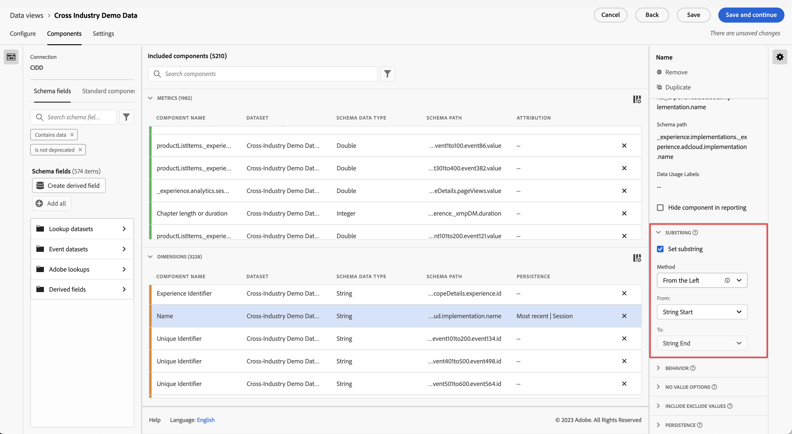

# Impostazioni del componente [!UICONTROL Substring]

Le impostazioni del componente [!UICONTROL Substring]consentono di eseguire più metodi di manipolazione delle stringhe per ottenere gli elementi dimensionali desiderati nei rapporti.

[!UICONTROL Substring] è disponibile solo sulle dimensioni ed è retroattivo per i dati a cui viene applicato. Si tratta di una trasformazione immediata dei dati che avviene prima dell’applicazione di filtri o di altre operazioni di analisi.

## From the Left/Right (Da sinistra/destra)

Prendi parte di una stringa in base alla sua posizione rispetto all’inizio o alla fine di una stringa. I metodi **[!UICONTROL From the Left]** e **[!UICONTROL From the Right]** hanno due elenchi a discesa: **[!UICONTROL From]** (da dove inizia l’output) e **[!UICONTROL To]** (dove termina l’output).

* **[!UICONTROL String Start]**: inizio della stringa.
* **[!UICONTROL String End]**: fine della stringa.
* **[!UICONTROL Position]**: numero statico di caratteri da sinistra o da destra, a seconda del metodo.
* **[!UICONTROL String]**: specifica un carattere o una sequenza di caratteri per indicare l’inizio o la fine di una stringa. Questo menu a discesa presenta alche altre opzioni:
   * **[!UICONTROL Match]**: stringa da trovare (corrispondenza). Se l’input non corrisponde a questo campo, vengono applicale le [opzioni per nessun valore](no-value-options.md).
   * **[!UICONTROL Index]**: il criterio **[!UICONTROL Match]** può essere presente più volte in una stringa. Questo numero intero determina quale corrispondenza considerare per avviare o terminare l’output, a seconda del metodo. Ad esempio, l’indice `1` rappresenta la prima corrispondenza. Se l’indice è superiore al numero di corrispondenze disponibili, vengono applicate le [opzioni per “Nessun valore”](no-value-options.md).
   * **[!UICONTROL Include String]**: casella di controllo che, se abilitata, include nell’output la stringa **[!UICONTROL Match]**.
* **[!UICONTROL Length]**: numero intero che specifica quanti caratteri includere dopo la posizione di inizio dell’output. Disponibile solo nel menu a discesa **[!UICONTROL To]**.

## Delimiter (Delimitatore)

Utilizza questo metodo per i campi che utilizzano un delimitatore per separare più valori stringa. Puoi estrarre un singolo elemento da utilizzare come output oppure convertire la stringa in un elemento schema di tipo array di oggetti.

* **[!UICONTROL Criterion]**: come trattare l’elenco di valori delimitato.
   * **[!UICONTROL From the Left]**: inizia dall’inizio dell’elenco delimitato e conta in avanti.
   * **[!UICONTROL From the Right]**: inizia dalla fine dell’elenco delimitato e conta all’indietro.
   * **[!UICONTROL Convert to array]**: considera questa dimensione come elemento schema di tipo array di oggetti.
* **[!UICONTROL Delimiter]**: delimitatore utilizzato dal campo.
* **[!UICONTROL Index]**: disponibile solo se il criterio è From the Left/Right (Da sinistra/Da destra). Numero dell’elemento come se si trovasse in un array. Ad esempio, se l’input della stringa è `"Fox,Turtle,Rabbit,Wolf"` con un indice pari a 3, l’output è `"Rabbit"`. Se l’indice è superiore al numero di elementi delimitati, vengono applicate le [opzioni per “Nessun valore”](no-value-options.md).

## URL parse (Analisi URL)

Da utilizzare con campi contenenti URL. Per l’URL di esempio `https://example.com/store/index.html?cid=campaign#cart`, sono disponibili le seguenti opzioni:

* **[!UICONTROL Get protocol]**: ottiene il protocollo dell’URL. Esempio: `"https://"`.
* **[!UICONTROL Get host]**: ottiene l’host dell’URL. Esempio: `"example.com"`.
* **[!UICONTROL Get path]**: ottiene il percorso dell’URL. Esempio: `"store/index.html"`.
* **[!UICONTROL Get query string value]**: ottiene il valore da una singola stringa di query. Inserisci il parametro della stringa di query desiderato nel campo **[!UICONTROL Query key]**. Se questo URL viene utilizzato con la chiave di query `"cid"`, l’output è `"campaign"`.
* **[!UICONTROL Get hash value]**: ottiene il valore hash dell’URL. Esempio: `"cart"`.

Se l’input non è un URL valido o se il componente URL desiderato non è presente, vengono applicate le [opzioni per “Nessun valore”](no-value-options.md).

## Trim (Taglia)

Consente di rimuovere dalla stringa spazi vuoti o caratteri speciali.

* **[!UICONTROL Trim whitespaces]**: casella di controllo che, se abilitata, consente di rimuovere tutti gli spazi all’inizio e alla fine della stringa.
* **[!UICONTROL Trim special characters]**: casella di controllo che, se abilitata, rivela un campo di input **[!UICONTROL Special characters]**. Tutti i caratteri in questo campo vengono rimossi dall’output. I caratteri multibyte non sono supportati.

## Regex

Applica espressioni regolari a una dimensione per recuperare il valore desiderato.

* **[!UICONTROL Regex]**: formula di espressione regolare.
* **[!UICONTROL Output format]**: campo facoltativo che consente di aggiungere del testo o riordinare l’output del sottogruppo regex. Se questo campo è vuoto, l’output della stringa corrisponde all’espressione regex valutata.
* **[!UICONTROL Case sensitive]**: casella di controllo che, se abilitata, applica all’espressione regolare la distinzione tra maiuscole e minuscole.

CJA utilizza un sottoinsieme della sintassi regex Perl. Se l’input non corrisponde all’espressione regolare e **[!UICONTROL Output format]** è vuoto, vengono applicate le [opzioni per “Nessun valore”](no-value-options.md). Sono supportate le seguenti espressioni:

| Espressione | Descrizione |
| --- | --- |
| `a` | Un singolo carattere `a`. |
| `a|b` | Un singolo carattere `a` o `b`. |
| `[abc]` | Un singolo carattere `a`, `b` o `c`. |
| `[^abc]` | Qualsiasi carattere singolo eccetto `a`, `b` o `c`. |
| `[a-z]` | Qualsiasi carattere singolo compreso nell’intervallo `a`-`z`. |
| `[a-zA-Z0-9]` | Qualsiasi carattere singolo compreso negli intervalli `a`-`z` e `A`-`Z`, o cifra compresa tra `0` e `9`. |
| `^` | Corrisponde all’inizio della riga. |
| `$` | Corrisponde alla fine della riga. |
| `\A` | Inizio della stringa. |
| `\z` | Fine della stringa. |
| `.` | Corrisponde a qualsiasi carattere. |
| `\s` | Qualsiasi carattere spazio vuoto. |
| `\S` | Qualsiasi carattere tranne gli spazi vuoti. |
| `\d` | Qualsiasi cifra. |
| `\D` | Qualsiasi carattere tranne le cifre. |
| `\w` | Qualsiasi lettera, numero o carattere di sottolineatura. |
| `\W` | Qualsiasi carattere non alfanumerico. |
| `\b` | Qualsiasi confine di parola. |
| `\B` | Qualsiasi carattere che non sia un confine di parola. |
| `\<` | Inizio della parola. |
| `\>` | Fine della parola. |
| `(...)` | Acquisisce tutti i caratteri racchiusi. |
| `(?:...)` | Acquisizione senza marcatura. Impedisce che la corrispondenza sia riportata nella stringa di output. |
| `a?` | Zero o uno di `a`. |
| `a*` | Zero o più di uno di `a`. |
| `a+` | Uno o più di `a`. |
| `a{3}` | Esattamente 3 di `a`. |
| `a{3,}` | 3 o più di `a`. |
| `a{3,6}` | Tra 3 e 6 di `a`. |

Sono supportati anche i segnaposto di output. È possibile utilizzare queste sequenze nel **[!UICONTROL Output format]** un qualsiasi numero di volte e in qualsiasi ordine per ottenere l’output di stringa desiderato.

| Sequenza di segnaposto di output | Descrizione |
| --- | --- |
| `$&` | Restituisce ciò che corrisponde all’intera espressione. |
| `$n` | Restituisce ciò che corrisponde alla ennesima espressione secondaria. Esempio: `$1` restituisce la prima espressione secondaria. |
| ``$` `` | Restituisce il testo tra la fine dell’ultima corrispondenza trovata (o l’inizio del testo, in assenza di una corrispondenza precedente) e l’inizio della corrispondenza corrente. |
| `$+` | Restituisce ciò che corrisponde all’ultima espressione secondaria contrassegnata nell’espressione regolare. |
| `$$` | Restituisce il carattere stringa `"$"`. |

{style=&quot;table-layout:auto&quot;}

## Video sulle dimensioni di binding

Ecco un video sulle dimensioni di binding:

>[!VIDEO](https://video.tv.adobe.com/v/342694/?quality=12)
