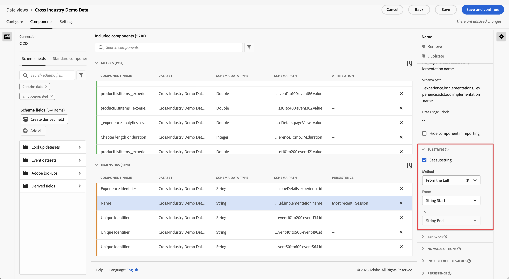

# Impostazioni dei componenti della Sottostringa {#substring-component-settings}

<!-- markdownlint-disable MD034 -->

>[!CONTEXTUALHELP]
>id="dataview_component_dimension_substring"
>title="Sottostringa"
>abstract="Estrai parti di una stringa utilizzando regole o espressioni regolari."

<!-- markdownlint-enable MD034 -->

Le impostazioni del componente [!UICONTROL Substring] consentono di eseguire più metodi di manipolazione delle stringhe per ottenere gli elementi dimensionali desiderati nei report.

[!UICONTROL Substring] è disponibile solo nelle dimensioni ed è retroattivo per i dati a cui viene applicato. Si tratta di una trasformazione immediata dei dati che avviene prima dell’applicazione di segmentazioni o di altre operazioni di analisi.

## From the Left/Right (Da sinistra/destra)

Prendi parte di una stringa in base alla sua posizione rispetto all’inizio o alla fine di una stringa. **[!UICONTROL Da sinistra]** e **[!UICONTROL Da destra]** i metodi forniscono due menu a discesa: **[!UICONTROL Da]** (da cui inizia l&#39;output) e **[!UICONTROL A]** (da cui termina l&#39;output).

* **[!UICONTROL Inizio stringa]**: inizio della stringa.
* **[!UICONTROL Fine stringa]**: fine della stringa.
* **[!UICONTROL Posizione]**: numero statico di caratteri da sinistra o da destra, a seconda del metodo.
* **[!UICONTROL Stringa]**: specifica un carattere o una sequenza di caratteri per indicare l&#39;inizio o la fine di una stringa. Questo menu a discesa presenta anche altre opzioni:
   * **[!UICONTROL Corrispondenza]**: stringa da trovare. Se l’input non corrisponde a questo campo, vengono applicale le [opzioni per nessun valore](no-value-options.md).
   * **[!UICONTROL Indice]**: il criterio **[!UICONTROL Corrispondenza]** può essere presente più volte in una stringa. Questo numero intero determina quale corrispondenza considerare per avviare o terminare l’output, a seconda del metodo. Ad esempio, l’indice `1` rappresenta la prima corrispondenza. Se l’indice è superiore al numero di corrispondenze disponibili, vengono applicate le [opzioni per “Nessun valore”](no-value-options.md).
   * **[!UICONTROL Includi stringa]**: casella di controllo che include la stringa **[!UICONTROL Corrispondenza]** nell&#39;output se abilitata.
* **[!UICONTROL Lunghezza]**: un numero intero che specifica il numero di caratteri da includere dopo la posizione iniziale dell&#39;output. Disponibile solo nel menu a discesa **[!UICONTROL A]**.

## Delimiter (Delimitatore)

Utilizza questo metodo per i campi che utilizzano un delimitatore per separare più valori stringa. Puoi estrarre un singolo elemento da utilizzare come output oppure convertire la stringa in un elemento schema di tipo array di oggetti.

* **[!UICONTROL Criterio]**: come trattare l&#39;elenco di valori delimitato.
   * **[!UICONTROL Da sinistra]**: inizia dall&#39;inizio dell&#39;elenco delimitato e conta in avanti.
   * **[!UICONTROL Da destra]**: inizia dalla fine dell&#39;elenco delimitato e conta all&#39;indietro.
   * **[!UICONTROL Converti in array]**: considera questa dimensione come un elemento schema di tipo array di oggetti. La dimensione diventa disponibile come [contenitore personalizzato](/help/data-views/create-dataview.md#containers-1) che puoi selezionare nella visualizzazione dati e utilizzare per [analisi sub-evento](/help/components/segments/sub-event.md) in un progetto Workspace.
* **[!UICONTROL Delimitatore]**: delimitatore utilizzato dal campo.
* **[!UICONTROL Indice]**: disponibile solo se il criterio è From the Left/Right (Da sinistra/Da destra). Numero dell’elemento come se si trovasse in un array. Ad esempio, se l’input della stringa è `"Fox,Turtle,Rabbit,Wolf"` con un indice pari a 3, l’output è `"Rabbit"`. Se l’indice è superiore al numero di elementi delimitati, vengono applicate le [opzioni per “Nessun valore”](no-value-options.md).

## URL parse (Analisi URL)

Da utilizzare con campi contenenti URL. Per l’URL di esempio `https://example.com/store/index.html?cid=campaign#cart`, sono disponibili le seguenti opzioni:

* **[!UICONTROL Ottieni protocollo]**: ottiene il protocollo dell&#39;URL. Ad esempio: `"https://"`.
* **[!UICONTROL Ottieni host]**: ottiene l&#39;host dell&#39;URL. Ad esempio: `"example.com"`.
* **[!UICONTROL Ottieni percorso]**: ottiene il percorso dell&#39;URL. Ad esempio: `"store/index.html"`.
* **[!UICONTROL Ottieni valore stringa di query]**: ottiene il valore da una singola stringa di query. Inserire il parametro della stringa di query desiderato nel campo **[!UICONTROL Chiave di query]**. Se questo URL viene utilizzato con la chiave di query `"cid"`, l’output è `"campaign"`.
* **[!UICONTROL Ottieni valore hash]**: ottiene il valore hash dell&#39;URL. Esempio: `"cart"`.

Se l’input non è un URL valido o se il componente URL desiderato non è presente, vengono applicate le [opzioni per “Nessun valore”](no-value-options.md).

## Taglia

Consente di rimuovere dalla stringa spazi vuoti o caratteri speciali.

* **[!UICONTROL Ritaglia spazi vuoti]**: casella di controllo che, se abilitata, rimuove tutti gli spazi all&#39;inizio e alla fine della stringa.
* **[!UICONTROL Taglia caratteri speciali]**: casella di controllo che, se abilitata, rivela un campo di input di **[!UICONTROL caratteri speciali]**. Tutti i caratteri in questo campo vengono rimossi dall’output. I caratteri multibyte non sono supportati.

## Regex

Applica espressioni regolari a una dimensione per recuperare il valore desiderato.

* **[!UICONTROL Regex]**: la formula dell&#39;espressione regolare.
* **[!UICONTROL Formato di output]**: campo facoltativo che consente di aggiungere testo o riordinare l&#39;output del sottogruppo regex. Se questo campo è vuoto, l’output della stringa corrisponde all’espressione regex valutata.
* **[!UICONTROL Distinzione maiuscole/minuscole]**: casella di controllo che, se abilitata, applica all&#39;espressione regolare la distinzione tra maiuscole e minuscole.

Customer Journey Analytics utilizza un sottoinsieme della sintassi delle regex in Perl. Se l&#39;input non corrisponde all&#39;espressione regolare e il formato di output **1&rbrace; è vuoto, vengono applicate le [opzioni per nessun valore](no-value-options.md).** Sono supportate le seguenti espressioni:

| Espressione | Descrizione |
| --- | --- |
| `a` | Un singolo carattere `a`. |
| `a\|b` | Un singolo carattere `a` o `b`. |
| `[abc]` | Un singolo carattere `a`, `b` o `c`. |
| `[^abc]` | Qualsiasi carattere singolo eccetto `a`, `b` o `c`. |
| `[a-z]` | Qualsiasi carattere singolo compreso nell’intervallo `a`-`z`. |
| `[a-zA-Z0-9]` | Qualsiasi carattere singolo compreso negli intervalli `a`-`z` e `A`-`Z`, o cifra compresa tra `0` e `9`. |
| `^` | Corrisponde all’inizio della riga. |
| `$` | Corrisponde alla fine della riga. |
| `\A` | Inizio della stringa. |
| `\z` | Fine della stringa. |
| `.` | Corrisponde a qualsiasi carattere. |
| `\s` | Qualsiasi carattere spazio vuoto. |
| `\S` | Qualsiasi carattere tranne gli spazi vuoti. |
| `\d` | Qualsiasi cifra. |
| `\D` | Qualsiasi carattere tranne le cifre. |
| `\w` | Qualsiasi lettera, numero o carattere di sottolineatura. |
| `\W` | Qualsiasi carattere non alfanumerico. |
| `\b` | Qualsiasi confine di parola. |
| `\B` | Qualsiasi carattere che non sia un confine di parola. |
| `\<` | Inizio della parola. |
| `\>` | Fine della parola. |
| `(...)` | Acquisisce tutti i caratteri racchiusi. |
| `(?:...)` | Acquisizione senza marcatura. Impedisce che la corrispondenza sia riportata nella stringa di output. |
| `a?` | Zero o uno di `a`. |
| `a*` | Zero o più di uno di `a`. |
| `a+` | Uno o più di `a`. |
| `a{3}` | Esattamente 3 di `a`. |
| `a{3,}` | 3 o più di `a`. |
| `a{3,6}` | Tra 3 e 6 di `a`. |

Sono supportati anche i segnaposto di output. Puoi utilizzare queste sequenze nel **[!UICONTROL Formato di output]** un numero illimitato di volte e in qualsiasi ordine per ottenere l’output di stringa desiderato.

| Sequenza di segnaposto di output | Descrizione |
| --- | --- |
| `$&` | Restituisce ciò che corrisponde all’intera espressione. |
| `$n` | Restituisce ciò che corrisponde alla ennesima espressione secondaria. Esempio: `$1` restituisce la prima espressione secondaria. |
| ``$` `` | Restituisce il testo tra la fine dell’ultima corrispondenza trovata (o l’inizio del testo, in assenza di una corrispondenza precedente) e l’inizio della corrispondenza corrente. |
| `$+` | Restituisce ciò che corrisponde all’ultima espressione secondaria contrassegnata nell’espressione regolare. |
| `$$` | Restituisce il carattere stringa `"$"`. |

{style="table-layout:auto"}
