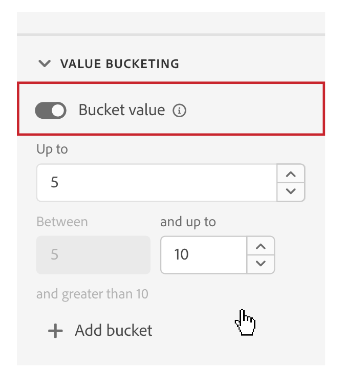

# Impostazioni del componente [!UICONTROL Value Bucketing]

Durante la creazione o la modifica di una visualizzazione dati, il bucket dei valori consente di combinare valori numerici in base a un intervallo. È disponibile solo per le dimensioni che utilizzano tipi di dati con schema intero o doppio.

La divisione in blocchi di valori è utile quando si desidera raggruppare gli intervalli anziché trattare ogni numero univoco come un elemento di dimensione separato. Ad esempio, un bucket “Tra 5 e 10” viene visualizzato come una riga da “5 a 10” in Analysis Workspace.

Se desideri la flessibilità di generare rapporti sia su una dimensione a blocchi che su una dimensione non a blocchi, trascina due copie del componente nell’elenco delle dimensioni disponibili. Abilitare il bucket su una dimensione e disattivarla sull&#39;altra.

| Impostazione | Descrizione |
| --- | --- |
| [!UICONTROL Bucket value] | Una casella di controllo che consente di abilitare il bucketing. |
| [!UICONTROL Less than] | Il limite superiore del primo bucket di dimensioni. |
| [!UICONTROL Including] [!UICONTROL and less than] | Limiti dei bucket successivi. |
| [!UICONTROL Greater than or equal to] | Il limite inferiore dell’ultimo bucket di dimensione. |
| [!UICONTROL Add bucket] | Consente di aggiungere un altro bucket alla creazione a blocchi di dimensioni numeriche. È possibile aggiungere fino a 20 bucket in una singola dimensione. |

{style="table-layout:auto"}
