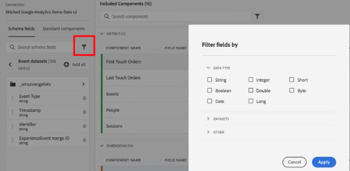

# Creare o modificare una visualizzazione di dati

Per creare una visualizzazione dati occorre creare metriche e dimensioni dagli elementi dello schema o utilizzare componenti standard. Gli elementi dello schema sono prevalentemente dimensioni o metriche, a seconda dei requisiti aziendali. Una volta trascinato un elemento schema in una visualizzazione dati, a destra vengono visualizzate le opzioni con cui è possibile regolare il funzionamento della dimensione o metrica in CJA.

Video sull’argomento:

>[!VIDEO](https://video.tv.adobe.com/v/35110/?quality=12&learn=on)

## Configurare una visualizzazione dati

1. Accedi a [Customer Journey Analytics](https://analytics.adobe.com) e passa alla scheda **[!UICONTROL Data Views]**.
2. Fai clic su **[!UICONTROL Add]** per creare una visualizzazione dati, oppure fai clic su una visualizzazione dati esistente per modificarla.

### Impostazioni della visualizzazione dati

Impostazioni generali per la visualizzazione dati.

| Impostazione | Descrizione |
| --- | --- |
| [!UICONTROL Connection] | Questo campo collega la visualizzazione dati alla connessione stabilita in precedenza, che contiene uno o più set di dati Adobe Experience Platform. |
| [!UICONTROL Name] | Obbligatorio. Nome della visualizzazione dati. Questo valore viene visualizzato nell’elenco a discesa in alto a destra in Analysis Workspace. |
| [!UICONTROL Description] | Facoltativo. Adobe consiglia di specificare una descrizione dettagliata, che consenta agli utenti di capire lo scopo della visualizzazione dati e per chi è progettata. |

{style="table-layout:auto"}

### Contenitori

Definisce il nome dei contenitori per la visualizzazione dati. I nomi dei contenitori vengono spesso utilizzati nei [filtri](/help/components/filters/filters-overview.md#Filter-containers).

| Impostazione | Descrizione |
| --- | --- |
| [!UICONTROL Person container name] | [!UICONTROL Person] (impostazione predefinita). Il [!UICONTROL Person] il contenitore include ogni sessione ed evento per le persone entro l’intervallo di tempo specificato. Se l’organizzazione utilizza un termine diverso (ad esempio, “Visitatore” o “Utente”), qui puoi rinominare il contenitore. |
| [!UICONTROL Session container name] | [!UICONTROL Session] (impostazione predefinita). Il contenitore [!UICONTROL Session] consente di identificare le interazioni con pagine, campagne o conversioni per una specifica sessione. Puoi rinominarlo “Visita” o con qualsiasi altro termine secondo le esigenze della tua organizzazione. |
| [!UICONTROL Event container name] | [!UICONTROL Event] (impostazione predefinita). Il contenitore [!UICONTROL Event] definisce singoli eventi in un set di dati. Se l’organizzazione utilizza un termine diverso (ad esempio, “Hit” o “Visualizzazioni pagine”), qui puoi rinominare il contenitore. |

{style="table-layout:auto"}

### Calendario

Indica il formato del calendario da applicare alla visualizzazione dati. Puoi avere più visualizzazioni dati basate sulla stessa [Connessione](/help/connections/create-connection.md) e assegnare loro diversi tipi di calendario o fusi orari. Tali visualizzazioni dati possono consentire ai team che utilizzano diversi tipi di calendario di soddisfare le rispettive esigenze, utilizzando gli stessi dati sottostanti.

| Impostazione | Descrizione |
| --- | --- |
| [!UICONTROL Time zone] | Scegli il fuso orario da applicare ai dati che vengono presentati. Se scegli un fuso orario con ora legale, i dati vengono automaticamente regolati in base a tale impostazione. In primavera, quando si va avanti di un’ora, vi sarà un vuoto di un’ora. In autunno, quando si va indietro di un’ora, verrà ripetuta un’ora al momento del passaggio all’ora solare. |
| [!UICONTROL Calendar Type] | Determina in che modo vengono raggruppate le settimane del mese. **Gregoriano:** formato di calendario standard. I trimestri sono raggruppati per mese. **4-5-4 Retail:** calendario 4-5-4 standard nel settore retail. Il primo e l’ultimo mese del trimestre contengono ciascuno 4 settimane; il secondo mese del trimestre è invece composto di 5 settimane. **Custom (4-5-4):** simile al calendario 4-5-4 eccetto che è possibile scegliere il primo giorno dell’anno e in quale anno si verifica la settimana “extra”. **Custom (4-4-5):** il primo e l’ultimo mese di ogni trimestre contengono ciascuno 4 settimane; l’ultimo mese di ogni trimestre è invece composto di 5 settimane. **Custom (5-4-4):** il primo mese di ogni trimestre è composto di 5 settimane; il secondo e il terzo mese di ogni trimestre contengono ciascuno 4 settimane. |
| [!UICONTROL First month of the year] e [!UICONTROL First day of week] | Visibile per il calendario di tipo gregoriano. Specifica il mese da cui vuoi iniziare l’anno solare e il giorno da cui vuoi iniziare ogni settimana. |
| [!UICONTROL First day of current year] | Visibile per i calendari di tipo personalizzato. Specifica il giorno dell’anno da utilizzare come inizio dell’anno corrente. Il calendario formatta automaticamente il primo giorno di ogni settimana in base a tale valore. |
| [!UICONTROL Year in which the "extra" week occurs] | Per la maggior parte dei calendari di 364 giorni (52 settimane di 7 giorni ciascuna), ogni anno i giorni rimanenti vengono accumulati fino a formare una settimana aggiuntiva. Questa viene quindi aggiunta all’ultimo mese dell’anno. Specifica a quale anno desideri aggiungere la settimana aggiungere. |

{style="table-layout:auto"}

## Impostare i componenti di una visualizzazione dati

Successivamente, puoi creare metriche e dimensioni dagli elementi dello schema. Puoi anche utilizzare i componenti Standard.

1. Accedi a [Customer Journey Analytics](https://analytics.adobe.com) e passa alla scheda **[!UICONTROL Data Views]**.
1. Fai clic su **[!UICONTROL Add]** per creare una visualizzazione dati, oppure fai clic su una visualizzazione dati esistente per modificarla.
1. Fai clic sulla scheda **[!UICONTROL Components]**.

   

   La [!UICONTROL Connection] è visibile in alto a sinistra, e contiene i set di dati e i relativi [!UICONTROL Schema fields]. I componenti già inclusi sono componenti standard richiesti (generati dal sistema) per tutte le visualizzazioni dati. Adobe applica anche il filtro **[!UICONTROL Contains data]** per impostazione predefinita, in modo che vengano visualizzati solo i campi schema che contengono dati. Se ti serve un campo che non contiene dati, rimuovi questo filtro.

1. Trascina un campo dello schema, ad esempio `pageTitle`, dalla barra a sinistra alla sezione Metriche o Dimensioni.

   Puoi trascinare più volte lo stesso campo schema nelle sezioni delle dimensioni o metriche, e configurare una stessa dimensione o metrica in modi diversi. Ad esempio, dal campo `pageTitle`, puoi creare una dimensione denominata “Pagine prodotto” e un’altra denominata “Pagine errore”, applicando a ciascuna diverse [impostazioni componente](component-settings/overview.md) a destra.

   

   Se trascini una cartella di campi schema dalla barra a sinistra, vengono disposti automaticamente nelle sezioni appropriate. I campi stringa vanno nella sezione [!UICONTROL Dimensions], mentre i campi schema di tipo numerico vanno nella sezione [!UICONTROL Metrics]. Se fai clic su **[!UICONTROL Add all]**, tutti i campi schema vengono aggiunti alle rispettive posizioni.

1. Quando selezionai il componente, a destra vengono visualizzate alcune impostazioni. Configura il componente utilizzando le [impostazioni del componente](component-settings/overview.md). Le impostazioni disponibili dipendono dal tipo di componente (dimensione o metrica) e il tipo di dati dello schema. Le impostazioni includono:

   * [[!UICONTROL Attribution]](component-settings/attribution.md)
   * [[!UICONTROL Behavior]](component-settings/behavior.md)
   * [[!UICONTROL Format]](component-settings/format.md)
   * [[!UICONTROL Include exclude values]](component-settings/include-exclude-values.md)
   * [[!UICONTROL Metric deduplication]](component-settings/metric-deduplication.md)
   * [[!UICONTROL No value options]](component-settings/no-value-options.md)
   * [[!UICONTROL Persistence]](component-settings/persistence.md)
   * [[!UICONTROL Value bucketing]](component-settings/value-bucketing.md)

## Duplicare metriche o dimensioni

È possibile duplicare metriche o dimensioni e quindi modificarne le impostazioni specifiche per creare facilmente più metriche o dimensioni da un singolo campo schema. Seleziona l’impostazione [!UICONTROL Duplicate] sotto il nome della metrica o delle dimensioni, in alto a destra. Modifica la nuova dimensione o metrica e salvala con un nome descrittivo.

## Filtrare i campi o set di dati dello schema

Puoi filtrare i campi schema nella barra a sinistra in base ai seguenti tipi di dati:

Puoi anche filtrare in base a set di dati e specificare se un campo schema contiene dati o se si tratta di un’identità. Per impostazione predefinita, Adobe applica inizialmente il filtro **[!UICONTROL Contains data]** a tutte le visualizzazioni dati.

## Scheda Impostazioni

1. Accedi a [Customer Journey Analytics](https://analytics.adobe.com) e passa alla scheda **[!UICONTROL Data Views]**.
1. Fai clic su **[!UICONTROL Add]** per creare una visualizzazione dati, oppure fai clic su una visualizzazione dati esistente per modificarla.
1. Fai clic sulla scheda **[!UICONTROL Settings]**.

### Filtro globale

Puoi aggiungere dei filtri applicabili a un’intera visualizzazione dati. Questo filtro viene applicato a qualsiasi rapporto eseguito in Workspace. Trascina un filtro dall’elenco nella barra a sinistra e rilascialo sul campo [!UICONTROL Add filters].

### Impostazioni di sessione

Determina quanto tempo di inattività deve trascorrere tra gli eventi prima che la sessione scada e che venga iniziata una nuova sessione. È necessario specificare un periodo di tempo. Facoltativamente, puoi anche forzare l’inizio di una nuova sessione quando un evento contiene una determinata metrica.

Una volta specificate tutte le impostazioni desiderate, fai clic su **[!UICONTROL Save and finish]**.
