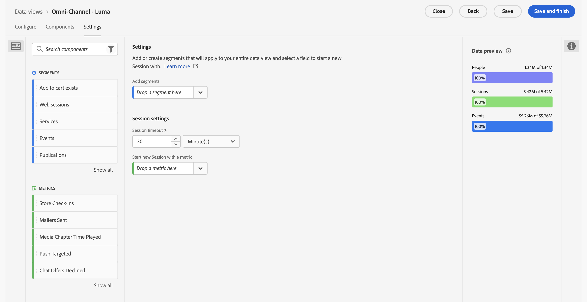

# Creare o modificare una visualizzazione di dati

Per creare una visualizzazione dati occorre creare metriche e dimensioni dagli elementi dello schema o utilizzare componenti standard. Gli elementi dello schema sono prevalentemente dimensioni o metriche, a seconda dei requisiti aziendali. Una volta trascinato un elemento schema in una visualizzazione dati, a destra vengono visualizzate le opzioni con cui è possibile regolare il funzionamento della dimensione o metrica in Customer Journey Analytics.

>[!BEGINSHADEBOX]

Per un video demo, guarda  [Creare o modificare una visualizzazione dati](https://video.tv.adobe.com/v/35110/?quality=12&learn=on){target="_blank"}.

>[!ENDSHADEBOX]

Creare o modificare una visualizzazione dati:

1. Accedi a [Customer Journey Analytics](https://analytics.adobe.com) e seleziona **[!UICONTROL Visualizzazioni dati]**, facoltativamente da **[!UICONTROL Gestione dati]**, nel menu principale.
1. Per creare una visualizzazione dati, selezionare **[!UICONTROL Crea nuova visualizzazione dati]**. In alternativa, puoi selezionare una visualizzazione dati esistente dal relativo elenco per modificarla.

## Configurare {#configure}

Per configurare una visualizzazione dati nuova o esistente:

>[!BEGINTABS]

>[!TAB Standard]

>[!TAB B2B Edition]

>[!ENDTABS]

1. Selezionare la scheda **[!UICONTROL Configura]** (se non è già attiva).

1. Specifica i dettagli di [!UICONTROL Impostazioni], [!UICONTROL Contenitore] e [!UICONTROL Calendario] (vedi sotto).
1. Seleziona **[!UICONTROL Salva e continua]** per continuare a configurare la visualizzazione dati nuova o esistente. Seleziona **[!UICONTROL Salva]** per salvare la configurazione per la visualizzazione dati esistente.

### Impostazioni {#configure-settings}

>[!CONTEXTUALHELP]
>id="dataview_externalid"
>title="ID esterno"
>abstract="La modifica di ID esterno può influire sul modo in cui il nome della visualizzazione dati viene visualizzato nelle origini esterne, ad esempio in strumenti di business intelligence."

Impostazioni generali per la visualizzazione dati.

| Impostazione | Descrizione |
| --- | --- |
| **[!UICONTROL Connessione]** | Questo campo collega la visualizzazione dati alla connessione stabilita in precedenza, che contiene uno o più set di dati Adobe Experience Platform. |
| **[!UICONTROL Nome]** | Obbligatorio. Nome della visualizzazione dati. Questo valore viene visualizzato nel menu a discesa in alto a destra di Analysis Workspace. |
| **[!UICONTROL ID esterno]** | Obbligatorio. Il nome della visualizzazione dati che è possibile utilizzare in origini esterne, ad esempio in strumenti di business intelligence. Il valore predefinito è `unspecified`. Se non specifichi un ID esterno, il nome verrà generato dal Nome della visualizzazione dati, sostituendo gli spazi con trattini bassi. |
| **[!UICONTROL Descrizione]** | Facoltativo. Adobe consiglia di specificare una descrizione dettagliata, che consenta agli utenti di capire lo scopo della visualizzazione dati e per chi è progettata. |

{style="table-layout:auto"}

### Compatibilità {#compatibility}

>[!CONTEXTUALHELP]
>id="dataview_dataviewsinadobejourneyoptimizer"
>title="Visualizzazioni dati in Journey Optimizer"
>abstract="Customer Journey Analytics deve utilizzare una connessione e una visualizzazione dati compatibili con Adobe Journey Optimizer. Per impostazione predefinita, a questo scopo vengono create automaticamente una connessione e una visualizzazione dati. In alternativa, puoi abilitare questa opzione per rendere predefinita questa visualizzazione dati, utilizzata nella generazione di rapporti di Adobe Journey Optimizer. Quando questa opzione è abilitata, tutti i componenti necessari richiesti per Journey Optimizer vengono aggiunti a questa visualizzazione dati e tutti i set di dati Journey Optimizer necessari vengono aggiunti alla connessione associata a questa visualizzazione dati."
>additional-url="https://experienceleague.adobe.com/it/docs/analytics-platform/using/integrations/ajo#connection" text="Quali componenti e set di dati vengono aggiunti."

Fornisce le impostazioni applicabili quando si utilizza AJO oltre a Customer Journey Analytics.

Questa sezione è visibile solo per gli amministratori che dispongono del provisioning di AJO.

| Impostazione | Descrizione |
| --- | --- |
| [!UICONTROL **Impostare come predefinito una visualizzazione dati in AJO**] | Questa opzione di configurazione standardizza il reporting tra AJO e Customer Journey Analytics. Consente inoltre di eseguire analisi avanzate dei dati AJO in Customer Journey Analytics (selezionando  [!UICONTROL **Analisi in CJA**] quando in AJO).
Per eseguire questo tipo di analisi, è necessario che AJO acceda a una visualizzazione dati di Customer Journey Analytics.
Abilita questa opzione per rendere questa, la visualizzazione dati predefinita utilizzata nel reporting di AJO relativo alla sandbox.

Automaticamente, questa opzione di configurazione:
<ul><li>Configura tutti i set di dati AJO richiesti nella connessione associata in Customer Journey Analytics per l’utilizzo con AJO.</li><li>Crea un set di metriche e dimensioni di AJO nella visualizzazione dati (inclusi campi derivati e metriche calcolate). Le etichette di contesto vengono impostate automaticamente su tutte queste metriche e dimensioni.</li><li>Abilita automaticamente l&#39;opzione **[!UICONTROL Usa in CJA]** nella connessione associata alla visualizzazione dati. Per ulteriori informazioni su questa opzione, vedere [Utilizzare una connessione Journey Optimizer in Customer Journey Analytics](/help/connections/manage-connections.md).
Se disattivi manualmente questa impostazione dopo averla attivata, la connessione e le visualizzazioni dati associate vengono ripristinate allo stato predefinito. Questo può comportare modifiche ai dati nei rapporti.
</li></ul>

Quando abiliti questa opzione, prendi in considerazione quanto segue: <ul><li>Puoi modificare la visualizzazione dati predefinita in un secondo momento, ma così facendo si potrebbero alterare i dati di reporting di AJO. Se si sceglie di disabilitare questa opzione dopo averla abilitata, verrà richiesto di selezionare una nuova visualizzazione dati predefinita.</li><li>Se hai già eseguito personalizzazioni manuali per i set di dati, le dimensioni o le metriche nella visualizzazione dati di Customer Journey Analytics, le personalizzazioni manuali rimarranno intatte quando abiliti questa opzione di configurazione. Questa opzione apporta ulteriori personalizzazioni che standardizzano ulteriormente il reporting in AJO e in Customer Journey Analytics. Dopo l’abilitazione di questa opzione, puoi effettuare anche personalizzazioni manuali.</li><li>Quando questa opzione è selezionata, la connessione associata alla visualizzazione dati non può essere eliminata.</li></ul>Consulta [Integrare Adobe Journey Optimizer con Adobe Customer Journey Analytics](/help/integrations/ajo.md) per ulteriori informazioni. |

{style="table-layout:auto"}

### Contenitori

Definisce il nome dei contenitori per la visualizzazione dati. I nomi dei contenitori vengono spesso utilizzati in [segmenti](/help/components/segments/seg-overview.md#containers).

| Impostazione | Descrizione |
| --- | --- |
| [!BADGE B2B edition]{type=Informative url="https://experienceleague.adobe.com/it/docs/analytics-platform/using/cja-overview/cja-b2b/cja-b2b-edition" newtab=true tooltip="Customer Journey Analytics B2B Edition"} **[!UICONTROL Nome contenitore account globale ]** | `Global Account` (impostazione predefinita). Il contenitore [!UICONTROL Account globale] include ogni sessione ed evento per gli account globali entro l&#39;intervallo di tempo specificato. Se la tua organizzazione utilizza un termine diverso, qui puoi rinominare il contenitore. |
| [!BADGE B2B edition]{type=Informative url="https://experienceleague.adobe.com/it/docs/analytics-platform/using/cja-overview/cja-b2b/cja-b2b-edition" newtab=true tooltip="Customer Journey Analytics B2B Edition"} **[!UICONTROL Nome contenitore account ]** | `Account` (impostazione predefinita). Il contenitore [!UICONTROL Account] include ogni sessione ed evento per gli account entro l&#39;intervallo di tempo specificato. Se la tua organizzazione utilizza un termine diverso, qui puoi rinominare il contenitore. |
| [!BADGE B2B edition]{type=Informative url="https://experienceleague.adobe.com/it/docs/analytics-platform/using/cja-overview/cja-b2b/cja-b2b-edition" newtab=true tooltip="Customer Journey Analytics B2B Edition"} **[!UICONTROL Nome contenitore opportunità&#x200B;]** | `Opportunity` (impostazione predefinita). Il contenitore [!UICONTROL Opportunità] include ogni sessione ed evento per le opportunità entro l&#39;intervallo di tempo specificato. Se la tua organizzazione utilizza un termine diverso, qui puoi rinominare il contenitore. |
| [!BADGE B2B edition]{type=Informative url="https://experienceleague.adobe.com/it/docs/analytics-platform/using/cja-overview/cja-b2b/cja-b2b-edition" newtab=true tooltip="Customer Journey Analytics B2B Edition"} **[!UICONTROL Nome contenitore gruppo di acquisto ]** | `Buying Group` (impostazione predefinita). Il contenitore [!UICONTROL Gruppo di acquisto] include ogni sessione ed evento per i gruppi di acquisto entro l&#39;intervallo di tempo specificato. Se la tua organizzazione utilizza un termine diverso, qui puoi rinominare il contenitore. |
| **[!UICONTROL Nome contenitore persona]** | `Person` (impostazione predefinita). Il contenitore [!UICONTROL Persona] include ogni sessione ed evento per le persone entro l&#39;intervallo di tempo specificato. Se l’organizzazione utilizza un termine diverso (ad esempio, “Visitatore” o “Utente”), qui puoi rinominare il contenitore. |
| **[!UICONTROL Nome contenitore sessione]** | `Session` (impostazione predefinita). Il contenitore [!UICONTROL Sessione] consente di identificare le interazioni di pagina, le campagne o le conversioni per una sessione specifica. Puoi rinominarlo “Visita” o con qualsiasi altro termine secondo le esigenze della tua organizzazione. |
| **[!UICONTROL Nome contenitore eventi]** | `Event` (impostazione predefinita). Il contenitore [!UICONTROL Event] definisce singoli eventi in un set di dati. Se l’organizzazione utilizza un termine diverso (ad esempio, “Hit” o “Visualizzazioni pagine”), qui puoi rinominare il contenitore. |

{style="table-layout:auto"}

### Calendario

Indica il formato del calendario da applicare alla visualizzazione dati. Puoi avere più visualizzazioni dati basate sulla stessa [Connessione](/help/connections/create-connection.md) e assegnare loro diversi tipi di calendario o fusi orari. Tali visualizzazioni dati possono consentire ai team che utilizzano diversi tipi di calendario di soddisfare le rispettive esigenze, utilizzando gli stessi dati sottostanti.

| Impostazione | Descrizione |
| --- | --- |
| [!UICONTROL **Fuso orario**] | Scegli il fuso orario da applicare ai dati che vengono presentati. Se scegli un fuso orario con ora legale, i dati vengono automaticamente regolati in base a tale impostazione. In primavera, quando si va avanti di un’ora, vi sarà un vuoto di un’ora. In autunno, quando si va indietro di un’ora, verrà ripetuta un’ora al momento del passaggio all’ora solare. |
| [!UICONTROL **Tipo di calendario**] | Determina in che modo vengono raggruppate le settimane del mese. **Gregoriano:** formato di calendario standard. I trimestri sono raggruppati per mese. **4-5-4 Retail:** calendario 4-5-4 standard nel settore retail. Il primo e l’ultimo mese del trimestre contengono ciascuno 4 settimane; il secondo mese del trimestre è invece composto di 5 settimane. **Custom (4-5-4):** simile al calendario 4-5-4 eccetto che è possibile scegliere il primo giorno dell’anno e in quale anno si verifica la settimana “extra”. **Custom (4-4-5):** il primo e l’ultimo mese di ogni trimestre contengono ciascuno 4 settimane; l’ultimo mese di ogni trimestre è invece composto di 5 settimane. **Custom (5-4-4):** il primo mese di ogni trimestre è composto di 5 settimane; il secondo e il terzo mese di ogni trimestre contengono ciascuno 4 settimane. |
| [!UICONTROL **Primo mese dell’anno**] e [!UICONTROL **Primo giorno della settimana**] | Visibile per il calendario di tipo gregoriano. Specifica il mese da cui vuoi iniziare l’anno solare e il giorno da cui vuoi iniziare ogni settimana. |
| [!UICONTROL **Primo giorno dell’anno corrente**] | Visibile per i calendari di tipo personalizzato. Specifica il giorno dell’anno da utilizzare come inizio dell’anno corrente. Il calendario formatta automaticamente il primo giorno di ogni settimana in base a tale valore. |
| [!UICONTROL **Anno in cui si verifica la settimana “extra”**] | Per la maggior parte dei calendari di 364 giorni (52 settimane di 7 giorni ciascuna), ogni anno i giorni rimanenti vengono accumulati fino a formare una settimana aggiuntiva. Questa viene quindi aggiunta all’ultimo mese dell’anno. Specifica a quale anno desideri aggiungere la settimana aggiungere. |

{style="table-layout:auto"}

## Componenti

Successivamente, puoi impostare i componenti di una visualizzazione dati e quindi creare metriche e dimensioni dagli elementi dello schema. Puoi anche utilizzare i componenti standard.

>[!IMPORTANT]
>
>Puoi aggiungere fino a 5.000 metriche e 5.000 dimensioni a una singola visualizzazione dati.

1. Seleziona la scheda **[!UICONTROL Componenti]**.

   

   Puoi visualizzare la [!UICONTROL Connessione] in alto a sinistra, che contiene i set di dati e i relativi [!UICONTROL campi schema].  I componenti già inclusi sono componenti standard (generati dal sistema) necessari per tutte le visualizzazioni dati (come Eventi, Persone, Metriche sessioni e dimensioni Minuto, Trimestre, Settimana). Adobe applica anche il filtro **[!UICONTROL Contiene dati]** e **[!UICONTROL non è obsoleto]** per impostazione predefinita, in modo che vengano visualizzati solo i campi schema che contengono dati e che non sono obsoleti.

1. Cerca un campo dello schema utilizzando  **[!UICONTROL Cerca i campi dello schema]** o trova un campo spostandosi in una delle raccolte di set di dati, ad esempio  **[!UICONTROL Set di dati evento]** o  **[!UICONTROL Set di dati di ricerca]**. Per i set di dati evento, sono disponibili raccolte separate per  **[!UICONTROL Campi XDM]** e  **[!UICONTROL Campi ad hoc e relazionali]**. In alternativa, puoi creare un campo derivato utilizzando l’ **Crea campo derivato**. Per ulteriori informazioni, consulta [Campi derivati](./derived-fields/derived-fields.md).

1. Quando hai trovato il campo dello schema specifico o hai definito il campo derivato, trascina tale campo, ad esempio  **[!UICONTROL Nome pagina]**, dalla barra a sinistra alla sezione **[!UICONTROL Metriche]** o **[!UICONTROL Dimensioni]** sotto **[!UICONTROL Componenti inclusi]**.
Puoi trascinare più volte lo stesso campo schema nelle sezioni delle dimensioni o metriche, e configurare una stessa dimensione o metrica in modi diversi. Ad esempio, dal campo pageName è possibile creare una dimensione con titolo `Product Pages` e un&#39;altra con titolo `Error pages` utilizzando diverse [impostazioni dei componenti](component-settings/overview.md) a destra.
Se trascini una cartella di campi schema dalla barra a sinistra, i campi nella cartella vengono ordinati automaticamente nella sezione appropriata. I campi stringa vanno nella sezione [!UICONTROL Dimensions] e i tipi di schema numerico vanno nella sezione [!UICONTROL Metrics]. Puoi anche fare clic su **[!UICONTROL Aggiungi tutti]** e tutti i campi schema vengono aggiunti alla rispettiva sezione.

1. Quando selezioni il componente, a destra vengono visualizzate le impostazioni.

   

   Configura il componente utilizzando le [impostazioni del componente](component-settings/overview.md). Le impostazioni disponibili dipendono dal tipo di componente (dimensione o metrica) e il tipo di dati dello schema. Le impostazioni includono:

   * [[!UICONTROL Attribuzione]](component-settings/attribution.md)
   * [[!UICONTROL Comportamento]](component-settings/behavior.md)
   * [[!UICONTROL Formato]](component-settings/format.md)
   * [[!UICONTROL Includi valori di esclusione]](component-settings/include-exclude-values.md)
   * [[!UICONTROL Deduplica delle metriche]](component-settings/metric-deduplication.md)
   * [[!UICONTROL Opzioni per “Nessun valore”]](component-settings/no-value-options.md)
   * [[!UICONTROL Persistenza]](component-settings/persistence.md)
   * [[!UICONTROL Bucketing dei valori]](component-settings/value-bucketing.md)

1. Seleziona **[!UICONTROL Salva e continua]** per continuare a configurare la visualizzazione dati nuova o esistente. Seleziona **[!UICONTROL Salva]** per salvare la configurazione per la visualizzazione dati esistente.

### Duplicare metriche o dimensioni

È possibile duplicare metriche o dimensioni e quindi modificarne le impostazioni specifiche per creare facilmente più metriche o dimensioni da un singolo campo schema. Seleziona l&#39;impostazione [!UICONTROL Duplica] sotto il nome della metrica o delle dimensioni, in alto a destra. Modifica la nuova dimensione o metrica e salvala con un nome descrittivo.

### Filtrare i campi o set di dati dello schema

È possibile filtrare i campi dello schema  nella barra a sinistra per [!UICONTROL tipo di dati], [!UICONTROL set di dati], [!UICONTROL governance dei dati] e [!UICONTROL altri] criteri ([!UICONTROL contiene dati], [!UICONTROL è identità] e [!UICONTROL non è obsoleto]):

>[!TIP]
>
>Se i componenti non vengono caricati correttamente nella visualizzazione dati e viene invece visualizzato un messaggio di errore, consulta [Mancanza di autorizzazioni](../troubleshooting/lack-of-permissions.md) per ottenere una soluzione.

### Componenti inclusi {#included-components}

>[!CONTEXTUALHELP]
>id="dataview_includedcomponents_filter_datagovernance_custom"
>title="Etichette personalizzate"
>abstract="Oltre alle etichette fornite da Adobe, puoi anche definire etichette personalizzate per la tua organizzazione."
>additional-url="https://experienceleague.adobe.com/it/docs/experience-platform/data-governance/labels/overview" text="Panoramica sulle etichette di utilizzo dei dati"

>[!CONTEXTUALHELP]
>id="dataview_includedcomponents_filter_datagovernance_contract"
>title="Etichette per contratti"
>abstract="Le etichette per contratti (C) vengono utilizzate per categorizzare i dati con obblighi contrattuali o relativi ai criteri di governance dei dati della tua organizzazione."
>additional-url="https://experienceleague.adobe.com/it/docs/experience-platform/data-governance/labels/overview" text="Panoramica sulle etichette di utilizzo dei dati"

>[!CONTEXTUALHELP]
>id="dataview_includedcomponents_filter_datagovernance_identity"
>title="Etichette di identità"
>abstract="Le etichette di identità (I) vengono utilizzate per categorizzare i dati che possono identificare o contattare una persona specifica."
>additional-url="https://experienceleague.adobe.com/it/docs/experience-platform/data-governance/labels/overview" text="Panoramica sulle etichette di utilizzo dei dati"

>[!CONTEXTUALHELP]
>id="dataview_includedcomponents_filter_datagovernance_sensitive"
>title="Etichette per dati sensibili"
>abstract="Le etichette per dati sensibili (S) vengono utilizzate per categorizzare i dati considerati sensibili dall’utente e dall’organizzazione."
>additional-url="https://experienceleague.adobe.com/it/docs/experience-platform/data-governance/labels/overview" text="Panoramica sulle etichette di utilizzo dei dati"

>[!CONTEXTUALHELP]
>id="dataview_includedcomponents_filter_datagovernance_partnerecosystem"
>title="Ecosistema partner"
>abstract="Le etichette per l’ecosistema partner (P) vengono utilizzate per categorizzare i dati condivisi con partner di terze parti."
>additional-url="https://experienceleague.adobe.com/it/docs/experience-platform/data-governance/labels/overview" text="Panoramica sulle etichette di utilizzo dei dati"

>[!CONTEXTUALHELP]
>id="dataview_includedcomponents_filter_datagovernance_policies"
>title="Criteri"
>abstract="Affinché le etichette di utilizzo dei dati supportino in modo efficace la conformità, è necessario implementare i criteri di utilizzo dei dati. I criteri di utilizzo dei dati sono regole che descrivono i tipi di azioni di marketing che possono essere eseguite o meno sui dati in Experience Platform. I filtri Criteri applicano il criterio abilitato alla visualizzazione dati."
>additional-url="https://experienceleague.adobe.com/it/docs/experience-platform/data-governance/labels/overview" text="Panoramica sulle etichette di utilizzo dei dati"

>[!CONTEXTUALHELP]
>id="dataview_includedcomponents_filter_datagovernance_responsibleengagement"
>title="Etichette di coinvolgimento responsabile"
>abstract="Le etichette di coinvolgimento responsabile vengono utilizzate per supportare il coinvolgimento responsabile."
>additional-url="https://experienceleague.adobe.com/it/docs/experience-platform/data-governance/labels/overview" text="Panoramica sulle etichette di utilizzo dei dati"

I **[!UICONTROL componenti inclusi]** contengono l&#39;elenco delle **[!UICONTROL metriche]** e delle **[!UICONTROL dimensioni]** configurate per la visualizzazione dati.

* Per cercare componenti, utilizzare  **[!UICONTROL _Cerca componenti_]**.
* Per filtrare i componenti inclusi elencati, selezionare .

  

  Nella finestra di dialogo **[!UICONTROL Filtra campo per]**, puoi filtrare in base alle seguenti categorie:

   * **[!UICONTROL Tipo di dati]** - È possibile selezionare uno o più dei seguenti tipi di dati: [!UICONTROL Stringa], [!UICONTROL Intero], [!UICONTROL Breve], [!UICONTROL Booleano], [!UICONTROL Doppio], [!UICONTROL Byte], [!UICONTROL Lungo], [!UICONTROL Data] o [!UICONTROL Data-ora].
   * **[!UICONTROL Set di dati]** - Selezionare uno o più set di dati.
   * **[!UICONTROL Governance dei dati]**: selezionare una o più etichette dalle sottocategorie [!UICONTROL Etichette personalizzate], [!UICONTROL Etichette contratto], [!UICONTROL Etichette identità], [!UICONTROL Etichette sensibilità], P[!UICONTROL Ecosistema partner] o [!UICONTROL Criteri].
   * **[!UICONTROL Altro]** - Selezionare una o più opzioni [!UICONTROL Contiene dati], [!UICONTROL È identità] o [!UICONTROL Non è obsoleto].

  Seleziona **[!UICONTROL Applica]** per applicare i filtri.

## Impostazioni {#dataview-settings}

1. Selezionare la scheda **[!UICONTROL Impostazioni]**.

   

1. Configura i segmenti da applicare all’intera visualizzazione dati. Consulta [Impostazioni (segmenti)](#settings-filters) di seguito.
1. Configura il timeout e le metriche della sessione. Consulta [Impostazioni sessione](#session-settings) di seguito.

1. Seleziona **[!UICONTROL Salva e continua]** per continuare a configurare la visualizzazione dati nuova o esistente. Seleziona **[!UICONTROL Salva]** per salvare la configurazione per la visualizzazione dati esistente.

### Impostazioni (segmenti) {#segment-settings}

Puoi aggiungere segmenti applicabili a un’intera visualizzazione dati. Questo segmento viene applicato a qualsiasi rapporto eseguito in Workspace. Trascina un segmento dai componenti nella barra a sinistra al campo **[!UICONTROL Aggiungi segmenti]**.

### Impostazioni di sessione

Determina quanto tempo di inattività deve trascorrere tra gli eventi prima che la sessione scada e che venga iniziata una nuova sessione. È necessario specificare un periodo di tempo. Facoltativamente, puoi anche forzare l’inizio di una nuova sessione quando un evento contiene una determinata metrica. Per altre informazioni consulta la parte relativa alle [Impostazioni della sessione](session-settings.md).

### Anteprima dati

L’anteprima dati confronta (per i vari contenitori) i dati di questa visualizzazione dati con quelli della connessione. La percentuale di anteprima è basata sul numero totale nella connessione per gli ultimi 90 giorni.

Se l’anteprima non viene caricata, è possibile che la connessione sia ancora in fase di retrocompilazione.

Dopo aver specificato tutte le impostazioni desiderate, fare clic su **[!UICONTROL Salva e termina]**.
