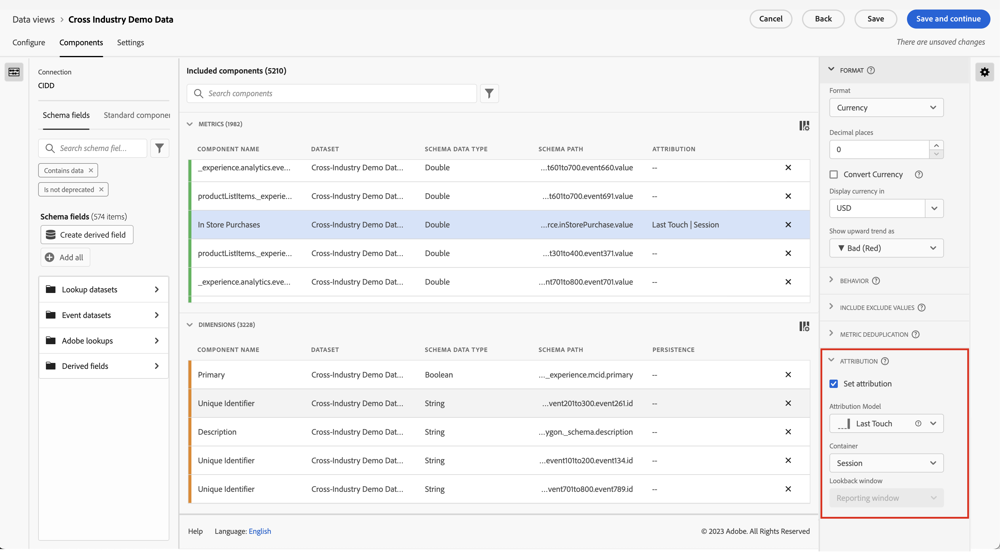

# Creare una nuova visualizzazione dati

>[!IMPORTANT]
>
>Questa funzionalità sarà generalmente disponibile il 22 aprile 2021.

La creazione di una visualizzazione dati comporta la creazione di metriche e dimensioni dagli elementi dello schema o l’utilizzo di componenti standard. La creazione di metriche o dimensioni offre un&#39;enorme flessibilità. In precedenza, si presupponeva che in Adobe Experience Platform i set di dati fossero utilizzati come campi stringa e come metriche. Per modificare uno qualsiasi di questi campi, era necessario modificare lo schema in Platform. L&#39;interfaccia utente per la visualizzazione dei dati ora consente una [definizione più a forma libera di metriche e dimensioni](/help/data-views/data-views.md). Per ulteriori casi d’uso, consulta [Casi d’uso delle visualizzazioni dati](/help/data-views/data-views-usecases.md).

## 1. Configurare le impostazioni e i contenitori delle visualizzazioni dati

1. In Customer Journey Analytics, accedi alla scheda **[!UICONTROL Data Views]**.
2. Fai clic su **[!UICONTROL Add]** per creare una nuova visualizzazione dati e configurarne le impostazioni.

| Impostazione | Caso di utilizzo/descrizione |
| --- | --- |
| [!UICONTROL Connection] | Questo campo collega la visualizzazione dati alla connessione stabilita in precedenza, che contiene uno o più set di dati Adobe Experience Platform. |
| [!UICONTROL Name] | È obbligatorio assegnare un nome alla visualizzazione dati. |
| [!UICONTROL Description] | Una descrizione dettagliata non è obbligatoria, ma è consigliata. |
| [!UICONTROL Time zone] | Scegli il fuso orario in cui dovranno essere presentati i dati. |
| [!UICONTROL Tags] | I tag ti consentono di organizzare le visualizzazioni dati in categorie. |
| [!UICONTROL Containers] | Puoi rinominare i contenitori qui ed ecco come appariranno in qualsiasi progetto Workspace basato su questa visualizzazione dati. I contenitori vengono utilizzati nei filtri e nell’abbandono/flusso, ecc., per definire l’ampiezza o la limitazione dell’ambito o del contesto. [Ulteriori informazioni](https://experienceleague.adobe.com/docs/analytics-platform/using/cja-components/cja-filters/filters-overview.html?lang=en#filter-containers) |
| [!UICONTROL Person container name is…] | [!UICONTROL Person] (predefinito). Il contenitore [!UICONTROL Person] include ogni visita e visualizzazione di pagina per i visitatori entro un intervallo di tempo specificato. È possibile rinominarlo &quot;Utente&quot; o qualsiasi altro termine preferito. |
| [!UICONTROL Session container name is…] | [!UICONTROL Session] (predefinito). Il contenitore [!UICONTROL Session] ti consente di identificare le interazioni di pagina, le campagne o le conversioni per una sessione specifica. Puoi rinominarlo in &quot;Visita&quot; o in qualsiasi altro termine preferito. |
| [!UICONTROL Event container name is…] | [!UICONTROL Event] (predefinito). Il contenitore [!UICONTROL Event] definisce gli eventi di pagina da includere o escludere da un filtro. |

Successivamente, puoi creare metriche e dimensioni dagli elementi dello schema. Puoi anche utilizzare i componenti Standard .

## 2. Creazione di metriche e dimensioni dagli elementi dello schema

1. In [!UICONTROL Customer Journey Analytics] > [!UICONTROL Data Views], fai clic sulla scheda [!UICONTROL Components] .

Puoi vedere il [!UICONTROL Connection] in alto a sinistra, che contiene i set di dati, e il relativo [!UICONTROL Schema fields] qui sotto. Nota bene:

* I componenti già inclusi sono i componenti standard richiesti (generati dal sistema).
* Per impostazione predefinita, viene applicato anche il filtro **[!UICONTROL Contains data]** in modo che vengano visualizzati solo i campi dello schema contenenti dati. Se cerchi un campo che non contiene dati, devi solo rimuovere il filtro.

1. Ora trascina un campo schema, ad esempio [!UICONTROL pageTitle], dalla barra a sinistra nella sezione Metriche o Dimension .

   Puoi trascinare più volte lo stesso campo schema nelle sezioni di dimensioni o metriche e configurare la stessa dimensione o metrica in modi diversi.
Ad esempio, dal campo **[!UICONTROL pageTitle]** puoi creare una dimensione denominata &quot;Pagine di prodotto&quot; e un’altra denominata &quot;Pagine di errore&quot;, ecc., rinominando **[!UICONTROL Component Name]** a destra. dal **[!UICONTROL pageTitle]**; Puoi anche creare metriche da un valore stringa. Ad esempio, puoi creare una o più metriche **[!UICONTROL Orders]** con diverse impostazioni di attribuzione e diversi valori di inclusione/esclusione.

   

   >[!NOTE]
   >
   >Puoi trascinare dall’barra a sinistra intere cartelle di campi schema, che verranno ordinate automaticamente nelle sezioni tradizionali. I campi stringa finiranno nella sezione [!UICONTROL Dimensions] e le cifre nella sezione [!UICONTROL Metrics]. In alternativa, puoi fare clic su **[!UICONTROL Add all]** per aggiungere tutti i campi dello schema.

1. Una volta selezionato il componente, vengono visualizzate una serie di impostazioni a destra. Configura il componente utilizzando le impostazioni descritte di seguito.

### Configurare le impostazioni dei componenti

| Impostazione | Caso di utilizzo/descrizione |
| --- | --- |
| [!UICONTROL Component type] | Obbligatorio. Consente di cambiare un componente da Metrica a Dimension o viceversa. |
| [!UICONTROL Component Name] | Obbligatorio. Consente di specificare il nome descrittivo che verrà visualizzato in Analysis Workspace. È possibile rinominare un componente per assegnargli un nome specifico per la visualizzazione dati. |
| [!UICONTROL Description] | Facoltativo ma consigliato per fornire informazioni sul componente per altri utenti. |
| [!UICONTROL Tags] | Facoltativo. Consente di assegnare al componente tag personalizzati o predefiniti per facilitarne la ricerca e il filtraggio nell’interfaccia utente di Analysis Workspace. |
| [!UICONTROL Field Name] | Nome del campo schema. |
| [!UICONTROL Dataset type] | Obbligatorio. Un campo non modificabile che mostra il tipo di set di dati (evento, ricerca o profilo) da cui proviene il componente. |
| [!UICONTROL Dataset] | Obbligatorio. Un campo non modificabile che mostra il tipo di campo di origine del componente (ad esempio Stringa, Intero, ecc.). Questo campo può contenere più set di dati, ad esempio quando si combinano più suite di rapporti. |
| [!UICONTROL Schema type] | Indica se il componente è una stringa, un numero intero, ecc. |
| [!UICONTROL Component ID] | Obbligatorio. Il [CJA API](https://adobe.io/cja-apis/docs) utilizza questo campo per fare riferimento al componente. Puoi fare clic sull’icona di modifica e modificare l’ID del componente. Tuttavia, la modifica dell’ID del componente interrompe tutti i progetti Workspace esistenti che contengono questo componente. Se crei un’altra visualizzazione dati che utilizza un campo diverso per una dimensione pageTitle, puoi rinominarla e rendere compatibile la visualizzazione dati incrociati della dimensione. |
| [!UICONTROL Path] | Obbligatorio. Un campo non modificabile che mostra il percorso dello schema da cui proviene il componente. |
| [!UICONTROL Hide component in reporting] | Predefinito = disattivato. Consente di eliminare il componente dalla visualizzazione dati quando utilizzato nel rapporto. Questo non influisce sulle autorizzazioni, ma solo sulla cura dei componenti. In altre parole, puoi nascondere il componente da non amministratori nel reporting. Gli amministratori possono comunque accedervi facendo clic su [!UICONTROL Show All Components] in un progetto Analysis Workspace. |

### Configurare le impostazioni del formato

Le impostazioni del formato sono solo per le metriche.

| Impostazione | Caso di utilizzo/descrizione |
| --- | --- |
| [!UICONTROL Format] | Consente di specificare la formattazione di una metrica, come Decimale, Tempo, Percentuale o Valuta. |
| [!UICONTROL Decimal Places] | Consente di specificare il numero di posizioni decimali da visualizzare in una metrica. |
| [!UICONTROL Show upward trend as] | Consente di specificare se una tendenza verso l’alto per questa metrica deve essere considerata buona (verde) o cattiva (rossa). |
| [!UICONTROL Currency] | Questa impostazione viene visualizzata solo se il formato della metrica selezionata è [!UICONTROL Currency]. È disponibile un elenco di opzioni di valuta. Il valore predefinito è nessuna valuta. Questo ti consente di rappresentare i ricavi nella valuta scelta nel reporting. Questa non è una conversione di valuta, ma solo un&#39;opzione di formattazione dell&#39;interfaccia utente. |

### Configurare le impostazioni di attribuzione

| Impostazione | Caso di utilizzo/descrizione |
| --- | --- |
| [!UICONTROL Set attribution] | Consente di specificare le impostazioni di attribuzione da applicare a questa metrica per impostazione predefinita quando viene utilizzata. Questa impostazione predefinita può essere ignorata nelle tabelle a forma libera o in una metrica calcolata. |
| [!UICONTROL Attribution model] | Consente di specificare un modello di attribuzione predefinito, attivo solo quando si attiva l’impostazione [!UICONTROL Use Non-default attribution model]. Predefinito su [!UICONTROL Last Touch]. Le opzioni sono: Ultimo contatto, Primo contatto, Lineare, Partecipazione, Stesso contatto, A forma di U, Curva J, J inversa, Decadimento nel tempo, Personalizzato, Algoritmico. Alcune di queste opzioni creano campi aggiuntivi da compilare, come Personalizzato o Decadimento nel tempo. È possibile creare più metriche utilizzando lo stesso campo, il che significa che è possibile avere una metrica di entrate [!UICONTROL Last touch] e una metrica di ricavi [!UICONTROL First Touch], ma basata sullo stesso campo di ricavi nello schema. |
| [!UICONTROL Lookback window] | Consente di specificare un intervallo di lookback predefinito per una metrica, attivo solo quando si attiva l’impostazione [!UICONTROL Use Non-default attribution model]. Le opzioni sono: Persona (finestra di reporting), Sessione, Personalizzata. Quando è selezionata l’opzione Personalizzato , è anche possibile selezionare un numero qualsiasi di giorni/settimane/mesi/ecc. (fino a 90 giorni), proprio come le Attribution IQ. Puoi avere più metriche utilizzando lo stesso campo dello schema, ma ciascuna con un intervallo di lookback separato. |

### Configurare le impostazioni Includi/Escludi valori

Questa impostazione consente di modificare i dati sottostanti sui quali si sta eseguendo il reporting al momento della query. Non è lo stesso di un filtro (precedentemente denominato segmento). Ma i filtri rispetteranno questa nuova dimensione, così come il percorso e l’attribuzione.

Ad esempio, puoi creare una dimensione fuori dal campo pageTitle , ma chiamarla &quot;pagine di errore&quot; e includere qualsiasi pagina che sia [!UICONTROL contains the phrase] &quot;error&quot;.

| Impostazione | Caso di utilizzo/descrizione |
| --- | --- |
| [!UICONTROL Case sensitive] | Predefinito = attivato. Questa impostazione si applica solo alla sezione [!UICONTROL Include/Exclude Values]. Ti consente di stabilire se la regola di inclusione/esclusione che stai applicando deve fare distinzione tra maiuscole e minuscole. |
| [!UICONTROL Match] | Consente di specificare quali valori si desidera considerare per il reporting prima dell’attribuzione e della segmentazione (ad esempio, utilizza solo valori contenenti la frase &quot;error&quot;). Puoi specificare: **[!UICONTROL If all criteria are met]** o **[!UICONTROL If any criteria are met]**. |
| [!UICONTROL Criteria] | Consente di specificare la logica di corrispondenza da applicare a una regola di filtro specifica.<ul><li>**Stringa**: Contiene la frase, Contiene qualsiasi termine, Contiene tutti i termini, Non contiene alcun termine, Non contiene la frase, È uguale a, Non uguale a, Inizia con, Termina con</li><li>**Doppio/Intero**: è uguale a, non è uguale a, è maggiore di, è minore di, è maggiore o uguale a, è minore o uguale a</li><li>**Data**: è uguale a, non è uguale a, è successivo a, è precedente, si trova in</li></ul> |
| [!UICONTROL Match operand] | Consente di specificare l’operando di corrispondenza a cui deve essere applicato l’operatore di corrispondenza.<ul><li>**Stringa**: Campo di testo</li><li>**Doppio/Intero**: Campo di testo con frecce verso l’alto o il basso per i valori numerici</li><li>**Data**: Selettore di granularità del giorno (calendario)</li><li>**Data e ora**: Selettore di granularità data e ora</li></ul> |
| [!UICONTROL Add rule] | Consente di specificare un operatore di corrispondenza e un operando aggiuntivi. |

### Configurare le impostazioni del comportamento

| Impostazione | Caso di utilizzo/descrizione |
| --- | --- |
| [!UICONTROL Count instances] | Consente di specificare se un campo numerico o di tipo data utilizzato come metrica deve contare le ore impostate anziché il valore stesso.  Se si desidera sommare le istanze di un campo numerico e si desidera semplicemente aggiungere il numero di volte in cui è stato  ** impostato un campo, anziché il valore effettivo all’interno. Questa funzione è utile, ad esempio, per creare una  [!UICONTROL Orders] metrica da un  [!UICONTROL Revenue] campo. Se sono stati impostati i ricavi, vogliamo contare 1 singolo ordine invece dell&#39;importo numerico dei ricavi. |

### Configurare le impostazioni [!UICONTROL No Value Options]

[!UICONTROL No Value Options] le impostazioni sono simili ai  [!UICONTROL Unspecified] valori  [!UICONTROL None] o nel reporting. Nell’interfaccia utente delle visualizzazioni dati, a seconda dei singoli componenti, puoi decidere come trattare questi valori nei rapporti. Puoi anche rinominare [!UICONTROL No value] in modo che sia più adatto al tuo ambiente, ad esempio [!UICONTROL Null], [!UICONTROL Not set] o ad altri.

Inoltre, qualsiasi cosa specifichi in questo campo può essere utilizzata per un trattamento speciale dell’interfaccia utente della riga [!UICONTROL No Value] nel reporting, come indicato nell’impostazione [!UICONTROL No Value Options].

| Impostazione | Caso di utilizzo/descrizione |
| --- | --- |
| [!UICONTROL If shown, call No value...] | In questo punto è possibile rinominare **[!UICONTROL No value]** in un altro elemento. |
| [!UICONTROL Don't show No value by default] | Questo valore non viene visualizzato nel rapporto. |
| [!UICONTROL Show No value by default] | Mostra questo valore nel rapporto. |
| [!UICONTROL Treat No value as a value] | Questa impostazione sostituirà i valori vuoti nei dati con il testo specificato in [!UICONTROL If shown, call No value ...]. Ad esempio, se la dimensione include tipi di dispositivi mobili, puoi rinominare l’elemento **[!UICONTROL No value]** in &quot;Desktop&quot;. Tieni presente che quando modifichi questo campo in un valore personalizzato, il valore personalizzato viene considerato come un valore di stringa legittimo. Pertanto, se si immette il valore &quot;Rosso&quot; in questo campo, anche tutte le istanze della stringa &quot;Rosso&quot; che compaiono nei dati stessi verranno riportate sotto la stessa riga specificata. |

### Configurare le impostazioni di persistenza

Per ulteriori informazioni, consulta l’argomento relativo alla [persistenza](/help/data-views/persistence.md).

| Impostazione | Caso di utilizzo/descrizione |
| --- | --- |
| [!UICONTROL Set persistence] | Tasto di attivazione/disattivazione |
| [!UICONTROL Allocation] | Consente di specificare il modello di allocazione utilizzato su una dimensione per la persistenza. Le opzioni sono: [!UICONTROL Most recent], [!UICONTROL Original], [!UICONTROL Instance], [!UICONTROL All]. Se desideri che un valore persista (simile alle eVar nella versione tradizionale di Analytics), questo è il punto in cui lo imposteresti. L’unica differenza chiave è che la persistenza massima impostabile è 90 giorni. Inoltre, [!UICONTROL Never expire] non è un’opzione. |
| [!UICONTROL Expiration] | Consente di specificare la finestra di persistenza per una dimensione. Le opzioni sono: [!UICONTROL Session] (predefinito), [!UICONTROL Person], [!UICONTROL Time], [!UICONTROL Metric]. Potrebbe essere necessario poter scadere la dimensione su un acquisto (ad esempio termini di ricerca interni o altri casi d’uso di merchandising). [!UICONTROL Metric] consente di specificare una delle metriche definite come scadenza per questa dimensione (ad esempio, una  [!UICONTROL Purchase] metrica). |

### Configurare le impostazioni di bucket dei valori

Ad esempio, un bucket &quot;compreso tra 5 e 10&quot; verrà visualizzato come voce di riga &quot;da 5 a 10&quot; nel reporting di Workspace.

| Impostazione | Caso di utilizzo/descrizione |
| --- | --- |
| [!UICONTROL Bucket value] | Consente di creare una versione a blocchi di una dimensione numerica. Questo ti consente di creare rapporti su blocchi di ricavi o altri valori numerici come una dimensione nel reporting. |
| [!UICONTROL Up to] | Consente di specificare i bordi del primo bucket dimensione numerica. Questo vale solo per le dimensioni numeriche. |
| [!UICONTROL Between and up to] | Consente di specificare i bordi dei bucket di dimensione numerica successivi. |
| [!UICONTROL Add bucket] | Consente di aggiungere un altro bucket alla creazione a blocchi di dimensioni numeriche. |

### Seleziona [!UICONTROL Standard components]

Oltre a creare metriche e dimensioni da elementi dello schema, puoi utilizzare componenti standard anche nelle visualizzazioni dati.

[!UICONTROL Standard components] sono componenti che non sono generati dai campi dello schema del set di dati, ma che sono invece generati dal sistema. Alcuni componenti di sistema sono necessari in qualsiasi visualizzazione dati per facilitare le funzionalità di reporting in Analysis Workspace, mentre altri componenti di sistema sono facoltativi.

Per impostazione predefinita, i componenti standard richiesti vengono aggiunti alla visualizzazione dati.

| Nome componente | Dimension o metrica | Note |
| --- | --- | --- |
| [!UICONTROL People] | Metrica | Questa metrica si basa sull’ID persona specificato in una connessione. |
| [!UICONTROL Sessions] | Metrica | Questa metrica si basa sulle impostazioni di sessionizzazione specificate di seguito. |
| [!UICONTROL Events] | Metrica | Questa metrica rappresenta il numero di righe di tutti i set di dati evento in una connessione. |
| [!UICONTROL Day] | Dimensione | La dimensione &quot;Giorno&quot; indica il giorno in cui si è verificata una determinata metrica. Il primo elemento dimensione è il primo giorno dell’intervallo di date e l’ultimo elemento dimensione è l’ultimo giorno dell’intervallo di date. |
| [!UICONTROL Week] | Dimensione | La dimensione &quot;Settimana&quot; indica la settimana in cui si è verificata una determinata metrica. Il primo elemento dimensione è la prima settimana nell’intervallo di date e l’ultimo elemento dimensione è l’ultima settimana nell’intervallo di date. |
| [!UICONTROL Month] | Dimensione | La dimensione Mese indica il mese in cui si è verificata una particolare metrica. Il primo elemento dimensione è il primo mese nell’intervallo di date e l’ultimo elemento dimensione è l’ultimo mese nell’intervallo di date. |
| [!UICONTROL Quarter] | Dimensione | La dimensione &quot;Trimestre&quot; indica il trimestre in cui si è verificata una data metrica. Il primo elemento dimensione è il primo trimestre nell’intervallo di date e l’ultimo elemento dimensione è l’ultimo trimestre nell’intervallo di date. |
| [!UICONTROL Year] | Dimensione | La dimensione &quot;Anno&quot; indica l’anno in cui si è verificata una determinata metrica. Il primo elemento dimensione è il primo anno nell’intervallo di date e l’ultimo elemento dimensione è l’anno più recente nell’intervallo di date. |
| [!UICONTROL Hour] | Dimensione | La dimensione &quot;Ora&quot; indica l’ora in cui si è verificata una determinata metrica (arrotondata per difetto). Il primo elemento dimensione è la prima ora nell’intervallo di date e l’ultimo elemento dimensione è l’ultima ora nell’intervallo di date. |
| [!UICONTROL Minute] | Dimensione | La dimensione &quot;Minuto&quot; indica il minuto in cui si è verificata una determinata metrica (arrotondata per difetto). Il primo elemento dimensione è il primo minuto nell’intervallo di date e l’ultimo elemento dimensione è l’ultimo minuto nell’intervallo di date. |

### Componenti standard opzionali

I componenti Standard facoltativi sono disponibili nella scheda **[!UICONTROL Standard Components]** .

| Nome componente | Dimension o metrica | Note |
| --- | --- | --- |
| [!UICONTROL Session Starts] | Metrica | Questa metrica conta il numero di eventi che sono stati il primo evento di una sessione. Utilizzato in una definizione di filtro (ad esempio &#39;[!UICONTROL Session Starts] exists&#39;), filtra fino al primo evento di ogni sessione. |
| [!UICONTROL Session Ends] | Metrica | Questa metrica conta il numero di eventi che sono stati l’ultimo evento di una sessione. Simile a [!UICONTROL Session Starts], può anche essere utilizzato in una definizione di filtro per filtrare gli elementi fino all&#39;ultimo evento di ogni sessione. |
| [!UICONTROL Time Spent (seconds)] | Metrica | La metrica [!UICONTROL Time Spent] somma il tempo tra due valori diversi per una dimensione. |
| [!UICONTROL Time Spent per Event] | Dimensione | [!UICONTROL Time Spent per Event] divide la  [!UICONTROL Time Spent] metrica in  [!UICONTROL Event] blocchi. |
| [!UICONTROL Time Spent per Session] | Dimensione | [!UICONTROL Time Spent per Session] divide la  [!UICONTROL Time Spent] metrica in  [!UICONTROL Session] blocchi. |
| [!UICONTROL Time Spent per Person] | Dimensione | [!UICONTROL Time Spent per Person] divide la  [!UICONTROL Time Spent] metrica in  [!UICONTROL Person] blocchi. |
| [!UICONTROL Batch ID] | Dimensione | Rappresenta il batch di Experienci Platform di cui faceva parte un elemento [!UICONTROL Event]. |
| [!UICONTROL Dataset ID] | Dimensione | Rappresenta l&#39;Experience Platform di set di dati di cui faceva parte [!UICONTROL Event]. |

### Filtrare campi e dimensioni/metriche dello schema

Puoi filtrare i campi dello schema nella barra a sinistra in base ai seguenti tipi di dati:

Puoi anche filtrare per set di dati e specificando se un campo di schema contiene dati o se si tratta di un’identità. Per impostazione predefinita, il filtro **[!UICONTROL Contains data]** viene applicato a tutte le visualizzazioni di dati.

## 3. Aggiungi un filtro globale alla visualizzazione dati

Puoi aggiungere filtri applicabili all’intera visualizzazione dati. Questo filtro verrà applicato a qualsiasi rapporto eseguito in Workspace.

1. Fare clic sulla scheda [!UICONTROL Settings] in [!UICONTROL Data views].
1. Trascina un filtro dall’elenco nella barra a sinistra fino al campo [!UICONTROL Add filters] .
