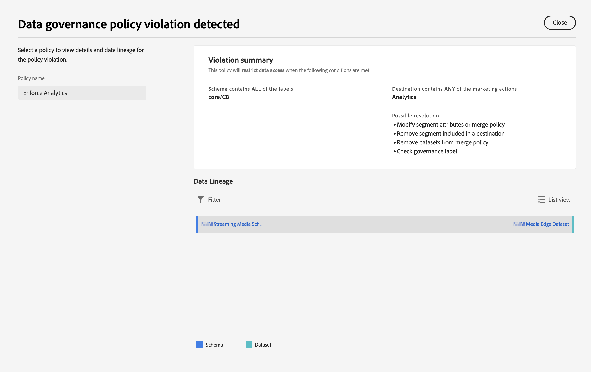

# Etichette e criteri

Quando crei un set di dati in Experienci Platform, puoi creare [etichette di utilizzo dei dati](https://experienceleague.adobe.com/en/docs/experience-platform/data-governance/labels/reference) per alcuni o tutti gli elementi del set di dati. Puoi visualizzare queste etichette e criteri in Customer Journey Analytics.

Le seguenti etichette sono di particolare interesse per il Customer Journey Analytics:

* L&#39; `C8` etichetta **[!UICONTROL No measurement]**. Questa etichetta indica che i dati non possono essere utilizzati per l’analisi sui siti web o sulle app della tua organizzazione.

* L&#39; `C12` etichetta **[!UICONTROL No general data export]**. I campi dello schema con questa etichetta non possono essere esportati o scaricati dal Customer Journey Analytics (tramite reporting, esportazione, API, ecc.)

>[!NOTE]
>
>Le etichette di utilizzo dei dati non vengono propagate automaticamente ai set di dati uniti. Tuttavia, possono essere aggiunte manualmente.

L’etichettatura di per sé non significa che queste etichette di utilizzo dei dati siano applicate. Per questo vengono utilizzate le policy. Puoi creare i tuoi criteri utilizzando [Interfaccia utente Experienci Platform](https://experienceleague.adobe.com/en/docs/experience-platform/data-governance/policies/user-guide) o tramite [API del servizio criteri](https://experienceleague.adobe.com/en/docs/experience-platform/data-governance/api/overview) in Experience Platform.

Nel Customer Journey Analytics vengono visualizzati due criteri definiti dall’Adobe che influiscono sul reporting e sul download/condivisione:

* **[!UICONTROL Enforce Analytics]** policy
* **[!UICONTROL Enforce Download]** policy

## Visualizzare le etichette dati nelle visualizzazioni dati del Customer Journey Analytics

Le etichette dati create da te o da altri utenti in Experienci Platform vengono visualizzate in tre posizioni nell’interfaccia utente delle visualizzazioni dati:

| Posizione | Descrizione |
| --- | --- |
| Pulsante Informazioni su un campo schema | Fai clic su questo pulsante per indicare le [!UICONTROL Data Usage Labels] attualmente applicabili a un campo:
 |
| Barra a destra sotto [Impostazioni dei componenti](/help/data-views/component-settings/overview.md) | Tutte le [!UICONTROL Data Usage Labels] sono elencate qui:
 |
| Aggiungi etichette dati come colonna | Puoi aggiungere una colonna [!UICONTROL Data Usage Labels] alle colonne dei [!UICONTROL Included Components] nelle visualizzazioni dati. Fai clic sull’icona del selettore colonne e seleziona **[!UICONTROL Data Usage Labels]**:
 |

{style="table-layout:auto"}

## Filtrare le etichette per la governance dei dati nelle visualizzazioni dati

Nell’editor delle visualizzazioni dati, fai clic su [!UICONTROL filter] nella traccia a sinistra e filtra i componenti delle visualizzazioni dati in base a **[!UICONTROL Data Governance]** e tipo di **[!UICONTROL Label]**:

Fai clic su **[!UICONTROL Apply]** per vedere quali componenti dispongono di etichette collegate.

## Filtrare i criteri di governance dei dati nelle visualizzazioni dati

Puoi verificare se un criterio (ad esempio, un criterio denominato Enforce Analytics) è attivato e se tale criterio blocca l’utilizzo di determinati elementi della visualizzazione dati di Customer Journey Analytics per l’analisi.

Di nuovo, fai clic su [!UICONTROL filter] nella barra a sinistra e sotto **[!UICONTROL Data Governance]**, fai clic su **[!UICONTROL Policies]**:

Clic **[!UICONTROL Apply]** per vedere quali criteri sono abilitati.

## Effetti dei criteri abilitati sulle visualizzazioni dati

Se il **[!UICONTROL Enforce Analytics]** Se il criterio è attivato, i componenti dello schema a cui sono associate determinate etichette di dati (come C8) non possono essere aggiunti alle visualizzazioni dati.

Questi componenti sono visualizzati in grigio nella barra a sinistra [!UICONTROL Schema fields] elenco:

Inoltre, non è possibile salvare una visualizzazione dati contenente campi bloccati.

Prova ad applicare le etichette di accesso e governance dei dati ai campi o ai gruppi di campi di questo Experience Platform, per i quali hai già definito dei componenti nella visualizzazione dati. Potrebbe essere visualizzata questa finestra di dialogo.

Devi innanzitutto risolvere la violazione (ad esempio rimuovere i componenti dalla visualizzazione dati).

>[!MORELIKETHIS]
>
>[Scaricare dati sensibili](/help/analysis-workspace/export/download-send.md)

>[!MORELIKETHIS]
>
>[Cosa sono le etichette per limitazioni nel Report Builder?](https://experienceleague.adobe.com/en/docs/analytics-platform/using/cja-reportbuilder/restricted-labels)

