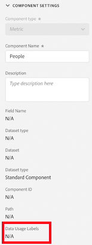

# Supporto di CJA per la governance dei dati di Adobe Experience Platform

Integrazione tra CJA e [Governance dei dati di Adobe Experience Platform](https://experienceleague.adobe.com/docs/experience-platform/data-governance/home.html?lang=en) consente l’etichettatura dei dati CJA sensibili e l’applicazione delle politiche sulla privacy.

Le etichette per la privacy e i criteri creati sui set di dati utilizzati da Experience Platform possono essere visualizzati nel flusso di lavoro delle visualizzazioni dati di CJA. Queste etichette interrompono o avvertono gli utenti che creano metriche e/o dimensioni da campi sensibili.

Inoltre, quando i dati vengono esportati da CJA (tramite reporting, esportazione, API ecc.), vengono aggiunti avvisi o etichette per avvisare gli utenti che un rapporto contiene informazioni sensibili che devono essere trattate in un modo specifico.

Questa integrazione consente di gestire più facilmente la conformità. Gli amministratori di dati della tua organizzazione possono impostare criteri per limitare l’utilizzo. Di conseguenza, gli utenti CJA possono utilizzare i dati in modo più affidabile, sapendo che sono conformi ai criteri definiti dagli amministratori dei dati.

## Etichette e criteri in Adobe Experience Platform

Quando crei un set di dati in Experience Platform, puoi creare [etichette di utilizzo dei dati](https://experienceleague.adobe.com/docs/experience-platform/data-governance/labels/reference.html?lang=en) per alcuni o tutti gli elementi del set di dati. Finora, queste etichette non erano esposte in CJA. Con questa versione, puoi visualizzare queste etichette in CJA. Di particolare interesse per CJA è l’etichetta C8, che indica che &quot;i dati non possono essere utilizzati per la misurazione dei siti web o delle app della tua organizzazione&quot;.

L’etichettatura di per sé non significa che queste etichette di utilizzo dei dati siano applicate. Per questo vengono utilizzati i criteri. Crea i tuoi criteri tramite [API del servizio criteri](https://experienceleague.adobe.com/docs/experience-platform/data-governance/api/overview.html?lang=en) Experience Platform.

I criteri hanno due componenti: l’etichetta dei dati e un’azione di marketing che i consumatori possono intraprendere nel contesto di criteri di utilizzo dei dati limitati. Nel contesto di CJA, due Adobi definiti [azioni di marketing](https://experienceleague.adobe.com/docs/experience-platform/data-governance/policies/overview.html?lang=en#appendix) sono importanti:

* Analytics : utilizza i dati a scopo di analisi, ad esempio per misurare, analizzare e generare rapporti sull’utilizzo da parte del consumatore dei siti o delle app della tua organizzazione.

* Esportazione di questi dati dall’ambiente di Adobe, ad esempio esportazione di dati a terzi.

È possibile collegare etichette e azioni di marketing a un criterio e quindi attivare il criterio. La politica prende l&#39;etichetta e l&#39;azione di marketing e dice: applica questa restrizione. In CJA vengono visualizzati due criteri definiti in Adobe:

* Criteri di Analytics
* Criterio di download

## Visualizzare le etichette dati nelle visualizzazioni dati di CJA

Le etichette dati create in Experience Platform vengono visualizzate in tre posizioni nell’interfaccia utente della visualizzazione dati:

| Posizione | Descrizione |
| --- | --- |
| Pulsante Informazioni su un campo schema | Fai clic su questo pulsante per indicare le etichette di utilizzo dei dati attualmente applicabili a un campo:
 |
| Barra a destra sotto [Impostazioni dei componenti](/help/data-views/component-settings/overview.md) | Tutte le etichette di utilizzo dei dati sono elencate qui:
 |
| Aggiungi etichette dati come colonna | Puoi aggiungere Etichette dati come colonna alle colonne Componenti inclusi nelle visualizzazioni dati. Fai clic sull’icona del selettore colonna e seleziona Etichette di utilizzo dati:
 |

### Filtrare le etichette per la governance dei dati in CJA

Nell’editor delle visualizzazioni dati, fai clic sull’icona Filtro nella traccia a sinistra e filtra i componenti delle visualizzazioni dati in base alle etichette di governance dei dati:

### Filtrare i criteri di governance dei dati in CJA

Puoi verificare se è attivato un criterio che blocca l’utilizzo di alcuni elementi di visualizzazione dati CJA per scopi di analisi o esportazione.

Di nuovo, fai clic sull’icona Filtro nella barra a sinistra e in Governance dei dati fai clic su Criteri:

Se il criterio è attivato, i campi dello schema a cui sono associate determinate etichette di dati (ad esempio C8) non possono essere utilizzati a scopo di analisi o download (ad esempio per inviare e-mail o condividere file pdf) all’interno di CJA Workspace.

Tieni presente quanto segue

* Non è consentito aggiungerli alle visualizzazioni dati. Questi campi saranno disattivati nell’elenco dei campi dello schema della barra a sinistra.
* Non è possibile salvare una visualizzazione dati contenente campi bloccati.

