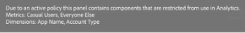

# Etichette e politiche

>[!NOTE]
>
>Questa funzionalità è attualmente in [fase di test](/help/release-notes/releases.md).

Quando crei un set di dati in Experience Platform, puoi creare [etichette di utilizzo dei dati](https://experienceleague.adobe.com/docs/experience-platform/data-governance/labels/reference.html?lang=en) per alcuni o tutti gli elementi del set di dati. Finora, queste etichette non erano esposte in CJA. Con questa versione, puoi visualizzare queste etichette in CJA. Di particolare interesse per CJA sono le seguenti etichette:

* La `C8` etichetta **[!UICONTROL No measurement]**. Questa etichetta indica che i dati non possono essere utilizzati per analisi sui siti web o sulle app dell’organizzazione.

* La `C12` etichetta **[!UICONTROL No General Data Export]**. I campi dello schema etichettati in questo modo non possono essere esportati o scaricati da CJA (tramite reporting, esportazione, API, ecc.)

L’etichettatura di per sé non significa che queste etichette di utilizzo dei dati siano applicate. Per questo vengono utilizzati i criteri. Crea i tuoi criteri tramite [API del servizio criteri](https://experienceleague.adobe.com/docs/experience-platform/data-governance/api/overview.html?lang=en) Experience Platform.

In CJA vengono visualizzati due criteri definiti in Adobe e influiscono sul reporting e sul download/condivisione:

* **[!UICONTROL Enforce Analytics]** policy
* **[!UICONTROL Enforce Download]** policy

## Visualizzare le etichette dati nelle visualizzazioni dati di CJA

Le etichette dati create in Experience Platform vengono visualizzate in tre posizioni nell’interfaccia utente della visualizzazione dati:

| Posizione | Descrizione |
| --- | --- |
| Pulsante Informazioni su un campo schema | Fai clic su questo pulsante per indicare quale [!UICONTROL Data Usage Labels] attualmente applicabile a un campo:
 |
| Barra a destra sotto [Impostazioni dei componenti](/help/data-views/component-settings/overview.md) | Qualsiasi [!UICONTROL Data Usage Labels] sono elencati qui:
 |
| Aggiungi etichette dati come colonna | Puoi aggiungere [!UICONTROL Data Labels] come colonna del [!UICONTROL Included Components] nelle visualizzazioni dati. Fai clic sull’icona del selettore colonna e seleziona **[!UICONTROL Data Usage Labels]**:
 |

{style=&quot;table-layout:auto&quot;}

## Filtrare le etichette per la governance dei dati nelle visualizzazioni dati

Nell’editor delle visualizzazioni dati, fai clic sull’icona Filtro nella traccia a sinistra e filtra i componenti delle visualizzazioni dati in base alle etichette di governance dei dati:

Fai clic su **[!UICONTROL Apply]** per vedere quali componenti dispongono di etichette collegate.

## Filtrare i criteri di governance dei dati nelle visualizzazioni dati

Puoi verificare se è attivato un criterio che blocca l’utilizzo di alcuni elementi di visualizzazione dati CJA per scopi di analisi o esportazione.

Di nuovo, fai clic sull’icona Filtro nella barra a sinistra e in Governance dei dati fai clic su Criteri:

Fai clic su **[!UICONTROL Apply]** per vedere quali criteri sono abilitati.

## Come funziona [!UICONTROL Enforce Analytics] i criteri influiscono sui progetti Workspace

Se questo criterio è attivato, i campi dello schema a cui sono associate determinate etichette di dati (come C8) non possono essere utilizzati a scopo di analisi in CJA Workspace.

Per la generazione di rapporti, ciò significa che

* Non è possibile aggiungere questi campi alle visualizzazioni dati e sono disattivati nella barra a sinistra [!UICONTROL Schema fields] elenco.
* Non è possibile salvare una visualizzazione dati contenente campi bloccati.

Se tenti di eseguire analisi di Workspace sulle visualizzazioni di dati che contengono elementi non consentiti per Analytics, riceverai un avviso simile al seguente:

Per i singoli componenti, il messaggio è simile al seguente:

## Come funziona [!UICONTROL Enforce Download] i criteri influiscono sui progetti Workspace

Se questa policy è attivata, qualsiasi esportazione o download (ad esempio invio di e-mail o condivisione di pdf) di progetti Workspace eseguirà l’hash dei campi sensibili. Puoi comunque eseguire l’analisi di questi campi in Workspace, ma se tenti di inviare un messaggio e-mail o di condividere in altro modo un progetto, i campi bloccati verranno visualizzati come elementi con hash nel file .pdf .

Aggiungi uno screenshot qui.

## Visualizza etichette nel Report Builder

Vedi _questa sezione_ per ulteriori informazioni. (link al documento di Christine)
