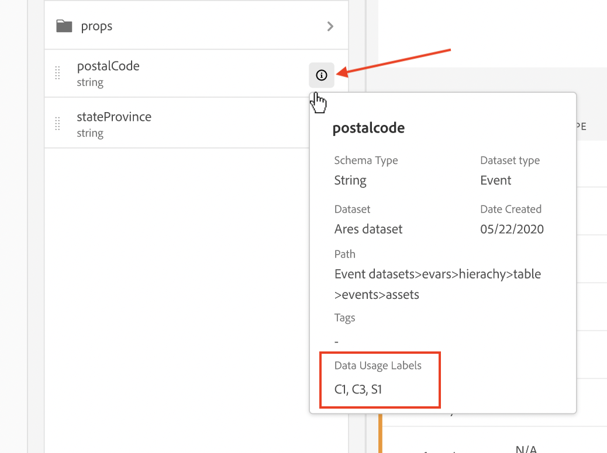

# Etichette e criteri

Quando crei un set di dati in Experience Platform, puoi creare [etichette di utilizzo dei dati](https://experienceleague.adobe.com/it/docs/experience-platform/data-governance/labels/reference) per alcuni o tutti gli elementi del set di dati. Puoi visualizzare queste etichette e criteri in Customer Journey Analytics.

Le seguenti etichette sono di particolare interesse per Customer Journey Analytics:

* Etichetta `C8` - **[!UICONTROL Nessuna misurazione]**. Questa etichetta indica che i dati non possono essere utilizzati per analisi sui siti web o sulle app dell’organizzazione.

* Etichetta `C12` - **[!UICONTROL Nessuna esportazione dati generale]**. I campi dello schema etichettati in questo modo non possono essere esportati o scaricati da Customer Journey Analytics (tramite reporting, esportazione, API, ecc.)

>[!NOTE]
>
>Le etichette di utilizzo dei dati non vengono propagate automaticamente ai set di dati uniti. Tuttavia, possono essere aggiunte manualmente.

L’etichettatura di per sé non significa che queste etichette di utilizzo dei dati siano applicate. Per questo vengono utilizzati i criteri. Puoi creare i tuoi criteri utilizzando l’[Interfaccia utente Experience Platform](https://experienceleague.adobe.com/it/docs/experience-platform/data-governance/policies/user-guide) o tramite l’[API di Privacy Service](https://experienceleague.adobe.com/it/docs/experience-platform/data-governance/api/overview) in Experience Platform.

In Adobe sono disponibili due criteri definiti da Experience Platform che possono emergere in Customer Journey Analytics e influire sul reporting e sull’esportazione dei dati:

* **[!UICONTROL Limita analisi dell&#39;utilizzo e misurazione basata su utente]** criteri, utilizzando l&#39;etichetta `C8` e
* **[!UICONTROL Limita i criteri di esportazione dei dati]**, utilizzando l&#39;etichetta `C12`.

## Visualizzare le etichette dati nelle visualizzazioni dati di Customer Journey Analytics

Le etichette dati create da te o da altri in Experience Platform vengono visualizzate in tre aree nell’interfaccia utente della visualizzazione dati:

| Posizione | Descrizione |
| --- | --- |
| Pulsante Informazioni su un campo schema | Fare clic su questo pulsante per indicare le [!UICONTROL etichette di utilizzo dati] attualmente applicabili a un campo:
 |
| Barra a destra sotto [Impostazioni dei componenti](/help/data-views/component-settings/overview.md) | Tutte le [!UICONTROL etichette di utilizzo dati] sono elencate qui:
 |
| Aggiungi etichette dati come colonna | È possibile aggiungere [!UICONTROL Etichette di utilizzo dati] come colonna alle colonne [!UICONTROL Componenti inclusi] nelle visualizzazioni dati. Seleziona l&#39;icona del selettore colonne e seleziona **[!UICONTROL Etichette di utilizzo dati]**:
 |

{style="table-layout:auto"}

## Filtrare le etichette per la governance dei dati nelle visualizzazioni dati

Nell&#39;editor delle visualizzazioni dati, seleziona l&#39;icona [!UICONTROL filter] nella traccia a sinistra e filtra i componenti delle visualizzazioni dati in base a **[!UICONTROL Governance dei dati]** e al tipo di **[!UICONTROL Etichetta]**:

Fai clic su **[!UICONTROL Applica]** per vedere quali componenti dispongono di etichette collegate.

## Filtrare i criteri di governance dei dati nelle visualizzazioni dati

Puoi verificare se è attivato un criterio, ad esempio un criterio creato, denominato **[!UICONTROL Applica analisi]**. E se tale criterio blocca l’utilizzo di determinati elementi di visualizzazione dati di Customer Journey Analytics per l’analisi o l’esportazione di dati.

Di nuovo, seleziona l&#39;icona [!UICONTROL filtro] nella barra a sinistra e in **[!UICONTROL Governance dei dati]** seleziona **[!UICONTROL Criteri]**:

Fai clic su **[!UICONTROL Applica]** per vedere quali criteri sono abilitati.

## Effetti dei criteri abilitati sulle visualizzazioni dati

Se uno o più criteri sono attivati con etichette C8 o C12, i componenti dello schema a cui sono applicate determinate etichette dati non possono essere aggiunti alle visualizzazioni dati.

Questi componenti sono disattivati nella barra a sinistra [!UICONTROL Elenco campi schema]:

Inoltre, non è possibile salvare una visualizzazione dati contenente campi bloccati.

Prova ad applicare etichette di accesso e governance dei dati (tramite criteri) ai campi o ai gruppi di campi di Experience Platform, per i quali hai già definito dei componenti nella visualizzazione dati. Potrebbe essere visualizzata questa finestra di dialogo.

Devi innanzitutto risolvere la violazione (ad esempio rimuovere i componenti dalla visualizzazione dati).

>[!MORELIKETHIS]
>
>[Scaricare dati sensibili](/help/analysis-workspace/export/download-send.md)

>[!MORELIKETHIS]
>
>[Cosa sono le etichette per limitazioni in Report Builder?](https://experienceleague.adobe.com/it/docs/analytics-platform/using/cja-reportbuilder/restricted-labels)

