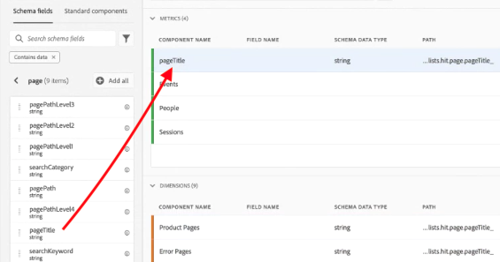
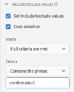

# Casi di utilizzo delle visualizzazioni dati

>[!IMPORTANT]
>
>Questa funzionalità sarà generalmente disponibile il 22 aprile 2021.

Questi casi d’uso mostrano la flessibilità e la potenza delle visualizzazioni dati in Customer Journey Analytics.

## Creare una metrica Ordini da un campo di schema pageTitle (stringa)

Ad esempio, quando crei una visualizzazione dati, puoi creare una metrica [!UICONTROL Orders] da un campo di schema [!UICONTROL pageTitle] che è una stringa. Di seguito sono riportati i passaggi da seguire:

1. Nella scheda Componenti , trascina [!UICONTROL pageTitle] nella sezione [!UICONTROL Metrics] di [!UICONTROL Included Components].
   
1. Ora evidenzia la metrica appena trascinata e rinominala in [!UICONTROL Component Settings] a destra:
   
1. Apri la finestra di dialogo [!UICONTROL Include/Exclude Values] a destra e specifica quanto segue:
   

   La frase &quot;di conferma&quot; indica che si tratta di un ordine. Dopo aver esaminato tutti i titoli delle pagine in cui tali criteri sono soddisfatti, viene conteggiato un &quot;1&quot; per ogni istanza. Il risultato è una nuova metrica (non una metrica calcolata). Una metrica con valori inclusi/esclusi può essere utilizzata ovunque sia possibile utilizzare qualsiasi altra metrica. Funziona con Attribution IQ, filtri e ovunque puoi utilizzare metriche standard.
1. Puoi inoltre specificare un modello di attribuzione per questa metrica, ad esempio [!UICONTROL Last Touch], con [!UICONTROL Lookback window] di [!UICONTROL Session].
Puoi anche creare un’altra metrica [!UICONTROL Orders] dallo stesso campo e specificare un modello di attribuzione diverso, ad esempio [!UICONTROL First Touch], e un [!UICONTROL Lookback window] diverso, ad esempio [!UICONTROL 30 days].

## Utilizzare i numeri interi come dimensioni

In precedenza, gli interi venivano trattati automaticamente come metriche in CJA. Ora le cifre (compresi gli eventi personalizzati da Adobe Analytics) possono essere trattate come dimensioni. Ecco un esempio:

1. Trascina il numero intero [!UICONTROL call_length_min] nella sezione [!UICONTROL Dimensions] sotto [!UICONTROL Included Components]:

   

1. È ora possibile aggiungere [!UICONTROL Value Bucketing] per presentare questa dimensione in modo fisso nel reporting. (Senza bucket, ogni istanza di questa dimensione apparirà come una riga nel reporting di Workspace.)

   

Per ulteriori informazioni sulle altre impostazioni delle visualizzazioni dati, consulta [Creare visualizzazioni dati](/help/data-views/create-dataview.md).
Per una panoramica concettuale delle visualizzazioni dati, consulta [Panoramica delle visualizzazioni dati](/help/data-views/data-views.md).
