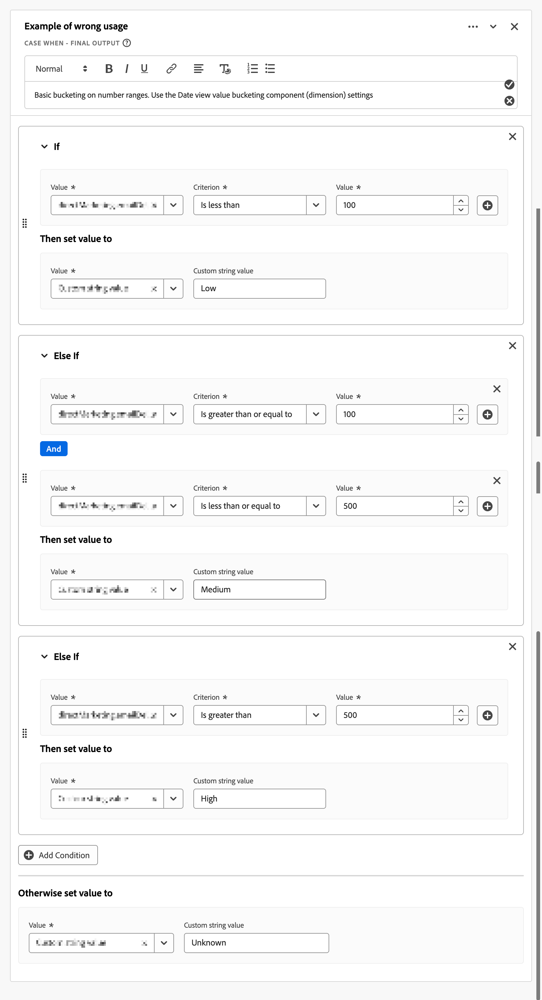
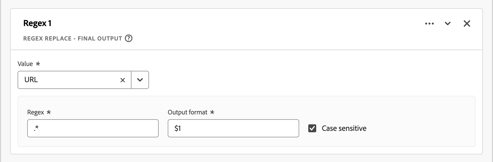
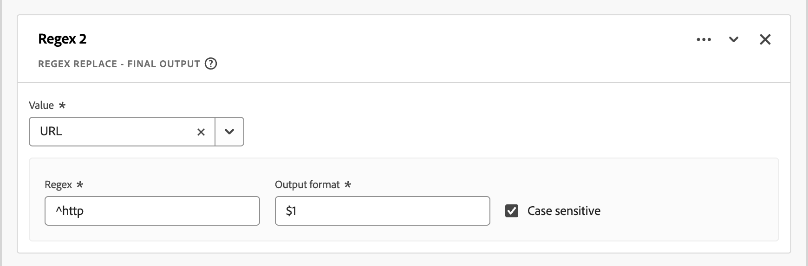
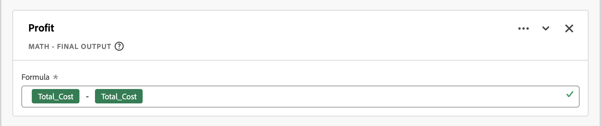
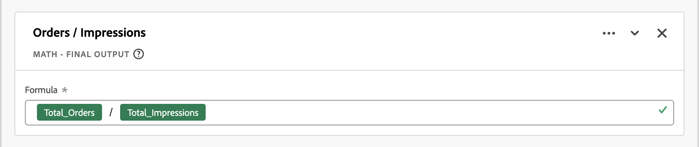

# Linee guida per i campi derivati

I [campi derivati](./derived-fields.md) di Customer Journey Analytics consentono di trasformare, classificare e arricchire dati in fase di query senza modificare i set di dati di origine. Questa flessibilità può introdurre complessità, problemi di prestazioni e sovraccarico di manutenzione se applicata senza disciplina.

Questo articolo fornisce linee guida (best practice, guardrail e insidie comuni) per l’utilizzo dei campi derivati. Il pubblico previsto sono architetti di dati, amministratori di prodotto e analisti che devono:

* **Ottimizza le prestazioni**: identifica i pattern che rallentano l&#39;esecuzione delle query o i limiti del sistema, per selezionare lo strumento corretto per il processo:

   * [Campi derivati](./derived-fields.md)
   * [Impostazioni della visualizzazione dati](/help/data-views/component-settings/overview.md)
   * [Preparazione dei dati](https://experienceleague.adobe.com/it/docs/experience-platform/data-prep/home)
   * [Metriche calcolate](/help/components/calc-metrics/calc-metr-overview.md)
   * [Set di dati di ricerca](/help/getting-started/cja-upgrade/cja-upgrade-dataset-lookup.md)

* **Miglioramento della manutenibilità**: genera una logica di campo derivata chiara, modulare e facile da aggiornare.
* **Correttezza**: evitare errori logici comuni nella classificazione, nell&#39;attribuzione e nella trasformazione dei dati.

Le sezioni in questo articolo sono organizzate per tema. Da concatenazioni di regole eccessivamente complesse all&#39;uso improprio di funzioni come [Lookup](./derived-fields.md#lookup), [Regex Replace](./derived-fields.md#regex-replace) e [Next o Previous](./derived-fields.md#next-or-previous). Ogni sezione include:

* **Pattern** da rilevare: segnali osservabili nelle definizioni dei campi derivati.
* **Diagnosi dei rischi**: perché il modello è problematico. Possibili cause: effetti negativi sulle **prestazioni**, **qualità dei dati** o **manutenzione**.
* **Consigli**: passaggi concreti per eseguire il refactoring o migliorare l&#39;implementazione.

Queste linee guida ti aiutano a creare implementazioni efficienti, scalabili e corrette dal punto di vista semantico in Customer Journey Analytics. Applica queste linee guida quando esegui il controllo di visualizzazioni dati esistenti, progetta nuovi campi derivati o crea strumenti di governance.

## Campi derivati ad alta cardinalità

Questa sezione descrive i segmenti predefiniti della visualizzazione dati che fanno riferimento a campi derivati ad alta cardinalità.

### Pattern

* I segmenti predefiniti della visualizzazione dati che fanno riferimento a un campo derivato basato su una dimensione ad alta cardinalità (circa un milione o più valori distinti). Ad esempio: URL della pagina intera.
* Operazioni semplici come [Minuscolo](./derived-fields.md#lowercase), [Trim](./derived-fields.md#trim) o [Caso Quando](./derived-fields.md#case-when) i controlli nell&#39;URL della pagina sono spesso più costosi della stessa logica nei campi a bassa cardinalità, come il nome della pagina, la sezione del sito o il gruppo URL.

### Diagnosi dei rischi: prestazioni

* I segmenti predefiniti che filtrano i campi derivati che toccano l’URL della pagina o altre dimensioni ad alta cardinalità aggiungono latenza a ogni query rispetto alla visualizzazione dati.

### Raccomandazioni

* Evita di fare riferimento agli URL di pagine intere o a componenti con cardinalità elevata simile direttamente nei segmenti predefiniti della visualizzazione dati. Effettua il push della logica dell&#39;URL pesante (complesso [Case When](./derived-fields.md#case-when), [Regex Replace](./derived-fields.md#regex-replace), più funzioni di stringa) a monte di [Preparazione dati](https://experienceleague.adobe.com/it/docs/experience-platform/data-prep/home) o [set di dati di ricerca](/help/getting-started/cja-upgrade/cja-upgrade-dataset-lookup.md) in modo che le classificazioni risultanti arrivino a dimensioni più semplici e a bassa cardinalità.
* Preferisci le chiavi a bassa cardinalità, come il nome di pagina normalizzato, la sezione del sito o i gruppi di URL preclassificati.
* Controlla periodicamente i segmenti predefiniti e i campi derivati della visualizzazione dati esistenti per i riferimenti a dimensioni ad alta cardinalità (URL della pagina, ID campagna, stringhe di query non elaborate) ed effettua il refactoring alle chiavi normalizzate o raggruppate.

## Caso eccessivamente complesso nelle catene di regole

Questa sezione descrive catene eccessivamente complesse di regole [Case When](./derived-fields.md#case-when).

Customer Journey Analytics applica limiti espliciti di [funzione e operatore](derived-fields.md#limitations) per campo derivato (ad esempio, numero massimo di operatori, numero massimo di funzioni per tipo). Le funzioni e le catene eccessivamente complesse all’interno delle funzioni sono più difficili da mantenere e più soggette a errori.

### Pattern

* [Caso molto grande Quando](./derived-fields.md#case-when) funziona con catene **[!UICONTROL If]** e **[!UICONTROL Else If]** complesse:
   * Molte condizioni (ad esempio: più di 20 operatori) o nidificazione profonda (più di 3 o 4 livelli di logica [Case When](./derived-fields.md#case-when) **[!UICONTROL If]** e **[!UICONTROL Else If]** nidificata).
   * Condizioni ripetute sullo stesso campo con valori diversi.
* Corrispondenza stringa costante ripetuta.

  +++ Esempio

  

  +++

### Diagnosi dei rischi: prestazioni, qualità dei dati, manutenzione elevata

* Manutenzione e rischio di errore: la logica codificata come blocco di regola monolitico è difficile da eseguire sul debug e aggiornare.
* Prestazioni potenziali e rischio limite: potresti raggiungere o avvicinarti ai [limiti di operatore o funzione](./derived-fields.md#limitations), soprattutto con modelli simili a quelli di classificazione.

### Raccomandazioni

* Dividi in più campi derivati. Ad esempio, separa *la normalizzazione della campagna* (mappatura di identificatori di campagna incoerenti a un valore canonico) dal bucket del canale invece di combinare tutto in un&#39;unica regola gigante.
* Utilizza i set di dati di ricerca. Molti **[!UICONTROL Se il valore _valore_ criterio _criterio_, impostare _valore_ su valore]** le condizioni vengono implementate meglio come [set di dati di ricerca](/help/getting-started/cja-upgrade/cja-upgrade-dataset-lookup.md) combinato con la funzione [Ricerca](./derived-fields.md#lookup) invece di utilizzare lunghe catene [Caso Quando](./derived-fields.md#case-when).
* Utilizza i filtri dei componenti della visualizzazione dati. Se una parte della logica esclude semplicemente i valori non validi, utilizza [include exclude](/help/data-views/component-settings/include-exclude-values.md) a livello del componente della visualizzazione dati anziché incorporare tale logica in un campo derivato.

## Utilizzo errato

Questa sezione descrive l’utilizzo errato dei campi derivati. In particolare, dove le alternative sono una soluzione migliore.

>[!NOTE]
>
>Lo spostamento della logica da un campo derivato a un’impostazione del componente Visualizzazione dati non migliora di per sé le prestazioni delle query. Entrambi gli approcci si basano sulla stessa logica derivata sottostante. Le raccomandazioni contenute in questa sezione riguardano la chiarezza, la governance e il riutilizzo anziché la velocità.

### Pattern

* Un campo derivato replica il comportamento già disponibile nelle impostazioni dei componenti:
   * Normalizzazione dei casi, ritaglio o filtraggio semplice (ad esempio: escludendo `unknown`, `undefined` o `null`) senza complessità aggiuntiva.
   * Inserimento di intervalli di numeri negli intervalli di base.

     +++ Esempio

     

     +++

     Utilizza invece [bucket di valori](/help/data-views/component-settings/value-bucketing.md) in una dimensione nella visualizzazione dati.
   * Logica di persistenza o attribuzione codificata con [Next o Previous](./derived-fields.md#next-or-previous) o logica di sequenza manuale in cui sarebbero sufficienti le impostazioni di visualizzazione dati [attribution](/help/data-views/component-settings/attribution.md) e [expiration](/help/data-views/component-settings/persistence.md).
   * Una metrica derivata che conta semplicemente una metrica esistente in una condizione.

     +++ Esempio

     

     +++

     Questo replica ciò che una metrica filtrata o [Includi valori di esclusione](/help/data-views/component-settings/include-exclude-values.md) potrebbe ottenere.

### Diagnosi dei rischi: qualità dei dati, manutenzione elevata

* Complessità ridondante: i campi derivati vengono utilizzati laddove esistono funzioni di visualizzazione dati integrate più semplici.
* Rischio di governance: altri utenti potrebbero non capire perché esiste un campo derivato invece di un’impostazione nativa. Il pattern aumenta il disordine nell’amministrazione dei campi derivati.
* Riutilizzabilità ridotta: la codifica dei flag condizionali come campi derivati rende più difficile riutilizzare le metriche di base con filtri diversi nei progetti.

### Raccomandazioni

* Taglia / Minuscolo: utilizzare le impostazioni del componente [Substring](/help/data-views/component-settings/substring.md) e [Behavior](/help/data-views/component-settings/behavior.md) a meno che non siano necessarie trasformazioni combinate in più passaggi.
* Esclusione di valore: utilizzare [Includi valori di esclusione](/help/data-views/component-settings/include-exclude-values.md) per le metriche o i valori di dimensione a livello del componente della visualizzazione dati, non in un campo derivato.
* Attribuzione e persistenza: utilizzare le impostazioni della visualizzazione dati [Persistenza](/help/data-views/component-settings/persistence.md) (**[!UICONTROL Modello di allocazione]** e **[!UICONTROL Scadenza]**) per le dimensioni invece di simularle in un campo derivato con [Successivo o Precedente](./derived-fields.md#next-or-previous) o altra logica sequenziale.
* Bucket numerico: mantieni numerico il campo derivato e lascia che la visualizzazione dati crei una dimensione a bucket in primo piano, invece delle etichette di intervallo a codifica fissa in una catena [Case When](./derived-fields.md#case-when).
* Logica condizionale: converti la logica del flag semplice 0 o 1 in:
   * la metrica originale con logica di filtro dei valori di inclusione o esclusione applicata in Analysis Workspace.
   * una metrica filtrata utilizzando la configurazione delle impostazioni del componente della visualizzazione dati.

## Errori di classificazione di metriche e dimensioni

Questa sezione descrive le classificazioni errate di metriche e dimensioni.

### Pattern

* Un campo derivato produce chiaramente:
   * Output numerici (conteggio, rapporto o aritmetica) ma il componente è configurato come dimensione.
   * Output categorici (etichette o stringhe) ma il componente è configurato come metrica.
* Un campo derivato codifica i flag 0/1 come stringhe.

Customer Journey Analytics consente di forzare i campi numerici per le dimensioni e i campi stringa per le metriche a livello di visualizzazione dati, ma un disallineamento può creare rapporti confusi.

### Diagnosi dei rischi: qualità dei dati

* Mancata corrispondenza semantica: il tipo di componente non corrisponde alla natura del risultato derivato, rendendo più difficile l’analisi o l’aggregazione corretta del tipo di componente.

### Raccomandazioni

* Se l’output è numerico:
   * Impostare il tipo di componente su **[!UICONTROL Metrica]** nella visualizzazione dati.
   * Se il componente rappresenta una metrica subset (ad esempio, **[!UICONTROL Visualizzazioni pagina di checkout]**), utilizza una metrica filtrata all&#39;interno della visualizzazione dati, anziché una stringa derivata e una metrica calcolata all&#39;inizio.
* Se l’output è un’etichetta:
   * Imposta il tipo di componente su **[!UICONTROL Dimension]** e configura di conseguenza le impostazioni di [Persistenza](/help/data-views/component-settings/persistence.md) (**[!UICONTROL Modello di allocazione]** e **[!UICONTROL Scadenza]**).

## Insidie del canale di marketing e della logica della campagna

Questa sezione descrive le insidie del canale di marketing e della logica della campagna.

>[!NOTE]
>
>Considera la semplificazione a monte: utilizza [Preparazione dati](https://experienceleague.adobe.com/it/docs/experience-platform/data-prep/home), [set di dati di ricerca](/help/getting-started/cja-upgrade/cja-upgrade-dataset-lookup.md) o funzioni campo derivato come [Classifica](./derived-fields.md#classify) per consolidare regole di canale di marketing simili e ridurre il numero di operatori nella logica [Caso di utilizzo](./derived-fields.md#case-when). Inoltre, limita il numero di campi ad alta cardinalità a cui si fa riferimento nella logica di classificazione del canale (ad esempio, molte chiavi di parametri di query distinte), in quanto questi campi aumentano sia la cardinalità che il costo della query.

### Pattern

* I canali di marketing Customer Journey Analytics vengono spesso implementati utilizzando campi derivati.

   * Campi derivati che implementano il canale di marketing o il bucket di campagne in base a parametri URL, referrer, pagina di destinazione e altro ancora.
   * Ordine sospetto: prima di applicare regole più specifiche, viene visualizzata una regola generale catch-all.
   * Gestione incompleta di tutte le opzioni possibili: nessun ramo esplicito per **[!UICONTROL Il dominio di riferimento non è impostato]** o **[!UICONTROL Il parametro di query non è impostato]**.

### Diagnosi dei rischi: qualità dei dati

* Errore nell’ordinamento logico: regole successive nella catena che potrebbero ignorare canali specifici e causare una classificazione errata del traffico.
* Errata etichettatura del traffico diretto: il traffico senza corrispondenza rientra in un canale non desiderato o è etichettato come `Other`.

### Raccomandazioni

* Applica l&#39;ordinamento di priorità top-down. Inserisci prima i segnali più forti (ad esempio: domini interni per escludere i parametri di campagne a pagamento).
* Includi un **[!UICONTROL finale esplicito. Altrimenti imposta il valore su]** maiuscole/minuscole. Impostare il fallback su **[!UICONTROL Nessun valore]** per evitare la sovrascrittura dei canali precedenti. Non impostare il valore su **[!UICONTROL Valore stringa personalizzato]** e quindi il **[!UICONTROL Valore stringa personalizzato]** su `Direct`, `None` o `Unclassified` in questo passaggio catch-all.
* Utilizzare i modelli. Se possibile, sfrutta i modelli di campo derivati del canale di marketing. In alternativa, allinea la logica con le best practice consigliate per il canale di marketing di Adobe.

## Chiavi stringa non normalizzate utilizzate nelle ricerche

Questa sezione descrive l’utilizzo di chiavi di stringa non normalizzate nelle ricerche.

### Pattern

* Una funzione [Lookup](./derived-fields.md#lookup) su un evento o un campo di profilo che alimenta un set di dati di ricerca.
* Nessun elemento [Minuscolo](./derived-fields.md#lowercase), [Trim](./derived-fields.md#trim) o [Regex Replace](./derived-fields.md#regex-replace) precedente standardizza la chiave.
* Candidati comuni: URL, ID campagna, e-mail, ID account.

### Diagnosi dei rischi: qualità dei dati, manutenzione elevata

* Rischio di qualità dei dati: le ricerche non riescono quando il case della chiave o lo spazio vuoto differiscono dalla tabella di ricerca, causando *nessuna corrispondenza* e lacune nei rapporti.

### Raccomandazioni

* Aggiungi le funzioni [Minuscolo](./derived-fields.md#lowercase) e [Taglia](./derived-fields.md#trim) prima della funzione [Ricerca](./derived-fields.md#lookup) a meno che non vi sia un motivo documentato per mantenere lettere maiuscole o minuscole.
* Se più trasformazioni sono già concatenate, verificane l’ordine: normalizza prima, quindi cerca.

## Uso improprio o sovraccarico di Regex

Questa sezione descrive l’uso improprio o l’overreach della funzionalità regex per i campi derivati.

### Pattern

* [Regex Replace](./derived-fields.md#regex-replace) o condizioni basate su regex utilizzano modelli molto ampi in cui le funzioni [Case When](./derived-fields.md#case-when) più semplici con **[!UICONTROL Contains]** o **[!UICONTROL Starts with]** rappresentano un&#39;alternativa più semplice e migliore.

  +++ Esempio

  

  

  +++

* Più condizioni regex si sovrappongono o entrano in conflitto.
* Utilizzo intensivo di regex per analizzare gli URL invece di utilizzare la funzione [URL Parse](./derived-fields.md#url-parse).

### Diagnosi dei rischi: prestazioni, qualità dei dati, manutenzione elevata

* Rischio di prestazioni e manutenibilità: i pattern regex complessi sono più difficili da eseguire e possono essere più lenti.
* Rischio di correttezza: un’eccessiva ampiezza di regex può acquisire valori non desiderati.

### Raccomandazioni

* Preferisci [Analisi URL](./derived-fields.md#url-parse) per elementi URL standard (dominio, percorso, parametri query) invece di [Sostituzione regex](./derived-fields.md#regex-replace).
* Per controlli pattern semplici, utilizza [Case When](./derived-fields.md#case-when) con **[!UICONTROL Contains]**, **[!UICONTROL Starts with]** o **[!UICONTROL Ends with]** logic invece delle espressioni regolari con [Regex Replace](./derived-fields.md#regex-replace).
* Contrassegna le espressioni regolari che utilizzano più gruppi nidificati o alternative per i pattern semplici. Oppure espressioni regolari che possono essere sostituite utilizzando funzioni di stringa di campo derivate.

## Logica di stile della metrica calcolata nei campi derivati

Questa sezione descrive l’utilizzo della logica di stile calcolata in un campo derivato.

>[!NOTE]
>
>I campi derivati vengono valutati a livello di evento (riga) prima dell’aggregazione, mentre le metriche calcolate di Analysis Workspace funzionano su valori già aggregati. I rapporti, le medie e i calcoli in stile distinto possono quindi produrre risultati diversi a seconda che questi calcoli vengano implementati come campo derivato o come metrica calcolata. Siate decisi su dove vive l&#39;aritmetica, perché la grandezza della valutazione cambia la risposta.

### Pattern

* Aritmetica pura su campi numerici all’interno di un campo derivato (somma, sottrazione, divisione) che si presenta come una metrica calcolata.

  +++ Esempi

  

  .

  +++

* Non viene utilizzato alcun tipo di manipolazione o classificazione delle stringhe; la logica è puramente numerica.

### Diagnosi dei rischi: qualità dei dati

* Questione di governance e progettazione: l&#39;aritmetica può essere meglio posizionata come:
   * Una metrica di campo derivata (se desideri che il campo derivato sia una metrica standard gestita per tutti gli utenti).
   * Una metrica calcolata in Analysis Workspace (se la metrica calcolata è specifica per l’analisi).

### Raccomandazioni

* Se il risultato aritmetico è generalmente utile tra utenti e progetti, mantienilo come metrica di campo derivata. Assicurati che il tipo di componente sia metrica e che la formattazione (valuta, percentuale) sia configurata a livello di visualizzazione dati.
* Se il risultato è specifico per la nicchia o per l’analista, spostalo in una metrica calcolata e semplifica la visualizzazione dati.

## Utilizzo eccessivo delle funzioni Successivo o Precedente o sequenziale

Questa sezione descrive l&#39;utilizzo eccessivo di [funzioni successive o precedenti](./derived-fields.md#next-or-previous) o sequenziali.

### Pattern

* Un campo derivato utilizza più volte le funzioni [Successivo o Precedente](./derived-fields.md#next-or-previous) (in prossimità del limite documentato per campo).
* [Next o Previous](./derived-fields.md#next-or-previous) viene utilizzato per implementare una logica di persistenza (ad esempio: portare avanti una campagna) invece di utilizzare la persistenza della visualizzazione dati.

### Diagnosi dei rischi: qualità dei dati, manutenzione elevata

* Complessità e fragilità: una logica sequenziale pesante è più difficile da ragionare e può interrompersi se le regole di sessionizzazione o di ordinamento cambiano.
* Ridondanza con persistenza della dimensione: alcuni casi d&#39;uso (ad esempio, Canale di ultimo contatto in una sessione) sono trattati meglio dalle impostazioni della visualizzazione dati [Persistenza](/help/data-views/component-settings/persistence.md) (**[!UICONTROL Modello di allocazione]**) nella dimensione.

### Raccomandazioni

* Per i pattern che assomigliano alla persistenza standard (ad esempio, il trasferimento di un valore in una sessione o persona), utilizza le impostazioni [Persistenza](/help/data-views/component-settings/persistence.md) della dimensione (**[!UICONTROL Modello di allocazione]** e **[!UICONTROL Scadenza]**) nella visualizzazione dati invece di simulare questi pattern con [Successivo o Precedente](./derived-fields.md#next-or-previous).
* Riserva [Successivo o Precedente](./derived-fields.md#next-or-previous) per il percorso avanzato in più passaggi o per l&#39;etichettatura funnel che la sola persistenza della dimensione non può raggiungere (ad esempio: concatenazione della sequenza di canale).

## Ignorare il contesto a livello di sessione e persona

In questa sezione viene descritto come ignorare il contesto a livello di sessione e persona durante la definizione di un campo derivato.

>[!NOTE]
>
>In alcuni casi, un segmento con ambito a livello di sessione o di persona in Analysis Workspace può modellare il comportamento più semplicemente di un campo derivato. Valuta l’utilizzo di segmenti invece di campi derivati complessi da più ambiti, se appropriato.

### Pattern

* Un campo derivato presuppone implicitamente un particolare [livello contenitore](/help/getting-started/cja-b2b-concepts-features.md#containers) (evento, sessione o persona), ma:

   * Il campo derivato non fa riferimento ad attributi a livello di sessione o di persona.
   * Le impostazioni della sessione della visualizzazione dati sono in conflitto con la logica prevista.

### Diagnosi dei rischi: qualità dei dati

* Mancata corrispondenza concettuale: la semantica dei campi derivati potrebbe non corrispondere al livello di aggregazione previsto dagli analisti (ad esempio, un campo basato su utente tipo che può cambiare con ogni evento).

### Raccomandazioni

* Se la logica deve essere a livello di sessione: verificare che le [impostazioni di sessione](/help/data-views/session-settings.md) siano configurate in modo appropriato e provare a utilizzare componenti con ambito di sessione o riepilogo in Analysis Workspace o in uno [strumento di business intelligence integrato](/help/data-views/bi-extension.md).
* Se la logica deve essere a livello di persona: utilizza i set di dati di profilo o di ricerca e fai riferimento a tali set di dati all’interno di campi derivati.
* Valuta se un segmento con ambito di sessione o di persona in Analysis Workspace raggiungerebbe lo stesso risultato più semplicemente di un campo derivato.

## Raggiungere o avvicinarsi ai limiti documentati delle funzioni

Questa sezione descrive le implicazioni di raggiungere o avvicinarsi ai limiti documentati delle funzioni di campo derivato.

>[!NOTE]
>
>Riduci la dipendenza da campi ad alta cardinalità all&#39;interno di campi derivati complessi, ove possibile (ad esempio: utilizza chiavi normalizzate o classificazioni raggruppate) per limitare sia il costo delle query che la probabilità di raggiungere i limiti di [operatore o funzione](./derived-fields.md#limitations).

Numero massimo di funzioni e operatori per campo derivato in Customer Journey Analytics [documenti](./derived-fields.md#limitations), inclusi i limiti per tipo di funzione ([Ricerca](./derived-fields.md#lookup), [Matematica data](./derived-fields.md#date-math), [Deduplicazione](./derived-fields.md#deduplicate), [Matematica](./derived-fields.md#math), [Divisione](./derived-fields.md#split), [Analisi URL](./derived-fields.md#url-parse) e altro).

### Pattern

* Un campo derivato utilizza molte [ricerche](./derived-fields.md#lookup), [operazioni matematiche](./derived-fields.md#math), [suddivisioni](./derived-fields.md#split) o altre funzioni.
* Il numero di operatori è vicino ai [limiti documentati](./derived-fields.md#limitations) (ad esempio: più del 70% - 80% dei conteggi consentiti).

### Diagnosi dei rischi: prestazioni, manutenzione elevata

* Rischio di scalabilità: le aggiunte future potrebbero non riuscire o comportarsi in modo imprevisto se il campo raggiunge il limite di funzioni.

### Raccomandazioni

* Segnala in modo proattivo quando l’utilizzo supera una soglia (ad esempio: > 70% di qualsiasi limite di funzione o operatore).
* Dividi la logica in più campi derivati concatenati (ad esempio, un campo derivato A che normalizza una chiave di ricerca e un campo derivato Banda normalize_key e quindi lookup_label).
* Utilizza la preparazione dati esterna o un set di dati di ricerca in cui sono necessarie classificazioni particolarmente grandi.

## Regole di ottimizzazione specifiche della visualizzazione dati

Questa sezione descrive le regole di ottimizzazione specifiche della visualizzazione dati per i campi derivati.

Controlla anche la configurazione della visualizzazione dati per ciascun componente derivato.

### Pattern

* Una dimensione derivata ha un&#39;attribuzione predefinita (ad esempio: Ultimo contatto con scadenza sessione), ma il nome del campo derivato implica una semantica diversa (ad esempio: `First Campaign of Visit`, `Original Source`).
* Una dimensione derivata ha impostazioni [Persistenza](/help/data-views/component-settings/persistence.md) predefinite (ad esempio: **[!UICONTROL Allocazione più recente]** con **[!UICONTROL Sessione]** scadenza) ma il nome della dimensione derivata implica una semantica diversa (ad esempio `First Campaign of Visit` o `Original Source`).

### Diagnosi dei rischi: qualità dei dati

* Mancata corrispondenza semantica: l’etichetta della dimensione suggerisce un comportamento di allocazione o scadenza diverso (ad esempio, allocazione originale o scadenza a livello di persona) rispetto a quello effettivamente configurato.
* Questa mancata corrispondenza aumenta il rischio che gli analisti interpretino erroneamente i rapporti o confrontino componenti che appaiono simili per nome ma che utilizzano modelli di allocazione diversi.

### Raccomandazioni

* Regola il modello di allocazione [&#x200B; e la scadenza &#x200B;](/help/data-views/component-settings/persistence.md) su quella dimensione per allineare nome e comportamento. Ad esempio, una dimensione campo derivata denominata `Original Source` deve utilizzare l&#39;attribuzione Primo contatto con scadenza impostata su Persona.
* Regola il **[!UICONTROL modello di allocazione]** e la **[!UICONTROL scadenza]** nelle impostazioni di [persistenza](/help/data-views/component-settings/persistence.md) della dimensione per allineare nome e comportamento. Ad esempio, `Original Source` deve impostare **[!UICONTROL Allocation model]** su **[!UICONTROL Original]** con **[!UICONTROL Expiration]** impostato su **[!UICONTROL Person]**.
