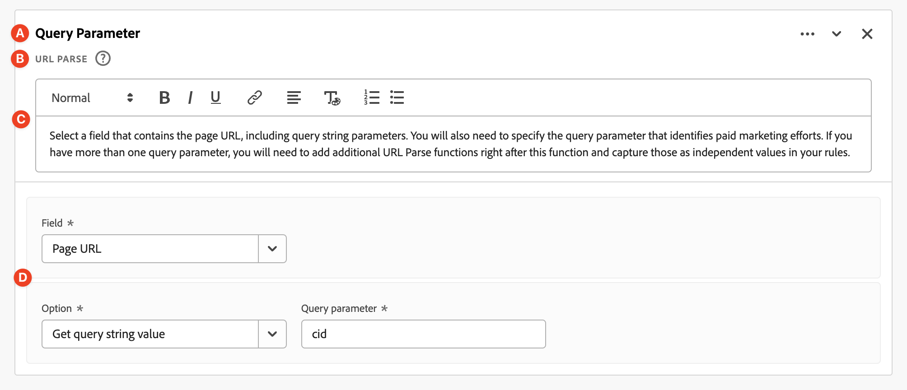

# Campi derivati

I campi derivati sono un aspetto importante della funzionalità di reporting in tempo reale in Adobe Customer Journey Analytics. Un campo derivato consente di definire al volo manipolazioni (spesso complesse) dei dati tramite un generatore di regole personalizzabile. Puoi quindi utilizzare il campo derivato come componente (metrica o dimensione) in [Workspace](../../analysis-workspace/home.md) o anche definire ulteriormente il campo derivato come componente in [Visualizzazione dati](../data-views.md).

I campi derivati consentono di risparmiare molto tempo e fatica rispetto alla trasformazione o alla manipolazione dei dati in altre posizioni al di fuori del Customer Journey Analytics. Ad esempio [Preparazione dati](https://experienceleague.adobe.com/docs/experience-platform/data-prep/home.html?lang=it), [Data Distiller](https://experienceleague.adobe.com/docs/experience-platform/query/data-distiller/overview.html?lang=en)o all&#39;interno dei processi ETL (Extract Transform Load)/ELT (Extract Load Transform).

I campi derivati sono definiti in [Visualizzazioni dati](../data-views.md), si basano su un set di funzioni definite come regole e applicate ai campi standard e/o schema disponibili.

Esempi di casi di utilizzo:

- Definisci un campo Nome pagina derivato che corregga i valori errati dei nomi di pagina raccolti per correggere i valori dei nomi di pagina.

- Definisci un campo Canale di marketing derivato che determini il canale di marketing appropriato in base a una o più condizioni (ad esempio parametro URL, URL pagina, nome pagina).

## Interfaccia campo derivato

Quando si crea o si modifica un campo derivato, viene utilizzata l&#39;interfaccia del campo derivato.

|  | Nome | Descrizione |
|---------|----------|--------|
| 1 | **Selettore** | Utilizza l’area del selettore per selezionare e trascinare la funzione, il modello di funzione, il campo schema o il campo standard nel generatore di regole.  Utilizza il menu a discesa per selezionare tra:   [!UICONTROL Functions] - elenchi disponibili [funzioni](#function-reference),   [!UICONTROL Function templates] - elenchi disponibili [modelli di funzioni](#function-templates),    [!UICONTROL Schema fields] : elenca i campi disponibili dalle categorie di set di dati (evento, profilo, ricerca) e i campi derivati definiti in precedenza, e   [!UICONTROL Standard fields] : campi disponibili standard (come ID del set di dati della piattaforma). Nel selettore vengono visualizzati solo i campi standard stringa e numerici. Se la funzione supporta altri tipi di dati, è possibile selezionare campi standard con questi altri tipi di dati per valori o campi all’interno dell’interfaccia della regola. È possibile cercare funzioni, modelli di funzione, schemi e campi standard utilizzando  Casella di ricerca.  È possibile filtrare l&#39;elenco di oggetti selezionato selezionando  Filtra e specifica i filtri nella [!UICONTROL Filter fields by] . Puoi rimuovere facilmente i filtri utilizzando  per ciascun filtro. |
| 2 | **Generatore di regole** | Puoi creare il campo derivato in sequenza utilizzando una o più regole. Una regola è un’implementazione specifica di una funzione ed è quindi sempre associata a una sola funzione. Per creare una regola, trascina e rilascia una funzione nel generatore di regole. Il tipo di funzione determina l’interfaccia della regola. Consulta la [Interfaccia regola](#rule-interface) per ulteriori informazioni.  Puoi inserire una funzione all’inizio, alla fine o tra le regole già disponibili nel generatore di regole. L’ultima regola nel generatore di regole determina l’output finale del campo derivato. |
| 3 | **[!UICONTROL ** Impostazioni campo **]** | È possibile denominare e descrivere il campo derivato e verificarne il tipo. |
| 4 | **[!UICONTROL ** Output finale **]** | Questa area mostra un’anteprima istantaneamente aggiornata dei valori di output, in base ai dati degli ultimi 30 giorni e alle modifiche apportate al campo derivato nel generatore di regole. |

{style="table-layout:auto"}

## Creazione guidata modello di campo

Quando si accede all&#39;interfaccia del campo derivato per la prima volta, [!UICONTROL Start with a field template] viene visualizzata la procedura guidata.

1. Seleziona il modello che descrive meglio il tipo di campo che stai tentando di creare.
2. Seleziona la **[!UICONTROL ** Seleziona **]** per continuare.

La finestra di dialogo del campo derivato viene compilata con regole (e funzioni) necessarie o utili per il tipo di campo selezionato. Consulta [Modelli di funzione](#function-templates) per ulteriori informazioni sui modelli disponibili.

## Interfaccia regola

Quando definisci una regola nel generatore di regole, utilizzi l’interfaccia della regola.

|  | Nome | Descrizione |
|---------|----------|--------|
| A | **Nome regola** | Per impostazione predefinita, il nome della regola è **Regola X** (X che fa riferimento a un numero progressivo). Per modificare il nome di una regola, selezionarne il nome e digitarlo nel nuovo nome, ad esempio `Query Parameter`. |
| B | **Nome funzione** | Il nome della funzione selezionata per la regola, ad esempio [!UICONTROL URL PARSE]. Quando la funzione è l&#39;ultima nella sequenza di funzioni e determina i valori di output finali, il nome della funzione è seguito da [!UICONTROL - FINAL OUTPUT], ad esempio [!UICONTROL URL PARSE - FINAL OUTPUT].  Per visualizzare una finestra a comparsa con ulteriori informazioni sulla funzione, selezionare . |
| C | **Descrizione regola** | Facoltativamente, puoi aggiungere una descrizione a una regola. Seleziona , quindi seleziona **[!UICONTROL ** Aggiungi descrizione **]** per aggiungere una descrizione o **[!UICONTROL ** Modifica descrizione **]** per modificare una descrizione esistente. Utilizza l’editor per immettere una descrizione. È possibile utilizzare la barra degli strumenti per formattare il testo (utilizzando selettore di stile, grassetto, corsivo, sottolineato, destro, sinistro, centrato, colore, elenco numerato, elenco puntato) e aggiungendo collegamenti a informazioni esterne.  Per completare la modifica della descrizione, fai clic all’esterno dell’editor. |
| D | **Area funzione** | Definisce la logica della funzione. L’interfaccia dipende dal tipo di funzione. Menu a discesa per [!UICONTROL Field] o [!UICONTROL Value] mostra tutte le categorie di campi (regole, campi standard, campi) disponibili, in base al tipo di input previsto dalla funzione. In alternativa, puoi trascinare e rilasciare un campo dal selettore dei campi Schema e Standard su un Campo o un Valore. Quando il campo trascinato proviene da un set di dati di ricerca, viene inserita automaticamente una funzione di ricerca prima della funzione definita.  Consulta [Riferimento funzione](#function-reference) informazioni dettagliate su ciascuna delle funzioni supportate. |

{style="table-layout:auto"}

## Creare un campo derivato

1. Seleziona una visualizzazione dati esistente o creane una. Consulta [Visualizzazioni dati](../data-views.md) per ulteriori informazioni.

2. Seleziona la **[!UICONTROL ** Componenti **]** della visualizzazione Dati.

3. Seleziona **[!UICONTROL ** Crea campo derivato **]** dalla barra a sinistra.

4. Per definire il campo derivato, utilizza [!UICONTROL Create derived field] di rete. Consulta [Interfaccia campo derivato](#derived-field-interface).

   Per salvare il nuovo campo derivato, seleziona **[!UICONTROL ** Salva **]**.

5. Il nuovo campo derivato viene aggiunto al [!UICONTROL Derived fields >] contenitore, come parte di **[!UICONTROL ** Campi schema **]** nella barra a sinistra della visualizzazione Dati.

## Modificare un campo derivato

1. Seleziona una visualizzazione dati esistente. Consulta [Visualizzazioni dati](../data-views.md) per ulteriori informazioni.

2. Seleziona la **[!UICONTROL ** Componenti **]** della visualizzazione Dati.

3. Seleziona **[!UICONTROL ** Campi schema **]** scheda in [!UICONTROL Connection] a sinistra.

4. Seleziona **[!UICONTROL ** Campi derivati >**]** contenitore.

5. Passa il puntatore del mouse sul campo derivato che desideri modificare e seleziona .

6. Per modificare il campo derivato, utilizzare [!UICONTROL Edit derived field] di rete. Consulta [Interfaccia campo derivato](#derived-field-interface).

   - Seleziona **[!UICONTROL ** Salva **]** per salvare il campo derivato aggiornato.

   - Seleziona **[!UICONTROL ** Annulla **]** per annullare le modifiche apportate al campo derivato.

   - Seleziona **[!UICONTROL ** Salva con nome **]** per salvare il campo derivato come nuovo campo derivato. Il nuovo campo derivato ha lo stesso nome del campo derivato modificato originale con `(copy)` è stato aggiunto.

In alternativa, se hai utilizzato un campo derivato come componente per dimensioni o metriche nella visualizzazione dati:

1. Seleziona il componente. Il componente potrebbe avere un nome diverso dal campo derivato.

1. Nel pannello Componente, selezionate  accanto al campo derivato, sotto il nome del campo Schema.

1. Per modificare il campo derivato, utilizzare [!UICONTROL Edit derived field] di rete. Consulta [Interfaccia campo derivato](#derived-field-interface).

   - Seleziona **[!UICONTROL ** Salva **]** per salvare il campo derivato aggiornato.

   - Seleziona **[!UICONTROL ** Annulla **]** per annullare le modifiche apportate al campo derivato.

   - Seleziona **[!UICONTROL ** Salva con nome **]** per salvare il campo derivato come nuovo campo derivato. Il nuovo campo derivato ha lo stesso nome del campo derivato modificato originale con `(copy)` è stato aggiunto.

## Eliminare un campo derivato

1. Seleziona una visualizzazione dati esistente. Consulta [Visualizzazioni dati](../data-views.md) per ulteriori informazioni.

2. Seleziona la **[!UICONTROL ** Componenti **]** della visualizzazione Dati.

3. Seleziona **[!UICONTROL ** Campi schema **]** scheda in [!UICONTROL Connection] riquadro.

4. Seleziona **[!UICONTROL ** Campi derivati >**]** contenitore.

5. Passa il puntatore del mouse sul campo derivato che desideri eliminare e seleziona .

6. In [!UICONTROL Edit derived field] interfaccia, seleziona **[!UICONTROL Delete]**.

   A [!UICONTROL Delete component] chiede di confermare l’eliminazione. Considera eventuali riferimenti esterni al campo derivato all’esterno della visualizzazione dati.

   - Seleziona **[!UICONTROL ** Continua **]** per eliminare il campo derivato.

In alternativa, se hai utilizzato un campo derivato come componente per dimensioni o metriche nella visualizzazione dati:

1. Seleziona il componente. Il componente potrebbe avere un nome diverso dal campo derivato.

1. Nel pannello Componente, selezionate  accanto al campo derivato, sotto il nome del campo Schema.

1. In [!UICONTROL Edit derived field] interfaccia, seleziona **[!UICONTROL Delete]**.

   A [!UICONTROL Delete component] chiede di confermare l’eliminazione. Considera eventuali riferimenti esterni al campo derivato all’esterno della visualizzazione dati.

   - Seleziona **[!UICONTROL ** Continua **]** per eliminare il campo derivato.

>[!NOTE]
>
>I campi derivati vengono gestiti a livello di connessione nel Customer Journey Analytics. Qualsiasi modifica apportata a un campo derivato in una delle visualizzazioni dati associate a tale connessione viene applicata a tutte le visualizzazioni dati associate.

## Modelli di funzione

Per creare rapidamente un campo derivato per casi d’uso specifici, sono disponibili modelli di funzioni. È possibile accedere a questi modelli di funzione dall’area del selettore nell’interfaccia dei campi derivati o vengono presentati al primo utilizzo in [!UICONTROL Start with a field template] procedura guidata.

### Canali di marketing

Questo modello è configurato per l&#39;utilizzo di [Analisi Url](#dnl-url-parse) e [Caso di utilizzo](#dnl-case-when) funziona più volte per ottenere i valori appropriati da un URL. A questi valori viene quindi applicata la logica per associare l’URL a un canale di marketing specifico.

+++ Dettagli

Per utilizzare il modello, è necessario specificare i parametri corretti per ogni funzione elencata come parte delle regole del modello. Consulta [Riferimento funzione](#function-reference) per ulteriori informazioni.

+++

<!--

+++ Data clean up template

>[!WARNING]
>
>Could not find any information on this template.
+++

-->

## Riferimento funzione

{{select-package}}

Per ciascuna funzione supportata, di seguito trovi i dettagli su:

- specifiche:
   - tipo di dati di input: tipo di dati supportati,
   - input: possibili valori di input,
   - operatori inclusi: operatori supportati per questa funzione (se del caso),
   - limitazioni: limitazioni applicabili a questa funzione specifica,
   - output.

- casi d’uso, tra cui:
   - dati prima di definire il campo derivato,
   - come definire il campo derivato,
   - dopo aver definito il campo derivato.

- vincoli (se applicabili).

>[!NOTE]
>
>La funzione di ricerca è stata rinominata in [Classifica](#classify). Consulta la [Classifica](#classify) per ulteriori informazioni.

<!-- CASE WHEN -->

### Case When

Applica i condizionali, in base a criteri definiti da uno o più campi. Questi criteri vengono quindi utilizzati per definire i valori in un nuovo campo derivato, in base alla sequenza delle condizioni.

+++ Dettagli

## Specifiche {#casewhen-io}

| Tipo di dati di input | Input | Operatori inclusi | Limitazioni | Output |
|---|---|---|---|---|
| <ul><li>Stringa</li><li>Numeriche</li><li>Data</li></ul> | <ul><li>[!UICONTROL If], [!UICONTROL Else If] contenitore:
<ul><li>[!UICONTROL Value]</li><ul><li>Regole</li><li>Campi standard</li><li>Campi</li></ul><li>[!UICONTROL Criterion] (consultate operatori inclusi, in base al tipo di valore selezionato)</li></ul></li><li>[!UICONTROL Then set value to], [!UICONTROL Otherwise set value to]:
<ul><li>[!UICONTROL Value]</li><ul><li>Regole</li><li>Campi standard</li><li>Campi</li></ul></ul></li></ul> | 
Stringhe
<ul><li>È uguale a</li><li>È uguale a qualsiasi termine</li><li>Contiene la frase</li><li>Contiene qualsiasi termine</li><li>Contiene tutti i termini</li><li>Inizia con</li><li>Inizia con qualsiasi termine</li><li>Termina con</li><li>Termina con qualsiasi termine</li><li>È diverso da</li><li>Non è uguale a nessun termine</li><li>Non contiene la frase</li><li>Non contiene alcun termine</li><li>Non contiene tutti i termini</li><li>Non inizia con</li><li>Non inizia con alcun termine</li><li>Non termina con</li><li>Non termina con alcun termine</li><li>È impostato</li><li>Non è impostato</li></ul>
Numeriche
<ul><li>È uguale a</li><li>È diverso da</li><li>È maggiore di</li><li>È maggiore o uguale a</li><li>È minore di</li><li>È minore o uguale a</li><li>È impostato</li><li>Non è impostato</li></ul>
Date
<ul><li>È uguale a</li><li>È diverso da</li><li>È successivo a</li><li>È successivo o uguale a</li><li>È prima di</li><li>È precedente o uguale a</li><li>È impostato</li><li>Non è impostato</li></ul> | <ul><li>5 funzioni per campo derivato</li><li>200 operatori per campo derivato. Un esempio di un singolo operatore è &quot;Il dominio di riferimento contiene google&quot;. </li></ul> | 
Nuovo campo derivato
 |

{style="table-layout:auto"}

## Caso d’uso 1 {#casewhen-uc1}

Puoi definire regole per identificare vari canali di marketing, applicando una logica a cascata per impostare un campo canale di marketing sul valore corretto:

- Se il referente proviene da un motore di ricerca e la pagina ha un valore di stringa di query in cui `cid` contiene `ps_`, il canale di marketing deve essere identificato come [!DNL *Ricerca a pagamento*].
- Se il referente proviene da un motore di ricerca e la pagina non ha la stringa di query `cid`, il canale di marketing deve essere identificato come [!DNL *Ricerca naturale*].
- Se una pagina ha un valore stringa query in cui `cid` contiene `em_`, il canale di marketing deve essere identificato come [!DNL *E-mail*].
- Se una pagina ha un valore stringa query in cui `cid` contiene `ds_`, il canale di marketing deve essere identificato come [!DNL *Annuncio display*].
- Se una pagina ha un valore stringa query in cui `cid` contiene `so_`, il canale di marketing deve essere identificato come [!DNL *Social a pagamento*].
- Se il referente proviene da un dominio di riferimento di [!DNL twitter.com], [!DNL facebook.com], [!DNL linkedin.com], o [!DNL tiktok.com], il canale di marketing deve essere identificato come [!DNL *Social naturale*].
- Se nessuna delle regole di cui sopra corrisponde, il canale di marketing deve essere identificato come [!DNL *Altro referrer*].

Nel caso in cui il sito riceva i seguenti eventi di esempio, contenenti [!UICONTROL Referrer] e [!UICONTROL Page URL], questi eventi devono essere identificati come segue:

| [!DNL Event] | [!DNL Referrer] | [!DNL Page URL] | [!DNL Marketing Channel] |
|:--:|----|----|----|
| 1 | `https://facebook.com` | `https://site.com/home` | [!DNL Natural Social] |
| 2 | `https://abc.com` | `https://site.com/?cid=ds_12345678` | [!DNL Display] |
| 3 | | `https://site.com/?cid=em_12345678` | [!DNL Email] |
| 4 | `https://google.com` | `https://site.com/?cid=ps_abc098765` | [!DNL Paid Search] |
| 5 | `https://google.com` | `https://site.com/?cid=em_765544332` | [!DNL Email] |
| 6 | `https://google.com` |  | [!DNL Natural Search] |

{style="table-layout:auto"}

### Dati prima di {#casewhen-uc1-databefore}

| [!DNL Referrer] | [!DNL Page URL] |
|----|----|
| `https://facebook.com` | `https://site.com/home` |
| `https://abc.com` | `https://site.com/?cid=ds_12345678` |
|  | `https://site.com/?cid=em_12345678` |
| `https://google.com` | `https://site.com/?cid=ps_abc098765` |
| `https://google.com` | `https://site.com/?cid=em_765544332` |
| `https://google.com` |

{style="table-layout:auto"}

### Campo derivato {#casewhen-uc1-derivedfield}

Definisci un nuovo `Marketing Channel` campo derivato. Utilizzi il [!UICONTROL CASE WHEN] funzioni per definire regole che creano valori per il in base ai valori esistenti per entrambi `Page URL` e `Referring URL` campo.

Nota l’utilizzo della funzione [!UICONTROL URL PARSE] per definire le regole per recuperare i valori per `Page Url` e `Referring Url` prima del [!UICONTROL CASE WHEN] vengono applicate le regole.

### Dati dopo {#casewhen-uc1-dataafter}

| [!DNL Marketing Channel] |
|----|
| [!DNL Natural Social] |
| [!DNL Display] |
| [!DNL Email] |
| [!DNL Paid Search] |
| [!DNL Email] |
| [!DNL Natural Search] |

{style="table-layout:auto"}

## Caso d’uso 2 {#casewhen-uc2}

Hai raccolto diverse varianti di ricerca all’interno del tuo [!DNL Product Finding Methods] dimensione. Per comprendere le prestazioni complessive della ricerca rispetto alla navigazione, è necessario dedicare molto tempo alla combinazione manuale dei risultati.

Il sito raccoglie i seguenti valori per [!DNL Product Finding Methods] dimensione. Alla fine, tutti questi valori indicano una ricerca.

| Valore raccolto | Valore effettivo |
|---|---|
| [!DNL search p13n_no] | [!DNL search] |
| [!DNL search p13n_yes] | [!DNL search] |
| [!DNL search refine p13n_no] | [!DNL search] |
| [!DNL search refine p13n_yes] | [!DNL search] |
| [!DNL search redirect p13n_yes] | [!DNL search] |
| [!DNL search-redirect] | [!DNL search] |

{style="table-layout:auto"}

### Dati prima di {#casewhen-uc2-databefore}

| [!DNL Product Finding Methods] |
|----|
| [!DNL search p13_no] |
| [!DNL search p13_yes] |
| [!DNL browse] |
| [!DNL search refine p13_no] |
| [!DNL search refine p13_yes] |
| [!DNL browse] |
| [!DNL search redirect p13_yes] |
| [!DNL search-redirect] |
| [!DNL browse] |

{style="table-layout:auto"}

### Campo derivato {#casewhen-uc2-derivedfield}

Definisci un `Product Finding Methods (new)` campo derivato. Puoi creare quanto segue [!UICONTROL CASE WHEN] regole nel generatore di regole. Queste regole applicano la logica a tutte le possibili varianti del vecchio [!UICONTROL Product Finding Methods] valori dei campi per `search` e `browse` utilizzando [!UICONTROL Contains the phrase] criterio.

### Dati dopo {#casewhen-uc2-dataafter}

| [!DNL Product Finding Methods (new)] |
|----|
| [!DNL search] |
| [!DNL search] |
| [!DNL browse] |
| [!DNL search] |
| [!DNL search] |
| [!DNL browse] |
| [!DNL search] |
| [!DNL search] |
| [!DNL browse] |

{style="table-layout:auto"}

## Caso d’uso 3 {#casewhen-uc3}

In qualità di società di viaggi, vorresti poter definire la durata del viaggio in periodi fissi per i viaggi prenotati in modo da poter generare rapporti sulle lunghezze dei viaggi in periodi fissi.

Ipotesi:

- L’organizzazione raccoglie la durata del viaggio in un campo numerico.
- Vorrebbe inserire durate di 1-3 giorni in un bucket denominato &quot;[!DNL short trip]&#39;
- Vorrebbe inserire durate di 4-7 giorni in un bucket denominato &quot;[!DNL medium trip]&#39;
- Vorrebbe inserire durate di oltre 8 giorni in un bucket denominato &quot;[!DNL long trip]&#39;
- 132 viaggi sono stati prenotati per una durata di 1 giorno
- 110 viaggi sono stati prenotati per una durata di 2 giorni
- Sono stati prenotati 105 viaggi per una durata di 3 giorni
- 99 viaggi sono stati prenotati per una durata di 4 giorni
- 92 viaggi sono stati prenotati per una durata di 5 giorni
- 85 viaggi sono stati prenotati per una durata di 6 giorni
- 82 viaggi sono stati prenotati per una durata di 7 giorni
- 78 viaggi sono stati prenotati per una durata di 8 giorni
- 50 viaggi sono stati prenotati per una durata di 9 giorni
- 44 viaggi sono stati prenotati per una durata di 10 giorni
- Sono stati prenotati 38 viaggi per una durata di 11 giorni
- Sono stati prenotati 31 viaggi per una durata di 12 giorni

Il rapporto desiderato dovrebbe essere simile al seguente:

| [!DNL Trip Duration Type] | [!DNL Bookings] |
|----|---:|
| [!DNL medium trip] | 358 |
| [!DNL short trip] | 347 |
| [!DNL long trip] | 241 |

{style="table-layout:auto"}

### Dati prima di {#casewhen-uc3-databefore}

| [!DNL Trip Duration] |
|---:|
| 1 |
| 12 |
| 3 |
| 6 |
| 4 |
| 8 |
| 6 |
| 2 |
| 1 |
| 2 |
| 21 |
| 8 |

### Campo derivato {#casewhen-uc3-derivedfield}

Definisci un `Trip Duration (bucketed)` campo derivato. Puoi creare quanto segue [!UICONTROL CASE WHEN] regola nel generatore di regole. Questa regola applica la logica al bucket precedente [!UICONTROL Trip Duration] valori dei campi in tre valori: `short trip`, `medium  trip`, e `long trip`.

### Dati dopo {#casewhen-uc3-dataafter}

| [!DNL Trip Duration (bucketed)] |
|---|
| [!DNL short trip] |
| [!DNL long trip] |
| [!DNL short trip] |
| [!DNL medium trip] |
| [!DNL medium trip] |
| [!DNL long trip] |
| [!DNL medium trip] |
| [!DNL short trip] |
| [!DNL short trip] |
| [!DNL short trip] |
| [!DNL long trip] |
| [!DNL long trip] |

## Ulteriori informazioni

Il Customer Journey Analytics utilizza una struttura di contenitori nidificati, modellata sul modello di Adobe Experience Platform [XDM](https://experienceleague.adobe.com/docs/experience-platform/xdm/home.html?lang=it) (Experience Data Model). Consulta [Contenitori](../create-dataview.md#containers) e [Contenitori di filtri](../../components/filters/filters-overview.md#filter-containers) per ulteriori informazioni di base. Questo modello di contenitore, anche se per sua natura flessibile, impone alcuni vincoli quando si utilizza il generatore di regole.

Il Customer Journey Analytics utilizza il seguente modello di contenitore predefinito:

I seguenti vincoli si applicano e vengono applicati quando *selezione* e *impostazione* valori.

|  | Vincoli |
|:---:|----|
| **A** | Valori *seleziona* all&#39;interno dello stesso [!UICONTROL If], [!UICONTROL Else If] costrutto (utilizzando [!UICONTROL And] o [!UICONTROL Or]) in una regola deve provenire dallo stesso contenitore e può essere di qualsiasi tipo (stringa , numerico e così via).   |
| **B** | Tutti i valori *set* in una regola deve provenire dallo stesso contenitore e avere lo stesso tipo o un valore derivato dello stesso tipo.    |
| **C** | I valori *seleziona* in orizzontale [!UICONTROL If], [!UICONTROL Else If] costrutti nella regola do *non* devono provenire dallo stesso contenitore ed eseguire *non* devono essere dello stesso tipo.    |

{style="table-layout:auto"}

+++

<!-- CLASSIFY -->

### Classifica

Definisce un insieme di valori che vengono sostituiti dai valori corrispondenti in un nuovo campo derivato.

+++ Dettagli

>[!NOTE]
>
>Questa funzione era originariamente denominata Lookup ma è stata rinominata in Classify per adattarsi a una funzione di ricerca futura con funzionalità diverse.

## Specifiche {#classify-io}

| Tipo di dati di input | Input | Operatori inclusi | Limitazioni | Output |
|---|---|---|---|---|
| <ul><li>Stringa</li><li>Numeriche</li><li>Data</li></ul> | <ul><li>[!UICONTROL Field to classify]:<ul><li>Regole</li><li>Campi standard</li><li>Campi</li></ul></li><li>[!UICONTROL When value equals] e [!UICONTROL Replace values with]:
<ul><li>Stringa</li></ul><li>Mostra valori originali<ul><li>Booleano</li></ul></li></ul> | 
N/D
 | 
5 funzioni per campo derivato 100 righe per funzione
 | 
Nuovo campo derivato
 |

{style="table-layout:auto"}

## Caso d’uso 1 {#classify-uc1}

Hai un file CSV che include una colonna chiave per `hotelID` e una o più colonne aggiuntive associate al `hotelID`: `city`, `rooms`, `hotel name`.
Stai raccogliendo [!DNL Hotel ID] in una dimensione, ma desidera creare un [!DNL Hotel Name] dimensione derivata dal `hotelID` nel file CSV.

**Struttura e contenuto dei file CSV**

| [!DNL hotelID] | [!DNL city] | [!DNL rooms] | [!DNL hotel name] |
|---|---|---:|---|
| [!DNL SLC123] | [!DNL Salt Lake City] | 40 | [!DNL SLC Downtown] |
| [!DNL LAX342] | [!DNL Los Angeles] | 60 | [!DNL LA Airport] |
| [!DNL SFO456] | [!DNL San Francisco] | 75 | [!DNL Market Street] |
| [!DNL AMS789] | [!DNL Amsterdam] | 50 | [!DNL Okura] |

{style="table-layout:auto"}

**Rapporto corrente**

| [!DNL Hotel ID] | Visualizzazioni prodotto |
|---|---:|
| [!DNL SLC123] | 200 |
| [!DNL LX342] | 198 |
| [!DNL SFO456] | 190 |
| [!DNL AMS789] | 150 |

{style="table-layout:auto"}

**Report desiderato**

| [!DNL Hotel Name] | Visualizzazioni prodotto |
|----|----:|
| [!DNL SLC Downtown] | 200 |
| [!DNL LA Airport] | 198 |
| [!DNL Market Street] | 190 |

{style="table-layout:auto"}

### Dati prima di {#classify-uc1-databefore}

| [!DNL Hotel ID] |
|----|
| [!DNL SLC123] |
| [!DNL LAX342] |
| [!DNL SFO456] |
| [!DNL AMS789] |

{style="table-layout:auto"}

### Campo derivato {#classify-uc1-derivedfield}

Definisci un `Hotel Name` campo derivato. Utilizzi il [!UICONTROL CLASSIFY] per definire una regola in cui è possibile classificare i valori della [!UICONTROL Hotel ID] e sostituirli con nuovi valori.

Se desideri includere valori originali che non sono stati definiti come parte dei valori da classificare (ad esempio, ID hotel AMS789), assicurati di selezionare **[!UICONTROL Show original values]**. Ciò garantisce che AMS789 faccia parte dell’output per il campo derivato, nonostante tale valore non sia stato classificato.

### Dati dopo {#classify-uc1-dataafter}

| [!DNL Hotel Name] |
|----|
| [!DNL SLC Downtown] |
| [!DNL LA Airport] |
| [!DNL Market Street] |

{style="table-layout:auto"}

## Caso d’uso 2 {#classify-uc2}

Hai raccolto gli URL invece del nome descrittivo di diverse pagine. Questa raccolta mista di valori interrompe il reporting.

### Dati prima di {#classify-uc2-databefore}

| [!DNL Page Name] |
|---|
| [!DNL Home Page] |
| [!DNL Flight Search] |
| `http://www.adobetravel.ca/Hotel-Search` |
| `https://www.adobetravel.com/Package-Search` |
| [!DNL Deals & Offers] |
| `http://www.adobetravel.ca/user/reviews` |
| `https://www.adobetravel.com.br/Generate-Quote/preview` |

{style="table-layout:auto"}

### Campo derivato {#classify-uc2-derivedfield}

Definisci un `Page Name (updated)` campo derivato. Utilizzi il [!UICONTROL CLASSIFY] per definire una regola in cui è possibile classificare i valori delle [!UICONTROL Page Name] e sostituirli con valori corretti aggiornati.

### Dati dopo {#classify-uc2-dataafter}

| [!DNL Page Name (updated)] |
|---|
| [!DNL Home Page] |
| [!DNL Flight Search] |
| [!DNL Hotel Search] |
| [!DNL Package Search] |
| [!DNL Deals & Offers] |
| [!DNL Reviews] |
| [!DNL Generate Quote] |

## Ulteriori informazioni {#classify-moreinfo}

Nell’interfaccia Classifica regola sono disponibili le seguenti funzionalità aggiuntive:

- Per cancellare rapidamente tutti i valori della tabella, seleziona  **[!UICONTROL Clear all table values]**.
- Per caricare un file CSV contenente i valori originali di Quando i valori sono uguali e i nuovi valori di Sostituisci i valori con, seleziona  **[!UICONTROL Upload CSV]**.
- Per scaricare un modello per la creazione di un file CSV con valori originali e nuovi da caricare, seleziona  **[!UICONTROL Download CSV template]**.
- Per scaricare un file CSV con tutti i valori originali e nuovi popolati nell’interfaccia della regola, seleziona  **[!UICONTROL Download CSV values]**.

+++

<!-- CONCATENATE -->

### Concatena

Combina i valori dei campi in un unico nuovo campo derivato con delimitatori definiti.

+++ Dettagli

## Specifiche {#concatenate-io}

| Tipo di dati di input | Input | Operatori inclusi | Limitazioni | Output |
|---|---|---|---|---|
| <ul><li>Stringa</li></ul> | <ul><li>[!UICONTROL Value]:<ul><li>Regole</li><li>Campi standard</li><li>Campi</li><li>Stringa</li></ul></li><li>[!UICONTROL Delimiter]:<ul><li>Stringa</li></ul></li> </ul> | 
N/D
 | 
2 funzioni per campo derivato
 | 
Nuovo campo derivato
 |

{style="table-layout:auto"}

## Caso d’uso {#concatenate-uc}

Attualmente raccogli i codici dell’aeroporto di origine e di destinazione come campi separati. Vorresti prendere i due campi e combinarli in una singola dimensione separata da un trattino (-). Puoi quindi analizzare la combinazione di origine e destinazione per identificare i migliori percorsi prenotati.

Ipotesi:

- I valori di origine e destinazione vengono raccolti in campi separati nella stessa tabella.
- L’utente determina di utilizzare il delimitatore &quot;-&quot; tra i valori.

Immagina che si verifichino le seguenti prenotazioni:

- Il cliente ABC123 registra un volo tra Salt Lake City (SLC) e Orlando (MCO)
- Il cliente ABC456 prenota un volo tra Salt Lake City (SLC) e Los Angeles (LAX)
- Il cliente ABC789 prenota un volo tra Salt Lake City (SLC) e Seattle (SEA)
- Il cliente ABC987 prenota un volo tra Salt Lake City (SLC) e San Jose (SJO)
- Il cliente ABC654 registra un volo tra Salt Lake City (SLC) e Orlando (MCO)

Il rapporto desiderato dovrebbe essere simile al seguente:

| Origine / Destinazione | Prenotazioni |
|----|---:|
| SLC-MCO | 2 |
| SLC-LAX | 1 |
| SLC-SEA | 1 |
| SLC-SJO | 1 |

{style="table-layout:auto"}

### Dati prima di {#concatenate-uc-databefore}

| Origine | Destinazione |
|----|---:|
| SLC | MCO |
| SLC | LAX |
| SLC | MARE |
| SLC | SJO |
| SLC | MCO |

{style="table-layout:auto"}

### Campo derivato {#concatenate-derivedfield}

Definisci un nuovo [!UICONTROL Origin - Destination] campo derivato. Utilizzi il [!UICONTROL CONCATENATE] per definire una regola per concatenare il [!UICONTROL Original] e [!UICONTROL Destination] campi che utilizzano `-` [!UICONTROL Delimiter].

### Dati dopo {#concatenate-dataafter}

| Origine - Destinazione (campo derivato) |
|---|
| SLC-MCO |
| SLC-LAX |
| SLC-SEA |
| SLC-SJO |
| SLC-MCO |

{style="table-layout:auto"}

+++

<!-- FIND AND REPLACE -->

### Trova e sostituisci

Trova tutti i valori in un campo selezionato e li sostituisce con un valore diverso in un nuovo campo derivato.

+++ Dettagli

## Specifiche {#findreplace-io}

| Tipo di dati di input | Input | Operatori inclusi | Limitazioni | Output |
|---|---|---|---|---|
| <ul><li>Stringa</li></ul> | <ul><li>[!UICONTROL Value]<ul><li>Regole</li><li>Campi standard</li><li>Campi</li></ul></li><li>[!UICONTROL Find all], [!UICONTROL and replace all with]:<ul><li>Stringa</li></ul></li></ul></ul> | 
Stringhe
<ul><li>[!UICONTROL Find all], [!UICONTROL and replace all with]</li></ul> | 
5 funzioni per campo derivato
 | 
Nuovo campo derivato
 |

{style="table-layout:auto"}

## Caso d’uso {#findreplace-uc}

Sono stati ricevuti alcuni valori non validi per il rapporto dei canali di marketing esterno, ad esempio `email%20 marketing` invece di `email marketing`. Questi valori in formato non corretto interrompono la generazione dei rapporti e rendono più difficile vedere le prestazioni dell’e-mail. Desideri sostituire `email%20marketing` con `email marketing`.

**Rapporto originale**

| [!DNL External Marketing Channels] | [!DNL Sessions] |
|---|--:|
| [!DNL email marketing] | 500 |
| [!DNL email %20marketing] | 24 |

{style="table-layout:auto"}

**Report preferito**

| [!DNL External Marketing Channels] | [!DNL Sessions] |
|---|--:|
| [!DNL email marketing] | 524 |

### Dati prima di {#findreplace-uc-databefore}

| [!DNL External Marketing] |
|----|
| [!DNL email marketing] |
| [!DNL email%20marketing] |
| [!DNL email marketing] |
| [!DNL email marketing] |
| [!DNL email%20marketing] |

{style="table-layout:auto"}

### Campo derivato {#findreplace-uc-derivedfield}

Definisci un’ `Email Marketing (updated)` campo derivato. Utilizzi il [!UICONTROL FIND AND REPLACE] per definire una regola per trovare e sostituire tutte le occorrenze di `email%20marketing` con `email marketing`.

### Dati dopo {#findreplace-uc-dataafter}

| [!DNL External Marketing (updated)] |
|----|
| [!DNL email marketing] |
| [!DNL email marketing] |
| [!DNL email marketing] |
| [!DNL email marketing] |
| [!DNL email marketing] |

{style="table-layout:auto"}

+++

<!-- LOOKUP -->

### Ricerca

Cerca valori utilizzando un campo da un set di dati di ricerca e restituisce un valore in un nuovo campo derivato o per un’ulteriore elaborazione delle regole.

+++ Dettagli

## Specifiche {#lookup-io}

| Tipo di dati di input | Input | Operatori inclusi | Limite | Output |
|---|---|---|---|---|
| <ul><li>Stringa</li><li>Numeriche</li><li>Data</li></ul> | <ul><li>[!UICONTROL Field to apply lookup]:</li><ul><li>Regole</li><li>Campi standard</li><li>Campi</li></ul><li>[!UICONTROL Lookup dataset]</li><ul><li>Set di dati</li></ul><li>[!UICONTROL Matching key]<ul><li>Regole</li><li>Campi</li></ul></li><li>Valori da restituire<ul><li>Regole</li><li>Campi</li></ul></li></ul> | 
N/D
 | 
3 funzioni per campo derivato
 | 
Nuovo campo o valore derivato per ulteriore elaborazione nella regola successiva
 |

{style="table-layout:auto"}

## Caso d’uso {#lookup-uc}

Desideri cercare il nome dell’attività utilizzando l’ID attività raccolto quando i clienti hanno fatto clic su un banner personalizzato visualizzato tramite Adobe Target. Desideri utilizzare un set di dati di ricerca con attività Analytics for Target (A4T) contenenti ID attività e nomi di attività.

### Set di dati di ricerca A4T {#lookup-uc-lookup}

| ID attività | Nome attività |
|---|---|
| 415851 | Pagine categoria test MVT |
| 415852 | Luma - Campagna Max 2022 |
| 402922 | Banner home page |

{style="table-layout:auto"}

### Campo derivato {#lookup-uc-derivedfield}

Definisci un’ `Activity Name` campo derivato. Utilizzi il [!UICONTROL LOOKUP] per definire una regola per ricercare il valore dai dati raccolti, specificato nella [!UICONTROL Field to apply lookup] campo (ad esempio **[!DNL ActivityIdentifier]**). Seleziona il set di dati di ricerca da [!UICONTROL Lookup dataset] elenco (ad esempio **[!DNL New CJA4T Activities]**). Quindi selezioni il campo dell’identificatore (ad esempio **[!DNL ActivityIdentifier]**) dalla [!UICONTROL Matching key] e il campo da restituire dal [!UICONTROL Values to return] elenco (ad esempio **[!DNL ActivityName]**).

## Ulteriori informazioni

È possibile inserire rapidamente [!UICONTROL Lookup] funzione nel generatore di regole, che contiene già una o più altre funzioni.

1. Seleziona **[!UICONTROL Schema fields]** dal selettore.
1. Seleziona  **[!UICONTROL Lookup datasets]**.
1. Seleziona il set di dati di ricerca e individua il campo da utilizzare per la ricerca.
1. Trascina e rilascia il campo di ricerca in uno qualsiasi dei campi di input disponibili per una funzione (ad esempio, Caso Quando). Quando è valida, una casella blu, etichettata **[!UICONTROL + Add]**, consente di rilasciare il campo e inserire automaticamente una funzione di ricerca prima della funzione su cui è stato rilasciato il campo di ricerca. La funzione di ricerca inserita viene compilata automaticamente con i valori rilevanti per tutti i campi.
   

+++

<!-- LOWERCASE -->

### Minuscolo

Converte i valori da un campo in minuscolo e li memorizza in un nuovo campo derivato.

+++ Dettagli

## Specifiche {#lowercase-io}

| Tipo di dati di input | Input | Operatori inclusi | Limite | Output |
|---|---|---|---|---|
| <ul><li>Stringa</li><li>Numeriche</li><li>Data</li></ul> | <ul><li>[!UICONTROL Field]:</li><ul><li>Regole</li><li>Campi standard</li><li>Campi</li></ul> | 
N/D
 | 
2 funzioni per campo derivato
 | 
Nuovo campo derivato
 |

{style="table-layout:auto"}

## Caso d’uso {#lowercase-uc}

Per una corretta generazione di rapporti, converti tutti i nomi dei prodotti raccolti in minuscolo.

### Dati prima di {#lowercase-uc-databefore}

| Nomi prodotti raccolti | Visualizzazioni prodotto |
|---|---:|
| Racchetta da tennis | 35 |
| Racchetta da tennis | 33 |
| racchetta da tennis | 21 |
| Mazza da baseball | 15 |
| Mazza da baseball | 12 |
| mazza da baseball | 10 |

{style="table-layout:auto"}

### Campo derivato {#lowercase-uc-derivedfield}

Definisci un `Product Names` campo derivato. Utilizzi il [!UICONTROL LOWERCASE] per definire una regola per la conversione del valore dalla funzione [!UICONTROL Collected Product Names] in minuscolo e memorizzarlo nel nuovo campo derivato.

### Dati dopo {#lowercase-uc-dataafter}

| Nomi prodotti | Visualizzazioni prodotto |
|---|---|
| racchetta da tennis | 89 |
| mazza da baseball | 37 |

{style="table-layout:auto"}

+++

<!-- MERGE FIELDS -->

### Unisci campi

Unisce i valori di due campi diversi in un nuovo campo derivato.

+++ Dettagli

## Specifiche {#merge-fields-io}

| Tipo di dati di input | Input | Operatori inclusi | Limite | Output |
|---|---|---|---|---|
| <ul><li>Stringa</li><li>Numeriche</li><li>Data</li></ul> | <ul><li>[!UICONTROL Field]:</li><ul><li>Regole</li><li>Campi standard</li><li>Campi</li></ul> | 
N/D
 | 
5 funzioni per campo derivato
 | 
Nuovo campo derivato
 |

{style="table-layout:auto"}

## Caso d’uso {#merge-fields-uc}

Desideri creare una dimensione composta dal campo del nome della pagina e dal campo del motivo della chiamata con l’intento di analizzare il percorso tra i canali.

### Dati prima di {#merge-fields-uc-databefore}

| Nome pagina | Sessione | Visitatori |
|---|--:|--:|
| pagina della guida | 250 | 200 |
| home page | 500 | 250 |
| pagina dettagli prodotto | 300 | 200 |

{style="table-layout:auto"}

| Motivo della chiamata | Sessione | Visitatori |
|---|--:|--:|
| domande sul mio ordine | 275 | 250 |
| apporta una modifica al mio ordine | 150 | 145 |
| problema di ordinamento | 100 | 95 |

{style="table-layout:auto"}

### Campo derivato {#merge-fields-uc-derivedfield}

Definisci un `Cross Channel Interactions` campo derivato. Utilizzi il [!UICONTROL MERGE FIELDS] per definire una regola per unire i valori dalla funzione [!UICONTROL Page Name] campo e [!UICONTROL Call Reason] e memorizzarlo nel nuovo campo derivato.

### Dati dopo {#merge-fields-uc-dataafter}

| Interazioni cross-channel | Sessioni | Visitatori |
|---|--:|--:|
| home page | 500 | 250 |
| pagina dettagli prodotto | 300 | 200 |
| domande sul mio ordine | 275 | 250 |
| pagina della guida | 250 | 200 |
| apporta una modifica al mio ordine | 150 | 145 |
| problema di ordinamento | 100 | 95 |

{style="table-layout:auto"}

## Ulteriori informazioni {#merge-fields-moreinfo}

È necessario selezionare lo stesso tipo di campi in una regola Unisci campi. Se ad esempio si seleziona un campo Data, tutti gli altri campi che si desidera unire devono essere campi Data.

+++

<!-- REGEX REPLACE -->

### Regex Replace

Sostituisce un valore di un campo utilizzando un&#39;espressione regolare in un nuovo campo derivato.

+++ Dettagli

## Specifiche {#regex-replace-io}

| Tipo di dati di input | Input | Operatori inclusi | Limite | Output |
|---|---|---|---|---|
| <ul><li>Stringa</li><li>Numeriche</li></ul> | <ul><li>[!UICONTROL Field]:</li><ul><li>Regole</li><li>Campi standard</li><li>Campi</li></ul></ul><ul><li>[!UICONTROL Regex]:</li><ul><li>Stringa</li></ul></li><li>[!UICONTROL Output Format]:<ul><li>Stringa</li></ul></ul><ul><li>Maiuscole/minuscole</li><ul><li>Booleano</li></ul></li></ul></li> | 
N/D
 | 
1 funzione per campo derivato
 | 
Nuovo campo derivato
 |

{style="table-layout:auto"}

## Caso d’uso {#regex-replace-uc}

Desideri acquisire un’opzione di un URL e utilizzarla come identificatore di pagina univoco per analizzare il traffico. Utilizzi `[^/]+(?=/$|$)` affinché l’espressione regolare acquisisca la fine dell’URL e `$1` come pattern di output.

### Dati prima di {#regex-replace-uc-databefore}

| URL della pagina |
|---|
| `https://business.adobe.com/products/analytics/adobe-analytics-benefits.html` |
| `https://business.adobe.com/products/analytics/adobe-analytics.html` |
| `https://business.adobe.com/products/experience-platform/customer-journey-analytics.html` |
| `https://business.adobe.com/products/experience-platform/adobe-experience-platform.html` |

{style="table-layout:auto"}

### Campo derivato {#regex-replace-uc-derivedfield}

Si crea un `Page Identifier` campo derivato. Utilizzi il [!UICONTROL REGEX REPLACE] funzione per definire una regola per sostituire il valore del [!UICONTROL Referring URL] campo che utilizza un [!UICONTROL Regex] di `[^/]+(?=/$|$)` e [!UICONTROL Output format] di `$1`.

### Dati dopo {#regex-replace-uc-dataafter}

| Identificatore pagina |
|---|
| adobe-analytics-benefits.html |
| adobe-analytics.html |
| customer-journey-analytics.html |
| adobe-experience-platform.html |

## Ulteriori informazioni

Il Customer Journey Analytics utilizza un sottoinsieme della sintassi regex Perl. Sono supportate le seguenti espressioni:

| Espressione | Descrizione |
| --- | --- |
| `a` | Un singolo carattere `a`. |
| `a\|b` | Un singolo carattere `a` o `b`. |
| `[abc]` | Un singolo carattere `a`, `b` o `c`. |
| `[^abc]` | Qualsiasi carattere singolo eccetto `a`, `b` o `c`. |
| `[a-z]` | Qualsiasi carattere singolo compreso nell’intervallo `a`-`z`. |
| `[a-zA-Z0-9]` | Qualsiasi carattere singolo compreso negli intervalli `a`-`z` e `A`-`Z`, o cifra compresa tra `0` e `9`. |
| `^` | Corrisponde all’inizio della riga. |
| `$` | Corrisponde alla fine della riga. |
| `\A` | Inizio della stringa. |
| `\z` | Fine della stringa. |
| `.` | Corrisponde a qualsiasi carattere. |
| `\s` | Qualsiasi carattere spazio vuoto. |
| `\S` | Qualsiasi carattere tranne gli spazi vuoti. |
| `\d` | Qualsiasi cifra. |
| `\D` | Qualsiasi carattere tranne le cifre. |
| `\w` | Qualsiasi lettera, numero o carattere di sottolineatura. |
| `\W` | Qualsiasi carattere non alfanumerico. |
| `\b` | Qualsiasi confine di parola. |
| `\B` | Qualsiasi carattere che non sia un confine di parola. |
| `\<` | Inizio della parola. |
| `\>` | Fine della parola. |
| `(...)` | Acquisisce tutti i caratteri racchiusi. |
| `(?:...)` | Acquisizione senza marcatura. Impedisce che la corrispondenza sia riportata nella stringa di output. |
| `a?` | Zero o uno di `a`. |
| `a*` | Zero o più di uno di `a`. |
| `a+` | Uno o più di `a`. |
| `a{3}` | Esattamente 3 di `a`. |
| `a{3,}` | 3 o più di `a`. |
| `a{3,6}` | Tra 3 e 6 di `a`. |

È possibile utilizzare queste sequenze nel [!UICONTROL Output format] un qualsiasi numero di volte e in qualsiasi ordine per ottenere l’output di stringa desiderato.

| Sequenza di segnaposto di output | Descrizione |
| --- | --- |
| `$&` | Restituisce ciò che corrisponde all’intera espressione. |
| `$n` | Restituisce ciò che corrisponde all’ennesima sottoespressione. Ad esempio: `$1` restituisce la prima sottoespressione. |
| ``$` `` | Restituisce il testo tra la fine dell’ultima corrispondenza trovata (o l’inizio del testo, in assenza di una corrispondenza precedente) e l’inizio della corrispondenza corrente. |
| `$+` | Restituisce ciò che corrisponde all’ultima sottoespressione contrassegnata nell’espressione regolare. |
| `$$` | Restituisce il carattere stringa `"$"`. |

{style="table-layout:auto"}

+++

<!-- SPLIT -->

### Split

Divide un valore da un campo in un nuovo campo derivato.

+++ Dettagli

## Specifiche {#split-io}

| Tipo di dati di input | Input | Operatori inclusi | Limite | Output |
|---|---|---|---|---|
| <ul><li>Stringa</li><li>Numeriche</li></ul> | <ul><li>[!UICONTROL Field]:</li><ul><li>Regole</li><li>Campi standard</li><li>Campi</li></ul></ul><ul><li>[!UICONTROL Method]:</li><ul><li>Da sinistra</li><li>Da destra</li><li>Converti in array</li></ul></li><li>Per delimitatore:<ul><li>Stringa</li></ul><li>Per Indice:<ul><li>Numeriche</li></ul></li> | 
N/D
 | 
5 funzioni per campo derivato
 | 
Nuovo campo derivato
 |

{style="table-layout:auto"}

## Caso d’uso 1 {#split-uc1}

Raccogli le risposte dell’app vocale in un elenco delimitato in una singola dimensione. Desideri che ogni valore nell’elenco sia un valore univoco nel rapporto delle risposte.

### Dati prima di {#split-uc1-databefore}

| Risposte app vocali | Eventi |
|---|--:|
| è stato grandioso, ha perfettamente senso, consiglierà agli altri | 1 |
| è stato fantastico, un po&#39; confuso, consiglierà ad altri | 1 |
| non è stato grande, molto confuso, non sarà raccomandato agli altri | 1 |

{style="table-layout:auto"}

### Campo derivato {#split-u1-derivedfield}

Si crea un `Responses` campo derivato. Utilizzi il [!UICONTROL SPLIT] funzione per definire una regola da utilizzare  [!UICONTROL Convert to array] metodo per convertire i valori da [!UICONTROL Voice App Response] campo utilizzando `,` come [!UICONTROL Delimiter].

### Dati dopo {#split-uc1-dataafter}

| Risposte | Eventi |
|---|--:|
| è stato fantastico | 2 |
| consiglierà ad altri | 2 |
| non è stato fantastico | 1 |
| aveva perfettamente senso | 1 |
| un po&#39; confuso | 1 |
| molto confuso | 1 |
| non consiglierà ad altri | 1 |

{style="table-layout:auto"}

## Caso d’uso 2 {#split-uc2}

Raccogli le risposte dell’app vocale in un elenco delimitato in una singola dimensione. Desideri inserire nella propria dimensione le risposte dal primo valore dell’elenco. Desideri inserire l’ultimo valore nell’elenco nella propria dimensione.

### Dati prima di {#split-uc2-databefore}

| Risposte | Eventi |
|---|--:|
| è stato grandioso, ha perfettamente senso, consiglierà agli altri | 1 |
| è stato fantastico, un po&#39; confuso, consiglierà ad altri | 1 |
| non è stato grande, molto confuso, non sarà raccomandato agli altri | 1 |

{style="table-layout:auto"}

### Campo derivato {#split-u2-derivedfield}

Si crea un  `First Response` campo derivato. Utilizzi il [!UICONTROL SPLIT] per definire una regola in base alla quale estrarre il primo valore dalla [!UICONTROL Responses] campo a sinistra della risposta `,` come delimitatore.

Si crea un `Second Response` campo derivato per estrarre l’ultimo valore dal campo [!UICONTROL Responses] selezionando Da destra, 1 come delimitatore e 1 come indice.

### Dati dopo {#split-uc2-dataafter}

| Prima risposta | Eventi |
|---|--:|
| è stato fantastico | 2 |
| non è stato fantastico | 1 |

{style="table-layout:auto"}

| Seconda risposta | Eventi |
|---|--:|
| consiglierà ad altri | 2 |
| non consiglierà ad altri | 1 |

{style="table-layout:auto"}

+++

<!-- TRIM -->

### Trim (Taglia)

Taglia spazi vuoti, caratteri speciali o il numero di caratteri dall&#39;inizio o dalla fine dei valori di campo in un nuovo campo derivato.

+++ Dettagli

## Specifiche {#trim-io}

| Tipo di dati di input | Input | Operatori inclusi | Limite | Output |
|---|---|---|---|---|
| <ul><li>Stringa</li></ul> | <ul><li>[!UICONTROL Field]<ul><li>Regole</li><li>Campi standard</li><li>Campi</li></ul></li><li>Ritaglia spazio vuoto</li><li>Ritaglia caratteri speciali<ul><li>Inserimento di caratteri speciali</li></ul></li><li>Rifila da sinistra<ul><li>Da <ul><li>Inizio stringa</li><li>Posizione<ul><li>Posizione n.</li></ul></li><li>Stringa<ul><li>Valore stringa</li><li>Indice</li><li>Flag da includere nella stringa</li></ul></li></ul></li><li>Su<ul><li>Fine stringa</li><li>Posizione<ul><li>Posizione n.</li></ul></li><li>Stringa<ul><li>Valore stringa</li><li>Indice</li><li>Flag da includere nella stringa</li></ul></li><li>Lunghezza</li></ul></li></ul></li><li>Rifila da destra<ul><li>Da <ul><li>Fine stringa</li><li>Posizione<ul><li>Posizione n.</li></ul></li><li>Stringa<ul><li>Valore stringa</li><li>Indice</li><li>Flag da includere nella stringa</li></ul></li></ul></li><li>Su<ul><li>Inizio stringa</li><li>Posizione<ul><li>Posizione n.</li></ul></li><li>Stringa<ul><li>Valore stringa</li><li>Indice</li><li>Flag da includere nella stringa</li></ul></li><li>Lunghezza</li></ul></li></ul></li></ul> | 
N/D
 | 
1 funzione per campo derivato
 | 
Nuovo campo derivato
 |

{style="table-layout:auto"}

## Caso d’uso 1 {#trim-uc1}

I dati del prodotto vengono raccolti, ma contengono spazi vuoti nascosti che generano rapporti sui frammenti. Per eliminare facilmente gli spazi vuoti in eccesso

### Dati prima di {#trim-uc1-databefore}

| ID prodotto | Eventi |
|---|--:|
| `"prod12356 "` | 1 |
| `"prod12356"` | 1 |
| `" prod12356"` | 1 |

{style="table-layout:auto"}

### Campo derivato {#trim-u1-derivedfield}

Si crea un `Product Identifier` campo derivato. Utilizzi il [!UICONTROL TRIM] funzione per definire una regola per **[!UICONTROL Trim whitespace]** dal **[!UICONTROL Product ID]** campo.

### Dati dopo {#trim-uc1-dataafter}

| Identificatore prodotto | Eventi |
|---|--:|
| `"prod12356"` | 3 |

{style="table-layout:auto"}

## Caso d’uso 2 {#trim-uc2}

I dati sui nomi delle pagine raccolti includono alcuni caratteri speciali errati alla fine del nome della pagina che devono essere rimossi.

### Dati prima di {#trim-uc2-databefore}

| Nome | Eventi |
|---|--:|
| home page# | 1 |
| home page? | 1 |
| home page% | 1 |
| home page&amp; | 1 |
| home page/ | 1 |

{style="table-layout:auto"}

### Campo derivato {#trim-u2-derivedfield}

Si crea un  `Page Name` campo derivato. Utilizzi il [!UICONTROL TRIM] funzione per definire una regola per [!UICONTROL Trim special characters] dal [!UICONTROL Name] campo utilizzando [!UICONTROL Special characters] `#?%&/`.

### Dati dopo {#trim-uc2-dataafter}

| Nome pagina | Eventi |
|---|--:|
| home page | 5 |

{style="table-layout:auto"}

## Caso d’uso 3 {#trim-uc3}

Raccogli dati che includono un ID store. Il valore storeID contiene come primi due caratteri il codice di stato abbreviato degli Stati Uniti. Desideri utilizzare solo il codice dello stato nel reporting.

### Dati prima di {#trim-uc3-databefore}

| storeID | Eventi |
|---|--:|
| CA293842 | 1 |
| CA423402 | 1 |
| UT 123418 | 1 |
| UT 189021 | 1 |
| ID028930 | 1 |
| O234223 | 1 |
| NV22342 | 1 |

{style="table-layout:auto"}

### Campo derivato {#trim-u3-derivedfield}

Si crea un  `Store Identifier` campo derivato. Utilizzi il [!UICONTROL TRIM] funzione per definire una regola per [!UICONTROL Truncate from right] il [!UICONTROL storeID] campo da fine a posizione stringa `3`.

### Dati dopo {#trim-uc3-dataafter}

| Identificatore store | Eventi |
|---|--:|
| CA | 2 |
| UT | 2 |
| ID | 1 |
| O | 1 |
| NV | 1 |

{style="table-layout:auto"}
+++

<!-- URL PARSE -->

### Parsing URL

Analizza diverse parti di un URL, inclusi i parametri di protocollo, host, percorso o query.

+++ Dettagli

## Specifiche {#urlparse-io}

| Tipo di dati di input | Input | Operatori inclusi | Limite | Output |
|---|---|---|---|---|
| <ul><li>Stringa</li></ul> | <ul><li>[!UICONTROL Field]:</li><ul><li>Regole</li><li>Campi standard</li><li>Campi</li></ul><li>[!UICONTROL Option]:<ul><li>[!UICONTROL Get protocol]</li><li>[!UICONTROL Get host]</li><li>[!UICONTROL Get path]</li><li>[!UICONTROL Get query string value]<ul><li>[!UICONTROL Query parameter]:<ul><li>Stringa</li></ul></li></ul></li><li>[!UICONTROL Get hash value]</li></ul></li></ul></li></ul> | 
N/D
 | 
5 funzioni per campo derivato
 | 
Nuovo campo derivato
 |

{style="table-layout:auto"}

## Caso d’uso 1 {#urlparse-uc1}

Desideri utilizzare il dominio di riferimento solo dall’URL di riferimento come parte del set di regole di un canale di marketing.

### Dati prima di {#urlparse-uc1-databefore}

| [!DNL Referring URL] |
|----|
| `https://www.google.com/` |
| `https://duckduckgo.com/` |
| `https://t.co/` |
| `https://l.facebook.com/` |

{style="table-layout:auto"}

### Campo derivato {#urlparse-uc1-derivedfield}

Definisci un  `Referring Domain` campo derivato. Utilizzi il [!UICONTROL URL PARSE] per definire una regola per recuperare l&#39;host dalla [!UICONTROL Referring URL] e memorizzarlo nel nuovo campo derivato.

### Dati dopo {#urlparse-uc1-dataafter}

| [!DNL Referrer Domain] |
|----|
| [!DNL www.google.com] |
| [!DNL duckduckgo.com] |
| [!DNL t.co] |
| [!DNL l.facebook.com] |

{style="table-layout:auto"}

## Caso d’uso 2 {#urlparse-uc2}

Desideri utilizzare il valore di `cid` parametro di una stringa di query in una [!DNL Page URL] come parte dell’output di un rapporto di codice di tracciamento derivato.

### Dati prima di {#urlparse-uc2-databefore}

| [!DNL Page URL] |
|----|
| `https://www.adobe.com/?cid=abc123` |
| `https://www.adobe.com/?em=email1234&cid=def123` |
| `https://www.adobe.com/landingpage?querystring1=test&test2=1234&cid=xyz123` |

{style="table-layout:auto"}

### Campo derivato {#urlparse-uc2-derivedfield}

Definisci un `Query String CID` campo derivato. Utilizzi il [!UICONTROL URL PARSE] per definire una regola per recuperare il valore del parametro della stringa di query nel [!UICONTROL Page URL] campo, specifica `cid` come parametro di query. Il valore di output viene memorizzato nel nuovo campo derivato.

### Dati dopo {#urlparse-uc2-dataafter}

| [!DNL Query String CID] |
|----|
| [!DNL abc123] |
| [!DNL def123] |
| [!DNL xyz123] |

{style="table-layout:auto"}

+++

## Limitazioni

Le seguenti limitazioni si applicano alla funzionalità del campo Derivato in generale:

- È possibile utilizzare un massimo di dieci campi schema diversi (esclusi i campi standard) durante la definizione delle regole per un campo derivato.
   - Da questo massimo di dieci campi schema diversi, sono consentiti solo un massimo di tre campi schema di ricerca o schema di profilo.
- Puoi avere un massimo di 100 campi derivati per connessione di Customer Journey Analytics.

## Ulteriori informazioni

[`Trim`](#trim) e [`Lowercase`](#lowercase) sono funzioni già disponibili nelle impostazioni del componente in [Visualizzazioni dati](../component-settings/overview.md). L’utilizzo dei campi derivati consente di combinare queste funzioni per eseguire una trasformazione dei dati più complessa direttamente nel Customer Journey Analytics. Ad esempio, puoi utilizzare `Lowercase` per rimuovere la distinzione tra maiuscole e minuscole in un campo evento, quindi utilizzare [`Lookup`](#lookup) affinché il nuovo campo minuscolo corrisponda a un set di dati di ricerca con solo chiavi di ricerca in minuscolo. Oppure puoi utilizzare `Trim` per rimuovere i caratteri prima di eseguire la configurazione `Lookup` sul nuovo campo.

Il supporto per i campi di ricerca e profilo nei campi derivati consente di trasformare i dati in base alle ricerche degli eventi e agli attributi del profilo. Questo può essere particolarmente utile in scenari B2B con dati a livello di account nei set di dati di ricerca o di profilo. Inoltre, questo supporto è utile per manipolare i dati nei campi comuni dai dati di ricerca (come informazioni sulla campagna e tipo di offerta) o dai dati di profilo (come livello membro e tipo di account).

Per ulteriori informazioni sui campi derivati, consulta:

- [Sfruttare al meglio i dati: un framework per l’utilizzo di campi derivati nel Customer Journey Analytics](https://experienceleaguecommunities.adobe.com/t5/adobe-analytics-blogs/making-the-most-of-your-data-a-framework-for-using-derived/ba-p/601670)

- [Casi di utilizzo dei campi derivati per il Customer Journey Analytics](https://experienceleaguecommunities.adobe.com/t5/adobe-analytics-blogs/derived-fields-use-cases-for-customer-journey-analytics/ba-p/601679)
