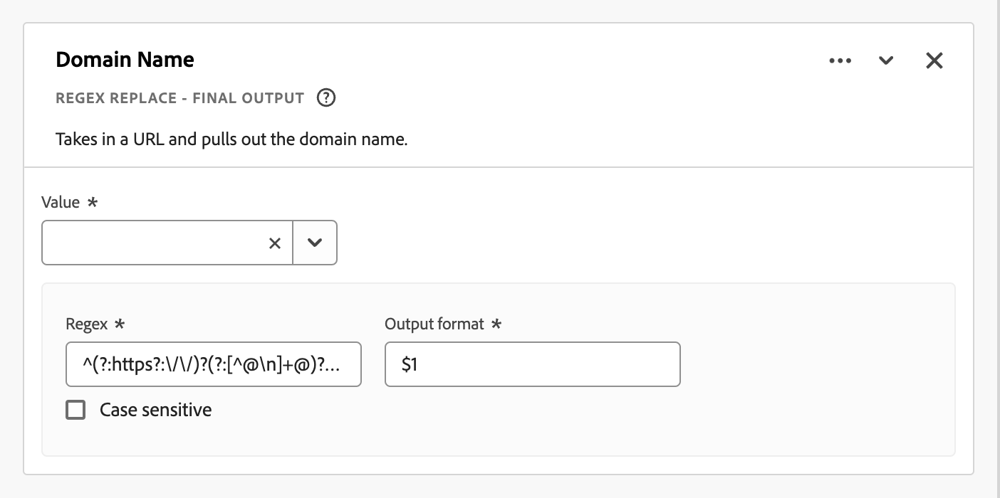
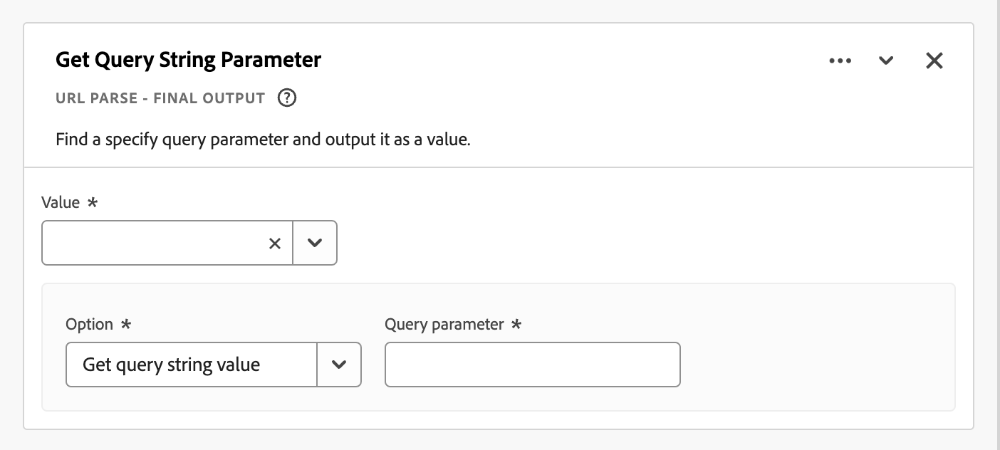
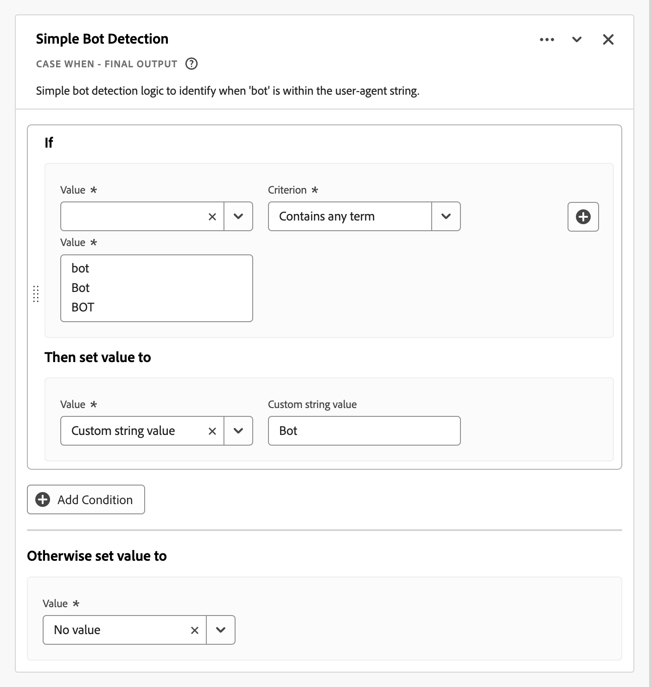

# Campi derivati {#derived-fields}

<!-- markdownlint-disable MD034 -->

>[!CONTEXTUALHELP]
>id="cja_dataview_derivedfields"
>title="Campi derivati"
>abstract="Un campo derivato consente di definire all’istante le manipolazioni dati, tramite un generatore di regole personalizzabile. Puoi quindi utilizzare tale campo derivato come componente (metrica o dimensione) in Workspace o definirlo ulteriormente come componente nella Vista dati."

<!-- markdownlint-enable MD034 -->

I campi derivati sono un aspetto importante della funzionalità di reporting in tempo reale in Adobe Customer Journey Analytics. Un campo derivato consente di definire al volo manipolazioni (spesso complesse) dei dati tramite un generatore di regole personalizzabile. È quindi possibile utilizzare il campo derivato come componente (metrica o dimensione) in [Workspace](../../analysis-workspace/home.md) o definire ulteriormente il campo derivato come componente in [Visualizzazione dati](../data-views.md).

I campi derivati consentono di risparmiare molto tempo e fatica rispetto alla trasformazione o alla manipolazione dei dati in altre posizioni al di fuori del Customer Journey Analytics. Ad esempio [Preparazione dati](https://experienceleague.adobe.com/docs/experience-platform/data-prep/home.html?lang=it), [Distiller dati](https://experienceleague.adobe.com/docs/experience-platform/query/data-distiller/overview.html) o all&#39;interno dei processi ETL (Extract Transform Load)/ELT (Extract Load Transform).

I campi derivati sono definiti all&#39;interno di [Visualizzazioni dati](../data-views.md), sono basati su un set di funzioni definite come regole e applicate ai campi standard e/o schema disponibili.

Esempi di casi di utilizzo:

- Definisci un campo Nome pagina derivato che corregga i valori errati dei nomi di pagina raccolti per correggere i valori dei nomi di pagina.

- Definisci un campo Canale di marketing derivato che determini il canale di marketing appropriato in base a una o più condizioni (ad esempio parametro URL, URL pagina, nome pagina).

## Interfaccia campo derivato {#interface}

Quando si crea o si modifica un campo derivato, viene utilizzata l&#39;interfaccia del campo derivato.

|  | Nome | Descrizione |
|---------|----------|--------|
| 1 | **Selettore** | Utilizza l’area del selettore per selezionare e trascinare la funzione, il modello di funzione, il campo schema o il campo standard nel generatore di regole.  Utilizza l&#39;elenco a discesa per selezionare tra:   [!UICONTROL Functions] - elenchi disponibili [Funzioni](#function-reference),   [!UICONTROL Function templates] - elenchi disponibili [Modelli funzione](#function-templates),   [!UICONTROL Schema fields] - elenchi campi disponibili da categorie di set di dati (evento, profilo, ricerca) e campi derivati definiti in precedenza e   [!UICONTROL Standard fields] - campi disponibili standard (come ID set di dati piattaforma). Nel selettore vengono visualizzati solo i campi standard stringa e numerici. Se la funzione supporta altri tipi di dati, è possibile selezionare campi standard con questi altri tipi di dati per valori o campi all’interno dell’interfaccia della regola. È possibile cercare funzioni, modelli di funzione, schemi e campi standard utilizzando la casella di ricerca .  È possibile filtrare l&#39;elenco di oggetti selezionato selezionando  Filtro e specificando i filtri nella finestra di dialogo [!UICONTROL Filter fields by]. Puoi rimuovere facilmente i filtri utilizzando l&#39; per ogni filtro. |
| 2 | **Generatore di regole** | Puoi creare il campo derivato in sequenza utilizzando una o più regole. Una regola è un’implementazione specifica di una funzione ed è quindi sempre associata a una sola funzione. Per creare una regola, trascina e rilascia una funzione nel generatore di regole. Il tipo di funzione determina l’interfaccia della regola. Per ulteriori informazioni, vedere [Interfaccia regola](#rule-interface).  È possibile inserire una funzione all&#39;inizio, alla fine o tra le regole già disponibili nel generatore di regole. L’ultima regola nel generatore di regole determina l’output finale del campo derivato. |
| 3 | **[!UICONTROL ** Impostazioni campo **]** | È possibile denominare e descrivere il campo derivato e verificarne il tipo. |
| 4 | **[!UICONTROL ** Output finale **]** | Questa area mostra un’anteprima istantaneamente aggiornata dei valori di output, in base ai dati degli ultimi 30 giorni e alle modifiche apportate al campo derivato nel generatore di regole. |

{style="table-layout:auto"}

## Creazione guidata modello di campo {#wizard}

Quando si accede all&#39;interfaccia del campo derivato per la prima volta, viene visualizzata la procedura guidata [!UICONTROL Start with a field template].

1. Seleziona il modello che descrive meglio il tipo di campo che stai tentando di creare.
2. Seleziona il pulsante **[!UICONTROL ** Seleziona **]** per continuare.

La finestra di dialogo del campo derivato viene compilata con regole (e funzioni) necessarie o utili per il tipo di campo selezionato. Per ulteriori informazioni sui modelli disponibili, vedere [Modelli di funzione](#function-templates).

## Interfaccia regola {#rules}

Quando definisci una regola nel generatore di regole, utilizzi l’interfaccia della regola.

|  | Nome | Descrizione |
|---------|----------|--------|
| A | **Nome regola** | Per impostazione predefinita, il nome della regola è **Regola X** (X fa riferimento a un numero di sequenza). Per modificare il nome di una regola, selezionarne il nome e digitare il nuovo nome, ad esempio `Query Parameter`. |
| B | **Nome funzione** | Il nome di funzione selezionato per la regola, ad esempio [!UICONTROL URL PARSE]. Quando la funzione è l&#39;ultima nella sequenza di funzioni e determina i valori di output finali, il nome della funzione è seguito da [!UICONTROL - FINAL OUTPUT], ad esempio [!UICONTROL URL PARSE - FINAL OUTPUT].  Per visualizzare un popup con ulteriori informazioni sulla funzione, selezionare . |
| C | **Descrizione regola** | Facoltativamente, puoi aggiungere una descrizione a una regola. Seleziona , quindi seleziona **[!UICONTROL ** Aggiungi descrizione **]** per aggiungere una descrizione o **[!UICONTROL ** Modifica descrizione **]** per modificare una descrizione esistente. Utilizzare l&#39;editor per immettere una descrizione. È possibile utilizzare la barra degli strumenti per formattare il testo (utilizzando selettore di stile, grassetto, corsivo, sottolineato, destro, sinistro, centrato, colore, elenco numerato, elenco puntato) e aggiungendo collegamenti a informazioni esterne.  Per completare la modifica della descrizione, fare clic all&#39;esterno dell&#39;editor. |
| D | **Area funzioni** | Definisce la logica della funzione. L’interfaccia dipende dal tipo di funzione. Il menu a discesa per [!UICONTROL Field] o [!UICONTROL Value] mostra tutte le categorie di campi (regole, campi standard, campi) disponibili, in base al tipo di input previsto dalla funzione. In alternativa, puoi trascinare e rilasciare un campo dal selettore dei campi Schema e Standard su un Campo o un Valore. Quando il campo trascinato proviene da un set di dati di ricerca, viene inserita automaticamente una funzione di ricerca prima della funzione definita.  Per informazioni dettagliate su ciascuna delle funzioni supportate, vedere [Riferimento funzione](#function-reference). |

{style="table-layout:auto"}

## Creare un campo derivato {#create}

1. Seleziona una visualizzazione dati esistente o creane una. Per ulteriori informazioni, vedi [Visualizzazioni dati](../data-views.md).

2. Selezionare la scheda **[!UICONTROL ** Componenti **]** della visualizzazione dati.

3. Seleziona **[!UICONTROL ** Crea campo derivato **]** dalla barra a sinistra.

4. Per definire il campo derivato, utilizzare l&#39;interfaccia [!UICONTROL Create derived field]. Vedi [Interfaccia campo derivato](#derived-field-interface).

   Per salvare il nuovo campo derivato, selezionare **[!UICONTROL ** Salva **]**.

5. Il nuovo campo derivato viene aggiunto al contenitore [!UICONTROL Derived fields >], come parte dei **[!UICONTROL ** campi schema **]** nella barra a sinistra della visualizzazione dati.

## Modificare un campo derivato {#edit}

1. Seleziona una visualizzazione dati esistente. Per ulteriori informazioni, vedi [Visualizzazioni dati](../data-views.md).

2. Selezionare la scheda **[!UICONTROL ** Componenti **]** della visualizzazione dati.

3. Selezionare la scheda **[!UICONTROL ** Campi schema **]** nel riquadro [!UICONTROL Connection] a sinistra.

4. Seleziona **[!UICONTROL ** Campi derivati >**]** contenitore.

5. Passa il puntatore del mouse sul campo derivato che desideri modificare e seleziona .

6. Per modificare il campo derivato, utilizzare l&#39;interfaccia [!UICONTROL Edit derived field]. Vedi [Interfaccia campo derivato](#derived-field-interface).

   - Seleziona **[!UICONTROL ** Salva **]** per salvare il campo derivato aggiornato.

   - Seleziona **[!UICONTROL ** Annulla **]** per annullare eventuali modifiche apportate al campo derivato.

   - Selezionare **[!UICONTROL ** Salva con nome **]** per salvare il campo derivato come nuovo campo derivato. Il nuovo campo derivato ha lo stesso nome del campo derivato modificato originale con `(copy)` aggiunto.

In alternativa, se hai utilizzato un campo derivato come componente per dimensioni o metriche nella visualizzazione dati:

1. Seleziona il componente. Il componente potrebbe avere un nome diverso dal campo derivato.

1. Nel pannello Componente, seleziona l&#39;icona  accanto al campo derivato, sotto il nome del campo Schema.

1. Per modificare il campo derivato, utilizzare l&#39;interfaccia [!UICONTROL Edit derived field]. Vedi [Interfaccia campo derivato](#derived-field-interface).

   - Seleziona **[!UICONTROL ** Salva **]** per salvare il campo derivato aggiornato.

   - Seleziona **[!UICONTROL ** Annulla **]** per annullare eventuali modifiche apportate al campo derivato.

   - Selezionare **[!UICONTROL ** Salva con nome **]** per salvare il campo derivato come nuovo campo derivato. Il nuovo campo derivato ha lo stesso nome del campo derivato modificato originale con `(copy)` aggiunto.

## Eliminare un campo derivato {#delete}

1. Seleziona una visualizzazione dati esistente. Per ulteriori informazioni, vedi [Visualizzazioni dati](../data-views.md).

2. Selezionare la scheda **[!UICONTROL ** Componenti **]** della visualizzazione dati.

3. Selezionare la scheda **[!UICONTROL ** Campi schema **]** nel riquadro [!UICONTROL Connection].

4. Seleziona **[!UICONTROL ** Campi derivati >**]** contenitore.

5. Passa il puntatore del mouse sul campo derivato che desideri eliminare e seleziona .

6. Nell&#39;interfaccia [!UICONTROL Edit derived field], selezionare **[!UICONTROL Delete]**.

   Una finestra di dialogo [!UICONTROL Delete component] richiede di confermare l&#39;eliminazione. Considera eventuali riferimenti esterni al campo derivato all’esterno della visualizzazione dati.

   - Seleziona **[!UICONTROL ** Continua **]** per eliminare il campo derivato.

In alternativa, se hai utilizzato un campo derivato come componente per dimensioni o metriche nella visualizzazione dati:

1. Seleziona il componente. Il componente potrebbe avere un nome diverso dal campo derivato.

1. Nel pannello Componente, seleziona l&#39;icona  accanto al campo derivato, sotto il nome del campo Schema.

1. Nell&#39;interfaccia [!UICONTROL Edit derived field], selezionare **[!UICONTROL Delete]**.

   Una finestra di dialogo [!UICONTROL Delete component] richiede di confermare l&#39;eliminazione. Considera eventuali riferimenti esterni al campo derivato all’esterno della visualizzazione dati.

   - Seleziona **[!UICONTROL ** Continua **]** per eliminare il campo derivato.

>[!NOTE]
>
>I campi derivati vengono gestiti a livello di connessione nel Customer Journey Analytics. Qualsiasi modifica apportata a un campo derivato in una delle visualizzazioni dati associate a tale connessione viene applicata a tutte le visualizzazioni dati associate.

## Modelli di funzione {#templates}

Per creare rapidamente un campo derivato per casi d’uso specifici, sono disponibili modelli di funzioni. È possibile accedere a questi modelli di funzione dall&#39;area del selettore nell&#39;interfaccia dei campi derivati o al primo utilizzo nella procedura guidata [!UICONTROL Start with a field template].

### Canali di marketing {#mchannel}

Questo modello di funzione utilizza una raccolta di regole per generare canali di marketing.

+++ Dettagli

Per utilizzare il modello, è necessario specificare i parametri corretti per ogni funzione elencata come parte delle regole del modello. Per ulteriori informazioni, vedere [Riferimento funzione](#function-reference).

+++

### Messaggi non recapitati {#bounces}

Questo modello di funzione utilizza una raccolta di regole per identificare i mancati recapiti del sito.

+++ Dettagli

Per utilizzare il modello, è necessario specificare i parametri corretti per ogni funzione elencata come parte delle regole del modello. Per ulteriori informazioni, vedere [Riferimento funzione](#function-reference).

+++

### Combinazione di più Dimension {#multi-dim}

Questo modello di funzione combina due valori in uno.

+++ Dettagli

Per utilizzare il modello, è necessario specificare i parametri corretti per ogni funzione elencata come parte delle regole del modello. Per ulteriori informazioni, vedere [Riferimento funzione](#function-reference).

+++

### Nome set di dati intuitivo {#friendlyname}

Questo modello di funzione fornisce un nome di set di dati leggibile.

+++ Dettagli

Per utilizzare il modello, è necessario specificare i parametri corretti per ogni funzione elencata come parte delle regole del modello. Per ulteriori informazioni, vedere [Riferimento funzione](#function-reference).

+++

### Nome pagina da URL {#pagename}

Questo modello di funzione crea un nome di pagina semplice.

+++ Dettagli

Per utilizzare il modello, è necessario specificare i parametri corretti per ogni funzione elencata come parte delle regole del modello. Per ulteriori informazioni, vedere [Riferimento funzione](#function-reference).

+++

### Stagione festiva {#holiday}

Questo modello di funzione classifica i momenti chiave dell’anno.

+++ Dettagli

Per utilizzare il modello, è necessario specificare i parametri corretti per ogni funzione elencata come parte delle regole del modello. Per ulteriori informazioni, vedere [Riferimento funzione](#function-reference).

+++

### Obiettivi mensili {#goals}

Questo modello di funzione imposta gli obiettivi mensili personalizzati.

+++ Dettagli

Per utilizzare il modello, è necessario specificare i parametri corretti per ogni funzione elencata come parte delle regole del modello. Per ulteriori informazioni, vedere [Riferimento funzione](#function-reference).

+++

### Ottieni tutti i valori in elenco delimitato {#allvalues}

Questo modello di funzione converte un elenco limitato in un array.

+++ Dettagli

Per utilizzare il modello, è necessario specificare i parametri corretti per ogni funzione elencata come parte delle regole del modello. Per ulteriori informazioni, vedere [Riferimento funzione](#function-reference).

+++

### Ottieni primo valore in elenco delimitato {#firstvalue}

Questo modello di funzione ottiene il primo valore in un elenco delimitato.

+++ Dettagli

Per utilizzare il modello, è necessario specificare i parametri corretti per ogni funzione elencata come parte delle regole del modello. Per ulteriori informazioni, vedere [Riferimento funzione](#function-reference).

+++

### Ottieni ultimo valore in elenco delimitato {#lastvalue}

Questo modello di funzione ottiene l’ultimo valore in un elenco delimitato.

+++ Dettagli

Per utilizzare il modello, è necessario specificare i parametri corretti per ogni funzione elencata come parte delle regole del modello. Per ulteriori informazioni, vedere [Riferimento funzione](#function-reference).

+++

### Nome di dominio {#domain}

Questo modello di funzione estrae il nome di dominio utilizzando un’espressione regolare.

+++ Dettagli

Per utilizzare il modello, è necessario specificare i parametri corretti per ogni funzione elencata come parte delle regole del modello. Per ulteriori informazioni, vedere [Riferimento funzione](#function-reference).

+++

### Ottieni parametro stringa di query {#querystring}

Questo modello di funzione estrae i valori della stringa di query.

+++ Dettagli

Per utilizzare il modello, è necessario specificare i parametri corretti per ogni funzione elencata come parte delle regole del modello. Per ulteriori informazioni, vedere [Riferimento funzione](#function-reference).

+++

### Campo di transizione {#transition}

Questo modello di funzione cambia il reporting da un campo all’altro.

+++ Dettagli

Per utilizzare il modello, è necessario specificare i parametri corretti per ogni funzione elencata come parte delle regole del modello. Per ulteriori informazioni, vedere [Riferimento funzione](#function-reference).

+++

### Rilevamento bot semplice {#botdetection}

Questo modello di funzione implementa l’identificazione light bot.

+++ Dettagli

Per utilizzare il modello, è necessario specificare i parametri corretti per ogni funzione elencata come parte delle regole del modello. Per ulteriori informazioni, vedere [Riferimento funzione](#function-reference).

+++

### Collegamento di uscita. {#exit}

Questo modello di funzione identifica l’ultimo collegamento su cui è stato fatto clic in una sessione.

+++ Dettagli

Per utilizzare il modello, è necessario specificare i parametri corretti per ogni funzione elencata come parte delle regole del modello. Per ulteriori informazioni, vedere [Riferimento funzione](#function-reference).

+++

### Collegamento di download. {#download}

Questo modello di funzione contrassegna i collegamenti di download comuni.

+++ Dettagli

Per utilizzare il modello, è necessario specificare i parametri corretti per ogni funzione elencata come parte delle regole del modello. Per ulteriori informazioni, vedere [Riferimento funzione](#function-reference).

+++

<!--

+++ Data clean up template

>[!WARNING]
>
>Could not find any information on this template.
+++

-->

## Riferimento funzione {#functionref}

{{select-package}}

Per ciascuna funzione supportata, di seguito trovi i dettagli su:

- specifiche:
   - tipo di dati di input: tipo di dati supportati,
   - input: possibili valori di input,
   - operatori inclusi: operatori supportati per questa funzione (se del caso),
   - limitazioni: limitazioni applicabili a questa funzione specifica,
   - output.

- casi d’uso, tra cui:
   - dati prima di definire il campo derivato,
   - come definire il campo derivato,
   - dopo aver definito il campo derivato.

- vincoli (se applicabili).

<!-- CASE WHEN -->

### Case When {#casewhen}

<!-- markdownlint-disable MD034 -->

>[!CONTEXTUALHELP]
>id="cja_dataview_derivedfields_casewhen"
>title="Case When"
>abstract="Questa funzione consente di applicare condizionali basati su criteri definiti da uno o più campi. Tali criteri vengono quindi utilizzati per definire i valori nel nuovo campo derivato, in base alla sequenza delle condizioni."

<!-- markdownlint-enable MD034 -->

Applica i condizionali, in base a criteri definiti da uno o più campi. Questi criteri vengono quindi utilizzati per definire i valori in un nuovo campo derivato, in base alla sequenza delle condizioni.

+++ Dettagli

## Specifiche {#casewhen-io}

| Tipo di dati di input | Input | Operatori inclusi | Limitazioni | Output |
|---|---|---|---|---|
| <ul><li>Stringa</li><li>Numeriche</li><li>Data</li></ul> | <ul><li>[!UICONTROL If], contenitore [!UICONTROL Else If]:
<ul><li>[!UICONTROL Value]</li><ul><li>Regole</li><li>Campi standard</li><li>Campi</li></ul><li>[!UICONTROL Criterion] (vedere operatori inclusi, in base al tipo di valore selezionato)</li></ul></li><li>[!UICONTROL Then set value to], [!UICONTROL Otherwise set value to]:
<ul><li>[!UICONTROL Value]</li><ul><li>Regole</li><li>Campi standard</li><li>Campi</li></ul></ul></li></ul> | 
Stringhe
<ul><li>È uguale a</li><li>È uguale a qualsiasi termine</li><li>Contiene la frase</li><li>Contiene qualsiasi termine</li><li>Contiene tutti i termini</li><li>Inizia con</li><li>Inizia con qualsiasi termine</li><li>Termina con</li><li>Termina con qualsiasi termine</li><li>È diverso da</li><li>Non è uguale a nessun termine</li><li>Non contiene la frase</li><li>Non contiene alcun termine</li><li>Non contiene tutti i termini</li><li>Non inizia con</li><li>Non inizia con alcun termine</li><li>Non termina con</li><li>Non termina con alcun termine</li><li>È impostato</li><li>Non è impostato</li></ul>
Numeriche
<ul><li>È uguale a</li><li>È diverso da</li><li>È maggiore di</li><li>È maggiore o uguale a</li><li>È minore di</li><li>È minore o uguale a</li><li>È impostato</li><li>Non è impostato</li></ul>
Date
<ul><li>È uguale a</li><li>È diverso da</li><li>È successivo a</li><li>È successivo o uguale a</li><li>È prima di</li><li>È precedente o uguale a</li><li>È impostato</li><li>Non è impostato</li></ul> | <ul><li>5 funzioni per campo derivato</li><li>200 [operatori](#operators) per campo derivato. Un esempio di un singolo operatore è &quot;Il dominio di riferimento contiene google&quot;. </li></ul> | 
Nuovo campo derivato
 |

{style="table-layout:auto"}

## Caso d’uso 1 {#casewhen-uc1}

Puoi definire regole per identificare vari canali di marketing, applicando una logica a cascata per impostare un campo canale di marketing sul valore corretto:

- Se il referente proviene da un motore di ricerca e la pagina ha un valore stringa di query in cui `cid` contiene `ps_`, il canale di marketing deve essere identificato come [!DNL *Ricerca a pagamento*].
- Se il referente proviene da un motore di ricerca e la pagina non ha la stringa di query `cid`, il canale di marketing deve essere identificato come [!DNL *Ricerca naturale*].
- Se una pagina include un valore stringa di query in cui `cid` contiene `em_`, il canale di marketing deve essere identificato come [!DNL *E-mail*].
- Se una pagina include un valore stringa query in cui `cid` contiene `ds_`, il canale di marketing deve essere identificato come [!DNL *Annuncio visualizzato*].
- Se una pagina contiene un valore stringa di query in cui `cid` contiene `so_`, il canale di marketing deve essere identificato come [!DNL *Social a pagamento*].
- Se il referente proviene da un dominio di riferimento di [!DNL twitter.com], [!DNL facebook.com], [!DNL linkedin.com] o [!DNL tiktok.com], il canale di marketing deve essere identificato come [!DNL *Social naturale*].
- Se nessuna delle regole di cui sopra corrisponde, il canale di marketing deve essere identificato come [!DNL *Altro referrer*].

Se il sito riceve i seguenti eventi di esempio, contenenti [!UICONTROL Referrer] e [!UICONTROL Page URL], questi eventi devono essere identificati come segue:

| [!DNL Event] | [!DNL Referrer] | [!DNL Page URL] | [!DNL Marketing Channel] |
|:--:|----|----|----|
| 1 | `https://facebook.com` | `https://site.com/home` | [!DNL Natural Social] |
| 2 | `https://abc.com` | `https://site.com/?cid=ds_12345678` | [!DNL Display] |
| 3 | | `https://site.com/?cid=em_12345678` | [!DNL Email] |
| 4 | `https://google.com` | `https://site.com/?cid=ps_abc098765` | [!DNL Paid Search] |
| 5 | `https://google.com` | `https://site.com/?cid=em_765544332` | [!DNL Email] |
| 6 | `https://google.com` |  | [!DNL Natural Search] |

{style="table-layout:auto"}

### Dati prima di {#casewhen-uc1-databefore}

| [!DNL Referrer] | [!DNL Page URL] |
|----|----|
| `https://facebook.com` | `https://site.com/home` |
| `https://abc.com` | `https://site.com/?cid=ds_12345678` |
|  | `https://site.com/?cid=em_12345678` |
| `https://google.com` | `https://site.com/?cid=ps_abc098765` |
| `https://google.com` | `https://site.com/?cid=em_765544332` |
| `https://google.com` | |

{style="table-layout:auto"}

### Campo derivato {#casewhen-uc1-derivedfield}

Definisci un campo derivato `Marketing Channel`. Utilizzare le funzioni [!UICONTROL CASE WHEN] per definire regole che creano valori per il campo in base ai valori esistenti per il campo `Page URL` e `Referring URL`.

Si noti l&#39;utilizzo della funzione [!UICONTROL URL PARSE] per definire regole per recuperare i valori per `Page Url` e `Referring Url` prima dell&#39;applicazione delle regole [!UICONTROL CASE WHEN].

### Dati dopo {#casewhen-uc1-dataafter}

| [!DNL Marketing Channel] |
|----|
| [!DNL Natural Social] |
| [!DNL Display] |
| [!DNL Email] |
| [!DNL Paid Search] |
| [!DNL Email] |
| [!DNL Natural Search] |

{style="table-layout:auto"}

## Caso d’uso 2 {#casewhen-uc2}

Sono state raccolte diverse varianti di ricerca nella dimensione [!DNL Product Finding Methods]. Per comprendere le prestazioni complessive della ricerca rispetto alla navigazione, è necessario dedicare molto tempo alla combinazione manuale dei risultati.

Il sito raccoglie i seguenti valori per la dimensione [!DNL Product Finding Methods]. Alla fine, tutti questi valori indicano una ricerca.

| Valore raccolto | Valore effettivo |
|---|---|
| [!DNL search p13n_no] | [!DNL search] |
| [!DNL search p13n_yes] | [!DNL search] |
| [!DNL search refine p13n_no] | [!DNL search] |
| [!DNL search refine p13n_yes] | [!DNL search] |
| [!DNL search redirect p13n_yes] | [!DNL search] |
| [!DNL search-redirect] | [!DNL search] |

{style="table-layout:auto"}

### Dati prima di {#casewhen-uc2-databefore}

| [!DNL Product Finding Methods] |
|----|
| [!DNL search p13_no] |
| [!DNL search p13_yes] |
| [!DNL browse] |
| [!DNL search refine p13_no] |
| [!DNL search refine p13_yes] |
| [!DNL browse] |
| [!DNL search redirect p13_yes] |
| [!DNL search-redirect] |
| [!DNL browse] |

{style="table-layout:auto"}

### Campo derivato {#casewhen-uc2-derivedfield}

Definisci un campo derivato `Product Finding Methods (new)`. Creare le [!UICONTROL CASE WHEN] regole seguenti nel generatore di regole. Queste regole applicano la logica a tutte le possibili varianti dei vecchi valori di campo [!UICONTROL Product Finding Methods] per `search` e `browse` utilizzando il criterio [!UICONTROL Contains the phrase].

### Dati dopo {#casewhen-uc2-dataafter}

| [!DNL Product Finding Methods (new)] |
|----|
| [!DNL search] |
| [!DNL search] |
| [!DNL browse] |
| [!DNL search] |
| [!DNL search] |
| [!DNL browse] |
| [!DNL search] |
| [!DNL search] |
| [!DNL browse] |

{style="table-layout:auto"}

## Caso d’uso 3 {#casewhen-uc3}

In qualità di società di viaggi, vorresti poter definire la durata del viaggio in periodi fissi per i viaggi prenotati in modo da poter generare rapporti sulle lunghezze dei viaggi in periodi fissi.

Ipotesi:

- L’organizzazione raccoglie la durata del viaggio in un campo numerico.
- Desiderano inserire le durate di 1-3 giorni in un bucket denominato &#39;[!DNL short trip]&#39;
- Desiderano inserire le durate di 4-7 giorni in un bucket denominato &#39;[!DNL medium trip]&#39;
- Desiderano inserire durate di oltre 8 giorni in un bucket denominato &#39;[!DNL long trip]&#39;
- 132 viaggi sono stati prenotati per una durata di 1 giorno
- 110 viaggi sono stati prenotati per una durata di 2 giorni
- Sono stati prenotati 105 viaggi per una durata di 3 giorni
- 99 viaggi sono stati prenotati per una durata di 4 giorni
- 92 viaggi sono stati prenotati per una durata di 5 giorni
- 85 viaggi sono stati prenotati per una durata di 6 giorni
- 82 viaggi sono stati prenotati per una durata di 7 giorni
- 78 viaggi sono stati prenotati per una durata di 8 giorni
- 50 viaggi sono stati prenotati per una durata di 9 giorni
- 44 viaggi sono stati prenotati per una durata di 10 giorni
- Sono stati prenotati 38 viaggi per una durata di 11 giorni
- Sono stati prenotati 31 viaggi per una durata di 12 giorni

Il rapporto desiderato dovrebbe essere simile al seguente:

| [!DNL Trip Duration Type] | [!DNL Bookings] |
|----|---:|
| [!DNL medium trip] | 358 |
| [!DNL short trip] | 347 |
| [!DNL long trip] | 241 |

{style="table-layout:auto"}

### Dati prima di {#casewhen-uc3-databefore}

| [!DNL Trip Duration] |
|---:|
| 1 |
| 12 |
| 3 |
| 6 |
| 4 |
| 8 |
| 6 |
| 2 |
| 1 |
| 2 |
| 21 |
| 8 |

### Campo derivato {#casewhen-uc3-derivedfield}

Definisci un campo derivato `Trip Duration (bucketed)`. Crea la seguente regola [!UICONTROL CASE WHEN] nel generatore di regole. Questa regola applica la logica al bucket dei vecchi valori di campo [!UICONTROL Trip Duration] in tre valori: `short trip`, `medium  trip` e `long trip`.

### Dati dopo {#casewhen-uc3-dataafter}

| [!DNL Trip Duration (bucketed)] |
|---|
| [!DNL short trip] |
| [!DNL long trip] |
| [!DNL short trip] |
| [!DNL medium trip] |
| [!DNL medium trip] |
| [!DNL long trip] |
| [!DNL medium trip] |
| [!DNL short trip] |
| [!DNL short trip] |
| [!DNL short trip] |
| [!DNL long trip] |
| [!DNL long trip] |

## Ulteriori informazioni {#casewhen-more-info}

Il Customer Journey Analytics utilizza una struttura di contenitori nidificati, modellata su [XDM](https://experienceleague.adobe.com/docs/experience-platform/xdm/home.html?lang=it) (Experience Data Model) di Adobe Experience Platform. Consulta [Contenitori](../create-dataview.md#containers) e [Contenitori filtro](../../components/filters/filters-overview.md#filter-containers) per ulteriori informazioni di background. Questo modello di contenitore, anche se per sua natura flessibile, impone alcuni vincoli quando si utilizza il generatore di regole.

Il Customer Journey Analytics utilizza il seguente modello di contenitore predefinito:

I seguenti vincoli si applicano e vengono applicati quando *si selezionano* e *si impostano* valori.

|  | Vincoli |
|:---:|----|
| **A** | I valori *select* all&#39;interno dello stesso costrutto [!UICONTROL If], [!UICONTROL Else If] (utilizzando [!UICONTROL And] o [!UICONTROL Or]) in una regola devono provenire dallo stesso contenitore e possono essere di qualsiasi tipo (stringa , numerico  e così via).   |
| **B** | Tutti i valori *impostati* in una regola devono appartenere allo stesso contenitore e avere lo stesso tipo o un valore derivato dello stesso tipo.    |
| **C** | I valori *select* in [!UICONTROL If], [!UICONTROL Else If] costrutti nella regola *not* devono provenire dallo stesso contenitore e *not* devono essere dello stesso tipo.    |

{style="table-layout:auto"}

+++

<!-- CLASSIFY -->

### Classifica {#classify}

<!-- markdownlint-disable MD034 -->

>[!CONTEXTUALHELP]
>id="cja_dataview_derivedfields_classify"
>title="Classifica"
>abstract="Questa funzione consente di definire un insieme di valori che vengono sostituiti dai valori corrispondenti tramite l’immissione di testo."

<!-- markdownlint-enable MD034 -->

Definisce un insieme di valori che vengono sostituiti dai valori corrispondenti in un nuovo campo derivato.

+++ Dettagli

## Specifiche {#classify-io}

| Tipo di dati di input | Input | Operatori inclusi | Limitazioni | Output |
|---|---|---|---|---|
| <ul><li>Stringa</li><li>Numeriche</li><li>Data</li></ul> | <ul><li>[!UICONTROL Field to classify]:<ul><li>Regole</li><li>Campi standard</li><li>Campi</li></ul></li><li>[!UICONTROL When value equals] e [!UICONTROL Replace values with]:
<ul><li>Stringa</li></ul><li>Mostra valori originali<ul><li>Booleano</li></ul></li></ul> | 
N/D
 | <ul><li>5 funzioni per campo derivato</li><li>200 [operatori](#operators) per campo derivato. Ogni voce per [!UICONTROL When value equals original value] [!UICONTROL Replace value with New value] è considerata un&#39;operazione.</li></ul> | 
Nuovo campo derivato
 |

{style="table-layout:auto"}

## Caso d’uso 1 {#classify-uc1}

Si dispone di un file CSV che include una colonna chiave per `hotelID` e una o più colonne aggiuntive associate a `hotelID`: `city`, `rooms`, `hotel name`.
Stai raccogliendo [!DNL Hotel ID] in una dimensione ma desideri creare una dimensione [!DNL Hotel Name] derivata da `hotelID` nel file CSV.

**Struttura e contenuto dei file CSV**

| [!DNL hotelID] | [!DNL city] | [!DNL rooms] | [!DNL hotel name] |
|---|---|---:|---|
| [!DNL SLC123] | [!DNL Salt Lake City] | 40 | [!DNL SLC Downtown] |
| [!DNL LAX342] | [!DNL Los Angeles] | 60 | [!DNL LA Airport] |
| [!DNL SFO456] | [!DNL San Francisco] | 75 | [!DNL Market Street] |
| [!DNL AMS789] | [!DNL Amsterdam] | 50 | [!DNL Okura] |

{style="table-layout:auto"}

**Rapporto corrente**

| [!DNL Hotel ID] | Visualizzazioni prodotto |
|---|---:|
| [!DNL SLC123] | 200 |
| [!DNL LX342] | 198 |
| [!DNL SFO456] | 190 |
| [!DNL AMS789] | 150 |

{style="table-layout:auto"}

**Report desiderato**

| [!DNL Hotel Name] | Visualizzazioni prodotto |
|----|----:|
| [!DNL SLC Downtown] | 200 |
| [!DNL LA Airport] | 198 |
| [!DNL Market Street] | 190 |

{style="table-layout:auto"}

### Dati prima di {#classify-uc1-databefore}

| [!DNL Hotel ID] |
|----|
| [!DNL SLC123] |
| [!DNL LAX342] |
| [!DNL SFO456] |
| [!DNL AMS789] |

{style="table-layout:auto"}

### Campo derivato {#classify-uc1-derivedfield}

Definisci un campo derivato `Hotel Name`. Utilizzare la funzione [!UICONTROL CLASSIFY] per definire una regola in cui è possibile classificare i valori del campo [!UICONTROL Hotel ID] e sostituirli con nuovi valori.

Se si desidera includere valori originali non definiti come parte dei valori da classificare (ad esempio, ID hotel AMS789), assicurarsi di selezionare **[!UICONTROL Show original values]**. Ciò garantisce che AMS789 faccia parte dell’output per il campo derivato, nonostante tale valore non sia stato classificato.

### Dati dopo {#classify-uc1-dataafter}

| [!DNL Hotel Name] |
|----|
| [!DNL SLC Downtown] |
| [!DNL LA Airport] |
| [!DNL Market Street] |

{style="table-layout:auto"}

## Caso d’uso 2 {#classify-uc2}

Hai raccolto gli URL invece del nome descrittivo di diverse pagine. Questa raccolta mista di valori interrompe il reporting.

### Dati prima di {#classify-uc2-databefore}

| [!DNL Page Name] |
|---|
| [!DNL Home Page] |
| [!DNL Flight Search] |
| `http://www.adobetravel.ca/Hotel-Search` |
| `https://www.adobetravel.com/Package-Search` |
| [!DNL Deals & Offers] |
| `http://www.adobetravel.ca/user/reviews` |
| `https://www.adobetravel.com.br/Generate-Quote/preview` |

{style="table-layout:auto"}

### Campo derivato {#classify-uc2-derivedfield}

Definisci un campo derivato `Page Name (updated)`. Utilizzare la funzione [!UICONTROL CLASSIFY] per definire una regola in cui è possibile classificare i valori del campo [!UICONTROL Page Name] esistente e sostituirli con valori corretti aggiornati.

### Dati dopo {#classify-uc2-dataafter}

| [!DNL Page Name (updated)] |
|---|
| [!DNL Home Page] |
| [!DNL Flight Search] |
| [!DNL Hotel Search] |
| [!DNL Package Search] |
| [!DNL Deals & Offers] |
| [!DNL Reviews] |
| [!DNL Generate Quote] |

## Ulteriori informazioni {#classify-moreinfo}

Nell’interfaccia Classifica regola sono disponibili le seguenti funzionalità aggiuntive:

- Per cancellare rapidamente tutti i valori della tabella, selezionare  **[!UICONTROL Clear all table values]**.
- Per caricare un file CSV contenente i valori originali di Quando i valori sono uguali e i nuovi valori di Sostituisci i valori con, seleziona  **[!UICONTROL Upload CSV]**.
- Per scaricare un modello per creare un file CSV con valori originali e nuovi da caricare, seleziona  **[!UICONTROL Download CSV template]**.
- Per scaricare un file CSV con tutti i valori originali e nuovi popolati nell&#39;interfaccia della regola, seleziona  **[!UICONTROL Download CSV values]**.

+++

<!-- CONCATENATE -->

### Concatena {#concatenate}

<!-- markdownlint-disable MD034 -->

>[!CONTEXTUALHELP]
>id="cja_dataview_derivedfields_concatenate"
>title="Concatena"
>abstract="Questa funzione consente di combinare due o più campi, campi derivati o valori stringa immessi dall’utente, in un singolo campo con delimitatori definiti."

<!-- markdownlint-enable MD034 -->

Combina i valori dei campi in un unico nuovo campo derivato con delimitatori definiti.

+++ Dettagli

## Specifiche {#concatenate-io}

| Tipo di dati di input | Input | Operatori inclusi | Limitazioni | Output |
|---|---|---|---|---|
| <ul><li>Stringa</li></ul> | <ul><li>[!UICONTROL Value]:<ul><li>Regole</li><li>Campi standard</li><li>Campi</li><li>Stringa</li></ul></li><li>[!UICONTROL Delimiter]:<ul><li>Stringa</li></ul></li> </ul> | 
N/D
 | 
2 funzioni per campo derivato
 | 
Nuovo campo derivato
 |

{style="table-layout:auto"}

## Caso d’uso {#concatenate-uc}

Attualmente raccogli i codici dell’aeroporto di origine e di destinazione come campi separati. Vorresti prendere i due campi e combinarli in una singola dimensione separata da un trattino (-). Puoi quindi analizzare la combinazione di origine e destinazione per identificare i migliori percorsi prenotati.

Ipotesi:

- I valori di origine e destinazione vengono raccolti in campi separati nella stessa tabella.
- L’utente determina di utilizzare il delimitatore &quot;-&quot; tra i valori.

Immagina che si verifichino le seguenti prenotazioni:

- Il cliente ABC123 registra un volo tra Salt Lake City (SLC) e Orlando (MCO)
- Il cliente ABC456 prenota un volo tra Salt Lake City (SLC) e Los Angeles (LAX)
- Il cliente ABC789 prenota un volo tra Salt Lake City (SLC) e Seattle (SEA)
- Il cliente ABC987 prenota un volo tra Salt Lake City (SLC) e San Jose (SJO)
- Il cliente ABC654 registra un volo tra Salt Lake City (SLC) e Orlando (MCO)

Il rapporto desiderato dovrebbe essere simile al seguente:

| Origine / Destinazione | Prenotazioni |
|----|---:|
| SLC-MCO | 2 |
| SLC-LAX | 1 |
| SLC-SEA | 1 |
| SLC-SJO | 1 |

{style="table-layout:auto"}

### Dati prima di {#concatenate-uc-databefore}

| Origine | Destinazione |
|----|---:|
| SLC | MCO |
| SLC | LAX |
| SLC | MARE |
| SLC | SJO |
| SLC | MCO |

{style="table-layout:auto"}

### Campo derivato {#concatenate-derivedfield}

Definisci un campo derivato `Origin - Destination`. Utilizzare la funzione [!UICONTROL CONCATENATE] per definire una regola per concatenare i campi [!UICONTROL Original] e [!UICONTROL Destination] utilizzando `-` [!UICONTROL Delimiter].

### Dati dopo {#concatenate-dataafter}

| Origine - Destinazione (campo derivato) |
|---|
| SLC-MCO |
| SLC-LAX |
| SLC-SEA |
| SLC-SJO |
| SLC-MCO |

{style="table-layout:auto"}

+++

### Deduplica {#dedup}

<!-- markdownlint-disable MD034 -->

>[!CONTEXTUALHELP]
>id="cja_dataview_derivedfields_deduplicate"
>title="Deduplica"
>abstract="Questa funzione consente di configurare un campo in modo da contare solo i valori che non si ripetono a livello di sessione o di persona. Inoltre, è possibile utilizzare un ID di deduplica per garantire che, in base a un determinato ID (ad esempio un ID acquisto), venga utilizzato un solo valore (o la prima o l’ultima istanza)."

<!-- markdownlint-enable MD034 -->

Impedisce di contare un valore più volte.

+++ Dettagli

## Specifiche {#deduplicate-io}

| Tipo di dati di input | Input | Operatori inclusi | Limitazioni | Output |
|---|---|---|---|---|
| <ul><li>Stringa</li><li>Numeriche</li></ul> | <ul><li>[!UICONTROL Value]:<ul><li>Regole</li><li>Campi standard</li><li>Campi</li><li>Stringa</li></ul></li><li>[!UICONTROL Scope]:<ul><li>Persona</li><li>Sessione</li></ul></li><li>[!UICONTROL Deduplication ID]:<ul><li>Regole</li><li>Campi standard</li><li>Campi</li><li>Stringa</li></ul><li>[!UICONTROL Value to keep]:<ul><li>Mantieni prima istanza</li><li>Mantieni ultima istanza</li></ul></li></ul> | 
N/D
 | 
5 funzioni per campo derivato
 | 
Nuovo campo derivato
 |

{style="table-layout:auto"}

## Caso d’uso 1 {#deduplicate-uc1}

Desideri evitare di conteggiare i ricavi duplicati quando un utente ricarica la pagina di conferma della prenotazione. Utilizza l’ID di conferma della prenotazione all’identificatore per non contare nuovamente i ricavi, quando vengono ricevuti sullo stesso evento.

### Dati prima di {#deduplicate-uc1-databefore}

| ID conferma prenotazione | Ricavi |
|----|---:|
| ABC123456789 | 359 |
| ABC123456789 | 359 |
| ABC123456789 | 359 |

{style="table-layout:auto"}

### Campo derivato {#deduplicate-uc1-derivedfield}

Definisci un campo derivato `Booking Confirmation`. Utilizzare la funzione [!UICONTROL DEDUPLICATE] per definire una regola per deduplicare [!UICONTROL Value] [!DNL Booking] per [!UICONTROL Scope] [!DNL Person] utilizzando [!UICONTROL Deduplication ID] [!UICONTROL Booking Confirmation ID]. Si seleziona [!UICONTROL Keep first instance] come [!UICONTROL Value to keep].

### Dati dopo {#deduplicate-uc1-dataafter}

| ID conferma prenotazione | Ricavi |
|----|---:|
| ABC123456789 | 359 |
| ABC123456789 | 0 |
| ABC123456789 | 0 |

{style="table-layout:auto"}

## Caso d’uso 2 {#deduplicate-uc2}

Utilizzi gli eventi come proxy per i click-through di campagne con campagne di marketing esterne. Ricaricamenti e reindirizzamenti causano un aumento dell’incremento della metrica dell’evento. Desideri deduplicare la dimensione del codice di tracciamento in modo da raccogliere solo il primo e ridurre al minimo il conteggio eccessivo degli eventi.

### Dati prima di {#deduplicate-uc2-databefore}

| Visitor ID | Canale di marketing | Eventi |
|----|---|---:|
| ABC123 | ricerca a pagamento | 1 |
| ABC123 | ricerca a pagamento | 1 |
| ABC123 | ricerca a pagamento | 1 |
| DEF123 | e-mail | 1 |
| DEF123 | e-mail | 1 |
| JKL123 | ricerca naturale | 1 |
| JKL123 | ricerca naturale | 1 |

{style="table-layout:auto"}

### Campo derivato {#deduplicate-uc2-derivedfield}

Si definisce un nuovo campo derivato `Tracking Code (deduplicated)`. Utilizzare la funzione [!UICONTROL DEDUPLICATE] per definire una regola per deduplicare [!UICONTROL Tracking Code] con [!UICONTROL Deduplication scope] di [!UICONTROL Session] e [!UICONTROL Keep first instance] come [!UICONTROL Value to keep].

### Dati dopo {#deduplicate-uc2-dataafter}

| Visitor ID | Canale di marketing | Eventi |
|----|---|---:|
| ABC123 | ricerca a pagamento | 1 |
| DEF123 | e-mail | 1 |
| JKL123 | ricerca naturale | 1 |

{style="table-layout:auto"}

+++

<!-- FIND AND REPLACE -->

### Trova e sostituisci {#find-and-replace}

<!-- markdownlint-disable MD034 -->

>[!CONTEXTUALHELP]
>id="cja_dataview_derivedfields_findandreplace"
>title="Trova e sostituisci"
>abstract="Questa funzione consente di trovare tutti i valori in un campo selezionato e sostituirli con un valore diverso in un nuovo campo derivato."

<!-- markdownlint-enable MD034 -->

Trova tutti i valori in un campo selezionato e li sostituisce con un valore diverso in un nuovo campo derivato.

+++ Dettagli

## Specifiche {#findreplace-io}

| Tipo di dati di input | Input | Operatori inclusi | Limitazioni | Output |
|---|---|---|---|---|
| <ul><li>Stringa</li></ul> | <ul><li>[!UICONTROL Value]<ul><li>Regole</li><li>Campi standard</li><li>Campi</li></ul></li><li>[!UICONTROL Find all], [!UICONTROL and replace all with]:<ul><li>Stringa</li></ul></li></ul></ul> | 
Stringhe
<ul><li>[!UICONTROL Find all], [!UICONTROL and replace all with]</li></ul> | 
5 funzioni per campo derivato
 | 
Nuovo campo derivato
 |

{style="table-layout:auto"}

## Caso d’uso {#findreplace-uc}

Sono stati ricevuti alcuni valori non validi per il report dei canali di marketing esterno, ad esempio `email%20 marketing` anziché `email marketing`. Questi valori in formato non corretto interrompono la generazione dei rapporti e rendono più difficile vedere le prestazioni dell’e-mail. Sostituire `email%20marketing` con `email marketing`.

**Rapporto originale**

| [!DNL External Marketing Channels] | [!DNL Sessions] |
|---|--:|
| [!DNL email marketing] | 500 |
| [!DNL email %20marketing] | 24 |

{style="table-layout:auto"}

**Report preferito**

| [!DNL External Marketing Channels] | [!DNL Sessions] |
|---|--:|
| [!DNL email marketing] | 524 |

### Dati prima di {#findreplace-uc-databefore}

| [!DNL External Marketing] |
|----|
| [!DNL email marketing] |
| [!DNL email%20marketing] |
| [!DNL email marketing] |
| [!DNL email marketing] |
| [!DNL email%20marketing] |

{style="table-layout:auto"}

### Campo derivato {#findreplace-uc-derivedfield}

Definisci un campo derivato `Email Marketing (updated)`. Utilizzare la funzione [!UICONTROL FIND AND REPLACE] per definire una regola per trovare e sostituire tutte le occorrenze di `email%20marketing` con `email marketing`.

### Dati dopo {#findreplace-uc-dataafter}

| [!DNL External Marketing (updated)] |
|----|
| [!DNL email marketing] |
| [!DNL email marketing] |
| [!DNL email marketing] |
| [!DNL email marketing] |
| [!DNL email marketing] |

{style="table-layout:auto"}

+++

<!-- LOOKUP -->

### Ricerca {#lookup}

<!-- markdownlint-disable MD034 -->

>[!CONTEXTUALHELP]
>id="cja_dataview_derivedfields_lookup"
>title="Ricerca"
>abstract="Questa funzione consente di utilizzare i campi di un set di dati di ricerca utilizzando una chiave di corrispondenza tra i set di dati."

<!-- markdownlint-enable MD034 -->

Cerca valori utilizzando un campo da un set di dati di ricerca e restituisce un valore in un nuovo campo derivato o per un’ulteriore elaborazione delle regole.

+++ Dettagli

## Specifiche {#lookup-io}

| Tipo di dati di input | Input | Operatori inclusi | Limite | Output |
|---|---|---|---|---|
| <ul><li>Stringa</li><li>Numeriche</li><li>Data</li></ul> | <ul><li>[!UICONTROL Field to apply lookup]:</li><ul><li>Regole</li><li>Campi standard</li><li>Campi</li></ul><li>[!UICONTROL Lookup dataset]</li><ul><li>Set di dati</li></ul><li>[!UICONTROL Matching key]<ul><li>Regole</li><li>Campi</li></ul></li><li>Valori da restituire<ul><li>Regole</li><li>Campi</li></ul></li></ul> | 
N/D
 | 
3 funzioni per campo derivato
 | 
Nuovo campo o valore derivato per ulteriore elaborazione nella regola successiva
 |

{style="table-layout:auto"}

## Caso d’uso {#lookup-uc}

Desideri cercare il nome dell’attività utilizzando l’ID attività raccolto quando i clienti hanno fatto clic su un banner personalizzato visualizzato tramite Adobe Target. Desideri utilizzare un set di dati di ricerca con attività Analytics for Target (A4T) contenenti ID attività e nomi di attività.

### Set di dati di ricerca A4T {#lookup-uc-lookup}

| ID attività | Nome attività |
|---|---|
| 415851 | Pagine categoria test MVT |
| 415852 | Luma - Campagna Max 2022 |
| 402922 | Banner home page |

{style="table-layout:auto"}

### Campo derivato {#lookup-uc-derivedfield}

Definisci un campo derivato `Activity Name`. Utilizzare la funzione [!UICONTROL LOOKUP] per definire una regola per ricercare il valore dai dati raccolti, specificato nel campo [!UICONTROL Field to apply lookup] (ad esempio **[!DNL ActivityIdentifier]**). Selezionare il set di dati di ricerca dall&#39;elenco [!UICONTROL Lookup dataset] (ad esempio **[!DNL New CJA4T Activities]**). Quindi si seleziona il campo dell&#39;identificatore (ad esempio **[!DNL ActivityIdentifier]**) dall&#39;elenco [!UICONTROL Matching key] e il campo da restituire dall&#39;elenco [!UICONTROL Values to return] (ad esempio **[!DNL ActivityName]**).

## Ulteriori informazioni {#lookup-more-info}

La funzione di ricerca viene applicata al momento della generazione del rapporto ai dati recuperati dal Customer Journey Analytics dal set di dati di ricerca configurato come parte della connessione.

È possibile inserire rapidamente una funzione [!UICONTROL Lookup] nel generatore di regole, che contiene già una o più altre funzioni.

1. Seleziona **[!UICONTROL Schema fields]** dal selettore.
1. Seleziona  **[!UICONTROL Lookup datasets]**.
1. Seleziona il set di dati di ricerca e individua il campo da utilizzare per la ricerca.
1. Trascina e rilascia il campo di ricerca in uno qualsiasi dei campi di input disponibili per una funzione (ad esempio, Caso Quando). Quando è valida, una casella blu, con etichetta **[!UICONTROL + Add]**, consente di rilasciare il campo e inserire automaticamente una funzione di ricerca prima della funzione su cui è stato rilasciato il campo di ricerca. La funzione di ricerca inserita viene compilata automaticamente con i valori rilevanti per tutti i campi.
   

+++

<!-- LOWERCASE -->

### Minuscolo {#lowercase}

<!-- markdownlint-disable MD034 -->

>[!CONTEXTUALHELP]
>id="cja_dataview_derivedfields_lowercase"
>title="Minuscolo"
>abstract="Questa funzione converte l’intero testo della stringa in valori minuscoli."

<!-- markdownlint-enable MD034 -->

Converte i valori da un campo in minuscolo e li memorizza in un nuovo campo derivato.

+++ Dettagli

## Specifiche {#lowercase-io}

| Tipo di dati di input | Input | Operatori inclusi | Limite | Output |
|---|---|---|---|---|
| <ul><li>Stringa</li><li>Numeriche</li><li>Data</li></ul> | <ul><li>[!UICONTROL Field]:</li><ul><li>Regole</li><li>Campi standard</li><li>Campi</li></ul> | 
N/D
 | 
2 funzioni per campo derivato
 | 
Nuovo campo derivato
 |

{style="table-layout:auto"}

## Caso d’uso {#lowercase-uc}

Per una corretta generazione di rapporti, converti tutti i nomi dei prodotti raccolti in minuscolo.

### Dati prima di {#lowercase-uc-databefore}

| Nomi prodotti raccolti | Visualizzazioni prodotto |
|---|---:|
| Racchetta da tennis | 35 |
| Racchetta da tennis | 33 |
| racchetta da tennis | 21 |
| Mazza da baseball | 15 |
| Mazza da baseball | 12 |
| mazza da baseball | 10 |

{style="table-layout:auto"}

### Campo derivato {#lowercase-uc-derivedfield}

Definisci un campo derivato `Product Names`. Utilizzare la funzione [!UICONTROL LOWERCASE] per definire una regola per convertire il valore dal campo [!UICONTROL Collected Product Names] in minuscolo e archiviarlo nel nuovo campo derivato.

### Dati dopo {#lowercase-uc-dataafter}

| Nomi prodotti | Visualizzazioni prodotto |
|---|---|
| racchetta da tennis | 89 |
| mazza da baseball | 37 |

{style="table-layout:auto"}

+++

<!-- MATH -->

### Math {#math}

<!-- markdownlint-disable MD034 -->

>[!CONTEXTUALHELP]
>id="cja_dataview_derivedfields_math"
>title="Math"
>abstract="Questa funzione consente di eseguire operazioni matematiche su un campo. La funzione può essere utilizzata per eseguire operazioni aritmetiche di base, quali addizione, sottrazione, moltiplicazione e divisione."

<!-- markdownlint-enable MD034 -->

Utilizzare gli operatori matematici di base (aggiungere, sottrarre, moltiplicare, dividere e aumentare a potenza) nei campi numerici.

+++ Dettagli

## Specifiche {#math-io}

| Tipo di dati di input | Input | Operatori inclusi | Limite | Output |
|---|---|---|---|---|
| <ul><li>Numeriche</li></ul> | <ul><li>Uno o più campi numerici</li><li>Uno o più operatori (aggiungere, sottrarre, moltiplicare, dividere, alzare a potenza)</li><li>Valore di input utente</li></ul> | <ul><li>`+` (aggiungere)</li><li>`-` (sottrazione)</li><li>`*` (moltiplicare)</li><li>`/` (divisione)</li><li>`^` (incremento potenza)</li></ul> | <ul><li>25 operazioni per campo derivato</li><li>5 funzioni matematiche per campo derivato</li></ul> | 
Nuovo campo derivato
 |

{style="table-layout:auto"}

## Caso d’uso {#math-uc}

A causa dell’inflazione, desideri correggere i numeri dei ricavi dei dati CRM acquisiti con un’inflazione del 5%.

### Dati prima di {#math-uc-databefore}

| ID CRM | Entrate annuali |
|---|---:|
| 1234 | 35.070.000 |
| 4133 | 7.500.000 |
| 8110 | 10.980 |
| 2201 | 42.620 |

{style="table-layout:auto"}

### Campo derivato {#math-uc-derivedfield}

Definisci un campo derivato `Corrected Annual Revenue`. Utilizzare la funzione [!UICONTROL MATH] per definire una regola che moltiplica il numero di Ricavo annuale originale con 1,05.

### Dati dopo {#math-uc-dataafter}

| ID CRM | Reddito Annuo Corretto |
|---|---:|
| 1234 | 36.823.500 |
| 4133 | 7.875.000 |
| 8110 | 11.529,00 |
| 2201 | 44.751 |

{style="table-layout:auto"}

## Ulteriori informazioni {#math-more-info}

Per creare una formula:

1. È sufficiente iniziare a digitare nel campo Formula e nei campi numerici che corrispondono a ciò che si digita verrà visualizzato in un menu a comparsa. In alternativa, puoi trascinare un campo numerico dai campi disponibili nel riquadro a sinistra.
   

1. Aggiungere l&#39;operando (ad esempio `*` da moltiplicare) seguito da un altro campo o da un valore statico. Le parentesi consentono di definire formule più complesse.

1. Per inserire un valore statico, ad esempio `1.05`, digitare il valore e selezionare **[!UICONTROL Add *x *come valore statico]**o **[!UICONTROL Add -*x* come valore statico negativo]** dal menu a comparsa.
   

1. Un segno di spunta verde  indica se la formula matematica è valida, altrimenti verrà visualizzato un avviso  e il messaggio [!UICONTROL Invalid formula expression].
   

Durante l&#39;utilizzo di numeri statici nella funzione [!UICONTROL MATH] è necessario tenere presenti alcune considerazioni importanti:

- I valori statici devono essere associati a un campo. Ad esempio, l&#39;utilizzo della funzione [!UICONTROL MATH] con solo campi statici non è supportato.
- Non è possibile utilizzare l&#39;operatore di incremento dell&#39;alimentazione (`ˆ`) su un valore statico.
- Se si utilizzano più valori statici in una formula, questi devono essere raggruppati utilizzando le parentesi affinché la formula sia valida. Ad esempio:

   - Questa formula restituisce un errore.
     

   - Formula valida.
     

Utilizza la funzione Math per i calcoli basati su hit. Utilizza la funzione [Riepiloga](#summarize) per i calcoli basati su eventi, sessioni o persone.

+++

<!-- MERGE FIELDS -->

### Unisci campi {#merge}

<!-- markdownlint-disable MD034 -->

>[!CONTEXTUALHELP]
>id="cja_dataview_derivedfields_mergefields"
>title="Unisci campi"
>abstract="Questa funzione consente di prendere valori da due campi diversi e includerne i rispettivi valori in una singola dimensione. La regola verifica innanzitutto se è impostato il primo valore. In caso contrario, utilizzerà il secondo valore e così via."

<!-- markdownlint-enable MD034 -->

Unisce i valori di due campi diversi in un nuovo campo derivato.

+++ Dettagli

## Specifiche {#merge-fields-io}

| Tipo di dati di input | Input | Operatori inclusi | Limite | Output |
|---|---|---|---|---|
| <ul><li>Stringa</li><li>Numeriche</li><li>Data</li></ul> | <ul><li>[!UICONTROL Field]:</li><ul><li>Regole</li><li>Campi standard</li><li>Campi</li></ul> | 
N/D
 | 
5 funzioni per campo derivato
 | 
Nuovo campo derivato
 |

{style="table-layout:auto"}

## Caso d’uso {#merge-fields-uc}

Desideri creare una dimensione composta dal campo del nome della pagina e dal campo del motivo della chiamata con l’intento di analizzare il percorso tra i canali.

### Dati prima di {#merge-fields-uc-databefore}

| Nome pagina | Sessione | Visitatori |
|---|--:|--:|
| pagina della guida | 250 | 200 |
| home page | 500 | 250 |
| pagina dettagli prodotto | 300 | 200 |

{style="table-layout:auto"}

| Motivo della chiamata | Sessione | Visitatori |
|---|--:|--:|
| domande sul mio ordine | 275 | 250 |
| apporta una modifica al mio ordine | 150 | 145 |
| problema di ordinamento | 100 | 95 |

{style="table-layout:auto"}

### Campo derivato {#merge-fields-uc-derivedfield}

Definisci un campo derivato `Cross Channel Interactions`. Utilizzare la funzione [!UICONTROL MERGE FIELDS] per definire una regola per unire i valori del campo [!UICONTROL Page Name] e del campo [!UICONTROL Call Reason] e archiviarli nel nuovo campo derivato.

### Dati dopo {#merge-fields-uc-dataafter}

| Interazioni cross-channel | Sessioni | Visitatori |
|---|--:|--:|
| home page | 500 | 250 |
| pagina dettagli prodotto | 300 | 200 |
| domande sul mio ordine | 275 | 250 |
| pagina della guida | 250 | 200 |
| apporta una modifica al mio ordine | 150 | 145 |
| problema di ordinamento | 100 | 95 |

{style="table-layout:auto"}

## Ulteriori informazioni {#merge-fields-moreinfo}

È necessario selezionare lo stesso tipo di campi in una regola Unisci campi. Se ad esempio si seleziona un campo Data, tutti gli altri campi che si desidera unire devono essere campi Data.

+++

<!-- NEXT OR PREVIOUS -->

### Successivo o Precedente {#next-previous}

<!-- markdownlint-disable MD034 -->

>[!CONTEXTUALHELP]
>id="cja_dataview_derivedfields_nextprevious"
>title="Successivo o Precedente"
>abstract="Questa funzione consente di esaminare il valore successivo o precedente raccolto per un determinato campo."

<!-- markdownlint-enable MD034 -->

Accetta un campo come input e risolve il valore successivo o precedente per tale campo nell’ambito della sessione o dell’utilizzo. Ciò si applica solo ai campi della tabella Visita ed Evento.

+++ Dettagli

## Specifiche {#prevornext-io}

| Tipo di dati di input | Input | Operatori inclusi | Limite | Output |
|---|---|---|---|---|
| <ul><li>Stringa</li><li>Numeriche</li><li>Data</li></ul> | <ul><li>[!UICONTROL Field]:</li><ul><li>Regole</li><li>Campi standard</li><li>Campi</li></ul><li>[!UICONTROL Method]:<ul><li>Valore precedente</li><li>Valore successivo</li></ul></li><li>[!UICONTROL Scope]:<ul><li>Persona</li><li>Sessione</li></ul></li><li>[!UICONTROL Index]:<ul><li>Numeriche</li></ul><li>[!UICONTROL Include repeats]:<ul><li>Booleano</li></ul></li></ul> | 
N/D
 | 
3 funzioni per campo derivato
 | 
Nuovo campo derivato
 |

{style="table-layout:auto"}

## Caso d’uso {#prevornext-uc1}

Desideri capire qual è il valore **next** o **previous** dei dati ricevuti, tenendo conto dei valori ripetuti.

### Dati {#prevornext-uc1-databefore}

**Esempio 1 - La gestione include le ripetizioni**

| Dati ricevuti | Valore successivo Sessione Indice = 1 Includi ripetizioni | Valore successivo Sessione Indice = 1 NON includere ripetizioni | Valore precedente Sessione Indice = 1 Includi ripetizioni | Valore precedente Sessione Indice = 1 NON includere ripetizioni |
|---|---|---|---|---|
| Creative Cloud | Creative Cloud | ricerca | *Nessun valore* | *Nessun valore* |
| Creative Cloud | ricerca | ricerca | Creative Cloud | *Nessun valore* |
| ricerca | ricerca | dettagli prodotto | Creative Cloud | Creative Cloud |
| ricerca | dettagli prodotto | dettagli prodotto | ricerca | Creative Cloud |
| dettagli prodotto | ricerca | ricerca | ricerca | ricerca |
| ricerca | dettagli prodotto | dettagli prodotto | dettagli prodotto | dettagli prodotto |
| dettagli prodotto | ricerca | ricerca | ricerca | ricerca |
| ricerca | ricerca | *Nessun valore* | dettagli prodotto | dettagli prodotto |
| ricerca | *Nessun valore* | *Nessun valore* | ricerca | dettagli prodotto |

{style="table-layout:auto"}

**Esempio 2 - La gestione include le ripetizioni con valori vuoti nei dati ricevuti**

| Dati ricevuti | Valore successivo Sessione Indice = 1 Includi ripetizioni | Valore successivo Sessione Indice = 1 NON includere ripetizioni | Valore precedente Sessione Indice = 1 Includi ripetizioni | Valore precedente Sessione Indice = 1 NON includere ripetizioni |
|---|---|---|---|---|
| Creative Cloud | Creative Cloud | ricerca | *Nessun valore* | *Nessun valore* |
| Creative Cloud | Creative Cloud | ricerca | Creative Cloud | *Nessun valore* |
| Creative Cloud | ricerca | ricerca | Creative Cloud | *Nessun valore* |
| ricerca | ricerca | dettagli prodotto | Creative Cloud | Creative Cloud |
|   |   |   |   |   |
| ricerca | ricerca | dettagli prodotto | ricerca | Creative Cloud |
| ricerca | dettagli prodotto | dettagli prodotto | ricerca | Creative Cloud |
| dettagli prodotto | *Nessun valore* | *Nessun valore* | ricerca | ricerca |
|   |   |   |   |   |

{style="table-layout:auto"}

### Campo derivato {#prevnext-uc1-derivedfield}

Definisci un campo derivato `Next Value` o `Previous value`. Utilizzare la funzione [!UICONTROL NEXT OR PREVIOUS] per definire una regola che seleziona il campo [!UICONTROL Data received], seleziona [!UICONTROL Next value] o [!UICONTROL Previous value] come [!UICONTROL Method], [!UICONTROL Session] come ambito e imposta il valore di [!UICONTROL Index] su `1`.

## Ulteriori informazioni {#prevnext-moreinfo}

Puoi selezionare solo i campi che appartengono alla tabella Visita o Evento.

[!UICONTROL Include repeats] determina come gestire i valori ripetuti per la funzione [!UICONTROL NEXT OR PREVIOUS].

- Includi gli sguardi ripetuti e i valori successivi o precedenti. Se è selezionato [!UICONTROL Include Repeats], verranno ignorate le ripetizioni sequenziali dei valori successivi o precedenti dell&#39;hit corrente.

- Le righe senza valori (vuoti) per un campo selezionato non avranno valori successivi o precedenti restituiti come parte dell&#39;output della funzione [!UICONTROL NEXT OR PREVIOUS].

+++

<!-- REGEX REPLACE -->

### Sostituisci Regex {#regex-replace}

<!-- markdownlint-disable MD034 -->

>[!CONTEXTUALHELP]
>id="cja_dataview_derivedfields_regexreplace"
>title="Sostituisci Regex"
>abstract="Questa funzione consente di estrarre parti di una stringa utilizzando espressioni regolari."

<!-- markdownlint-enable MD034 -->

Sostituisce un valore di un campo utilizzando un&#39;espressione regolare in un nuovo campo derivato.

+++ Dettagli

## Specifiche {#regex-replace-io}

| Tipo di dati di input | Input | Operatori inclusi | Limite | Output |
|---|---|---|---|---|
| <ul><li>Stringa</li><li>Numeriche</li></ul> | <ul><li>[!UICONTROL Field]:</li><ul><li>Regole</li><li>Campi standard</li><li>Campi</li></ul></ul><ul><li>[!UICONTROL Regex]:</li><ul><li>Stringa</li></ul></li><li>[!UICONTROL Output Format]:<ul><li>Stringa</li></ul></ul><ul><li>Maiuscole/minuscole</li><ul><li>Booleano</li></ul></li></ul></li> | 
N/D
 | 
1 funzione per campo derivato
 | 
Nuovo campo derivato
 |

{style="table-layout:auto"}

## Caso d’uso {#regex-replace-uc}

Desideri acquisire un’opzione di un URL e utilizzarla come identificatore di pagina univoco per analizzare il traffico. Si utilizza `[^/]+(?=/$|$)` per l&#39;espressione regolare per acquisire la fine dell&#39;URL e `$1` come modello di output.

### Dati prima di {#regex-replace-uc-databefore}

| URL della pagina |
|---|
| `https://business.adobe.com/products/analytics/adobe-analytics-benefits.html` |
| `https://business.adobe.com/products/analytics/adobe-analytics.html` |
| `https://business.adobe.com/products/experience-platform/customer-journey-analytics.html` |
| `https://business.adobe.com/products/experience-platform/adobe-experience-platform.html` |

{style="table-layout:auto"}

### Campo derivato {#regex-replace-uc-derivedfield}

Si crea un campo derivato `Page Identifier`. Utilizzare la funzione [!UICONTROL REGEX REPLACE] per definire una regola per sostituire il valore del campo [!UICONTROL Referring URL] utilizzando [!UICONTROL Regex] di `[^/]+(?=/$|$)` e [!UICONTROL Output format] di `$1`.

### Dati dopo {#regex-replace-uc-dataafter}

| Identificatore pagina |
|---|
| adobe-analytics-benefits.html |
| adobe-analytics.html |
| customer-journey-analytics.html |
| adobe-experience-platform.html |

## Ulteriori informazioni {#regex-replace-more-info}

Il Customer Journey Analytics utilizza un sottoinsieme della sintassi regex Perl. Sono supportate le seguenti espressioni:

| Espressione | Descrizione |
| --- | --- |
| `a` | Un singolo carattere `a`. |
| `a\|b` | Un singolo carattere `a` o `b`. |
| `[abc]` | Un singolo carattere `a`, `b` o `c`. |
| `[^abc]` | Qualsiasi carattere singolo eccetto `a`, `b` o `c`. |
| `[a-z]` | Qualsiasi carattere singolo compreso nell’intervallo `a`-`z`. |
| `[a-zA-Z0-9]` | Qualsiasi carattere singolo compreso negli intervalli `a`-`z` e `A`-`Z`, o cifra compresa tra `0` e `9`. |
| `^` | Corrisponde all’inizio della riga. |
| `$` | Corrisponde alla fine della riga. |
| `\A` | Inizio della stringa. |
| `\z` | Fine della stringa. |
| `.` | Corrisponde a qualsiasi carattere. |
| `\s` | Qualsiasi carattere spazio vuoto. |
| `\S` | Qualsiasi carattere tranne gli spazi vuoti. |
| `\d` | Qualsiasi cifra. |
| `\D` | Qualsiasi carattere tranne le cifre. |
| `\w` | Qualsiasi lettera, numero o carattere di sottolineatura. |
| `\W` | Qualsiasi carattere non alfanumerico. |
| `\b` | Qualsiasi confine di parola. |
| `\B` | Qualsiasi carattere che non sia un confine di parola. |
| `\<` | Inizio della parola. |
| `\>` | Fine della parola. |
| `(...)` | Acquisisce tutti i caratteri racchiusi. |
| `(?:...)` | Acquisizione senza marcatura. Impedisce che la corrispondenza sia riportata nella stringa di output. |
| `a?` | Zero o uno di `a`. |
| `a*` | Zero o più di uno di `a`. |
| `a+` | Uno o più di `a`. |
| `a{3}` | Esattamente 3 di `a`. |
| `a{3,}` | 3 o più di `a`. |
| `a{3,6}` | Tra 3 e 6 di `a`. |

È possibile utilizzare queste sequenze nel [!UICONTROL Output format] un qualsiasi numero di volte e in qualsiasi ordine per ottenere l’output di stringa desiderato.

| Sequenza di segnaposto di output | Descrizione |
| --- | --- |
| `$&` | Restituisce ciò che corrisponde all’intera espressione. |
| `$n` | Restituisce ciò che corrisponde all’ennesima sottoespressione. `$1`, ad esempio, restituisce la prima sottoespressione. |
| ``$` `` | Restituisce il testo tra la fine dell’ultima corrispondenza trovata (o l’inizio del testo, in assenza di una corrispondenza precedente) e l’inizio della corrispondenza corrente. |
| `$+` | Restituisce ciò che corrisponde all’ultima sottoespressione contrassegnata nell’espressione regolare. |
| `$$` | Restituisce il carattere stringa `"$"`. |

{style="table-layout:auto"}

+++

<!-- SPLIT -->

### Split {#split}

<!-- markdownlint-disable MD034 -->

>[!CONTEXTUALHELP]
>id="cja_dataview_derivedfields_split"
>title="Split"
>abstract="Questa funzione consente di suddividere un campo in più campi in base a un delimitatore."

<!-- markdownlint-enable MD034 -->

Divide un valore da un campo in un nuovo campo derivato.

+++ Dettagli

## Specifiche {#split-io}

| Tipo di dati di input | Input | Operatori inclusi | Limite | Output |
|---|---|---|---|---|
| <ul><li>Stringa</li><li>Numeriche</li></ul> | <ul><li>[!UICONTROL Field]:</li><ul><li>Regole</li><li>Campi standard</li><li>Campi</li></ul></ul><ul><li>[!UICONTROL Method]:</li><ul><li>Da sinistra</li><li>Da destra</li><li>Converti in array</li></ul></li><li>Per delimitatore:<ul><li>Stringa</li></ul><li>Per Indice:<ul><li>Numeriche</li></ul></li> | 
N/D
 | 
5 funzioni per campo derivato
 | 
Nuovo campo derivato
 |

{style="table-layout:auto"}

## Caso d’uso 1 {#split-uc1}

Raccogli le risposte dell’app vocale in un elenco delimitato in una singola dimensione. Desideri che ogni valore nell’elenco sia un valore univoco nel rapporto delle risposte.

### Dati prima di {#split-uc1-databefore}

| Risposte app vocali | Eventi |
|---|--:|
| è stato grandioso, ha perfettamente senso, consiglierà agli altri | 1 |
| è stato fantastico, un po&#39; confuso, consiglierà ad altri | 1 |
| non è stato grande, molto confuso, non sarà raccomandato agli altri | 1 |

{style="table-layout:auto"}

### Campo derivato {#split-u1-derivedfield}

Si crea un campo derivato `Responses`. Utilizzare la funzione [!UICONTROL SPLIT] per definire una regola per utilizzare il metodo [!UICONTROL Convert to array] per convertire i valori dal campo [!UICONTROL Voice App Response] utilizzando `,` come [!UICONTROL Delimiter].

### Dati dopo {#split-uc1-dataafter}

| Risposte | Eventi |
|---|--:|
| è stato fantastico | 2 |
| consiglierà ad altri | 2 |
| non è stato fantastico | 1 |
| aveva perfettamente senso | 1 |
| un po&#39; confuso | 1 |
| molto confuso | 1 |
| non consiglierà ad altri | 1 |

{style="table-layout:auto"}

## Caso d’uso 2 {#split-uc2}

Raccogli le risposte dell’app vocale in un elenco delimitato in una singola dimensione. Desideri inserire nella propria dimensione le risposte dal primo valore dell’elenco. Desideri inserire l’ultimo valore nell’elenco nella propria dimensione.

### Dati prima di {#split-uc2-databefore}

| Risposte | Eventi |
|---|--:|
| è stato grandioso, ha perfettamente senso, consiglierà agli altri | 1 |
| è stato fantastico, un po&#39; confuso, consiglierà ad altri | 1 |
| non è stato grande, molto confuso, non sarà raccomandato agli altri | 1 |

{style="table-layout:auto"}

### Campo derivato {#split-u2-derivedfield}

Si crea un campo derivato `First Response`. Utilizzare la funzione [!UICONTROL SPLIT] per definire una regola per prendere il primo valore dal campo [!UICONTROL Responses] a sinistra della risposta `,` come delimitatore.

Creare un campo derivato `Second Response` per prendere l&#39;ultimo valore dal campo [!UICONTROL Responses] selezionando Da destra, 1 come delimitatore e 1 come indice.

### Dati dopo {#split-uc2-dataafter}

| Prima risposta | Eventi |
|---|--:|
| è stato fantastico | 2 |
| non è stato fantastico | 1 |

{style="table-layout:auto"}

| Seconda risposta | Eventi |
|---|--:|
| consiglierà ad altri | 2 |
| non consiglierà ad altri | 1 |

{style="table-layout:auto"}

+++

<!-- SUMMARIZE -->

### Riepiloga {#summarize}

<!-- markdownlint-disable MD034 -->

>[!CONTEXTUALHELP]
>id="cja_dataview_derivedfields_summarize"
>title="Riepiloga"
>abstract="Questa funzione consente di aggregare i valori a livello di evento, sessione o persona. A seconda del tipo di campo, per il campo selezionato saranno disponibili opzioni diverse."

<!-- markdownlint-enable MD034 -->

Applica funzioni di tipo aggregazione a metriche o dimensioni a livello di evento, sessione e utente.

+++ Dettagli

## Specifiche {#summarize-io}

| Tipo di dati di input | Input | Operatori inclusi | Limite | Output |
|---|---|---|---|---|
| <ul><li>Stringa</li><li>Numeriche</li><li>Data</li></ul> | <ul><li>Valore<ul><li>Regole</li><li>Campi standard</li><li>Campi</li></ul></li><li>Metodi di riepilogo</li><li>Ambito<ul><li>Evento</li><li>Sessione</li><li>Persona</li></ul></li></ul> | <ul><li>Numeriche<ul><li>MAX: restituisce il valore più grande da un insieme di valori</li><li>MIN - restituisce il valore più piccolo da un insieme di valori</li><li>MEDIANA: restituisce la mediana per un insieme di valori</li><li>MEDIA: restituisce la media per un set di valori</li><li>SOMMA: restituisce la somma per un set di valori</li><li>COUNT: restituisce il numero di valori ricevuti</li><li>DISTINCT - restituisce un insieme di valori distinti</li></ul></li><li>Stringhe<ul><li>DISTINCT - restituisce un insieme di valori distinti</li><li>COUNT DISTINCT - restituisce il numero di valori distinti</li><li>MOST COMMON - restituisce il valore stringa più spesso ricevuto</li><li>LEAST COMMON: restituisce il valore stringa ricevuto con minore frequenza</li><li>PRIMO - Il primo valore ricevuto; applicabile solo per le tabelle sessione ed evento</li><li>LAST- Ultimo valore ricevuto; applicabile solo per le tabelle di sessioni ed eventi</li></ul></li><li>Date<ul><li>DISTINCT - restituisce un insieme di valori distinti</li><li>COUNT DISTINCT - restituisce il numero di valori distinti</li><li>MOST COMMON - restituisce il valore stringa più spesso ricevuto</li><li>LEAST COMMON: restituisce il valore stringa ricevuto con minore frequenza</li><li>PRIMO - Il primo valore ricevuto; applicabile solo per le tabelle sessione ed evento</li><li>LAST- Ultimo valore ricevuto; applicabile solo per le tabelle di sessioni ed eventi</li><li>PRIMA: il primo valore ricevuto (determinato in base al tempo); applicabile solo per le tabelle sessione ed evento</li><li>PIÙ RECENTE: l’ultimo valore ricevuto (determinato in base all’ora); applicabile solo per le tabelle di sessioni ed eventi</li></ul></li></ul> | 3 funzioni per campo derivato | Nuovo campo derivato |

{style="table-layout:auto"}

## Caso d’uso {#summarize-uc}

Desideri classificare Aggiungi al carrello Ricavi in tre diverse categorie: Piccolo, Medium e Grande. Questo consente di analizzare e identificare le caratteristiche dei clienti di alto valore.

### Dati prima di {#summarize-uc-databefore}

Ipotesi:

- Aggiungi al carrello I ricavi vengono raccolti come campo numerico.

Scenari

- CustomerABC123 aggiunge $35 al carrello per ProductABC, quindi aggiunge separatamente ProductDEF al carrello per $75.
- CustomerDEF456 aggiunge $50 al carrello per ProductGHI, quindi aggiunge separatamente ProductJKL al carrello per $275.
- CustomerGHI789 aggiunge $500 al carrello per ProductMNO.

Logica:

- Se il totale delle entrate da aggiungere al carrello per un visitatore è inferiore a 150 $, imposta su Piccola.
- Se il totale dei ricavi totali aggiunti al carrello per un visitatore è superiore a 150 $ ma inferiore a 500 $, imposta Medium.
- Se il totale delle entrate da aggiungere al carrello per un visitatore è maggiore o uguale a 500 $, imposta su Grande.

Risultati:

- Ricavi totali da aggiungere al carrello per $110 per CustomerABC123.
- Ricavi totali da aggiungere al carrello per $325 per CustomerDEF456.
- Ricavi totali da aggiungere al carrello per $500 per CustomerGHI789.

### Campo derivato {#summarize-uc-derivedfield}

Si crea un campo derivato `Add To Cart Revenue Size`. Utilizzare la funzione [!UICONTROL SUMMARIZE] e [!UICONTROL Sum] [!UICONTROL Summarize method] con [!UICONTROL Scope] impostato su [!UICONTROL Person] per sommare i valori del campo [!UICONTROL cart_add]. Quindi si utilizza una seconda regola [!UICONTROL CASE WHEN] per dividere il risultato nelle dimensioni delle categorie della struttura.

### Dati dopo {#summarize-uc-dataafter}

| Aggiungi al carrello dimensione ricavi | Visitatori |
|---|--:|
| Piccolo | 1 |
| Canale | 1 |
| Grande | 1 |

{style="table-layout:auto"}

## Ulteriori informazioni {#summarize-more-info}

Utilizzare la funzione Riepiloga per i calcoli basati sull&#39;ambito evento, sessione o persona. Utilizza la funzione [Math](#math) per i calcoli basati su hit a livello di hit.

+++

<!-- TRIM -->

### Trim (Taglia)

<!-- markdownlint-disable MD034 -->

>[!CONTEXTUALHELP]
>id="cja_dataview_derivedfields_trim"
>title="Trim (Taglia)"
>abstract="Questa funzione consente di rimuovere spazi o caratteri speciali dall’inizio o dalla fine di una stringa. Inoltre, consente di specificare il numero di caratteri da utilizzare per il valore restituito, sia nella parte anteriore sia alla fine della stringa."

<!-- markdownlint-enable MD034 -->

Taglia spazi vuoti, caratteri speciali o il numero di caratteri dall&#39;inizio o dalla fine dei valori di campo in un nuovo campo derivato.

+++ Dettagli

## Specifiche {#trim-io}

| Tipo di dati di input | Input | Operatori inclusi | Limite | Output |
|---|---|---|---|---|
| <ul><li>Stringa</li></ul> | <ul><li>[!UICONTROL Field]<ul><li>Regole</li><li>Campi standard</li><li>Campi</li></ul></li><li>Ritaglia spazio vuoto</li><li>Ritaglia caratteri speciali<ul><li>Inserimento di caratteri speciali</li></ul></li><li>Rifila da sinistra<ul><li>Da <ul><li>Inizio stringa</li><li>Posizione<ul><li>Posizione n.</li></ul></li><li>Stringa<ul><li>Valore stringa</li><li>Indice</li><li>Flag da includere nella stringa</li></ul></li></ul></li><li>Su<ul><li>Fine stringa</li><li>Posizione<ul><li>Posizione n.</li></ul></li><li>Stringa<ul><li>Valore stringa</li><li>Indice</li><li>Flag da includere nella stringa</li></ul></li><li>Lunghezza</li></ul></li></ul></li><li>Rifila da destra<ul><li>Da <ul><li>Fine stringa</li><li>Posizione<ul><li>Posizione n.</li></ul></li><li>Stringa<ul><li>Valore stringa</li><li>Indice</li><li>Flag da includere nella stringa</li></ul></li></ul></li><li>Su<ul><li>Inizio stringa</li><li>Posizione<ul><li>Posizione n.</li></ul></li><li>Stringa<ul><li>Valore stringa</li><li>Indice</li><li>Flag da includere nella stringa</li></ul></li><li>Lunghezza</li></ul></li></ul></li></ul> | 
N/D
 | 
1 funzione per campo derivato
 | 
Nuovo campo derivato
 |

## Caso d’uso 1 {#trim-uc1}

I dati del prodotto vengono raccolti, ma contengono spazi vuoti nascosti che generano rapporti sui frammenti. Per eliminare facilmente gli spazi vuoti in eccesso

### Dati prima di {#trim-uc1-databefore}

| ID prodotto | Eventi |
|---|--:|
| `"prod12356 "` | 1 |
| `"prod12356"` | 1 |
| `" prod12356"` | 1 |

{style="table-layout:auto"}

### Campo derivato {#trim-u1-derivedfield}

Si crea un campo derivato `Product Identifier`. Utilizzare la funzione [!UICONTROL TRIM] per definire una regola per **[!UICONTROL Trim whitespace]** dal campo **[!UICONTROL Product ID]**.

### Dati dopo {#trim-uc1-dataafter}

| Identificatore prodotto | Eventi |
|---|--:|
| `"prod12356"` | 3 |

{style="table-layout:auto"}

## Caso d’uso 2 {#trim-uc2}

I dati sui nomi delle pagine raccolti includono alcuni caratteri speciali errati alla fine del nome della pagina che devono essere rimossi.

### Dati prima di {#trim-uc2-databefore}

| Nome | Eventi |
|---|--:|
| home page# | 1 |
| home page? | 1 |
| home page% | 1 |
| home page&amp; | 1 |
| home page/ | 1 |

{style="table-layout:auto"}

### Campo derivato {#trim-u2-derivedfield}

Si crea un campo derivato `Page Name`. Utilizzare la funzione [!UICONTROL TRIM] per definire una regola per [!UICONTROL Trim special characters] dal campo [!UICONTROL Name] utilizzando [!UICONTROL Special characters] `#?%&/`.

### Dati dopo {#trim-uc2-dataafter}

| Nome pagina | Eventi |
|---|--:|
| home page | 5 |

{style="table-layout:auto"}

## Caso d’uso 3 {#trim-uc3}

Raccogli dati che includono un ID store. Il valore storeID contiene come primi due caratteri il codice di stato abbreviato degli Stati Uniti. Desideri utilizzare solo il codice dello stato nel reporting.

### Dati prima di {#trim-uc3-databefore}

| storeID | Eventi |
|---|--:|
| CA293842 | 1 |
| CA423402 | 1 |
| UT 123418 | 1 |
| UT 189021 | 1 |
| ID028930 | 1 |
| O234223 | 1 |
| NV22342 | 1 |

{style="table-layout:auto"}

### Campo derivato {#trim-u3-derivedfield}

Si crea un campo derivato `Store Identifier`. Utilizzare la funzione [!UICONTROL TRIM] per definire una regola per [!UICONTROL Truncate from right] il campo [!UICONTROL storeID] dalla fine della stringa alla posizione `3`.

### Dati dopo {#trim-uc3-dataafter}

| Identificatore store | Eventi |
|---|--:|
| CA | 2 |
| UT | 2 |
| ID | 1 |
| O | 1 |
| NV | 1 |

{style="table-layout:auto"}
+++

<!-- URL PARSE -->

### Parsing URL

<!-- markdownlint-disable MD034 -->

>[!CONTEXTUALHELP]
>id="cja_dataview_derivedfields_urlparse"
>title="Analisi URL"
>abstract="Questa funzione consente di analizzare diverse parti di un URL, inclusi l’host, il percorso o i parametri di query."

<!-- markdownlint-enable MD034 -->

Analizza diverse parti di un URL, inclusi i parametri di protocollo, host, percorso o query.

+++ Dettagli

## Specifiche {#urlparse-io}

| Tipo di dati di input | Input | Operatori inclusi | Limite | Output |
|---|---|---|---|---|
| <ul><li>Stringa</li></ul> | <ul><li>[!UICONTROL Field]:</li><ul><li>Regole</li><li>Campi standard</li><li>Campi</li></ul><li>[!UICONTROL Option]:<ul><li>[!UICONTROL Get protocol]</li><li>[!UICONTROL Get host]</li><li>[!UICONTROL Get path]</li><li>[!UICONTROL Get query string value]<ul><li>[!UICONTROL Query parameter]:<ul><li>Stringa</li></ul></li></ul></li><li>[!UICONTROL Get hash value]</li></ul></li></ul></li></ul> | 
N/D
 | 
5 funzioni per campo derivato
 | 
Nuovo campo derivato
 |

{style="table-layout:auto"}

## Caso d’uso 1 {#urlparse-uc1}

Desideri utilizzare il dominio di riferimento solo dall’URL di riferimento come parte del set di regole di un canale di marketing.

### Dati prima di {#urlparse-uc1-databefore}

| [!DNL Referring URL] |
|----|
| `https://www.google.com/` |
| `https://duckduckgo.com/` |
| `https://t.co/` |
| `https://l.facebook.com/` |

{style="table-layout:auto"}

### Campo derivato {#urlparse-uc1-derivedfield}

Definisci un campo derivato `Referring Domain`. Utilizzare la funzione [!UICONTROL URL PARSE] per definire una regola per recuperare l&#39;host dal campo [!UICONTROL Referring URL] e archiviarlo nel nuovo campo derivato.

### Dati dopo {#urlparse-uc1-dataafter}

| [!DNL Referrer Domain] |
|----|
| [!DNL www.google.com] |
| [!DNL duckduckgo.com] |
| [!DNL t.co] |
| [!DNL l.facebook.com] |

{style="table-layout:auto"}

## Caso d’uso 2 {#urlparse-uc2}

Utilizzare il valore del parametro `cid` di una stringa di query in un [!DNL Page URL] come parte dell&#39;output di un report del codice di tracciamento derivato.

### Dati prima di {#urlparse-uc2-databefore}

| [!DNL Page URL] |
|----|
| `https://www.adobe.com/?cid=abc123` |
| `https://www.adobe.com/?em=email1234&cid=def123` |
| `https://www.adobe.com/landingpage?querystring1=test&test2=1234&cid=xyz123` |

{style="table-layout:auto"}

### Campo derivato {#urlparse-uc2-derivedfield}

Definisci un campo derivato `Query String CID`. Utilizzare la funzione [!UICONTROL URL PARSE] per definire una regola per recuperare il valore del parametro della stringa di query nel campo [!UICONTROL Page URL], specificando `cid` come parametro di query. Il valore di output viene memorizzato nel nuovo campo derivato.

### Dati dopo {#urlparse-uc2-dataafter}

| [!DNL Query String CID] |
|----|
| [!DNL abc123] |
| [!DNL def123] |
| [!DNL xyz123] |

{style="table-layout:auto"}

+++

## Limitazioni

Le seguenti limitazioni si applicano alla funzionalità del campo Derivato in generale:

- È possibile utilizzare un massimo di dieci campi schema diversi (esclusi i campi standard) durante la definizione delle regole per un campo derivato.
   - Da questo massimo di dieci campi schema diversi, sono consentiti solo un massimo di tre campi schema di ricerca o schema di profilo.
- Puoi avere un massimo di 100 campi derivati per connessione di Customer Journey Analytics.

### Riepilogo delle limitazioni delle funzioni

| Funzione | Limitazioni |
|---|---|
| 
Case When
 | <ul><li>5 casi Quando funzioni per campo derivato</li><li>200 [operatori](#operators) per campo derivato</li></ul> |
| 
Classifica
 | <ul><li>5 Classificare le funzioni per campo derivato</li><li>200 [operatori](#operators) per campo derivato</li></ul> |
| 
Concatena
 | <ul><li>2 Concatenare funzioni per campo derivato</li></ul> |
| 
Deduplica
 | <ul><li>5 Deduplicare le funzioni per campo derivato</li></ul> |
| 
Trova e sostituisci
 | <ul><li>2 Funzioni Trova e sostituisci per campo derivato</li></ul> |
| 
Ricerca
 | <ul><li>5 Funzioni di ricerca per campo derivato</li></ul> |
| 
Minuscolo
 | <ul><li>2 Funzioni minuscole per campo derivato</li></ul> |
| 
Math
 | <ul><li>25 operazioni per campo derivato</li><li>5 funzioni matematiche per campo derivato</li></ul> |
| 
Unisci campi
 | <ul><li>2 Funzioni dei campi unione per campo derivato</li></ul> |
| 
Successivo o Precedente
 | <ul><li>3 Funzioni Next o Previous per campo derivato</li></ul> |
| 
Sostituisci Regex
 | <ul><li>1 funzione Regex Replace per campo derivato</li></ul> |
| 
Split
 | <ul><li>5 funzioni di suddivisione per campo derivato</li></ul> |
| 
Riepiloga
 | <ul><li>3 Funzioni di riepilogo per campo derivato</li></ul> |
| 
Trim (Taglia)
 | <ul><li>1 Funzione di ritaglio per campo derivato</li></ul> |
| 
Parsing URL
 | <ul><li>5 Funzioni di analisi URL per campo derivato</li></ul> |

{style="table-layout:auto"}

### Operatori

Un operatore in un costrutto If o Else If all&#39;interno di una funzione Case When è la combinazione di un criterio con **un** valore. Ogni valore aggiuntivo per il criterio viene aggiunto al numero di operatori.

Ad esempio, la condizione seguente utilizza 13 operatori.

Un operatore nella funzione Classify è una voce singola per [!UICONTROL When value equal Original value] [!UICONTROL Replace value with New value].

Ad esempio, la regola Classifica seguente utilizza 3 operatori.

## Ulteriori informazioni {#trim-more-info}

[`Trim`](#trim) e [`Lowercase`](#lowercase) sono funzionalità già disponibili nelle impostazioni del componente in [Visualizzazioni dati](../component-settings/overview.md). L’utilizzo dei campi derivati consente di combinare queste funzioni per eseguire una trasformazione dei dati più complessa direttamente nel Customer Journey Analytics. È ad esempio possibile utilizzare `Lowercase` per rimuovere la distinzione tra maiuscole e minuscole in un campo evento, quindi utilizzare [`Lookup`](#lookup) per far corrispondere il nuovo campo minuscolo a un set di dati di ricerca che contiene solo chiavi di ricerca in minuscolo. In alternativa, è possibile utilizzare `Trim` per rimuovere i caratteri prima di configurare `Lookup` nel nuovo campo.

Il supporto per i campi di ricerca e profilo nei campi derivati consente di trasformare i dati in base alle ricerche degli eventi e agli attributi del profilo. Questo può essere particolarmente utile in scenari B2B con dati a livello di account nei set di dati di ricerca o di profilo. Inoltre, questo supporto è utile per manipolare i dati nei campi comuni dai dati di ricerca (come informazioni sulla campagna e tipo di offerta) o dai dati di profilo (come livello membro e tipo di account).

Per ulteriori informazioni sui campi derivati, consulta:

- [Sfruttare al meglio i dati: un framework per l&#39;utilizzo di campi derivati nel Customer Journey Analytics](https://experienceleaguecommunities.adobe.com/t5/adobe-analytics-blogs/making-the-most-of-your-data-a-framework-for-using-derived/ba-p/601670)

- [Casi di utilizzo di campi derivati per il Customer Journey Analytics](https://experienceleaguecommunities.adobe.com/t5/adobe-analytics-blogs/derived-fields-use-cases-for-customer-journey-analytics/ba-p/601679)
