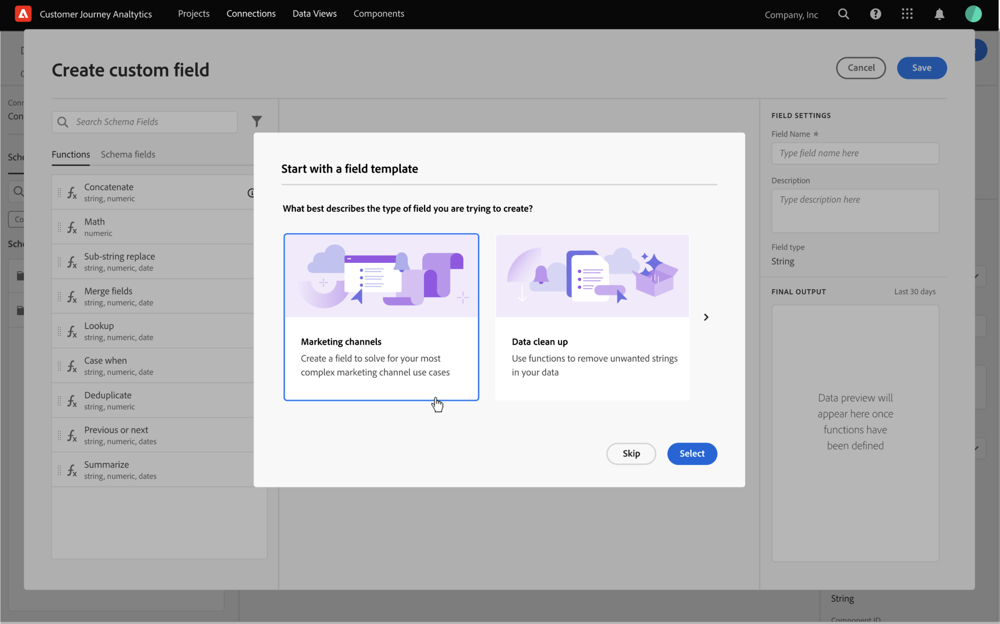

# Campi derivati

{{release-limited-testing}}

I campi derivati sono un aspetto importante della funzionalità di reporting in tempo reale in Customer Journey Analytics (CJA). Un campo derivato (personalizzato) ti consente di definire al volo (spesso complesse) manipolazioni dei dati tramite un generatore di regole personalizzabile. Puoi quindi utilizzare tale campo derivato come componente (metrica o dimensione) in [Area di lavoro](../../analysis-workspace/home.md) o ancora definire ulteriormente come componente in [Visualizzazione dati](../data-views.md).

I campi derivati possono risparmiare molto tempo e fatica rispetto alla trasformazione o manipolazione dei dati in altre aree al di fuori di CJA. Ad esempio [Preparazione dei dati](https://experienceleague.adobe.com/docs/experience-platform/data-prep/home.html?lang=it), [Distiller dati](https://experienceleague.adobe.com/docs/experience-platform/query/data-distiller/overview.html?lang=en)oppure all’interno dei propri processi di estrazione del carico di trasformazione (ETL) / estrazione della trasformazione del carico (ELT).

I campi derivati sono definiti come campi personalizzati all’interno di [Visualizzazioni dati](../data-views.md), si basano su un set di funzioni definite come regole e applicate ai campi standard e/o schema disponibili.

Esempi di casi di utilizzo:

- Definire un campo Nome pagina personalizzato che corregga i valori errati dei nomi di pagina raccolti per correggere i valori dei nomi di pagina.

- Definisci un campo del canale di marketing personalizzato che determina il canale di marketing appropriato in base a una o più condizioni (ad esempio il parametro URL, l’URL della pagina, il nome della pagina).

## Interfaccia campo personalizzata

Quando si crea o si modifica un campo personalizzato, è possibile utilizzare l’interfaccia del campo personalizzato.

|  | Nome | Descrizione |
|---------|----------|--------|
| 1 | **Selettore** | Utilizza l’area del selettore per selezionare, trascinare e rilasciare la  funzione, modello di funzione, campo schema, oppurecampo standard nel generatore di regole.  Utilizza il menu a discesa per selezionare tra [!UICONTROL Functions], [!UICONTROL Function templates], [!UICONTROL Schema fields]e [!UICONTROL Standard fields]. È possibile cercare campi di funzioni, modelli di funzioni, schemi e standard utilizzando  Casella di ricerca.  È possibile filtrare l’elenco di oggetti selezionati selezionando  Filtrare e specificare i filtri nel [!UICONTROL Filter fields by] finestra di dialogo. È possibile rimuovere facilmente i filtri utilizzando  per ogni filtro. |
| 2 | **Generatore di regole** | Puoi creare il campo personalizzato in sequenza utilizzando una o più regole. Una regola è un&#39;implementazione specifica di una funzione ed è quindi sempre associata a una sola funzione. Puoi creare una regola trascinando e rilasciando una funzione nel generatore di regole. Il tipo di funzione determina l&#39;interfaccia della regola. Consulta la sezione [Interfaccia regola](#rule-interface) per ulteriori informazioni.  È possibile inserire una funzione all&#39;inizio, alla fine o tra le regole già disponibili nel generatore di regole. L’ultima regola nel generatore di regole determina l’output finale del campo personalizzato. |
| 3 | **[!UICONTROL ** Impostazioni campo **]** | È possibile assegnare un nome e descrivere il campo personalizzato ed esaminarne il tipo. |
| 4 | **[!UICONTROL ** Output finale **]** | In questa area viene visualizzata un’anteprima aggiornata al volo dei valori di output, basata sui dati degli ultimi 30 giorni e sulle modifiche apportate al campo personalizzato nel Generatore di regole. |

{style="table-layout:auto"}

Quando si accede all’interfaccia del campo personalizzato per la prima volta, la [!UICONTROL Start with a field template] viene visualizzata la procedura guidata.

1. Selezionare il modello che descrive meglio il tipo di campo che si sta tentando di creare.
2. Seleziona la **[!UICONTROL ** Seleziona **]** per continuare.

La finestra di dialogo Campo personalizzato viene compilata con regole (e funzioni) necessarie o utili per il tipo di campo selezionato. Vedi [Modelli di funzione](#function-templates) per ulteriori informazioni sui modelli disponibili.

## Interfaccia regola

Quando definisci una regola nel generatore di regole, utilizza l&#39;interfaccia della regola.

|  | Nome | Descrizione |
|---------|----------|--------|
| A | **Nome della regola** | Per impostazione predefinita, il nome della regola è **Regola X** (X che fa riferimento a un numero di sequenza). Per modificare il nome di una regola, selezionane il nome e digita il nuovo nome, ad esempio `Query Parameter`. |
| B | **Nome funzione** | Nome della funzione selezionata per la regola, ad esempio [!DNL URL PARSE]. Quando la funzione è l&#39;ultima nella sequenza di funzioni e determina i valori di output finali, il nome della funzione è seguito da [!DNL FINAL OUTPUT], ad esempio [!DNL URL PARSE - FINAL OUTPUT].  Per visualizzare una finestra a comparsa con ulteriori informazioni sulla funzione, selezionare . |
| C | **Descrizione regola** | Facoltativamente, puoi aggiungere una descrizione a una regola. Seleziona , quindi seleziona **[!UICONTROL ** Aggiungi descrizione **]** per aggiungere una descrizione o **[!UICONTROL ** Modifica descrizione **]** per modificare una descrizione esistente. Utilizza l’editor per inserire una descrizione. È possibile utilizzare la barra degli strumenti per formattare il testo (utilizzando il selettore di stile, grassetto, corsivo, sottolineato, destro, sinistro, centrato, colore, elenco numerato, elenco puntato) e aggiungere collegamenti a informazioni esterne.  Per terminare la modifica della descrizione, fai clic all’esterno dell’editor. |
| D | **Area della funzione** | Definisce la logica della funzione. L’interfaccia dipende dal tipo di funzione. Vedi [Riferimento della funzione](#function-reference) informazioni dettagliate su ciascuna delle funzioni supportate. |

{style="table-layout:auto"}

## Creazione di un campo personalizzato

1. Selezionare una visualizzazione dati esistente o crearne una. Vedi [Visualizzazioni dati](../data-views.md) per ulteriori informazioni.

2. Seleziona la **[!UICONTROL ** Componenti **]** scheda della visualizzazione Dati.

3. Seleziona **[!UICONTROL ** Crea campo personalizzato **]** dalla barra a sinistra.

4. Per definire il campo personalizzato, utilizza le [!UICONTROL Create custom field] interfaccia. Vedi [Interfaccia campo personalizzata](#custom-field-interface).

   Per salvare il nuovo campo personalizzato, seleziona **[!UICONTROL ** Salva **]**.

5. Il nuovo campo personalizzato viene aggiunto al **[!UICONTROL ** Campi personalizzati >**]** come parte di **[!UICONTROL ** Campi dello schema **]** nella barra a sinistra della visualizzazione Dati.

## Modificare un campo personalizzato

1. Selezionare una visualizzazione dati esistente. Vedi [Visualizzazioni dati](../data-views.md) per ulteriori informazioni.

2. Seleziona la **[!UICONTROL ** Componenti **]** scheda della visualizzazione Dati.

3. Seleziona **[!UICONTROL ** Campi dello schema **]** nella scheda [!UICONTROL Connection] a sinistra.

4. Seleziona **[!UICONTROL ** Campi personalizzati >**]** contenitore.

5. Passa il puntatore del mouse sul campo personalizzato da modificare e seleziona .

6. Per modificare il campo personalizzato, utilizza le [!UICONTROL Edit custom field] interfaccia. Vedi [Interfaccia campo personalizzata](#custom-field-interface).

   - Seleziona **[!UICONTROL ** Salva **]** per salvare il campo personalizzato aggiornato.

   - Seleziona **[!UICONTROL ** Annulla **]** per annullare eventuali modifiche apportate al campo personalizzato.

   - Seleziona **[!UICONTROL ** Salva con nome **]** per salvare il campo personalizzato come nuovo campo personalizzato. Il nuovo campo personalizzato ha lo stesso nome del campo personalizzato originale modificato con `(copy)` aggiunto.

## Eliminare un campo personalizzato

1. Selezionare una visualizzazione dati esistente. Vedi [Visualizzazioni dati](../data-views.md) per ulteriori informazioni.

2. Seleziona la **[!UICONTROL ** Componenti **]** scheda della visualizzazione Dati.

3. Seleziona **[!UICONTROL ** Campi dello schema **]** scheda in [!UICONTROL Connection] riquadro.

4. Seleziona **[!UICONTROL ** Campi personalizzati >**]** contenitore.

5. Passa il puntatore del mouse sul campo personalizzato da eliminare e seleziona .

6. Nell’uso **[!UICONTROL ** Modifica campo personalizzato **]** , selezionare Elimina.

   A [!UICONTROL Delete component] viene richiesto di confermare l’eliminazione. Considera eventuali riferimenti esterni al campo personalizzato al di fuori della visualizzazione Dati.

   - Seleziona **[!UICONTROL ** Continua **]** per eliminare il campo personalizzato.

## Modelli di funzione

Per creare rapidamente un campo personalizzato per casi d’uso specifici, sono disponibili modelli di funzione. Questi modelli di funzioni sono accessibili dall&#39;area Selettore nell&#39;interfaccia del campo personalizzato o sono presentati al primo utilizzo nella [!UICONTROL Start with a field template] procedura guidata.

### Canali di marketing

Questo modello è configurato per utilizzare il [Analisi Url](#dnl-url-parse) e [Case quando](#dnl-case-when) funziona più volte per ottenere i valori appropriati da un URL. A questi valori viene quindi applicata la logica per associare l’URL a un canale di marketing specifico.

+++ Dettagli

Per utilizzare il modello, è necessario specificare i parametri corretti per ogni funzione elencata come parte delle regole nel modello. Vedi [Riferimento della funzione](#function-reference) per ulteriori informazioni.

+++

<!--

+++ Data clean up template

>[!WARNING]
>
>Could not find any information on this template.
+++

-->

## Riferimento della funzione

Per ogni funzione supportata, trova i dettagli seguenti su:

- specifiche:
   - tipo di dati di input: tipo di dati supportati,
   - input: possibili valori di input,
   - operatori inclusi: operatori supportati per questa funzione (se presenti),
   - limite: numero massimo di regole con questa funzione che è possibile utilizzare in un campo derivato,
   - output.

- casi d’uso, compresi:
   - dati prima di definire il campo personalizzato
   - come definire il campo personalizzato
   - dati dopo la definizione del campo personalizzato

- vincoli (facoltativo)

<!-- Concatenate -->

### [!DNL Concatenate]

Combina due o più campi, campi personalizzati o valori immessi dall’utente in un singolo campo con delimitatori definiti.

+++ Dettagli

## Specifiche {#concatenate-io}

| Tipo di dati di input | Ingresso | Operatori inclusi | Limite | Output |
|---|---|---|:--:|---|
| 
Stringa
 | <ul><li>Due o più valori da combinare<ul><li>Campi</li><li>Valore derivato da una regola precedente</li><li>Valore immesso dall’utente</li></ul></li><li>Delimitatori<ul><li>Input o selezione di un delimitatore per ciascun valore</li></ul></li> </ul> | 
N/D
 | 
2
 | 
Nuovo campo personalizzato
 |

{style="table-layout:auto"}

## Caso d’uso {#concatenate-uc}

Attualmente si raccolgono i codici dell&#39;aeroporto di origine e di destinazione come campi separati. Prendi i due campi e combinali in una singola dimensione separata da un trattino (-). Così puoi analizzare la combinazione di origine e destinazione per identificare i percorsi principali prenotati.

Ipotesi:

- I valori di origine e destinazione vengono raccolti in campi separati nella stessa tabella.
- L’utente determina l’utilizzo del delimitatore &quot;-&quot; tra i valori.

Immagina che si verifichino le seguenti prenotazioni:

- Il cliente ABC123 prenota un volo tra Salt Lake City (SLC) e Orlando (MCO)
- Il cliente ABC456 prenota un volo tra Salt Lake City (SLC) e Los Angeles (LAX)
- Il cliente ABC789 prenota un volo tra Salt Lake City (SLC) e Seattle (SEA)
- Il cliente ABC987 prenota un volo tra Salt Lake City (SLC) e San Jose (SJO)
- Il cliente ABC654 prenota un volo tra Salt Lake City (SLC) e Orlando (MCO)

Il rapporto desiderato si presenta così:

| Origine / Destinazione | Prenotazioni |
|----|---:|
| SLC-MCO | 2 |
| SLC-LAX | 1 |
| MARE SLC | 1 |
| SLC-SJO | 1 |

{style="table-layout:auto"}

### Dati precedenti {#concatenate-uc-databefore}

| Origin | Destinazione |
|----|---:|
| SLC | MCO |
| SLC | LAX |
| SLC | MARE |
| SLC | SJO |
| SLC | MCO |

{style="table-layout:auto"}

### Campo personalizzato {#concatenate-customfield}

Definisci un nuovo **[!UICONTROL ** Origine - Destinazione **]** campo personalizzato. Utilizzi le **[!UICONTROL CONCATENATE]** per definire una regola per concatenare il [!UICONTROL Original] e [!UICONTROL Destination] campi che utilizzano `-` [!UICONTROL Delimiter].

![[!DNL Concatenate] regola](assets/concatenate.png)

### Dati dopo {#concatenate-dataafter}

| Origine - Destinazione (campo personalizzato) |
|---|
| SLC-MCO |
| SLC-LAX |
| MARE SLC |
| SLC-SJO |
| SLC-MCO |

{style="table-layout:auto"}

+++

<!-- CASE WHEN -->

### [!DNL Case When]

Applica le condizionali in base a criteri definiti da uno o più campi. Questi criteri vengono quindi utilizzati per definire i valori in un nuovo campo personalizzato, in base alla sequenza delle condizioni.

+++ Dettagli

## Specifiche {#casewhen-io}

| Tipo di dati di input | Ingresso | Operatori inclusi | Limite | Output |
|---|---|---|:---:|---|
| <ul><li>Stringa</li><li>Numeriche</li><li>Data/Ora</li></ul> | <ul><li>Campi di input</li><li>Criteri</li></ul> | 
<u>Stringhe</u>
<ul><li>È uguale a</li><li>Uguale a qualsiasi termine</li><li>Contiene la frase</li><li>Contiene qualsiasi termine</li><li>Contiene tutti i termini</li><li>Inizia con</li><li>Inizia con qualsiasi termine</li><li>Termina con</li><li>Termina con qualsiasi termine</li><li>È diverso da</li><li>Non è uguale a nessun termine</li><li>Non contiene la frase</li><li>Non contiene alcun termine</li><li>Non contiene tutti i termini</li><li>Non inizia con</li><li>Non inizia con alcun termine</li><li>Non termina con</li><li>Non termina con alcun termine</li><li>È impostato</li><li>Non impostato</li></ul>
<u>Numeriche</u>
<ul><li>È uguale a</li><li>È diverso da</li><li>È maggiore di</li><li>È maggiore o uguale a</li><li>È minore di</li><li>È minore o uguale a</li><li>È impostato</li><li>Non impostato</li></ul>
<u>Date</u>
<ul><li>È uguale a</li><li>È diverso da</li><li>È successivo a</li><li>È successivo o uguale a</li><li>È prima di</li><li>È precedente o uguale a</li><li>È impostato</li><li>Non impostato</li></ul> | 
5
 | 
Nuovo campo personalizzato
 |

{style="table-layout:auto"}

## Caso d&#39;uso 1 {#casewhen-uc1}

Desideri definire regole per identificare vari canali di marketing applicando una logica a cascata per impostare un campo del canale di marketing sul valore corretto:

- Se il referente proviene da un motore di ricerca e la pagina dispone di un valore della stringa di query in cui `cid` contiene `ps_`, il canale di commercializzazione deve essere identificato come **Ricerca a pagamento**.
- Se il referente proviene da un motore di ricerca e la pagina non dispone della stringa di query `cid`, il canale di commercializzazione deve essere identificato come **Ricerca naturale**.
- Se una pagina dispone di un valore di stringa di query in cui `cid` contiene `em_`, il canale di marketing deve essere identificato come **E-mail**.
- Se una pagina dispone di un valore di stringa di query in cui `cid` contiene `ds_`, il canale di commercializzazione deve essere identificato come **Annuncio visualizzato**.
- Se una pagina dispone di un valore di stringa di query in cui `cid` contiene `so_`, il canale di commercializzazione deve essere identificato come **Social a pagamento**.
- Se il referente proviene da un dominio di riferimento di twitter.com, facebook.com, linkedin.com o tiktok.com, il canale di marketing deve essere identificato come **Social naturale**.
- Se nessuna delle regole di cui sopra corrisponde, il canale di marketing deve essere identificato come **Altro referente**.

Nel caso in cui il sito riceva i seguenti eventi di esempio, contenenti Referrer e URL pagina, questi eventi devono essere identificati come segue:

| Evento | Destinatario che inoltra | URL della pagina | Canale di marketing |
|:--:|----|----|----|
| 1 | `https://facebook.com` | `https://site.com/home` | Social naturale |
| 2 | `https://abc.com` | `https://site.com/?cid=ds_12345678` | Visualizzazione |
| 3 |  | `https://site.com/?cid=em_12345678` | E-mail |
| 4 | `https://google.com` | `https://site.com/?cid=ps_abc098765` | Ricerca a pagamento |
| 5 | `https://google.com` | `https://site.com/?cid=em_765544332` | E-mail |
| 6 | `https://google.com` |  | Ricerca naturale |

{style="table-layout:auto"}

### Dati precedenti {#casewhen-uc1-databefore}

| Destinatario che inoltra | URL della pagina |
|----|----|
| `https://facebook.com` | `https://site.com/home` |
| `https://abc.com` | `https://site.com/?cid=ds_12345678` |
|  | `https://site.com/?cid=em_12345678` |
| `https://google.com` | `https://site.com/?cid=ps_abc098765` |
| `https://google.com` | `https://site.com/?cid=em_765544332` |
| `https://google.com` |

{style="table-layout:auto"}

### Campo personalizzato {#casewhen-uc1-customfield}

Definisci un nuovo `Marketing Channel` campo personalizzato. Utilizzi le **[!UICONTROL CASE WHEN]** per definire regole che creano valori per in base ai valori esistenti per entrambi i tipi di `Page URL` e `Referring URL` campo .

Nota l&#39;utilizzo della funzione **[!UICONTROL ** ANALISI URL **]** per definire regole per recuperare i valori `Page Url` e `Referring Url` prima del **[!UICONTROL ** CASO IN CUI **]** vengono applicate le regole.

![[!DNL Case when] regola 1](assets/case-when-1.png)

### Dati dopo {#casewhen-uc1-dataafter}

| Canale di marketing |
|----|
| Social naturale |
| Visualizzazione |
| E-mail |
| Ricerca a pagamento |
| E-mail |
| Ricerca naturale |

{style="table-layout:auto"}

## Caso d&#39;uso 2 {#casewhen-uc2}

Hai raccolto diverse varianti di ricerca all’interno della dimensione Metodi di ricerca dei prodotti . Per comprendere le prestazioni complessive della ricerca rispetto alla navigazione, è necessario dedicare molto tempo combinando manualmente i risultati.

Il sito raccoglie i seguenti valori per la dimensione Metodi di ricerca dei prodotti . Alla fine, tutti questi valori indicano una ricerca.

| Valore raccolto | Valore effettivo |
|---|---|
| cerca p13n_no | ricerca |
| cerca p13n_yes | ricerca |
| ricerca perfeziona p13n_no | ricerca |
| ricerca raffina p13n_yes | ricerca |
| reindirizzamento ricerca p13n_yes | ricerca |
| redirect di ricerca | ricerca |

{style="table-layout:auto"}

### Dati precedenti {#casewhen-uc2-databefore}

| Metodi di ricerca dei prodotti |
|----|
| cerca p13_no |
| cerca p13_yes |
| navigazione |
| ricerca raffina p13_no |
| cerca raffina p13_yes |
| navigazione |
| reindirizzamento ricerca p13_yes |
| redirect di ricerca |
| navigazione |

{style="table-layout:auto"}

### Campo personalizzato {#casewhen-uc2-customfield}

Definisci un `Product Finding Methods (new)` campo personalizzato. Crea quanto segue **[!UICONTROL ** CASO IN CUI **]** regole nel generatore di regole. Queste regole applicano la logica a tutte le possibili varianti della **[!UICONTROL ** Metodi di ricerca dei prodotti **]** valori dei campi per `search` e `browse` utilizzando **[!UICONTROL Contains the phrase]** criterio.

![[!DNL Case When] regola 2](assets/case-when-2.png)

### Dati dopo {#casewhen-uc2-dataafter}

| Metodi di ricerca dei prodotti (nuovi) |
|----|
| ricerca |
| ricerca |
| navigazione |
| ricerca |
| ricerca |
| navigazione |
| ricerca |
| ricerca |
| navigazione |

{style="table-layout:auto"}

## Caso d&#39;uso 3 {#casewhen-uc3}

In qualità di società di viaggi, ti piacerebbe prenotare la durata del viaggio per i viaggi prenotati in modo da poter segnalare su lunghezze intasate di viaggi.

Ipotesi:

- L&#39;organizzazione sta raccogliendo la durata del viaggio in un campo numerico.
- Vorrebbero seccare 1-3 giorni di durata in un secchio chiamato &#39;viaggio breve&#39;
- Vorrebbero impennare le durate 4-7 giorni in un secchio chiamato &quot;viaggio medio&quot;
- Vorrebbero seccare 8+ giorni di durata in un secchio chiamato &quot;viaggio lungo&quot;
- 132 viaggi sono stati prenotati per una durata di 1 giorno
- 110 viaggi sono stati prenotati per una durata di 2 giorni
- 105 viaggi sono stati prenotati per una durata di 3 giorni
- 99 viaggi sono stati prenotati per una durata di 4 giorni
- 92 viaggi sono stati prenotati per una durata di 5 giorni
- Sono stati prenotati 85 viaggi per una durata di 6 giorni
- 82 viaggi sono stati prenotati per una durata di 7 giorni
- Sono stati prenotati 78 viaggi per una durata di 8 giorni
- 50 viaggi sono stati prenotati per una durata di 9 giorni
- 44 viaggi sono stati prenotati per una durata di 10 giorni
- 38 viaggi sono stati prenotati per una durata di 11 giorni
- 31 viaggi sono stati prenotati per una durata di 12 giorni

Il rapporto desiderato dovrebbe essere simile al seguente:

| Tipo di durata del viaggio | Prenotazioni |
|----|---:|
| viaggio medio | 358 |
| breve viaggio | 347 |
| viaggio lungo | 241 |

{style="table-layout:auto"}

### Dati precedenti {#casewhen-uc3-databefore}

| Durata del viaggio |
|---:|
| 1 |
| 12 |
| 3 |
| 6 |
| 4 |
| 8 |
| 6 |
| 2 |
| 1 |
| 2 |
| 21 |
| 8 |

### Campo personalizzato {#casewhen-uc3-customfield}

Definisci un `Trip Duration (bucketed)` campo personalizzato. Crea quanto segue **[!UICONTROL ** CASO IN CUI **]** nel generatore di regole. Questa regola applica la logica al bucket precedente **[!UICONTROL ** Durata del viaggio **]** valori dei campi in tre valori: `short trip`, `medium  trip`e `long trip`.

![[!DNL Case When] regola 3](assets/case-when-3.png)

### Dati dopo {#casewhen-uc3-dataafter}

| Durata del viaggio (a blocchi) |
|---|
| breve viaggio |
| viaggio lungo |
| breve viaggio |
| viaggio medio |
| viaggio medio |
| viaggio lungo |
| viaggio medio |
| breve viaggio |
| breve viaggio |
| breve viaggio |
| viaggio lungo |
| viaggio lungo |

## Vincoli

CJA utilizza un modello di contenitore nidificato per la relativa funzionalità. Questo modello di contenitore nidificato determina i vincoli quando si utilizza il generatore di regole. Il modello di contenitore nidificato predefinito utilizzato da CJA è strutturato come illustrato di seguito:

Vedi [Contenitori](../create-dataview.md#containers) e [Contenitori di filtri](../../components/filters/filters-overview.md#filter-containers) per ulteriori informazioni di base.

I seguenti vincoli contenitore si applicano e vengono applicati quando _selezione_ e _impostazione_ valori.

|  | Vincoli |
|:---:|----|
| **A** | Valori _select_ all&#39;interno dello stesso [!UICONTROL If], [!UICONTROL Else If] costrutto (utilizzando [!UICONTROL And] o [!UICONTROL Or]) in una regola deve provenire dallo stesso contenitore e può essere di qualsiasi tipo (stringa , numerico e così via).   |
| **B** | Tutti i valori _set_ in una regola deve provenire dallo stesso contenitore e avere lo stesso tipo o un valore personalizzato dello stesso tipo.    |
| **C** | I valori da te impostati _select_ in [!UICONTROL If], [!UICONTROL Else If] costrutti nella regola do _not_ devono provenire dallo stesso contenitore e devono _not_ devono essere dello stesso tipo.    |

{style="table-layout:auto"}

+++

<!-- FIND AND REPLACE -->

### [!DNL Find and Replace]

Trova tutti i valori in un campo selezionato e li sostituisce con un valore diverso in un nuovo campo personalizzato.

+++ Dettagli

## Specifiche {#findreplace-io}

| Tipo di dati di input | Ingresso | Operatori inclusi | Limite | Output |
|---|---|---|:---:|---|
| 
Stringa
 | <ul><li>Criteri di campo &quot;Quando sostituire&quot;</li><li>Valore del campo &quot;Sostituisci con&quot;<ul><li>Inserito dall’utente</li><li>Campo separato</li></ul></li></ul> | 
<u>Stringhe</u>
<ul><li>Trova tutto e sostituisci tutto</li></ul> | 
1
 | 
Nuovo campo personalizzato
 |

{style="table-layout:auto"}

## Caso d’uso {#findreplace-uc}

Hai ricevuto alcuni valori non validi per il report dei canali di marketing esterni, ad esempio `email%20 marketing` anziché `email marketing`. Questi valori malformati fraudolono il reporting e rendono più difficile vedere come funziona l’e-mail. Sostituire `email%20marketing` con `email marketing`.

**Rapporto originale**

| Canali marketing esterni | Sessioni |
|---|--:|
| marketing via e-mail | 500 |
| e-mail %20marketing | 24 |

{style="table-layout:auto"}

**Rapporto preferito**

| Canali marketing esterni | Sessioni |
|---|--:|
| marketing via e-mail | 524 |

### Dati precedenti {#findreplace-uc-databefore}

| Marketing esterno |
|----|
| marketing via e-mail |
| e-mail%20marketing |
| marketing via e-mail |
| marketing via e-mail |
| e-mail%20marketing |

{style="table-layout:auto"}

### Campo personalizzato {#findreplace-uc-customfield}

Definisci un `Email Marketing (updated)` campo personalizzato. Utilizzi le **[!UICONTROL FIND AND REPLACE]** per definire una regola per trovare e sostituire tutte le occorrenze di `email%20marketing` con `email marketing`.

![[!DNL Find and Replace] regola](assets/find-and-replace.png)

### Dati dopo {#findreplace-uc-dataafter}

| Marketing esterno (campo personalizzato) |
|----|
| marketing via e-mail |
| marketing via e-mail |
| marketing via e-mail |
| marketing via e-mail |
| marketing via e-mail |

{style="table-layout:auto"}

+++

<!-- LOOKUP -->

### [!DNL Lookup]

Definisce un set di valori di ricerca sostituiti dai valori corrispondenti.

+++ Dettagli

## Specifiche {#lookup-io}

| Tipo di dati di input | Ingresso | Operatori inclusi | Limite | Output |
|---|---|---|:---:|---|
| <ul><li>Stringa</li><li>Numeriche</li><li>Data</li></ul> | <ul><li>Campo singolo</li><li>File di ricerca<ul><li>Colonna chiave</li><li>Nuova colonna campo</li></ul></li></ul> | 
N/D
 | 
5
 | 
Nuovo campo personalizzato
 |

{style="table-layout:auto"}

## Caso d&#39;uso 1 {#lookup-uc1}

Hai un file CSV che include una colonna chiave per `hotelID` e una o più colonne aggiuntive associate al `hotelID`: `city`, `rooms`, `hotel name`.
Stai raccogliendo l’ID dell’hotel in una dimensione ma desideri creare una dimensione Nome hotel derivata da `hotelID` nel file CSV.

**Struttura e contenuto di file CSV**

| hotelID | città | camere | nome dell&#39;hotel |
|---|---|---:|---|
| SLC123 | Città del lago salato | 40 | SLC Downtown |
| LAX342 | Los Angeles | 60 | Aeroporto di Los Angeles |
| SFO456 | San Francisco | 75 | Market Street |

{style="table-layout:auto"}

**Rapporto corrente**

| ID hotel | Visualizzazioni prodotto |
|---|---:|
| SLC123 | 200 |
| LX342 | 198 |
| SFO456 | 190 |

{style="table-layout:auto"}

**Rapporto desiderato**

| Nome dell&#39;hotel | Visualizzazioni prodotto |
|----|----:|
| SLC Downtown | 200 |
| Aeroporto di Los Angeles | 198 |
| Market Street | 190 |

{style="table-layout:auto"}

### Dati precedenti {#lookup-uc1-databefore}

| ID hotel |
|----|
| SLC123 |
| LAX342 |
| SFO456 |

{style="table-layout:auto"}

### Campo personalizzato {#lookup-uc1-customfield}

Definisci un `Hotel Name` campo personalizzato. Utilizzi le **[!UICONTROL ** LOOKUP **]** per definire una regola in cui è possibile cercare i valori della **[!UICONTROL ** ID hotel **]** e sostituisci con nuovi valori.

![[!DNL Lookup] regola 1](assets/lookup-1.png)

### Dati dopo {#lookup-uc1-dataafter}

| Nome dell&#39;hotel |
|----|
| SLC Downtown |
| Aeroporto di Los Angeles |
| Market Street |

{style="table-layout:auto"}

## Caso d&#39;uso 2 {#lookup-uc2}

Per più pagine sono stati raccolti gli URL invece del nome della pagina descrittiva. Questa raccolta mista di valori interrompe il reporting.

### Dati precedenti {#lookup-uc2-databefore}

| Nome pagina |
|---|
| Home page |
| Ricerca di voli |
| `http://www.adobetravel.ca/Hotel-Search` |
| `https://www.adobetravel.com/Package-Search` |
| Offerte e offerte |
| `http://www.adobetravel.ca/user/reviews` |
| `https://www.adobetravel.com.br/Generate-Quote/preview` |

{style="table-layout:auto"}

### Campo personalizzato {#lookup-uc2-customfield}

Definisci un `Page Name (updated)` campo personalizzato. Utilizzi le **[!UICONTROL ** LOOKUP **]** funzione per definire una regola in cui è possibile cercare i valori della **[!UICONTROL ** Nome pagina **]** e sostituisci con valori corretti aggiornati.

![[!DNL Lookup] regola 2](assets/lookup-2.png)

### Dati dopo {#lookup-uc2-dataafter}

| Nome pagina (aggiornato) |
|---|
| Home page |
| Ricerca di voli |
| Ricerca alberghiera |
| Ricerca pacchetti |
| Offerte e offerte |
| Recensioni |
| Genera preventivo |

+++

<!-- URL PARSE -->

### [!DNL URL Parse]

Analizza parti diverse di un URL che includono parametri di protocollo, host, percorso o query.

+++ Dettagli

## Specifiche {#urlparse-io}

| Tipo di dati di input | Ingresso | Operatori inclusi | Limite | Output |
|---|---|---|:---:|---|
| <ul><li>Stringa</li></ul> | <ul><li>Campo singolo</li><li>Opzione Analisi<ul><li>Ottieni protocollo</li><li>Ottieni host</li><li>Ottieni percorso</li><li>Ottieni valore query<ul><li>Parametro query</li></ul></li><li>Ottieni valore hash</li></ul></li></ul></li></ul> | 
N/D
 | 
5
 | 
Nuovo campo personalizzato
 |

{style="table-layout:auto"}

## Caso d&#39;uso 1 {#urlparse-uc1}

Vuoi utilizzare il dominio di riferimento solo dall’URL di riferimento come parte del set di regole di un canale di marketing.

### Dati precedenti {#urlparse-uc1-databefore}

| URL di riferimento |
|----|
| `https://www.google.com/` |
| `https://duckduckgo.com/` |
| `https://t.co/` |
| `https://l.facebook.com/` |

{style="table-layout:auto"}

### Campo personalizzato {#urlparse-uc1-customfield}

Definisci un  `Referring Domain` campo personalizzato. Utilizzi le **[!UICONTROL ** ANALISI URL **]** per definire una regola per recuperare l&#39;host dal **URL di riferimento** e memorizzalo nel nuovo campo personalizzato.

![[!DNL Url Parse] regola 1](assets/url-parse-1.png)

### Dati dopo {#urlparse-uc1-dataafter}

| Dominio di riferimento |
|----|
| www.google.com |
| duckduckgo.com |
| t.co |
| l.facebook.com |

{style="table-layout:auto"}

## Caso d&#39;uso 2 {#urlparse-uc2}

Desideri utilizzare il valore della `cid` di una stringa di query in un URL di pagina come parte dell&#39;output di un report di codice di tracciamento derivato.

### Dati precedenti {#urlparse-uc2-databefore}

| URL della pagina |
|----|
| `https://www.adobe.com/?cid=abc123` |
| `https://www.adobe.com/?em=email1234&cid=def123` |
| `https://www.adobe.com/landingpage?querystring1=test&test2=1234&cid=xyz123` |

{style="table-layout:auto"}

### Campo personalizzato {#urlparse-uc2-customfield}

Definisci un `Query String CID` campo personalizzato. Utilizzi le **[!UICONTROL ** ANALISI URL **]** per definire una regola per recuperare il valore del parametro della stringa query nell’URL della pagina, specificando `cid` come parametro di query. Il valore di output viene memorizzato nel nuovo campo personalizzato.

![[!DNL Url Parse] regola 2](assets/url-parse-2.png)

### Dati dopo {#urlparse-uc2-dataafter}

| CID stringa query |
|----|
| abc123 |
| def123 |
| xyz123 |

{style="table-layout:auto"}

+++
