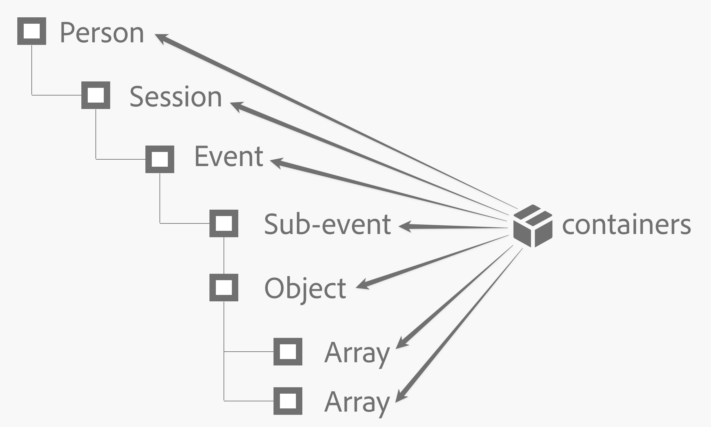
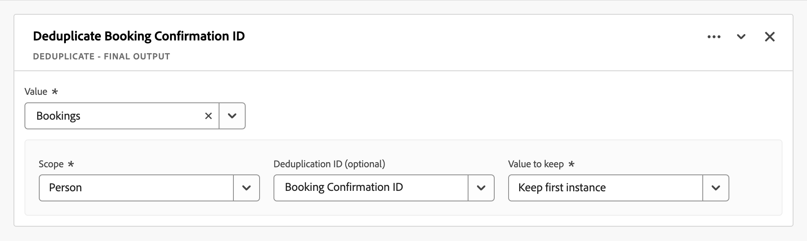

# Campi derivati {#derived-fields}

>[!CONTEXTUALHELP]
>id="dataview_derivedfields"
>title="Campi derivati"
>abstract="Un campo derivato consente di definire all’istante le manipolazioni dati, tramite un generatore di regole personalizzabile. Puoi quindi utilizzare tale campo derivato come componente (metrica o dimensione) in Workspace o definirlo ulteriormente come componente nella Vista dati."

I campi derivati sono un aspetto importante della funzionalità di reporting in tempo reale in Adobe Customer Journey Analytics. Un campo derivato consente di definire al volo manipolazioni (spesso complesse) dei dati tramite un generatore di regole personalizzabile. Puoi quindi utilizzare tale campo derivato come componente (metrica o dimensione) in [Workspace](../../analysis-workspace/home.md) o definirlo ulteriormente come componente nella [Visualizzazione dati](../data-views.md).

I campi derivati possono far risparmiare una quantità significativa di tempo e fatica, rispetto alla trasformazione o alla manipolazione dei dati in altre posizioni al di fuori di Customer Journey Analytics. Ad esempio [Preparazione dati](https://experienceleague.adobe.com/it/docs/experience-platform/data-prep/home.html), [Data distiller](https://experienceleague.adobe.com/it/docs/experience-platform/query/data-distiller/overview.html) o all’interno dei processi Estrai, Trasforma, Carica (ETL, Extract Transform Load) o Estrai, Carica, Trasforma (ELT, Extract Load Transform).

I campi derivati sono definiti all’interno delle [visualizzazioni dati](../data-views.md), sono basati su un set di funzioni definite come regole e applicate ai campi standard e/o di schema disponibili.

>[!NOTE]
>
>[I componenti standard](../component-reference.md) sono associati ai set di dati evento e sono associati ad essi. Di conseguenza, i componenti standard utilizzati come parte di un campo derivato funzionano solo con i dati di un set di dati evento.
>

Esempi di casi d’uso sono:

- Definisci un campo Nome pagina derivato che corregga i valori errati dei nomi di pagina raccolti per correggere i valori dei nomi di pagina.

- Definisci un campo Canale di marketing derivato che determini il canale di marketing appropriato in base a una o più condizioni (ad esempio parametro URL, URL pagina, nome pagina).

I componenti standard sono supportati solo sui set di dati evento nei campi derivati.

## Interfaccia campo derivato {#interface}

Quando crei o modifichi un campo derivato, utilizzi l’interfaccia del campo derivato.

|  | Nome | Descrizione |
|---------|----------|--------|
| 1 | **Selettore** | Utilizza l’area del selettore per selezionare e trascinare la funzione, il modello di funzione, il campo schema o il campo standard nel generatore di regole.  Utilizza l’elenco a discesa per selezionare tra:   [!UICONTROL Functions], elenca le [funzioni](#function-reference) disponibili,   [!UICONTROL Function templates], elenca [modelli di funzione](#function-templates) disponibili,   [!UICONTROL Schema fields], elenca campi disponibili da categorie di set di dati (evento, profilo, ricerca) e campi derivati definiti in precedenza e   [!UICONTROL Standard fields], campi disponibili standard (come ID set di dati piattaforma). Nel selettore vengono visualizzati solo i campi standard stringa e numerici. Se la funzione supporta altri tipi di dati, è possibile selezionare campi standard con questi altri tipi di dati per valori o campi all’interno dell’interfaccia della regola. È possibile cercare funzioni, modelli di funzione, schemi e campi standard utilizzando la casella di ricerca .  È possibile filtrare l’elenco di oggetti selezionato selezionando  Filtro e specificando i filtri nella finestra di dialogo [!UICONTROL Filter fields by]. Puoi rimuovere facilmente i filtri utilizzando  per ogni filtro. |
| 2 | **Generatore di regole** | Puoi creare il campo derivato in sequenza utilizzando una o più regole. Una regola è un’implementazione specifica di una funzione ed è quindi sempre associata a una sola funzione. Per creare una regola, trascina e rilascia una funzione nel generatore di regole. Il tipo di funzione determina l’interfaccia della regola. Consulta [Interfaccia regola](#rule-interface) per ulteriori informazioni.  È possibile inserire una funzione all’inizio, alla fine o tra le regole già disponibili nel generatore di regole. L’ultima regola nel generatore di regole determina l’output finale del campo derivato. |
| 3 | **[!UICONTROL **&#x200B; Impostazioni campo &#x200B;**]** | È possibile denominare e descrivere il campo derivato e verificarne il tipo. |
| 4 | **[!UICONTROL **&#x200B; Output finale &#x200B;**]** | Questa area mostra un’anteprima immediata aggiornata dei valori di output, in base ai dati degli ultimi 30 giorni e alle modifiche apportate al campo derivato nel generatore di regole. |

{style="table-layout:auto"}

## Procedura guidata del modello di campo {#wizard}

Quando accedi all’interfaccia del campo derivato per la prima volta, viene visualizzata la procedura guidata [!UICONTROL Start with a field template].

1. Seleziona il modello che descrive meglio il tipo di campo che stai tentando di creare.
2. Seleziona il pulsante **[!UICONTROL **&#x200B; Seleziona &#x200B;**]** per continuare.

La finestra di dialogo del campo derivato viene compilata con regole (e funzioni) necessarie o utili per il tipo di campo selezionato. Per ulteriori informazioni sui modelli disponibili, consulta [Modelli di funzione](#function-templates).

## Interfaccia regola {#rules}

Quando definisci una regola nel generatore di regole, utilizzi l’interfaccia regola.

|  | Nome | Descrizione |
|---------|----------|--------|
| A | **Nome regola** | Per impostazione predefinita, il nome della regola è **Regola X** (X fa riferimento a un numero di sequenza). Per modificare il nome di una regola, selezionane il nome e digita quello nuovo nome, ad esempio `Query Parameter`. |
| B | **Nome funzione** | Il nome della funzione selezionato per la regola, ad esempio [!UICONTROL URL PARSE]. Quando la funzione è l’ultima nella sequenza di funzioni e determina i valori di output finali, il nome della funzione è seguito da [!UICONTROL - FINAL OUTPUT], ad esempio [!UICONTROL URL PARSE - FINAL OUTPUT].  Per visualizzare un pop-up con ulteriori informazioni sulla funzione, seleziona l’. |
| C | **Descrizione regola** | Facoltativamente, puoi aggiungere una descrizione a una regola. Seleziona l’, quindi seleziona **[!UICONTROL ** Aggiungi descrizione **]** per aggiungere una descrizione o **[!UICONTROL **&#x200B; Modifica descrizione &#x200B;**]** per modificare una descrizione esistente. Utilizzare l’editor per immettere una descrizione. È possibile utilizzare la barra degli strumenti per formattare il testo (utilizzando selettore di stile, grassetto, corsivo, sottolineato, a destra, a sinistra, centrato, colore, elenco numerato, elenco puntato) e aggiungendo collegamenti a informazioni esterne.  Per completare la modifica della descrizione, fai clic all’esterno dell’editor. |
| D | **Area funzione** | Definisce la logica della funzione. L’interfaccia dipende dal tipo di funzione. Il menu a discesa per [!UICONTROL Field] o [!UICONTROL Value] mostra tutte le categorie di campi (regole, campi standard, campi) disponibili, in base al tipo di input previsto dalla funzione. In alternativa, puoi trascinare e rilasciare un campo dal selettore dei campi Schema e Standard su un Campo o un Valore. Quando il campo trascinato proviene da un set di dati di ricerca, viene inserita automaticamente una funzione di ricerca prima della funzione definita.  Per informazioni dettagliate su ciascuna delle funzioni supportate, vedere [Riferimento funzione](#function-reference). |

{style="table-layout:auto"}

## Creare un campo derivato {#create}

1. Seleziona una visualizzazione dati esistente o creane una. Per ulteriori informazioni, consulta [Visualizzazioni dati](../data-views.md).

2. Seleziona la scheda **[!UICONTROL **&#x200B; Componenti &#x200B;**]** della visualizzazione dati.

3. Seleziona **[!UICONTROL **&#x200B; Crea campo derivato &#x200B;**]** dalla barra a sinistra.

4. Per definire il campo derivato, utilizza l’interfaccia [!UICONTROL Create derived field]. Consulta [Interfaccia campo derivato](#derived-field-interface).

   Per salvare il nuovo campo derivato, seleziona **[!UICONTROL **&#x200B; Salva &#x200B;**]**.

5. Il nuovo campo derivato viene aggiunto al contenitore [!UICONTROL Derived fields >], come parte dei **[!UICONTROL **&#x200B; campi Schema &#x200B;**]** nella barra a sinistra della visualizzazione dati.

## Modificare un campo derivato {#edit}

1. Seleziona una visualizzazione dati esistente. Per ulteriori informazioni, consulta [Visualizzazione dati](../data-views.md).

2. Seleziona la scheda **[!UICONTROL **&#x200B; Componenti &#x200B;**]** della visualizzazione dati.

3. Seleziona la scheda **[!UICONTROL **&#x200B; Campi schema &#x200B;**]** nel riquadro [!UICONTROL Connection] a sinistra.

4. Seleziona **[!UICONTROL **&#x200B; Campi derivati >**]** contenitore.

5. Passa il puntatore sul campo derivato che desideri modificare e seleziona .

6. Per modificare il campo derivato, utilizza l’interfaccia [!UICONTROL Edit derived field]. Vedi [Interfaccia campo derivato](#derived-field-interface).

   - Seleziona **[!UICONTROL **&#x200B; Salva &#x200B;**]** per salvare il campo derivato aggiornato.

   - Seleziona **[!UICONTROL **&#x200B; Annulla &#x200B;**]** per annullare eventuali modifiche apportate al campo derivato.

   - Seleziona **[!UICONTROL **&#x200B; Salva con nome &#x200B;**]** per salvare il campo derivato come nuovo campo derivato. Il nuovo campo derivato ha lo stesso nome del campo derivato originale modificato con in fondo `(copy)`.

In alternativa, se hai utilizzato un campo derivato come componente per dimensioni o metriche nella visualizzazione dati:

1. Seleziona il componente. Il componente potrebbe avere un nome diverso dal campo derivato.

1. Nel pannello Componente, seleziona l’ accanto al campo derivato, sotto il nome del campo Schema.

1. Per modificare il campo derivato, utilizza l’interfaccia [!UICONTROL Edit derived field]. Vedi [Interfaccia campo derivato](#derived-field-interface).

   - Seleziona **[!UICONTROL **&#x200B; Salva &#x200B;**]** per salvare il campo derivato aggiornato.

   - Seleziona **[!UICONTROL **&#x200B; Annulla &#x200B;**]** per annullare eventuali modifiche apportate al campo derivato.

   - Seleziona **[!UICONTROL **&#x200B; Salva con nome &#x200B;**]** per salvare il campo derivato come nuovo campo derivato. Il nuovo campo derivato ha lo stesso nome del campo derivato originale modificato con in fondo `(copy)`.

## Eliminare un campo derivato {#delete}

1. Seleziona una visualizzazione dati esistente. Per ulteriori informazioni, consulta [Visualizzazione dati](../data-views.md).

2. Seleziona la scheda **[!UICONTROL **&#x200B; Componenti &#x200B;**]** della visualizzazione dati.

3. Seleziona la scheda **[!UICONTROL **&#x200B; Campi schema &#x200B;**]** nel riquadro [!UICONTROL Connection].

4. Seleziona **[!UICONTROL **&#x200B; Campi derivati >**]** contenitore.

5. Passa il puntatore sul campo derivato che desideri eliminare e seleziona l’.

6. Nell’interfaccia [!UICONTROL Edit derived field], seleziona **[!UICONTROL Delete]**.

   Una finestra di dialogo [!UICONTROL Delete component] richiede di confermare l’eliminazione. Considera eventuali riferimenti esterni al campo derivato che potrebbero esistere all’esterno della visualizzazione dati.

   - Seleziona **[!UICONTROL **&#x200B; Continua &#x200B;**]** per eliminare il campo derivato.

In alternativa, se hai utilizzato un campo derivato come componente per dimensioni o metriche nella visualizzazione dati:

1. Seleziona il componente. Il componente potrebbe avere un nome diverso dal campo derivato.

1. Nel pannello Componente, seleziona l’ accanto al campo derivato, sotto il nome del campo Schema.

1. Nell’interfaccia [!UICONTROL Edit derived field], seleziona **[!UICONTROL Delete]**.

   Una finestra di dialogo [!UICONTROL Delete component] richiede di confermare l’eliminazione. Considera eventuali riferimenti esterni al campo derivato che potrebbero esistere all’esterno della visualizzazione dati.

   - Seleziona **[!UICONTROL **&#x200B; Continua &#x200B;**]** per eliminare il campo derivato.

>[!NOTE]
>
>I campi derivati vengono gestiti a livello di connessione in Customer Journey Analytics. Qualsiasi modifica apportata a un campo derivato in una delle visualizzazioni dati associate a tale connessione viene applicata a tutte le visualizzazioni dati associate.

## Modelli di funzione {#templates}

Per creare rapidamente un campo derivato per casi d’uso specifici, sono disponibili modelli di funzione. È possibile accedere a questi modelli di funzione dall’area del selettore nell’interfaccia del campo derivato o al primo utilizzo nella procedura guidata [!UICONTROL Start with a field template].

### Canali di marketing {#mchannel}

Questo modello di funzione utilizza una raccolta di regole per generare canali di marketing.

+++ Dettagli

Per utilizzare il modello, è necessario specificare i parametri corretti per ogni funzione elencata come parte delle regole del modello. Per ulteriori informazioni, consulta [Riferimento funzione](#function-reference).

+++

### Messaggi non recapitati {#bounces}

Questo modello di funzione utilizza una raccolta di regole per identificare i mancati recapiti del sito.

+++ Dettagli

{{select-package}}

Per utilizzare il modello, è necessario specificare i parametri corretti per ogni funzione elencata come parte delle regole del modello. Per ulteriori informazioni, consulta [Riferimento funzione](#function-reference).

+++

### Combinazione multidimensionale {#multi-dim}

Questo modello di funzione combina due valori in uno.

+++ Dettagli

{{select-package}}

Per utilizzare il modello, è necessario specificare i parametri corretti per ogni funzione elencata come parte delle regole del modello. Per ulteriori informazioni, consulta [Riferimento funzione](#function-reference).

+++

### Nome descrittivo del set di dati {#friendlyname}

Questo modello di funzione fornisce un nome leggibile per il set di dati.

+++ Dettagli

{{select-package}}

Per utilizzare il modello, è necessario specificare i parametri corretti per ogni funzione elencata come parte delle regole del modello. Per ulteriori informazioni, consulta [Riferimento funzione](#function-reference).

+++

### Nome pagina dall’URL {#pagename}

Questo modello di funzione crea un nome di pagina semplice.

+++ Dettagli

{{select-package}}

Per utilizzare il modello, è necessario specificare i parametri corretti per ogni funzione elencata come parte delle regole del modello. Per ulteriori informazioni, consulta [Riferimento funzione](#function-reference).

+++

### Stagione festiva {#holiday}

Questo modello di funzione classifica i momenti chiave dell’anno.

+++ Dettagli

{{select-package}}

Per utilizzare il modello, è necessario specificare i parametri corretti per ogni funzione elencata come parte delle regole del modello. Per ulteriori informazioni, consulta [Riferimento funzione](#function-reference).

+++

### Obiettivi mensili {#goals}

Questo modello di funzione imposta gli obiettivi mensili personalizzati.

+++ Dettagli

{{select-package}}

Per utilizzare il modello, è necessario specificare i parametri corretti per ogni funzione elencata come parte delle regole del modello. Per ulteriori informazioni, consulta [Riferimento funzione](#function-reference).

+++

### Ottieni tutti i valori in un elenco delimitato {#allvalues}

Questo modello di funzione converte un elenco limitato in un array.

+++ Dettagli

{{select-package}}

Per utilizzare il modello, è necessario specificare i parametri corretti per ogni funzione elencata come parte delle regole del modello. Per ulteriori informazioni, consulta [Riferimento funzione](#function-reference).

+++

### Ottieni il primo valore in un elenco delimitato {#firstvalue}

Questo modello di funzione ottiene il primo valore in un elenco delimitato.

+++ Dettagli

{{select-package}}

Per utilizzare il modello, è necessario specificare i parametri corretti per ogni funzione elencata come parte delle regole del modello. Per ulteriori informazioni, consulta [Riferimento funzione](#function-reference).

+++

### Ottieni l’ultimo valore in un elenco delimitato {#lastvalue}

Questo modello di funzione ottiene l’ultimo valore in un elenco delimitato.

+++ Dettagli

{{select-package}}

Per utilizzare il modello, è necessario specificare i parametri corretti per ogni funzione elencata come parte delle regole del modello. Per ulteriori informazioni, consulta [Riferimento funzione](#function-reference).

+++

### Nome di dominio {#domain}

Questo modello di funzione estrae il nome di dominio utilizzando un’espressione regolare.

+++ Dettagli

{{select-package}}

Per utilizzare il modello, è necessario specificare i parametri corretti per ogni funzione elencata come parte delle regole del modello. Per ulteriori informazioni, consulta [Riferimento funzione](#function-reference).

+++

### Ottieni parametro della stringa di query {#querystring}

Questo modello di funzione estrae i valori della stringa di query.

+++ Dettagli

{{select-package}}

Per utilizzare il modello, è necessario specificare i parametri corretti per ogni funzione elencata come parte delle regole del modello. Per ulteriori informazioni, consulta [Riferimento funzione](#function-reference).

+++

### Campo di transizione {#transition}

Questo modello di funzione fa passare il reporting da un campo all’altro.

+++ Dettagli

{{select-package}}

Per utilizzare il modello, è necessario specificare i parametri corretti per ogni funzione elencata come parte delle regole del modello. Per ulteriori informazioni, consulta [Riferimento funzione](#function-reference).

+++

### Rilevamento bot semplice {#botdetection}

Questo modello di funzione implementa l’identificazione di un bot leggero.

+++ Dettagli

{{select-package}}

Per utilizzare il modello, è necessario specificare i parametri corretti per ogni funzione elencata come parte delle regole del modello. Per ulteriori informazioni, consulta [Riferimento funzione](#function-reference).

+++

### Collegamento di uscita. {#exit}

Questo modello di funzione identifica l’ultimo collegamento su cui è stato fatto clic in una sessione.

+++ Dettagli

{{select-package}}

Per utilizzare il modello, è necessario specificare i parametri corretti per ogni funzione elencata come parte delle regole del modello. Per ulteriori informazioni, consulta [Riferimento funzione](#function-reference).

+++

### Collegamento di download. {#download}

Questo modello di funzione contrassegna i collegamenti di download comuni.

+++ Dettagli

{{select-package}}

Per utilizzare il modello, è necessario specificare i parametri corretti per ogni funzione elencata come parte delle regole del modello. Per ulteriori informazioni, consulta [Riferimento funzione](#function-reference).

+++

### Latitudine dello Stato {#state-latitude}

Questo modello di funzione ottiene la latitudine per uno stato USA con una precisione di 5 cifre.

+++ Dettagli

{{select-package}}

Per utilizzare il modello, è necessario specificare i parametri corretti per ogni funzione elencata come parte delle regole del modello. Per ulteriori informazioni, consulta [Riferimento funzione](#function-reference).

+++

### Longitudine dello Stato {#state-longitude}

Questo modello di funzione ottiene la longitudine di uno stato degli Stati Uniti con una precisione di 5 cifre.

+++ Dettagli

{{select-package}}

Per utilizzare il modello, è necessario specificare i parametri corretti per ogni funzione elencata come parte delle regole del modello. Per ulteriori informazioni, consulta [Riferimento funzione](#function-reference).

+++

<!--

+++ Data clean up template

>[!WARNING]
>
>Could not find any information on this template.
+++

-->

## Riferimento funzione {#functionref}

{{select-package}}

Per ciascuna funzione supportata, di seguito trovi i dettagli su:

- specifiche:
   - tipo di dati di input: tipo di dati supportati,
   - input: possibili valori di input,
   - operatori inclusi: operatori supportati per questa funzione (se presenti),
   - limitazioni: limitazioni applicabili a questa funzione specifica,
   - output

- casi d’uso, tra cui:
   - dati prima della definizione del campo derivato,
   - come definire il campo derivato,
   - dati dopo la definizione del campo derivato.

- vincoli (se applicabili).

<!-- CASE WHEN -->

### Caso When {#casewhen}

>[!CONTEXTUALHELP]
>id="dataview_derivedfields_casewhen"
>title="Caso When"
>abstract="Questa funzione consente di applicare condizionali basati su criteri definiti da uno o più campi. Tali criteri vengono quindi utilizzati per definire i valori nel nuovo campo derivato, in base alla sequenza delle condizioni."

Applica i condizionali, in base a criteri definiti da uno o più campi. Tali criteri vengono quindi utilizzati per definire i valori in un nuovo campo derivato, in base alla sequenza delle condizioni.

+++ Dettagli

## Specifiche {#casewhen-io}

| Tipo di dati di input | Input | Operatori inclusi | Limitazioni | Output |
|---|---|---|---|---|
| <ul><li>Stringa</li><li>Numerici</li><li>Data</li></ul> | <ul><li>Contenitore [!UICONTROL If], [!UICONTROL Else If]:
<ul><li>[!UICONTROL Value]</li><ul><li>Regole</li><li>Campi standard</li><li>Campi</li></ul><li>[!UICONTROL Criterion] (consulta operatori inclusi, in base al tipo di valore selezionato)</li></ul></li><li>[!UICONTROL Then set value to], [!UICONTROL Otherwise set value to]:
<ul><li>[!UICONTROL Value]</li><ul><li>Regole</li><li>Campi standard</li><li>Campi</li></ul></ul></li></ul> | 
Stringhe
<ul><li>È uguale a</li><li>È uguale a qualsiasi termine</li><li>Contiene la frase</li><li>Contiene qualsiasi termine</li><li>Contiene tutti i termini</li><li>Inizia con</li><li>Inizia con qualsiasi termine</li><li>Termina con</li><li>Termina con qualsiasi termine</li><li>Non è uguale a</li><li>Non è uguale a nessun termine</li><li>Non contiene la frase</li><li>Non contiene alcun termine</li><li>Non contiene tutti i termini</li><li>Non inizia con</li><li>Non inizia con nessun termine</li><li>Non termina con</li><li>Non termina con nessun termine</li><li>È impostata</li><li>Non è impostata</li></ul>
Numerici
<ul><li>È uguale a</li><li>Non è uguale a</li><li>È maggiore di</li><li>È maggiore di o uguale a</li><li>È minore di</li><li>È minore di o uguale a</li><li>È impostata</li><li>Non è impostata</li></ul>
Date
<ul><li>È uguale a</li><li>Non è uguale a</li><li>È successivo a</li><li>È successivo o uguale a</li><li>È precedente a</li><li>È precedente o uguale a</li><li>È impostata</li><li>Non è impostata</li></ul> | <ul><li>5 funzioni per campo derivato</li><li>200 [operatori](#operators) per campo derivato. Un esempio di un singolo operatore è “Il dominio di riferimento contiene google”. </li></ul> | 
Nuovo campo derivato
 |

{style="table-layout:auto"}

## Caso d’uso 1 {#casewhen-uc1}

Vuoi definire le regole per identificare vari canali di marketing, applicando una logica a cascata per impostare un campo canale di marketing sul valore corretto:

- Se il referrer proviene da un motore di ricerca e la pagina ha un valore stringa di query in cui `cid` contiene `ps_`, il canale di marketing deve essere identificato come [!DNL *Ricerca a pagamento*].
- Se il referrer proviene da un motore di ricerca e la pagina non ha la stringa di query `cid`, il canale di marketing deve essere identificato come [!DNL *Ricerca naturale*].
- Se una pagina include un valore stringa di query in cui `cid` contiene `em_`, il canale di marketing deve essere identificato come [!DNL *E-mail*].
- Se una pagina include un valore stringa di query in cui `cid` contiene `ds_`, il canale di marketing deve essere identificato come [!DNL *Annuncio visualizzato*].
- Se una pagina contiene un valore stringa di query in cui `cid` contiene `so_`, il canale di marketing deve essere identificato come [!DNL *Social a pagamento*].
- Se il referrer proviene da un dominio di riferimento di [!DNL twitter.com], [!DNL facebook.com], [!DNL linkedin.com] o [!DNL tiktok.com], il canale di marketing deve essere identificato come [!DNL *Social naturale*].
- Se nessuna delle regole di cui sopra corrisponde, il canale di marketing deve essere identificato come [!DNL *Altro referrer*].

Se il sito riceve i seguenti eventi di esempio, contenenti [!UICONTROL Referrer] e [!UICONTROL Page URL], questi eventi devono essere identificati come segue:

| [!DNL Event] | [!DNL Referrer] | [!DNL Page URL] | [!DNL Marketing Channel] |
|:--:|----|----|----|
| 1 | `https://facebook.com` | `https://site.com/home` | [!DNL Natural Social] |
| 2 | `https://abc.com` | `https://site.com/?cid=ds_12345678` | [!DNL Display] |
| 3 | | `https://site.com/?cid=em_12345678` | [!DNL Email] |
| 4 | `https://google.com` | `https://site.com/?cid=ps_abc098765` | [!DNL Paid Search] |
| 5 | `https://google.com` | `https://site.com/?cid=em_765544332` | [!DNL Email] |
| 6 | `https://google.com` |  | [!DNL Natural Search] |

{style="table-layout:auto"}

### Dati precedenti {#casewhen-uc1-databefore}

| [!DNL Referrer] | [!DNL Page URL] |
|----|----|
| `https://facebook.com` | `https://site.com/home` |
| `https://abc.com` | `https://site.com/?cid=ds_12345678` |
|  | `https://site.com/?cid=em_12345678` |
| `https://google.com` | `https://site.com/?cid=ps_abc098765` |
| `https://google.com` | `https://site.com/?cid=em_765544332` |
| `https://google.com` | |

{style="table-layout:auto"}

### Campo derivato {#casewhen-uc1-derivedfield}

Definisci un campo derivato `Marketing Channel`. Utilizzi le funzioni [!UICONTROL CASE WHEN] per definire regole che creano valori per quelle in base ai valori esistenti per i campi `Page URL` e `Referring URL`.

Nota l’utilizzo della funzione [!UICONTROL URL PARSE] per definire regole per recuperare i valori per `Page Url` e `Referring Url` prima dell’applicazione delle regole [!UICONTROL CASE WHEN].

### Dati successivi {#casewhen-uc1-dataafter}

| [!DNL Marketing Channel] |
|----|
| [!DNL Natural Social] |
| [!DNL Display] |
| [!DNL Email] |
| [!DNL Paid Search] |
| [!DNL Email] |
| [!DNL Natural Search] |

{style="table-layout:auto"}

## Caso d’uso 2 {#casewhen-uc2}

Hai raccolto molte varianti di ricerca diverse nella dimensione [!DNL Product Finding Methods]. Per comprendere le prestazioni complessive della ricerca e della navigazione, devi dedicare molto tempo alla combinazione manuale dei risultati.

Il sito raccoglie i seguenti valori per la dimensione [!DNL Product Finding Methods]. Alla fine, tutti questi valori indicano una ricerca.

| Valore raccolto | Valore effettivo |
|---|---|
| [!DNL search p13n_no] | [!DNL search] |
| [!DNL search p13n_yes] | [!DNL search] |
| [!DNL search refine p13n_no] | [!DNL search] |
| [!DNL search refine p13n_yes] | [!DNL search] |
| [!DNL search redirect p13n_yes] | [!DNL search] |
| [!DNL search-redirect] | [!DNL search] |

{style="table-layout:auto"}

### Dati precedenti {#casewhen-uc2-databefore}

| [!DNL Product Finding Methods] |
|----|
| [!DNL search p13_no] |
| [!DNL search p13_yes] |
| [!DNL browse] |
| [!DNL search refine p13_no] |
| [!DNL search refine p13_yes] |
| [!DNL browse] |
| [!DNL search redirect p13_yes] |
| [!DNL search-redirect] |
| [!DNL browse] |

{style="table-layout:auto"}

### Campo derivato {#casewhen-uc2-derivedfield}

Definisci un campo derivato `Product Finding Methods (new)`. Crei le regole seguenti [!UICONTROL CASE WHEN] nel generatore di regole. Queste regole applicano la logica a tutte le possibili varianti dei vecchi valori di campo [!UICONTROL Product Finding Methods] per `search` e `browse` utilizzando il criterio [!UICONTROL Contains the phrase].

### Dati successivi {#casewhen-uc2-dataafter}

| [!DNL Product Finding Methods (new)] |
|----|
| [!DNL search] |
| [!DNL search] |
| [!DNL browse] |
| [!DNL search] |
| [!DNL search] |
| [!DNL browse] |
| [!DNL search] |
| [!DNL search] |
| [!DNL browse] |

{style="table-layout:auto"}

## Caso d’uso 3 {#casewhen-uc3}

In qualità di agenzia turistica, vorresti poter collocare in bucket la durata del viaggio per i viaggi prenotati in modo da poter generare rapporti sulle lunghezze dei viaggi nei bucket.

Presupposti:

- L’organizzazione inserisce la durata del viaggio in un campo numerico.
- Desidera inserire le durate di 1-3 giorni in un bucket denominato ‘[!DNL short trip]’
- Desidera inserire le durate di 4-7 giorni in un bucket denominato ‘[!DNL medium trip]’
- Desidera inserire le durate di più di 8 giorni in un bucket denominato ‘[!DNL long trip]’
- 132 viaggi sono stati prenotati per una durata di 1 giorno
- 110 viaggi sono stati prenotati per una durata di 2 giorni
- 105 viaggi sono stati prenotati per una durata di 3 giorni
- 99 viaggi sono stati prenotati per una durata di 4 giorni
- 92 viaggi sono stati prenotati per una durata di 5 giorni
- 85 viaggi sono stati prenotati per una durata di 6 giorni
- 82 viaggi sono stati prenotati per una durata di 7 giorni
- 78 viaggi sono stati prenotati per una durata di 8 giorni
- 50 viaggi sono stati prenotati per una durata di 9 giorni
- 44 viaggi sono stati prenotati per una durata di 10 giorni
- 38 viaggi sono stati prenotati per una durata di 11 giorni
- 31 viaggi sono stati prenotati per una durata di 12 giorni

Il report desiderato dovrebbe essere il seguente:

| [!DNL Trip Duration Type] | [!DNL Bookings] |
|----|---:|
| [!DNL medium trip] | 358 |
| [!DNL short trip] | 347 |
| [!DNL long trip] | 241 |

{style="table-layout:auto"}

### Dati precedenti {#casewhen-uc3-databefore}

| [!DNL Trip Duration] |
|---:|
| 1 |
| 12 |
| 3 |
| 6 |
| 4 |
| 8 |
| 6 |
| 2 |
| 1 |
| 2 |
| 21 |
| 8 |

### Campo derivato {#casewhen-uc3-derivedfield}

Definisci un campo derivato `Trip Duration (bucketed)`. Crei la seguente regola [!UICONTROL CASE WHEN] nel generatore di regole. Questa regola applica la logica per inserire i vecchi valori del campo [!UICONTROL Trip Duration] in tre valori: `short trip`, `medium  trip` e `long trip`.

### Dati successivi {#casewhen-uc3-dataafter}

| [!DNL Trip Duration (bucketed)] |
|---|
| [!DNL short trip] |
| [!DNL long trip] |
| [!DNL short trip] |
| [!DNL medium trip] |
| [!DNL medium trip] |
| [!DNL long trip] |
| [!DNL medium trip] |
| [!DNL short trip] |
| [!DNL short trip] |
| [!DNL short trip] |
| [!DNL long trip] |
| [!DNL long trip] |

## Ulteriori informazioni {#casewhen-more-info}

Customer Journey Analytics utilizza una struttura di contenitori nidificati, modellata su [XDM](https://experienceleague.adobe.com/it/docs/experience-platform/xdm/home.html?lang=it) (Experience Data Model) di Adobe Experience Platform. Per ulteriori informazioni di background, vedi [Contenitori](../create-dataview.md#containers) e [Contenitori di segmenti](/help/components/segments/seg-overview.md#containers). Questo modello di contenitore, anche se per sua natura flessibile, impone alcuni vincoli quando si utilizza il generatore di regole.

Customer Journey Analytics utilizza il seguente modello di contenitore predefinito:

I seguenti vincoli si applicano e vanno rispettati quando *si selezionano* e *si impostano* i valori.

|  | Vincoli |
|:---:|----|
| **A** | I valori *selezionati* all’interno dello stesso costrutto [!UICONTROL If], [!UICONTROL Else If] (utilizzando [!UICONTROL And] o [!UICONTROL Or]) in una regola devono provenire dallo stesso contenitore e possono essere di qualsiasi tipo (stringa , numerico  e così via).   |
| **B** | Tutti i valori *impostati* in una regola devono appartenere allo stesso contenitore e avere lo stesso tipo o un valore derivato dello stesso tipo.    |
| **C** | I valori *selezionati* nei costrutti [!UICONTROL If], [!UICONTROL Else If] nella regola *non* devono provenire dallo stesso contenitore e *non* devono essere dello stesso tipo.    |

{style="table-layout:auto"}

+++

<!-- CLASSIFY -->

### Classifica {#classify}

>[!CONTEXTUALHELP]
>id="dataview_derivedfields_classify"
>title="Classifica"
>abstract="Questa funzione consente di definire un insieme di valori che vengono sostituiti dai valori corrispondenti tramite l’immissione di testo."

Definisce un insieme di valori che vengono sostituiti dai valori corrispondenti in un nuovo campo derivato.

+++ Dettagli

## Specifiche {#classify-io}

| Tipo di dati di input | Input | Operatori inclusi | Limitazioni | Output |
|---|---|---|---|---|
| <ul><li>Stringa</li><li>Numerici</li><li>Data</li></ul> | <ul><li>[!UICONTROL Field to classify]:<ul><li>Regole</li><li>Campi standard</li><li>Campi</li></ul></li><li>[!UICONTROL When value equals] e [!UICONTROL Replace values with]:
<ul><li>Stringa</li></ul><li>Mostra valori originali<ul><li>Booleani</li></ul></li></ul> | 
N/D
 | <ul><li>5 funzioni per campo derivato</li><li>200 [operatori](#operators) per campo derivato. Ogni voce per [!UICONTROL When value equals original value] [!UICONTROL Replace value with New value] è considerata un’operazione.</li></ul> | 
Nuovo campo derivato
 |

{style="table-layout:auto"}

## Caso d’uso 1 {#classify-uc1}

Disponi di un file CSV che include una colonna chiave per `hotelID` e una o più colonne aggiuntive associate a `hotelID`: `city`, `rooms`, `hotel name`.
Stai inserendo [!DNL Hotel ID] in una dimensione, ma desideri creare una dimensione [!DNL Hotel Name] derivata da `hotelID` nel file CSV.

**Struttura e contenuto del file CSV**

| [!DNL hotelID] | [!DNL city] | [!DNL rooms] | [!DNL hotel name] |
|---|---|---:|---|
| [!DNL SLC123] | [!DNL Salt Lake City] | 40 | [!DNL SLC Downtown] |
| [!DNL LAX342] | [!DNL Los Angeles] | 60 | [!DNL LA Airport] |
| [!DNL SFO456] | [!DNL San Francisco] | 75 | [!DNL Market Street] |
| [!DNL AMS789] | [!DNL Amsterdam] | 50 | [!DNL Okura] |

{style="table-layout:auto"}

**Rapporto corrente**

| [!DNL Hotel ID] | Visualizzazioni prodotto |
|---|---:|
| [!DNL SLC123] | 200 |
| [!DNL LX342] | 198 |
| [!DNL SFO456] | 190 |
| [!DNL AMS789] | 150 |

{style="table-layout:auto"}

**Report desiderato**

| [!DNL Hotel Name] | Visualizzazioni prodotto |
|----|----:|
| [!DNL SLC Downtown] | 200 |
| [!DNL LA Airport] | 198 |
| [!DNL Market Street] | 190 |

{style="table-layout:auto"}

### Dati precedenti {#classify-uc1-databefore}

| [!DNL Hotel ID] |
|----|
| [!DNL SLC123] |
| [!DNL LAX342] |
| [!DNL SFO456] |
| [!DNL AMS789] |

{style="table-layout:auto"}

### Campo derivato {#classify-uc1-derivedfield}

Definisci un campo derivato `Hotel Name`. Utilizzi la funzione [!UICONTROL CLASSIFY] per definire una regola in cui puoi classificare i valori del campo [!UICONTROL Hotel ID] e sostituirli con nuovi valori.

Se desideri includere valori originali non definiti come parte dei valori da classificare (ad esempio, ID hotel AMS789), assicurati di selezionare **[!UICONTROL Show original values]**. Ciò garantisce che AMS789 faccia parte dell’output per il campo derivato, nonostante tale valore non sia stato classificato.

### Dati successivi {#classify-uc1-dataafter}

| [!DNL Hotel Name] |
|----|
| [!DNL SLC Downtown] |
| [!DNL LA Airport] |
| [!DNL Market Street] |

{style="table-layout:auto"}

## Caso d’uso 2 {#classify-uc2}

Hai inserito gli URL invece del nome descrittivo di diverse pagine. Questa raccolta mista di valori interrompe il reporting.

### Dati precedenti {#classify-uc2-databefore}

| [!DNL Page Name] |
|---|
| [!DNL Home Page] |
| [!DNL Flight Search] |
| `http://www.adobetravel.ca/Hotel-Search` |
| `https://www.adobetravel.com/Package-Search` |
| [!DNL Deals & Offers] |
| `http://www.adobetravel.ca/user/reviews` |
| `https://www.adobetravel.com.br/Generate-Quote/preview` |

{style="table-layout:auto"}

### Campo derivato {#classify-uc2-derivedfield}

Definisci un campo derivato `Page Name (updated)`. Utilizzi la funzione [!UICONTROL CLASSIFY] per definire una regola in cui puoi classificare i valori del campo [!UICONTROL Page Name] esistente e sostituirli con valori corretti aggiornati.

### Dati successivi {#classify-uc2-dataafter}

| [!DNL Page Name (updated)] |
|---|
| [!DNL Home Page] |
| [!DNL Flight Search] |
| [!DNL Hotel Search] |
| [!DNL Package Search] |
| [!DNL Deals & Offers] |
| [!DNL Reviews] |
| [!DNL Generate Quote] |

## Ulteriori informazioni {#classify-moreinfo}

Nell’interfaccia della regola Classificare sono disponibili le seguenti funzionalità aggiuntive:

- Per cancellare rapidamente tutti i valori della tabella, seleziona  **[!UICONTROL Clear all table values]**.
- Per caricare un file CSV contenente i valori originali di Quando i valori sono uguali e i nuovi valori di Sostituisci i valori con, seleziona  **[!UICONTROL Upload CSV]**.
- Per scaricare un modello per creare un file CSV con valori originali e valori nuovi da caricare, seleziona  **[!UICONTROL Download CSV template]**.
- Per scaricare un file CSV con tutti i valori originali e i valori nuovi popolati nell’interfaccia della regola, seleziona  **[!UICONTROL Download CSV values]**.

+++

<!-- CONCATENATE -->

### Concatena {#concatenate}

<!-- markdownlint-disable MD034 -->

>[!CONTEXTUALHELP]
>id="dataview_derivedfields_concatenate"
>title="Concatena"
>abstract="Questa funzione consente di combinare due o più campi, campi derivati o valori stringa immessi dall’utente, in un singolo campo con delimitatori definiti"

<!-- markdownlint-enable MD034 -->

Combina i valori dei campi in un unico nuovo campo derivato con delimitatori definiti.

+++ Dettagli

## Specifiche {#concatenate-io}

| Tipo di dati di input | Input | Operatori inclusi | Limitazioni | Output |
|---|---|---|---|---|
| <ul><li>Stringa</li></ul> | <ul><li>[!UICONTROL Value]:<ul><li>Regole</li><li>Campi standard</li><li>Campi</li><li>Stringa</li></ul></li><li>[!UICONTROL Delimiter]:<ul><li>Stringa</li></ul></li> </ul> | 
N/D
 | 
2 funzioni per campo derivato
 | 
Nuovo campo derivato
 |

{style="table-layout:auto"}

## Caso d’uso {#concatenate-uc}

Attualmente raccogli i codici dell’aeroporto di origine e di destinazione come campi separati. Vorresti prendere i due campi e combinarli in una singola dimensione separata da un trattino (-). Puoi quindi analizzare la combinazione di origine e destinazione per identificare i principali percorsi prenotati.

Presupposti:

- I valori di origine e destinazione vengono raccolti in campi separati nella stessa tabella.
- L’utente decide di utilizzare il delimitatore “-” tra i valori.

Immagina che si verifichino le seguenti prenotazioni:

- Il cliente ABC123 prenota un volo tra Salt Lake City (SLC) e Orlando (MCO)
- Il cliente ABC456 prenota un volo tra Salt Lake City (SLC) e Los Angeles (LAX)
- Il cliente ABC789 prenota un volo tra Salt Lake City (SLC) e Seattle (SEA)
- Il cliente ABC987 prenota un volo tra Salt Lake City (SLC) e San Jose (SJO)
- Il cliente ABC654 prenota un volo tra Salt Lake City (SLC) e Orlando (MCO)

Il rapporto desiderato dovrebbe essere simile al seguente:

| Origine / Destinazione | Prenotazioni |
|----|---:|
| SLC-MCO | 2 |
| SLC-LAX | 1 |
| SLC-SEA | 1 |
| SLC-SJO | 1 |

{style="table-layout:auto"}

### Dati precedenti {#concatenate-uc-databefore}

| Origine | Destinazione |
|----|---:|
| SLC | MCO |
| SLC | LAX |
| SLC | SEA |
| SLC | SJO |
| SLC | MCO |

{style="table-layout:auto"}

### Campo derivato {#concatenate-derivedfield}

Definisci un campo derivato `Origin - Destination`. Utilizzi la funzione [!UICONTROL CONCATENATE] per definire una regola per concatenare i campi [!UICONTROL Original] e [!UICONTROL Destination] utilizzando il [!UICONTROL Delimiter] `-`.

### Dati successivi {#concatenate-dataafter}

| Origine - Destinazione (campo derivato) |
|---|
| SLC-MCO |
| SLC-LAX |
| SLC-SEA |
| SLC-SJO |
| SLC-MCO |

{style="table-layout:auto"}

+++

<!-- DATE MATH -->

### Matematica della data {#datemath}

>[!CONTEXTUALHELP]
>id="dataview_derivedfields_datemath"
>title="Matematica della data"
>abstract="Questa funzione consente di restituire la differenza tra due campi data o data-ora. I campi basati su persona (dai set di dati profilo) non dispongono di opzioni per **[!UICONTROL Return the first]** e **[!UICONTROL Return the last.]**."

Restituisce la differenza tra due campi data-ora o data-ora.

+++ Dettagli

## Specifiche {#datemath-io}

| Tipo di dati di input | Input | Operatori inclusi | Limitazioni | Output |
|---|---|---|---|---|
| <ul><li>Data</li><li>Data e ora</li></ul> | <ul><li>[!UICONTROL Scope]<ul><li>Evento</li><li>Sessione</li><li>Persona</li></ul></li><li>[!UICONTROL Value]:<ul><li>Data</li><li>Data e ora</li><li>Data statica (immessa dall&#39;utente)</li><li>Data-ora statica (immessa dall&#39;utente)</li><li>Data dinamica<ul><li>Oggi</li></ul></li><li>Data-ora dinamica<ul><li>Ora</li></ul></li></ul></li><li>[!UICONTROL Granularity]:<ul><li>Seconds</li><li>Minutes</li><li>Ore</li><li>Days</li><li>Weeks</li><li>Months</li><li>trimestri</li><li>Anni</li></ul></li><li>Per ogni ritorno data o data-ora:<ul><li>Primo (all’interno della sessione o della persona)</li><li>Ultimo (entro sessione o persona)</li></ul></li></ul> | 
N/D
 | 
2 funzioni per campo derivato
 | 
Nuovo campo derivato
 |

{style="table-layout:auto"}

## Caso d’uso 1 {#datemath-uc1}

In qualità di analista di marketing di una società alberghiera, vorresti comprendere la differenza del numero di giorni tra le date di check-in dei clienti e le date di prenotazione nell’ultima settimana.

### Campo derivato {#datemath-uc1-derivedfield}

Definisci un campo derivato `Days between booking and check-in`. Utilizzare la funzione [!UICONTROL DATE MATH] per definire una regola per calcolare i giorni per [!UICONTROL Scope] [!DNL Person] tra [!UICONTROL Booking Date] e [!UICONTROL Check-in Date]. Si seleziona [!UICONTROL Day] come [!UICONTROL Output granularity]. Selezionare [!UICONTROL Return the last] sia per [!UICONTROL Booking Date] che per [!UICONTROL Check-in Date] per assicurarsi che nel calcolo venga utilizzato il valore con ambito dell&#39;ultima persona.

## Caso d’uso 2 {#datemath-uc2}

Come analista di marketing di un negozio di mattoni e malta si vuole capire quanti giorni fa è stata l&#39;ultima visita di un cliente al negozio. Puoi utilizzare la funzionalità di geolocalizzazione all’interno di un’app mobile e dei beacon nel negozio per acquisire le visite fisiche dei clienti.

### Campo derivato {#datemath-uc2-derivedfield}

Definisci un nuovo campo derivato `Days Since Visit To Shop`. Utilizzare la funzione [!UICONTROL DATE MATH] per definire una regola per calcolare i giorni tra una data-ora personalizzata (specificata in [!UICONTROL Date]) e il [!UICONTROL Local Time] (dal gruppo di campi [!UICONTROL placeContext] del set di dati evento) con un [!UICONTROL Deduplication scope] di [!UICONTROL Person]. Selezionare [!UICONTROL Return the last] per assicurarsi che nel calcolo venga utilizzato il valore con ambito dell&#39;ultima persona per [!UICONTROL Local time]. Si seleziona Giorno come [!UICONTROL Output granularity].

In alternativa, puoi utilizzare il valore di intervallo di date dinamico di convenienza Now (ora) per calcolare tra adesso e [!UICONTROL Local Time] (dal gruppo di campi [!UICONTROL placeContext] del set di dati dell&#39;evento)

## Caso d’uso 3 {#datemath-uc3}

Desideri comprendere il tempo di ricerca in minuti prima che un cliente all’interno di una sessione effettui un ordine.

Si definisce un nuovo campo derivato `Time Between Search And Order In Minutes` che è il risultato di due [[!UICONTROL CASE WHEN] funzioni](#case-when) per definire i valori [!UICONTROL Search Time] e [!UICONTROL Order Time].
Utilizzare quindi questi due valori per calcolare la differenza con una funzione [!UICONTROL DATE MATH] con [!UICONTROL Scope] impostato su [!UICONTROL Session], valori impostati su [!UICONTROL Search Time] e [!UICONTROL Order Time] e [!UICONTROL Output granularity] impostato su [!UICONTROL Minute]. Per entrambi i valori, selezionare [!UICONTROL Return the first] per assicurarsi che vengano restituiti i primi [!UICONTROL Search Time] e [!UICONTROL Order Time].

## Ulteriori informazioni {#datemath-more-info}

Le opzioni per [!UICONTROL Return the first] o [!UICONTROL Return the last] non sono disponibili quando si seleziona un campo basato su persona (da un set di dati di profilo). Un campo basato su persona può avere un solo valore per un campo Data o Data-ora per una persona.
+++

<!-- DEDUPLICATE -->

### Deduplica {#dedup}

>[!CONTEXTUALHELP]
>id="dataview_derivedfields_deduplicate"
>title="Deduplica"
>abstract="Questa funzione consente di configurare un campo in modo da contare solo i valori che non si ripetono a livello di sessione o di persona. Inoltre, è possibile utilizzare un ID di deduplica per garantire che, in base a un determinato ID (ad esempio un ID acquisto), venga utilizzato un solo valore (o la prima o l’ultima istanza)."

Impedisce di contare un valore più volte.

+++ Dettagli

## Specifiche {#deduplicate-io}

| Tipo di dati di input | Input | Operatori inclusi | Limitazioni | Output |
|---|---|---|---|---|
| <ul><li>Stringa</li><li>Numerici</li></ul> | <ul><li>[!UICONTROL Value]:<ul><li>Regole</li><li>Campi standard</li><li>Campi</li><li>Stringa</li></ul></li><li>[!UICONTROL Scope]:<ul><li>Persona</li><li>Sessione</li></ul></li><li>[!UICONTROL Deduplication ID]:<ul><li>Regole</li><li>Campi standard</li><li>Campi</li><li>Stringa</li></ul><li>[!UICONTROL Value to keep]:<ul><li>Mantieni prima istanza</li><li>Mantieni ultima istanza</li></ul></li></ul> | 
N/D
 | 
5 funzioni per campo derivato
 | 
Nuovo campo derivato
 |

{style="table-layout:auto"}

## Caso d’uso 1 {#deduplicate-uc1}

Desideri evitare di conteggiare i ricavi duplicati quando un utente ricarica la pagina di conferma della prenotazione. Utilizzi l’ID di conferma della prenotazione all’identificatore per non contare nuovamente i ricavi, quando vengono ricevuti per lo stesso evento.

### Dati precedenti {#deduplicate-uc1-databefore}

| ID conferma prenotazione | Ricavi |
|----|---:|
| ABC123456789 | 359 |
| ABC123456789 | 359 |
| ABC123456789 | 359 |

{style="table-layout:auto"}

### Campo derivato {#deduplicate-uc1-derivedfield}

Definisci un campo derivato `Booking Confirmation`. Utilizzi la funzione [!UICONTROL DEDUPLICATE] per definire una regola per deduplicare [!UICONTROL Value] [!DNL Booking] per [!UICONTROL Scope] [!DNL Person] utilizzando [!UICONTROL Deduplication ID] [!UICONTROL Booking Confirmation ID]. Selezioni [!UICONTROL Keep first instance] come [!UICONTROL Value to keep].

### Dati successivi {#deduplicate-uc1-dataafter}

| ID conferma prenotazione | Ricavi |
|----|---:|
| ABC123456789 | 359 |
| ABC123456789 | 0 |
| ABC123456789 | 0 |

{style="table-layout:auto"}

## Caso d’uso 2 {#deduplicate-uc2}

Utilizzi gli eventi come un proxy per i click-through di una campagna con campagne di marketing esterne. Ricaricamenti e reindirizzamenti causano un aumento della metrica dell’evento. Desideri deduplicare la dimensione del codice di tracciamento in modo da raccogliere solo il primo e ridurre al minimo il conteggio sopravvalutato degli eventi.

### Dati precedenti {#deduplicate-uc2-databefore}

| ID visitatore | Canale di marketing | Eventi |
|----|---|---:|
| ABC123 | ricerca a pagamento | 1 |
| ABC123 | ricerca a pagamento | 1 |
| ABC123 | ricerca a pagamento | 1 |
| DEF123 | e-mail | 1 |
| DEF123 | e-mail | 1 |
| JKL123 | ricerca naturale | 1 |
| JKL123 | ricerca naturale | 1 |

{style="table-layout:auto"}

### Campo derivato {#deduplicate-uc2-derivedfield}

Definisci un nuovo campo derivato `Tracking Code (deduplicated)`. Utilizzi la funzione [!UICONTROL DEDUPLICATE] per definire una regola per deduplicare il [!UICONTROL Tracking Code] con un [!UICONTROL Deduplication scope] di [!UICONTROL Session] e [!UICONTROL Keep first instance] come il [!UICONTROL Value to keep].

### Dati successivi {#deduplicate-uc2-dataafter}

| ID visitatore | Canale di marketing | Eventi |
|----|---|---:|
| ABC123 | ricerca a pagamento | 1 |
| DEF123 | e-mail | 1 |
| JKL123 | ricerca naturale | 1 |

{style="table-layout:auto"}

+++

<!-- DEPTH -->

### Profondità {#depth}

>[!CONTEXTUALHELP]
>id="dataview_derivedfields_depth"
>title="Profondità"
>abstract="Questa funzione consente di restituire la profondità di qualsiasi campo, in modo analogo alla funzionalità del componente standard relativo alla profondità di un evento."

Restituisce la profondità di un campo, in modo simile a quanto è possibile ottenere con la dimensione predefinita [Profondità evento standard](/help/components/dimensions/overview.md#standard-dimensions).

+++ Dettagli

## Specifiche {#depth-io}

| Tipo di dati di input | Input | Operatori inclusi | Limitazioni | Output |
|---|---|---|---|---|
| Qualsiasi | Qualsiasi campo | N/D | 3 funzioni per campo derivato | Nuovo campo derivato |

{style="table-layout:auto"}

## Caso d’uso {#depth-uc1}

Desideri comprendere la profondità di ricerca interna (che puoi anche interpretare come il numero di ricerche). Puoi quindi utilizzare tale profondità di ricerca interna in un secondo momento per suddividere il termine di ricerca associato a una profondità di ricerca specifica.

### Campo derivato {#depth-uc1-derivedfield}

Definisci un nuovo campo derivato `Internal Search Depth`. Utilizzare la funzione [!UICONTROL DEPTH] per definire una regola per recuperare la profondità di [!UICONTROL Internal Search Term] e archiviarla in un nuovo campo derivato.

E quindi utilizza quel nuovo campo derivato in una visualizzazione per suddividere in base al termine utilizzato per la ricerca alla prima ricerca.

+++

<!-- FIND AND REPLACE -->

### Trova e sostituisci {#find-and-replace}

<!-- markdownlint-disable MD034 -->

>[!CONTEXTUALHELP]
>id="dataview_derivedfields_findandreplace"
>title="Trova e sostituisci"
>abstract="Questa funzione consente di trovare tutti i valori in un campo selezionato e sostituirli con un valore diverso in un nuovo campo derivato."

Trova tutti i valori in un campo selezionato e li sostituisce con un valore diverso in un nuovo campo derivato.

+++ Dettagli

## Specifiche {#findreplace-io}

| Tipo di dati di input | Input | Operatori inclusi | Limitazioni | Output |
|---|---|---|---|---|
| <ul><li>Stringa</li></ul> | <ul><li>[!UICONTROL Value]<ul><li>Regole</li><li>Campi standard</li><li>Campi</li></ul></li><li>[!UICONTROL Find all], [!UICONTROL and replace all with]:<ul><li>Stringa</li></ul></li></ul></ul> | 
Stringhe
<ul><li>[!UICONTROL Find all], [!UICONTROL and replace all with]</li></ul> | 
5 funzioni per campo derivato
 | 
Nuovo campo derivato
 |

{style="table-layout:auto"}

## Caso d’uso {#findreplace-uc}

Hai ricevuto alcuni valori non validi per il rapporto dei canali di marketing esterno, ad esempio `email%20 marketing` anziché `email marketing`. Questi valori non validi interrompono la generazione dei rapporti e rendono più difficile comprendere le prestazioni dell’e-mail. Desideri sostituire `email%20marketing` con `email marketing`.

**Rapporto originale**

| [!DNL External Marketing Channels] | [!DNL Sessions] |
|---|--:|
| [!DNL email marketing] | 500 |
| [!DNL email %20marketing] | 24 |

{style="table-layout:auto"}

**Rapporto preferito**

| [!DNL External Marketing Channels] | [!DNL Sessions] |
|---|--:|
| [!DNL email marketing] | 524 |

### Dati precedenti {#findreplace-uc-databefore}

| [!DNL External Marketing] |
|----|
| [!DNL email marketing] |
| [!DNL email%20marketing] |
| [!DNL email marketing] |
| [!DNL email marketing] |
| [!DNL email%20marketing] |

{style="table-layout:auto"}

### Campo derivato {#findreplace-uc-derivedfield}

Definisci un campo derivato `Email Marketing (updated)`. Utilizzi la funzione [!UICONTROL FIND AND REPLACE] per definire una regola per trovare e sostituire tutte le occorrenze di `email%20marketing` con `email marketing`.

### Dati successivi {#findreplace-uc-dataafter}

| [!DNL External Marketing (updated)] |
|----|
| [!DNL email marketing] |
| [!DNL email marketing] |
| [!DNL email marketing] |
| [!DNL email marketing] |
| [!DNL email marketing] |

{style="table-layout:auto"}

+++

<!-- LOOKUP -->

### Ricerca {#lookup}

>[!CONTEXTUALHELP]
>id="dataview_derivedfields_lookup"
>title="Ricerca"
>abstract="Questa funzione consente di utilizzare i campi di un set di dati di ricerca utilizzando una chiave di corrispondenza tra i set di dati."

Cerca i valori utilizzando un campo da un set di dati di ricerca e restituisce un valore in un nuovo campo derivato o per un’ulteriore elaborazione delle regole.

+++ Dettagli

## Specifiche {#lookup-io}

| Tipo di dati di input | Input | Operatori inclusi | Limite | Output |
|---|---|---|---|---|
| <ul><li>Stringa</li><li>Numerici</li><li>Data</li></ul> | <ul><li>[!UICONTROL Field to apply lookup]:</li><ul><li>Regole</li><li>Campi standard</li><li>Campi</li></ul><li>[!UICONTROL Lookup dataset]</li><ul><li>Set di dati</li></ul><li>[!UICONTROL Matching key]<ul><li>Regole</li><li>Campi</li></ul></li><li>Valori da restituire<ul><li>Regole</li><li>Campi</li></ul></li></ul> | 
N/D
 | 
3 funzioni per campo derivato
 | 
Nuovo campo o valore derivato per un’ulteriore elaborazione nella regola successiva
 |

{style="table-layout:auto"}

## Caso d’uso {#lookup-uc}

Desideri cercare il nome dell’attività utilizzando l’ID attività raccolto quando la clientela ha fatto clic su un banner personalizzato visualizzato tramite Adobe Target. Desideri utilizzare un set di dati di ricerca con attività Analytics for Target (A4T) contenenti ID attività e nomi di attività.

### Set di dati di ricerca A4T {#lookup-uc-lookup}

| ID attività | Nome attività |
|---|---|
| 415851 | Pagine categoria test MVT |
| 415852 | Luma - Campagna Max 2022 |
| 402922 | Banner pagina Home |

{style="table-layout:auto"}

### Campo derivato {#lookup-uc-derivedfield}

Definisci un campo derivato `Activity Name`. Utilizzi la funzione [!UICONTROL LOOKUP] per definire una regola per ricercare il valore dai dati raccolti, specificato nel campo [!UICONTROL Field to apply lookup] (ad esempio **[!DNL ActivityIdentifier]**). Selezioni il set di dati di ricerca dall’elenco [!UICONTROL Lookup dataset] (ad esempio **[!DNL New CJA4T Activities]**). Quindi selezioni il campo dell’identificatore (ad esempio **[!DNL ActivityIdentifier]**) dall’elenco [!UICONTROL Matching key] e il campo da restituire dall’elenco [!UICONTROL Values to return] (ad esempio **[!DNL ActivityName]**).

## Ulteriori informazioni {#lookup-more-info}

La funzione di ricerca viene applicata nel momento della generazione del rapporto ai dati recuperati da Customer Journey Analytics dal set di dati di ricerca configurato come parte della connessione.

Puoi inserire rapidamente una funzione [!UICONTROL Lookup] nel generatore di regole, che contiene già un’altra o più funzioni.

1. Seleziona **[!UICONTROL Schema fields]** dal selettore.
1. Seleziona  **[!UICONTROL Lookup datasets]**.
1. Seleziona il set di dati di ricerca e trova il campo da utilizzare per la ricerca.
1. Trascina e rilascia il campo di ricerca in uno qualsiasi dei campi di input disponibili per una funzione (ad esempio, Caso When). Quando è valido, una casella blu, con etichetta **[!UICONTROL + Add]**, consente di rilasciare il campo e inserire automaticamente una funzione di ricerca prima della funzione su cui hai rilasciato il campo di ricerca. La funzione di ricerca inserita viene compilata automaticamente con i valori rilevanti per tutti i campi.
   

+++

<!-- LOWERCASE -->

### In minuscolo {#lowercase}

>[!CONTEXTUALHELP]
>id="dataview_derivedfields_lowercase"
>title="In minuscolo"
>abstract="Questa funzione converte l’intero testo della stringa in valori minuscoli."

Converte i valori da un campo in minuscolo e li memorizza in un nuovo campo derivato.

+++ Dettagli

## Specifiche {#lowercase-io}

| Tipo di dati di input | Input | Operatori inclusi | Limite | Output |
|---|---|---|---|---|
| <ul><li>Stringa</li><li>Numerici</li><li>Data</li></ul> | <ul><li>[!UICONTROL Field]:</li><ul><li>Regole</li><li>Campi standard</li><li>Campi</li></ul> | 
N/D
 | 
2 funzioni per campo derivato
 | 
Nuovo campo derivato
 |

{style="table-layout:auto"}

## Caso d’uso {#lowercase-uc}

Per una corretta generazione di rapporti, converti tutti i nomi dei prodotti raccolti in minuscolo.

### Dati precedenti {#lowercase-uc-databefore}

| Nomi dei prodotti raccolti | Visualizzazioni prodotto |
|---|---:|
| racchetta da Tennis | 35 |
| Racchetta da Tennis | 33 |
| racchetta da tennis | 21 |
| mazza da Baseball | 15 |
| Mazza da Baseball | 12 |
| mazza da baseball | 10 |

{style="table-layout:auto"}

### Campo derivato {#lowercase-uc-derivedfield}

Definisci un campo derivato `Product Names`. Utilizzi la funzione [!UICONTROL LOWERCASE] per definire una regola per convertire il valore dal campo [!UICONTROL Collected Product Names] in minuscolo e archiviarlo nel nuovo campo derivato.

### Dati successivi {#lowercase-uc-dataafter}

| Nomi prodotti | Visualizzazioni prodotto |
|---|---|
| racchetta da tennis | 89 |
| mazza da baseball | 37 |

{style="table-layout:auto"}

+++

<!-- MATH -->

### Matematica {#math}

>[!CONTEXTUALHELP]
>id="dataview_derivedfields_math"
>title="Matematica"
>abstract="Questa funzione consente di eseguire operazioni matematiche su un campo. La funzione può essere utilizzata per eseguire operazioni aritmetiche di base, quali addizione, sottrazione, moltiplicazione e divisione."

Utilizza gli operatori matematici di base (addizione, sottrazione, moltiplicazione, divisione ed elevamento a potenza) nei campi numerici.

+++ Dettagli

## Specifiche {#math-io}

| Tipo di dati di input | Input | Operatori inclusi | Limite | Output |
|---|---|---|---|---|
| <ul><li>Numerici</li></ul> | <ul><li>Uno o più campi numerici</li><li>Uno o più operatori (addizione, sottrazione, moltiplicazione, divisione ed elevamento a potenza)</li><li>Valore di input utente</li></ul> | <ul><li>`+` (addizione)</li><li>`-` (sottrazione)</li><li>`*` (moltiplicazione)</li><li>`/` (divisione)</li><li>`^` (elevamento a potenza)</li></ul> | <ul><li>25 operazioni per campo derivato</li><li>5 funzioni matematiche per campo derivato</li></ul> | 
Nuovo campo derivato
 |

{style="table-layout:auto"}

## Caso d’uso {#math-uc}

A causa dell’inflazione, desideri correggere i numeri dei ricavi dei dati CRM acquisiti con un’inflazione del 5%.

### Dati precedenti {#math-uc-databefore}

| ID CRM | Ricavi annuali |
|---|---:|
| 1234 | 35.070.000 |
| 4133 | 7.500.000 |
| 8110 | 10.980 |
| 2201 | 42.620 |

{style="table-layout:auto"}

### Campo derivato {#math-uc-derivedfield}

Definisci un campo derivato `Corrected Annual Revenue`. Utilizzi la funzione [!UICONTROL MATH] per definire una regola che moltiplica il numero dei Ricavi annuali originali con 1,05.

### Dati successivi {#math-uc-dataafter}

| ID CRM | Ricavi annui corretti |
|---|---:|
| 1234 | 36.823.500 |
| 4133 | 7.875.000 |
| 8110 | 11.529.00 |
| 2201 | 44.751 |

{style="table-layout:auto"}

## Ulteriori informazioni {#math-more-info}

Per creare una formula:

1. Inizia semplicemente a digitare nel campo Formula e i campi numerici che corrispondono a ciò che digiti verranno visualizzati in un menu a comparsa. In alternativa, puoi trascinare un campo numerico dai campi disponibili nel riquadro a sinistra.
   

1. Aggiungi l’operando (ad esempio `*` per moltiplicare) seguito da un altro campo o da un valore statico. Puoi utilizzare le parentesi per definire formule più complesse.

1. Per inserire un valore statico (ad esempio `1.05`), digita il valore e seleziona **[!UICONTROL Add *x *come valore statico]**&#x200B;o **[!UICONTROL Add -*x* come valore statico negativo]** dal menu a comparsa.
   

1. Un segno di spunta verde  indica se la formula matematica è valida, altrimenti verrà visualizzato un avviso  e il messaggio [!UICONTROL Invalid formula expression].
   

Durante l’utilizzo di numeri statici nella funzione [!UICONTROL MATH] è necessario tenere presenti alcune considerazioni importanti:

- I valori statici devono essere associati a un campo. Ad esempio, l’utilizzo della funzione [!UICONTROL MATH] solo con campi statici non è supportato.
- Non puoi utilizzare l’operatore per l’elevamento a potenza (`ˆ`) su un valore statico.
- Se stai utilizzando più valori statici in una formula, questi devono essere raggruppati utilizzando le parentesi affinché la formula sia valida. Ad esempio:

   - Questa formula restituisce un errore.
     

   - Questa formula è valida.
     

Utilizza la funzione Matematica per i calcoli basati a livello di hit. Utilizza la funzione [Riepilogo](#summarize) per i calcoli basati su eventi, sessioni o persone.

+++

<!-- MERGE FIELDS -->

### Unisci campi {#merge}

>[!CONTEXTUALHELP]
>id="dataview_derivedfields_mergefields"
>title="Unisci campi"
>abstract="Questa funzione consente di prendere valori da due campi diversi e includerne i rispettivi valori in una singola dimensione. La regola verifica innanzitutto se è impostato il primo valore. In caso contrario, utilizzerà il secondo valore e così via."

Unisce i valori di due campi diversi in un nuovo campo derivato.

+++ Dettagli

## Specifiche {#merge-fields-io}

| Tipo di dati di input | Input | Operatori inclusi | Limite | Output |
|---|---|---|---|---|
| <ul><li>Stringa</li><li>Numerici</li><li>Data</li></ul> | <ul><li>[!UICONTROL Field]:</li><ul><li>Regole</li><li>Campi standard</li><li>Campi</li></ul> | 
N/D
 | 
5 funzioni per campo derivato
 | 
Nuovo campo derivato
 |

{style="table-layout:auto"}

## Caso d’uso {#merge-fields-uc}

Desideri creare una dimensione composta dal campo del nome della pagina e dal campo del motivo della chiamata con l’intento di analizzare il percorso tra i canali.

### Dati precedenti {#merge-fields-uc-databefore}

| Nome pagina | Sessione | Visitatori |
|---|--:|--:|
| pagina della guida | 250 | 200 |
| pagina home | 500 | 250 |
| pagina dettagli prodotto | 300 | 200 |

{style="table-layout:auto"}

| Motivo della chiamata | Sessione | Visitatori |
|---|--:|--:|
| domande sul mio ordine | 275 | 250 |
| apportare una modifica al mio ordine | 150 | 145 |
| problema di ordinamento | 100 | 95 |

{style="table-layout:auto"}

### Campo derivato {#merge-fields-uc-derivedfield}

Definisci un campo derivato `Cross Channel Interactions`. Utilizzi la funzione [!UICONTROL MERGE FIELDS] per definire una regola per unire i valori del campo [!UICONTROL Page Name] e del campo [!UICONTROL Call Reason] e archiviarli nel nuovo campo derivato.

### Dati successivi {#merge-fields-uc-dataafter}

| Interazioni cross-channel | Sessioni | Visitatori |
|---|--:|--:|
| pagina home | 500 | 250 |
| pagina dettagli prodotto | 300 | 200 |
| domande sul mio ordine | 275 | 250 |
| pagina della guida | 250 | 200 |
| apportare una modifica al mio ordine | 150 | 145 |
| problema di ordinamento | 100 | 95 |

{style="table-layout:auto"}

## Ulteriori informazioni {#merge-fields-moreinfo}

Devi selezionare lo stesso tipo di campi in una regola Unisci campi. Se, ad esempio, selezioni un campo Data, tutti gli altri campi che vuoi unire devono essere campi Data.

+++

<!-- NEXT OR PREVIOUS -->

### Successivo o Precedente {#next-previous}

>[!CONTEXTUALHELP]
>id="dataview_derivedfields_nextprevious"
>title="Successivo o Precedente"
>abstract="Questa funzione consente di esaminare il valore successivo o precedente raccolto per un determinato campo."

Accetta un campo come input e risolve il valore successivo o precedente per tale campo nell’ambito della sessione o dell’utilizzo. Ciò si applica solo ai campi della tabella Visita ed Evento.

+++ Dettagli

## Specifiche {#prevornext-io}

| Tipo di dati di input | Input | Operatori inclusi | Limite | Output |
|---|---|---|---|---|
| <ul><li>Stringa</li><li>Numerici</li><li>Data</li></ul> | <ul><li>[!UICONTROL Field]:</li><ul><li>Regole</li><li>Campi standard</li><li>Campi</li></ul><li>[!UICONTROL Method]:<ul><li>Valore precedente</li><li>Valore successivo</li></ul></li><li>[!UICONTROL Scope]:<ul><li>Persona</li><li>Sessione</li></ul></li><li>[!UICONTROL Index]:<ul><li>Numerici</li></ul><li>[!UICONTROL Include repeats]:<ul><li>Booleani</li></ul></li></ul> | 
N/D
 | 
3 funzioni per campo derivato
 | 
Nuovo campo derivato
 |

{style="table-layout:auto"}

## Caso d’uso {#prevornext-uc1}

Desideri capire qual è il valore **successivo** o **precedente** dei dati ricevuti, tenendo conto dei valori ripetuti.

### Dati {#prevornext-uc1-databefore}

**Esempio 1: la gestione include le ripetizioni**

| Dati ricevuti | Valore successivo Indice Sessione  = 1 Includi ripetizioni | Valore successivo Indice Sessione  = 1 NON includere ripetizioni | Valore precedente Indice Sessione  = 1 Includi ripetizioni | Valore precedente Indice Sessione  = 1 NON includere ripetizioni |
|---|---|---|---|---|
| home | home | ricerca | *Nessun valore* | *Nessun valore* |
| home | ricerca | ricerca | home | *Nessun valore* |
| ricerca | ricerca | dettagli prodotto | home | home |
| ricerca | dettagli prodotto | dettagli prodotto | ricerca | home |
| dettagli prodotto | ricerca | ricerca | ricerca | ricerca |
| ricerca | dettagli prodotto | dettagli prodotto | dettagli prodotto | dettagli prodotto |
| dettagli prodotto | ricerca | ricerca | ricerca | ricerca |
| ricerca | ricerca | *Nessun valore* | dettagli prodotto | dettagli prodotto |
| ricerca | *Nessun valore* | *Nessun valore* | ricerca | dettagli prodotto |

{style="table-layout:auto"}

**Esempio 2 - La gestione include le ripetizioni con valori vuoti nei dati ricevuti**

| Dati ricevuti | Valore successivo Indice Sessione  = 1 Includi ripetizioni | Valore successivo Indice Sessione  = 1 NON includere ripetizioni | Valore precedente Indice Sessione  = 1 Includi ripetizioni | Valore precedente Indice Sessione  = 1 NON includere ripetizioni |
|---|---|---|---|---|
| home | home | ricerca | *Nessun valore* | *Nessun valore* |
| home | home | ricerca | home | *Nessun valore* |
| home | ricerca | ricerca | home | *Nessun valore* |
| ricerca | ricerca | dettagli prodotto | home | home |
|   |   |   |   |   |
| ricerca | ricerca | dettagli prodotto | ricerca | home |
| ricerca | dettagli prodotto | dettagli prodotto | ricerca | home |
| dettagli prodotto | *Nessun valore* | *Nessun valore* | ricerca | ricerca |
|   |   |   |   |   |

{style="table-layout:auto"}

### Campo derivato {#prevnext-uc1-derivedfield}

Definisci un campo derivato `Next Value` o `Previous value`. Utilizza la funzione [!UICONTROL NEXT OR PREVIOUS] per definire una regola che selezioni il campo [!UICONTROL Data received], seleziona [!UICONTROL Next value] o [!UICONTROL Previous value] come [!UICONTROL Method], [!UICONTROL Session] come ambito e imposta il valore di [!UICONTROL Index] su `1`.

## Ulteriori informazioni {#prevnext-moreinfo}

Puoi selezionare solo i campi che appartengono alla tabella Visita o Evento.

[!UICONTROL Include repeats] determina come gestire i valori ripetuti per la funzione [!UICONTROL NEXT OR PREVIOUS].

- Includi le ricerche di ripetizioni e i valori successivi o precedenti. Se è selezionato [!UICONTROL Include Repeats], verranno ignorate le ripetizioni sequenziali dei valori successivi o precedenti dell’hit corrente.

- Le righe senza valori (vuoti) per un campo selezionato non avranno valori successivi o precedenti restituiti come parte dell’output della funzione [!UICONTROL NEXT OR PREVIOUS].

+++

<!-- REGEX REPLACE -->

### Sostituzione Regex {#regex-replace}

>[!CONTEXTUALHELP]
>id="dataview_derivedfields_regexreplace"
>title="Sostituzione Regex"
>abstract="Questa funzione consente di estrarre parti di una stringa utilizzando espressioni regolari."

Sostituisce un valore di un campo utilizzando un’espressione regolare in un nuovo campo derivato.

+++ Dettagli

## Specifiche {#regex-replace-io}

| Tipo di dati di input | Input | Operatori inclusi | Limite | Output |
|---|---|---|---|---|
| <ul><li>Stringa</li><li>Numerici</li></ul> | <ul><li>[!UICONTROL Field]:</li><ul><li>Regole</li><li>Campi standard</li><li>Campi</li></ul></ul><ul><li>[!UICONTROL Regex]:</li><ul><li>Stringa</li></ul></li><li>[!UICONTROL Output Format]:<ul><li>Stringa</li></ul></ul><ul><li>Maiuscole/minuscole</li><ul><li>Booleani</li></ul></li></ul></li> | 
N/D
 | 
1 funzione per campo derivato
 | 
Nuovo campo derivato
 |

{style="table-layout:auto"}

## Caso d’uso {#regex-replace-uc}

Desideri acquisire una parte di un URL e utilizzarla come identificatore di pagina univoco per analizzare il traffico. Utilizza `[^/]+(?=/$|$)` per l’espressione regolare ed acquisire la fine dell’URL e `$1` come pattern di output.

### Dati precedenti {#regex-replace-uc-databefore}

| URL della pagina |
|---|
| `https://business.adobe.com/products/analytics/adobe-analytics-benefits.html` |
| `https://business.adobe.com/products/analytics/adobe-analytics.html` |
| `https://business.adobe.com/products/experience-platform/customer-journey-analytics.html` |
| `https://business.adobe.com/products/experience-platform/adobe-experience-platform.html` |

{style="table-layout:auto"}

### Campo derivato {#regex-replace-uc-derivedfield}

Crei un campo derivato `Page Identifier`. Utilizza la funzione [!UICONTROL REGEX REPLACE] per definire una regola per sostituire il valore del campo [!UICONTROL Referring URL] utilizzando [!UICONTROL Regex] di `[^/]+(?=/$|$)` e [!UICONTROL Output format] di `$1`.

### Dati successivi {#regex-replace-uc-dataafter}

| Identificatore pagina |
|---|
| adobe-analytics-benefits.html |
| adobe-analytics.html |
| customer-journey-analytics.html |
| adobe-experience-platform.html |

## Ulteriori informazioni {#regex-replace-more-info}

Customer Journey Analytics utilizza un sottoinsieme della sintassi delle regex in Perl. Sono supportate le seguenti espressioni:

| Espressione | Descrizione |
| --- | --- |
| `a` | Un singolo carattere `a`. |
| `a\|b` | Un singolo carattere `a` o `b`. |
| `[abc]` | Un singolo carattere `a`, `b` o `c`. |
| `[^abc]` | Qualsiasi carattere singolo eccetto `a`, `b` o `c`. |
| `[a-z]` | Qualsiasi carattere singolo compreso nell’intervallo `a`-`z`. |
| `[a-zA-Z0-9]` | Qualsiasi carattere singolo compreso negli intervalli `a`-`z` e `A`-`Z`, o cifra compresa tra `0` e `9`. |
| `^` | Corrisponde all’inizio della riga. |
| `$` | Corrisponde alla fine della riga. |
| `\A` | Inizio della stringa. |
| `\z` | Fine della stringa. |
| `.` | Corrisponde a qualsiasi carattere. |
| `\s` | Qualsiasi carattere spazio vuoto. |
| `\S` | Qualsiasi carattere tranne gli spazi vuoti. |
| `\d` | Qualsiasi cifra. |
| `\D` | Qualsiasi carattere tranne le cifre. |
| `\w` | Qualsiasi lettera, numero o carattere di sottolineatura. |
| `\W` | Qualsiasi carattere non alfanumerico. |
| `\b` | Qualsiasi confine di parola. |
| `\B` | Qualsiasi carattere che non sia un confine di parola. |
| `\<` | Inizio della parola. |
| `\>` | Fine della parola. |
| `(...)` | Acquisisce tutti i caratteri racchiusi. |
| `(?:...)` | Acquisizione senza marcatura. Impedisce che la corrispondenza sia riportata nella stringa di output. |
| `a?` | Zero o uno di `a`. |
| `a*` | Zero o più di uno di `a`. |
| `a+` | Uno o più di `a`. |
| `a{3}` | Esattamente 3 di `a`. |
| `a{3,}` | 3 o più di `a`. |
| `a{3,6}` | Tra 3 e 6 di `a`. |

È possibile utilizzare queste sequenze nel [!UICONTROL Output format] un qualsiasi numero di volte e in qualsiasi ordine per ottenere l’output di stringa desiderato.

| Sequenza di segnaposto di output | Descrizione |
| --- | --- |
| `$&` | Restituisce ciò che corrisponde all’intera espressione. |
| `$n` | Restituisce ciò che corrisponde alla ennesima sottoespressione. Per esempio, `$1` restituisce la prima sottoespressione. |
| ``$` `` | Restituisce il testo tra la fine dell’ultima corrispondenza trovata (o l’inizio del testo, in assenza di una corrispondenza precedente) e l’inizio della corrispondenza corrente. |
| `$+` | Restituisce ciò che corrisponde all’ultima sottoespressione contrassegnata nell’espressione regolare. |
| `$$` | Restituisce il carattere stringa `"$"`. |

{style="table-layout:auto"}

+++

<!-- SPLIT -->

### Suddivisione {#split}

>[!CONTEXTUALHELP]
>id="dataview_derivedfields_split"
>title="Suddivisione"
>abstract="Questa funzione consente di suddividere un campo in più campi in base a un delimitatore."

Divide un valore da un campo in un nuovo campo derivato.

+++ Dettagli

## Specifiche {#split-io}

| Tipo di dati di input | Input | Operatori inclusi | Limite | Output |
|---|---|---|---|---|
| <ul><li>Stringa</li><li>Numerici</li></ul> | <ul><li>[!UICONTROL Field]:</li><ul><li>Regole</li><li>Campi standard</li><li>Campi</li></ul></ul><ul><li>[!UICONTROL Method]:</li><ul><li>Da sinistra</li><li>Da destra</li><li>Converti in array</li></ul></li><li>Per delimitatore:<ul><li>Stringa</li></ul><li>Per indice:<ul><li>Numerici</li></ul></li> | 
N/D
 | 
2 funzioni per campo derivato
 | 
Nuovo campo derivato
 |

{style="table-layout:auto"}

## Caso d’uso 1 {#split-uc1}

Raccogli le risposte dell’app vocale in un elenco delimitato in una singola dimensione. Desideri che ogni valore nell’elenco sia un valore univoco nel rapporto delle risposte.

### Dati precedenti {#split-uc1-databefore}

| Risposte app vocali | Eventi |
|---|--:|
| è stato grandioso,aveva perfettamente senso,lo consiglierò ad altri | 1 |
| è stato grandioso,un po&#39; confusionario, lo consiglierò ad altri | 1 |
| non è stato grandioso,molto confusionario,non lo consiglierò ad altri | 1 |

{style="table-layout:auto"}

### Campo derivato {#split-u1-derivedfield}

Crei un campo derivato `Responses`. Utilizza la funzione [!UICONTROL SPLIT] per definire una regola per utilizzare il metodo [!UICONTROL Convert to array] per convertire i valori dal campo [!UICONTROL Voice App Response] utilizzando `,` come [!UICONTROL Delimiter].

### Dati successivi {#split-uc1-dataafter}

| Risposte | Eventi |
|---|--:|
| è stato grandioso | 2 |
| lo consiglierò ad altri | 2 |
| non è stato grandioso | 1 |
| aveva perfettamente senso | 1 |
| un po&#39; confusionario | 1 |
| molto confusionario | 1 |
| non lo consiglierò ad altri | 1 |

{style="table-layout:auto"}

## Caso d’uso 2 {#split-uc2}

Raccogli le risposte dell’app vocale in un elenco delimitato in una singola dimensione. Desideri che le risposte dal primo valore nella lista si trovino nella relativa dimensione. Desideri inserire l’ultimo valore dell’elenco nella relativa dimensione.

### Dati precedenti {#split-uc2-databefore}

| Risposte | Eventi |
|---|--:|
| è stato grandioso,aveva perfettamente senso, lo consiglierò ad altri | 1 |
| è stato grandioso,un po&#39; confusionario, lo consiglierò ad altri | 1 |
| non è stato grandioso,molto confusionario,non lo consiglierò ad altri | 1 |

{style="table-layout:auto"}

### Campo derivato {#split-u2-derivedfield}

Crei un campo derivato `First Response`. Utilizza la funzione [!UICONTROL SPLIT] per definire una regola per prendere il primo valore dal campo [!UICONTROL Responses] a sinistra della risposta `,` come delimitatore.

Crea un campo derivato `Second Response` per prendere l&#39;ultimo valore dal campo [!UICONTROL Responses] selezionando Da destra, 1 come delimitatore e 1 come indice.

### Dati successivi {#split-uc2-dataafter}

| Prima risposta | Eventi |
|---|--:|
| è stato grandioso | 2 |
| non è stato grandioso | 1 |

{style="table-layout:auto"}

| Seconda risposta | Eventi |
|---|--:|
| lo consiglierò ad altri | 2 |
| non lo consiglierò ad altri | 1 |

{style="table-layout:auto"}

+++

<!-- SUMMARIZE -->

### Riepilogo {#summarize}

>[!CONTEXTUALHELP]
>id="dataview_derivedfields_summarize"
>title="Riepilogo"
>abstract="Questa funzione consente di aggregare i valori a livello di evento, sessione o persona. A seconda del tipo di campo, per il campo selezionato saranno disponibili opzioni diverse."

Consente di applicare funzioni di tipo aggregazione a metriche o dimensioni a livelli di evento, sessione e utente.

+++ Dettagli

## Specifiche {#summarize-io}

| Tipo di dati di input | Input | Operatori inclusi | Limite | Output |
|---|---|---|---|---|
| <ul><li>Stringa</li><li>Numerici</li><li>Data</li></ul> | <ul><li>Valore<ul><li>Regole</li><li>Campi standard</li><li>Campi</li></ul></li><li>Metodi di riepilogo</li><li>Ambito<ul><li>Evento</li><li>Sessione</li><li>Persona</li></ul></li></ul> | <ul><li>Numerici<ul><li>MAX (MASSIMO): restituisce il valore più grande da un insieme di valori</li><li>MIN (MINIMO): restituisce il valore più piccolo da un insieme di valori</li><li>MEDIAN (MEDIANA): restituisce la mediana per un insieme di valori</li><li>MEAN (MEDIA): restituisce la media per un insieme di valori</li><li>SUM (SOMMA): restituisce la somma per un insieme di valori</li><li>COUNT (CONTA): restituisce il numero di valori ricevuti</li><li>DISTINCT (UNICI): restituisce un insieme di valori distinti</li></ul></li><li>Stringhe<ul><li>DISTINCT (UNICI): restituisce un insieme di valori distinti</li><li>COUNT DISTINCT (CONTEGGIO UNICI): restituisce il numero di valori distinti</li><li>MOST COMMON (PIÙ COMUNE): restituisce il valore stringa ricevuto più di frequente</li><li>LEAST COMMON (MENO COMUNE): restituisce il valore stringa ricevuto con minore frequenza</li><li>FIRST (PRIMO): il primo valore ricevuto; applicabile solo per le tabelle sessione ed evento</li><li>LAST (ULTIMO): ultimo valore ricevuto; applicabile solo per le tabelle sessione ed evento</li></ul></li><li>Date<ul><li>DISTINCT (UNICI): restituisce un insieme di valori distinti</li><li>COUNT DISTINCT (CONTEGGIO UNICI): restituisce il numero di valori distinti</li><li>MOST COMMON (PIÙ COMUNE): restituisce il valore stringa ricevuto più di frequente</li><li>LEAST COMMON (MENO COMUNE): restituisce il valore stringa ricevuto con minore frequenza</li><li>FIRST (PRIMO): il primo valore ricevuto; applicabile solo per le tabelle sessione ed evento</li><li>LAST (ULTIMO): ultimo valore ricevuto; applicabile solo per le tabelle sessione ed evento</li><li>EARLIEST (PRIMO IN ASSOLUTO): il primo valore ricevuto (determinato in base al tempo); applicabile solo per le tabelle sessione ed evento</li><li>LATEST (PIÙ RECENTE): l’ultimo valore ricevuto (determinato in base al tempo); applicabile solo per le tabelle sessione ed evento</li></ul></li></ul> | 3 funzioni per campo derivato | Nuovo campo derivato |

{style="table-layout:auto"}

## Caso d’uso {#summarize-uc}

Desideri classificare i ricavi di Aggiungi al carrello in tre diverse categorie: Piccolo, Medio e Grande. Questo consente di analizzare e identificare le caratteristiche dei clienti ad alto valore.

### Dati precedenti {#summarize-uc-databefore}

Presupposti:

- I ricavi di Aggiungi al carrello vengono raccolti come campo numerico.

Scenari:

- CustomerABC123 aggiunge 35 € al carrello per ProductABC, quindi aggiunge separatamente ProductDEF al carrello per 75 €.
- CustomerDEF456 aggiunge 50 € al carrello per ProductGHI, quindi aggiunge separatamente ProductJKL al carrello per 275 €.
- CustomerGHI789 aggiunge 500 € al carrello per ProductMNO.

Logica:

- Se il totale dei ricavi di Aggiungi al carrello per un visitatore è inferiore a 150 €, imposta su Piccolo.
- Se il totale dei ricavi di Aggiungi al carrello per un visitatore è superiore a 150 € ma inferiore a 500 €, imposta Medio.
- Se il totale dei ricavi di Aggiungi al carrello per un visitatore è maggiore o uguale a 500 €, imposta su Grande.

Risultati:

- Totale dei ricavi di Aggiungi al carrello per 110 € per CustomerABC123.
- Totale dei ricavi di Aggiungi al carrello al carrello per 325 € per CustomerDEF456.
- Totale dei ricavi di Aggiungi al carrello per 500 € per CustomerGHI789.

### Campo derivato {#summarize-uc-derivedfield}

Crei un campo derivato `Add To Cart Revenue Size`. Utilizzi la funzione [!UICONTROL SUMMARIZE] e [!UICONTROL Sum] [!UICONTROL Summarize method] con [!UICONTROL Scope] impostato su [!UICONTROL Person] per sommare i valori del campo [!UICONTROL cart_add]. Quindi utilizzi una seconda regola [!UICONTROL CASE WHEN] per dividere il risultato nelle dimensioni delle categorie della struttura.

### Dati successivi {#summarize-uc-dataafter}

| Aggiungi alla dimensione del carrello ricavi | Visitatori |
|---|--:|
| Piccolo | 1 |
| Canale | 1 |
| Grande | 1 |

{style="table-layout:auto"}

## Ulteriori informazioni {#summarize-more-info}

Utilizza la funzione Riepilogo per i calcoli basati sull’ambito evento, sessione o persona. Utilizza la funzione [Matematica](#math) per i calcoli basati a livello di hit.

+++

<!-- TRIM -->

### Taglia {#trim}

>[!CONTEXTUALHELP]
>id="dataview_derivedfields_trim"
>title="Taglia"
>abstract="Questa funzione consente di rimuovere spazi o caratteri speciali dall’inizio o dalla fine di una stringa. Inoltre, consente di specificare il numero di caratteri da utilizzare per il valore restituito, sia nella parte anteriore sia alla fine della stringa."

Taglia spazi vuoti, caratteri speciali o il numero di caratteri dall’inizio o dalla fine dei valori di campo in un nuovo campo derivato.

+++ Dettagli

## Specifiche {#trim-io}

| Tipo di dati di input | Input | Operatori inclusi | Limite | Output |
|---|---|---|---|---|
| <ul><li>Stringa</li></ul> | <ul><li>[!UICONTROL Field]<ul><li>Regole</li><li>Campi standard</li><li>Campi</li></ul></li><li>Taglia spazio vuoto</li><li>Taglia caratteri speciali<ul><li>Inserimento di caratteri speciali</li></ul></li><li>Taglia da sinistra<ul><li>Da<ul><li>Inizio stringa</li><li>Posizione<ul><li>Posizione #</li></ul></li><li>Stringa<ul><li>Valore stringa</li><li>Indice</li><li>Flag per includere la stringa</li></ul></li></ul></li><li>A<ul><li>Fine stringa</li><li>Posizione<ul><li>Posizione #</li></ul></li><li>Stringa<ul><li>Valore stringa</li><li>Indice</li><li>Flag per includere la stringa</li></ul></li><li>Lunghezza</li></ul></li></ul></li><li>Taglia da destra<ul><li>Da<ul><li>Fine stringa</li><li>Posizione<ul><li>Posizione #</li></ul></li><li>Stringa<ul><li>Valore stringa</li><li>Indice</li><li>Flag per includere la stringa</li></ul></li></ul></li><li>A<ul><li>Inizio stringa</li><li>Posizione<ul><li>Posizione #</li></ul></li><li>Stringa<ul><li>Valore stringa</li><li>Indice</li><li>Flag per includere la stringa</li></ul></li><li>Lunghezza</li></ul></li></ul></li></ul> | 
N/D
 | 
1 funzione per campo derivato
 | 
Nuovo campo derivato
 |

## Caso d’uso 1 {#trim-uc1}

Raccogli i dati del prodotto, ma quei dati contengono caratteri nascosti con spazi vuoti che frammentano la generazione di rapporti. Desideri eliminare facilmente gli spazi vuoti in eccesso

### Dati precedenti {#trim-uc1-databefore}

| ID prodotto | Eventi |
|---|--:|
| `"prod12356 "` | 1 |
| `"prod12356"` | 1 |
| `" prod12356"` | 1 |

{style="table-layout:auto"}

### Campo derivato {#trim-u1-derivedfield}

Crei un campo derivato `Product Identifier`. Utilizzi la funzione [!UICONTROL TRIM] per definire una regola per **[!UICONTROL Trim whitespace]** dal campo **[!UICONTROL Product ID]**.

### Dati successivi {#trim-uc1-dataafter}

| Identificatore prodotto | Eventi |
|---|--:|
| `"prod12356"` | 3 |

{style="table-layout:auto"}

## Caso d’uso 2 {#trim-uc2}

I dati sui nomi delle pagine raccolti includono alcuni caratteri speciali errati alla fine del nome della pagina che devono essere rimossi.

### Dati precedenti {#trim-uc2-databefore}

| Nome | Eventi |
|---|--:|
| pagina Home# | 1 |
| pagina Home? | 1 |
| pagina Home% | 1 |
| pagina Home&amp; | 1 |
| pagina Home/ | 1 |

{style="table-layout:auto"}

### Campo derivato {#trim-u2-derivedfield}

Crei un campo derivato `Page Name`. Utilizzi la funzione [!UICONTROL TRIM] per definire una regola per [!UICONTROL Trim special characters] dal campo [!UICONTROL Name] utilizzando i [!UICONTROL Special characters] `#?%&/`.

### Dati successivi {#trim-uc2-dataafter}

| Nome pagina | Eventi |
|---|--:|
| pagina home | 5 |

{style="table-layout:auto"}

## Caso d’uso 3 {#trim-uc3}

Raccogli dati che includono uno storeID. Lo storeID contiene come primi due caratteri il codice di stato abbreviato degli Stati Uniti. Desideri utilizzare solo il codice dello stato nel rapporto.

### Dati precedenti {#trim-uc3-databefore}

| storeID | Eventi |
|---|--:|
| CA293842 | 1 |
| CA423402 | 1 |
| UT123418 | 1 |
| UT189021 | 1 |
| ID028930 | 1 |
| OR234223 | 1 |
| NV22342 | 1 |

{style="table-layout:auto"}

### Campo derivato {#trim-u3-derivedfield}

Crei un campo derivato `Store Identifier`. Utilizzi la funzione [!UICONTROL TRIM] per definire una regola per [!UICONTROL Truncate from right] il campo [!UICONTROL storeID] dalla fine della stringa alla posizione `3`.

### Dati successivi {#trim-uc3-dataafter}

| Identificatore negozio | Eventi |
|---|--:|
| CA | 2 |
| UT | 2 |
| ID | 1 |
| OPPURE | 1 |
| NV | 1 |

{style="table-layout:auto"}

+++

<!-- TYPECASE -->

### Typecast {#typecast}

>[!CONTEXTUALHELP]
>id="dataview_derivedfields_typecast"
>title="Typecast"
>abstract="Questa funzione consente di modificare istantaneamente il tipo di campo, al fine di renderlo disponibile per ulteriori trasformazioni in Customer Journey Analytics."

Modifica il tipo di campo di un campo per renderlo disponibile per ulteriori trasformazioni in Customer Journey Analytics.

+++ Dettagli

## Specifiche {#typecast-io}

| Tipo di dati di input | Input | Operatori inclusi | Limite | Output |
|---|---|---|---|---|
| <ul><li>Numerici</li><li>Data</li><li>Data e ora</li><li>Stringa</li></ul> | <ul><li>[!UICONTROL Field] | 
<ul><li>Numero intero<ul><li>A stringa</li></ul></li><li>Doppio<ul><li>A stringa<ul><li>Includi numero di posizioni decimali da ereditare (massimo 5?)</li></ul></li><li>A numero intero</li></ul></li><li>Byte<ul><li>A stringa</li></ul></li><li>Lungo<ul><li>A stringa</li></ul></li><li>Data<ul><li>A stringa<ul><li>Consente di definire il formato di output</li></ul></li><li>Esempi<ul><li>Data (esempio del 7 gennaio 2025)<ul><li data-stringify-indent="1" data-stringify-border="0">MM-GG-AA<ul><li data-stringify-indent="2" data-stringify-border="0">Esempio: 01-07-25</li></ul></li><li data-stringify-indent="1" data-stringify-border="0">MM-GG-AAAA<ul><li data-stringify-indent="2" data-stringify-border="0">Esempio: 01-07-2025</li></ul></li><li data-stringify-indent="1" data-stringify-border="0">GG-MM-AA<ul><li data-stringify-indent="2" data-stringify-border="0">Esempio: 07-01-25</li></ul></li><li data-stringify-indent="1" data-stringify-border="0">GG-MM-AAAA<ul><li data-stringify-indent="2" data-stringify-border="0">Esempio: 07-01-2025</li></ul></li><li data-stringify-indent="1" data-stringify-border="0">AA-MM-GG<ul><li data-stringify-indent="2" data-stringify-border="0">Esempio: 25-01-07</li></ul></li><li data-stringify-indent="1" data-stringify-border="0">AAAA-MM-GG<ul><li data-stringify-indent="2" data-stringify-border="0">Esempio: 07/01/2025</li></ul></li><li data-stringify-indent="1" data-stringify-border="0">MM/GG/AA<ul><li data-stringify-indent="2" data-stringify-border="0">Esempio: 01/07/25</li></ul></li><li data-stringify-indent="1" data-stringify-border="0">GG/MM/AAAA<ul><li data-stringify-indent="2" data-stringify-border="0">Esempio: 01/07/2025</li></ul></li><li data-stringify-indent="1" data-stringify-border="0">AAAA/MM/GG<ul><li data-stringify-indent="2" data-stringify-border="0">Esempio: 2025/01/07</li></ul></li><li data-stringify-indent="1" data-stringify-border="0">AA/MM/GG<ul><li data-stringify-indent="2" data-stringify-border="0">Esempio: 25/01/07</li></ul></li><li data-stringify-indent="1" data-stringify-border="0">MMM GG, AAAA<ul><li data-stringify-indent="2" data-stringify-border="0">Esempio: mercoledì 7 gennaio 2025</li></ul></li></ul></li></ul></li></ul></li><li>Data e ora<ul><li>A stringa<ul><li>Consente di definire il formato di output</li></ul></li><li>Esempi<ul><li data-stringify-indent="0" data-stringify-border="0">Data-ora (esempio del 7 gennaio 2025 a 1:30pm, 52 secondi)<ul><li data-stringify-indent="2" data-stringify-border="0">MM-GG-AA hhmmss<ul><li data-stringify-indent="3" data-stringify-border="0">Esempio: 01-07-25 13:30:52</li></ul></li><li data-stringify-indent="2" data-stringify-border="0">DD/MM/YYYY hhmmss<ul><li data-stringify-indent="3" data-stringify-border="0">Esempio: 01-07-2025 13:30:52</li></ul></li><li data-stringify-indent="2" data-stringify-border="0">DD/MM/YY hhmmss<ul><li data-stringify-indent="3" data-stringify-border="0">Esempio: 07-01-25 13:30:52</li></ul></li><li data-stringify-indent="2" data-stringify-border="0">GG-MM-AAAA hhmmss<ul><li data-stringify-indent="3" data-stringify-border="0">Esempio: 07-01-2025 13:30:52</li></ul></li><li data-stringify-indent="2" data-stringify-border="0">AA-MM-GG hhmmss<ul><li data-stringify-indent="3" data-stringify-border="0">Esempio: 25-01-07 13:30:52</li></ul></li><li data-stringify-indent="2" data-stringify-border="0">AAAA-MM-GG hhmmss<ul><li data-stringify-indent="3" data-stringify-border="0">Esempio: 07/01/2025 13/0&rbrace;52:30:</li></ul></li><li data-stringify-indent="2" data-stringify-border="0">MM/GG/AA hhmmss<ul><li data-stringify-indent="3" data-stringify-border="0">Esempio: 01/07/25 13:30:52</li></ul></li><li data-stringify-indent="2" data-stringify-border="0">GG/MM/AAAA hhmmss<ul><li data-stringify-indent="3" data-stringify-border="0">Esempio: 01/07/2025 13:30:52</li></ul></li><li data-stringify-indent="2" data-stringify-border="0">AAAA/MM/GG hhmmss<ul><li data-stringify-indent="3" data-stringify-border="0">Esempio: 2025/01/07 13:30:52</li></ul></li><li data-stringify-indent="2" data-stringify-border="0">AA/MM/GG hh:mm :ss<ul><li data-stringify-indent="3" data-stringify-border="0">Esempio: 25/01/07 13:30:52</li></ul></li><li data-stringify-indent="2" data-stringify-border="0">MMM GG, AAAA hhmmss<ul><li data-stringify-indent="3" data-stringify-border="0">Esempio: 7 gennaio 2025 13:30:52</li></ul></li></ul></li></ul></li><li>Stringa<ul><li>A Numerico<ul><li>Se i valori non sono numerici, restituiranno null.</li><li>Sarà necessario immettere la precisione e la lingua da utilizzare. </li></ul></li></ul></li></ul></li></ul>
 | 
3 funzioni per campo derivato
 | 
Nuovo campo derivato
 |

{style="table-layout:auto"}

## Caso d’uso 1 {#typecast-uc1}

Hai un campo intero, altezza schermo (ad esempio device.screenHeight dal set di dati dell’evento), che desideri utilizzare come dimensione basata su stringhe.

### Campo derivato {#typecast-uc1-derivedfield}

Definisci un campo derivato `Screen Height`. Utilizzare la funzione [!UICONTROL TYPECAST] per definire una regola per [!UICONTROL Typecast to] [!UICONTROL String] il campo [!UICONTROL Screen height] e archiviarlo nel nuovo campo derivato.

## Caso d’uso 2 {#typecast-uc2}

Si desidera utilizzare i ricavi in una tabella coorte (che supporta solo i numeri interi), ma il campo Ricavi è di tipo Double.

### Campo derivato {#typecast-uc2-derivedfield}

Definisci un campo derivato `Revenue (integer)`. Utilizzare la funzione [!UICONTROL TYPECAST] per definire una regola per [!UICONTROL Typecast to] [!UICONTROL Integer] il campo [!UICONTROL Revenue] e archiviarlo nel nuovo campo derivato.

+++

<!-- URL PARSE -->

### Analisi URL {#urlparse}

>[!CONTEXTUALHELP]
>id="dataview_derivedfields_urlparse"
>title="Analisi URL"
>abstract="Questa funzione consente di analizzare diverse parti di un URL, inclusi l’host, il percorso o i parametri di query."

Analizza diverse parti di un URL, inclusi i parametri di protocollo, host, percorso o query.

+++ Dettagli

## Specifiche {#urlparse-io}

| Tipo di dati di input | Input | Operatori inclusi | Limite | Output |
|---|---|---|---|---|
| <ul><li>Stringa</li></ul> | <ul><li>[!UICONTROL Field]:</li><ul><li>Regole</li><li>Campi standard</li><li>Campi</li></ul><li>[!UICONTROL Option]:<ul><li>[!UICONTROL Get protocol]</li><li>[!UICONTROL Get host]</li><li>[!UICONTROL Get path]</li><li>[!UICONTROL Get query string value]<ul><li>[!UICONTROL Query parameter]:<ul><li>Stringa</li></ul></li></ul></li><li>[!UICONTROL Get hash value]</li></ul></li></ul></li></ul> | 
N/D
 | 
5 funzioni per campo derivato
 | 
Nuovo campo derivato
 |

{style="table-layout:auto"}

## Caso d’uso 1 {#urlparse-uc1}

Desideri utilizzare solo il dominio di riferimento dall’URL di riferimento come parte del set di regole di un canale di marketing.

### Dati precedenti {#urlparse-uc1-databefore}

| [!DNL Referring URL] |
|----|
| `https://www.google.com/` |
| `https://duckduckgo.com/` |
| `https://t.co/` |
| `https://l.facebook.com/` |

{style="table-layout:auto"}

### Campo derivato {#urlparse-uc1-derivedfield}

Definisci un campo derivato `Referring Domain`. Utilizzi la funzione [!UICONTROL URL PARSE] per definire una regola per recuperare l’host dal campo [!UICONTROL Referring URL] e archiviarlo nel nuovo campo derivato.

### Dati successivi {#urlparse-uc1-dataafter}

| [!DNL Referrer Domain] |
|----|
| [!DNL www.google.com] |
| [!DNL duckduckgo.com] |
| [!DNL t.co] |
| [!DNL l.facebook.com] |

{style="table-layout:auto"}

## Caso d’uso 2 {#urlparse-uc2}

Desideri utilizzare il valore del parametro `cid` di una stringa di query in un [!DNL Page URL] come parte dell’output di un report del codice di tracciamento derivato.

### Dati precedenti {#urlparse-uc2-databefore}

| [!DNL Page URL] |
|----|
| `https://www.adobe.com/?cid=abc123` |
| `https://www.adobe.com/?em=email1234&cid=def123` |
| `https://www.adobe.com/landingpage?querystring1=test&test2=1234&cid=xyz123` |

{style="table-layout:auto"}

### Campo derivato {#urlparse-uc2-derivedfield}

Definisci un campo derivato `Query String CID`. Utilizzi la funzione [!UICONTROL URL PARSE] per definire una regola per recuperare il valore del parametro della stringa di query nel campo [!UICONTROL Page URL], specificando `cid` come parametro di query. Il valore di output viene memorizzato nel nuovo campo derivato.

### Dati successivi {#urlparse-uc2-dataafter}

| [!DNL Query String CID] |
|----|
| [!DNL abc123] |
| [!DNL def123] |
| [!DNL xyz123] |

{style="table-layout:auto"}

+++

## Limitazioni

Le seguenti limitazioni si applicano alla funzionalità del campo Derivato in generale:

- Puoi utilizzare un massimo di dieci campi schema diversi (esclusi i campi standard) durante la definizione delle regole per un campo derivato.
   - Da questo massimo di dieci campi schema diversi, sono consentiti solo un massimo di tre campi schema di ricerca o campi schema di profilo.
- Puoi avere un numero massimo di campi derivati per connessione Customer Journey Analytics a seconda del pacchetto di cui hai la licenza. Per ulteriori informazioni, vedere [Descrizione del prodotto](https://helpx.adobe.com/it/legal/product-descriptions/customer-journey-analytics.html){target="_blank"}.

### Riepilogo delle limitazioni delle funzioni

| Funzione | Limitazioni |
|---|---|
| 
Caso When
 | <ul><li>5 casi di funzioni When per campo derivato</li><li>200 [operatori](#operators) per campo derivato</li></ul> |
| 
Classifica
 | <ul><li>5 funzioni Classifica per campo derivato</li><li>200 [operatori](#operators) per campo derivato</li></ul> |
| 
Concatena
 | <ul><li>2 funzioni Concatena per campo derivato</li><li>3 valori per funzione Concatenate</ul> |
| 
Matematica della data
 | <ul><li>2 Funzioni Date Math per campo derivato</li></ul> |
| 
Deduplica
 | <ul><li>5 funzioni Deduplica per campo derivato</li></ul> |
| 
Profondità
 | <ul><li>3 funzionalità di profondità per campo derivato</li></ul> |
| 
Trova e sostituisci
 | <ul><li>2 funzioni Trova e sostituisci per campo derivato</li></ul> |
| 
Ricerca
 | <ul><li>5 funzioni Ricerca per campo derivato</li></ul> |
| 
In minuscolo
 | <ul><li>2 funzioni In minuscolo per campo derivato</li></ul> |
| 
Matematica
 | <ul><li>25 operazioni per campo derivato</li><li>5 funzioni matematiche per campo derivato</li></ul> |
| 
Unisci campi
 | <ul><li>2 funzioni Unisci campi per campo derivato</li></ul> |
| 
Successivo o Precedente
 | <ul><li>3 funzioni Successivo o Precedente per campo derivato</li></ul> |
| 
Sostituzione Regex
 | <ul><li>1 funzione Sostituzione Regex per campo derivato</li></ul> |
| 
Suddivisione
 | <ul><li>2 funzioni Suddivisione per campo derivato</li></ul> |
| 
Riepilogo
 | <ul><li>3 funzioni Riepilogo per campo derivato</li></ul> |
| 
Taglia
 | <ul><li>1 funzione Taglia per campo derivato</li></ul> |
| 
Typecast
 | <ul><li>3 Funzioni Typecast per campo derivato</li></ul> |
| 
Analisi URL
 | <ul><li>5 Funzioni di analisi URL per campo derivato</li></ul> |

{style="table-layout:auto"}

### Operatori

Un operatore in un costrutto If o Else If all’interno di una funzione Case When è la combinazione di un criterio con **un** valore. Ogni valore aggiuntivo per il criterio viene aggiunto al numero di operatori.

Ad esempio, la condizione seguente utilizza 13 operatori.

Un operatore nella funzione Classify è una voce singola per [!UICONTROL When value equal Original value] [!UICONTROL Replace value with New value].

Ad esempio, la regola Classifiy seguente utilizza 3 operatori.

## Ulteriori informazioni {#trim-more-info}

[`Trim`](#trim) e [`Lowercase`](#lowercase) sono funzioni già disponibili nelle impostazioni del componente in [Visualizzazioni dati](../component-settings/overview.md). L’utilizzo dei campi derivati consente di combinare queste funzioni per eseguire una trasformazione dei dati più complessa direttamente in Customer Journey Analytics. È ad esempio possibile utilizzare `Lowercase` per rimuovere la distinzione tra maiuscole e minuscole in un campo evento, quindi utilizzare [`Lookup`](#lookup) per far corrispondere il nuovo campo minuscolo a un set di dati di ricerca che contiene solo chiavi di ricerca in minuscolo. In alternativa, è possibile utilizzare `Trim` per rimuovere i caratteri prima di configurare `Lookup` nel nuovo campo.

Il supporto per i campi di ricerca e profilo nei campi derivati consente di trasformare i dati in base alle ricerche degli eventi e agli attributi del profilo. Questo può essere particolarmente utile in scenari B2B con dati a livello di account nei set di dati di ricerca o di profilo. Inoltre, questo supporto è utile per manipolare i dati nei campi comuni dai dati di ricerca (come informazioni sulla campagna e tipo di offerta) o dai dati di profilo (come livello membro e tipo di account).

>[!MORELIKETHIS]
>
>- [Blog: Sfruttare al meglio i dati: un framework per l’utilizzo di campi derivati in Customer Journey Analytics](https://experienceleaguecommunities.adobe.com/t5/adobe-analytics-blogs/making-the-most-of-your-data-a-framework-for-using-derived/ba-p/601670)
>- [Blog: Casi d’uso dei campi derivati per Customer Journey Analytics](https://experienceleaguecommunities.adobe.com/t5/adobe-analytics-blogs/derived-fields-use-cases-for-customer-journey-analytics/ba-p/601679)
>- [Blog: Miglioramenti ai campi derivati di Adobe Customer Journey Analytics](https://experienceleaguecommunities.adobe.com/t5/adobe-analytics-blogs/adobe-customer-journey-analytics-derived-fields-enhancements/ba-p/697808)

