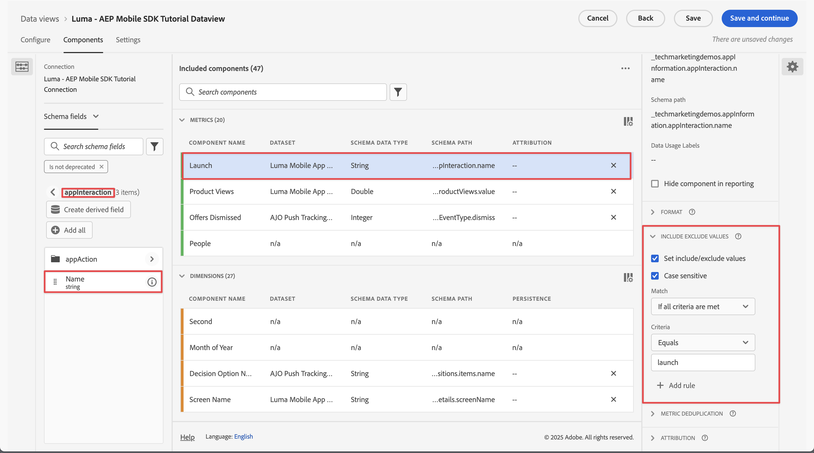
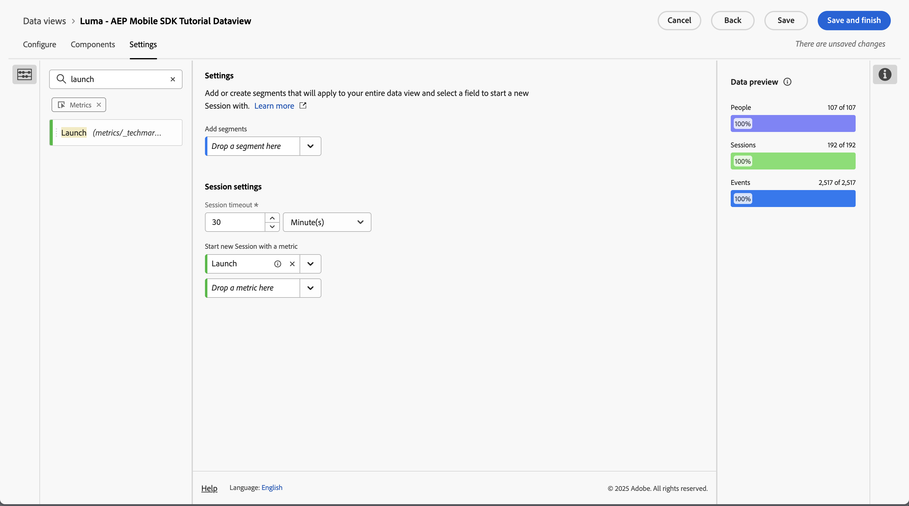

# Impostazioni di sessione {#session-settings}

<!-- markdownlint-disable MD034 -->

>[!CONTEXTUALHELP]
>id="dataview_settings_datapreview"
>title="Anteprima dati"
>abstract="Confronta i dati di questa visualizzazione dati con i dati della connessione. La percentuale di anteprima è basata sul numero totale nella connessione a partire dagli **ultimi 90 giorni**.  Se l’anteprima non viene caricata, è possibile che la connessione sia ancora in retrocompilazione."

<!-- markdownlint-enable MD034 -->

<!-- markdownlint-enable MD034 -->

In Customer Journey Analytics puoi definire una sessione in qualsiasi modo per far corrispondere il modo in cui le persone interagiscono con le tue esperienze digitali. Puoi configurare le impostazioni della sessione all’interno di una visualizzazione dati.

Le definizioni delle impostazioni di sessione sono non distruttive e non alterano i dati sottostanti. Puoi impostare visualizzazioni dati multiple (ciascuna con la propria definizione di impostazioni di sessione specifica) come base per i progetti Workspace.

Per definire il contesto di una sessione per una visualizzazione dati:

1. Seleziona **[!UICONTROL Visualizzazioni dati]**, facoltativamente da **[!UICONTROL Gestione dati]**, nella navigazione principale dell&#39;interfaccia utente di Customer Journey Analytics.

1. Crea una nuova visualizzazione dati o modificane una esistente. Per ulteriori informazioni, consulta [Creare o modificare una visualizzazione dati](create-dataview.md).

1. Seleziona la scheda **[!UICONTROL Impostazioni]**. Sotto [!UICONTROL Impostazioni sessione]:

   1. Immetti un valore per **[!UICONTROL Timeout sessione]** in [!UICONTROL minuti], [!UICONTROL ore], [!UICONTROL giorni] o [!UICONTROL settimane]. Il timeout della sessione determina per quanto tempo una sessione può rimanere inattiva (non si verificano eventi) prima di avviarne una nuova.

      Se ti interessa analizzare principalmente le interazioni online, utilizza un breve timeout di sessione (ad esempio, 30 minuti). Ad esempio, analizzando se i profili che visitano le pagine di prodotti del negozio online aggiungono prodotti al carrello o acquistano anche online.

      Utilizza un timeout di sessione lungo (ad esempio 3 mesi) se stai combinando dati online e offline e desideri analizzare se chi ha acquistato uno o più prodotti ha chiamato il tuo centro assistenza nei primi tre mesi successivi all’acquisto.

   1. Se desideri segmentare una visualizzazione dati, seleziona un segmento dal menu a discesa **[!UICONTROL Aggiungi segmenti]**. In alternativa, puoi trascinare un segmento da  **[!UICONTROL Segmenti]** nel riquadro a sinistra in **[!UICONTROL _Rilasciare un segmento qui_]**.

      Vengono elencati solo i segmenti condivisi, a cui hai accesso e che possono essere valutati in base ai componenti definiti per la visualizzazione dati.

   1. Selezionare una metrica dal menu a discesa **[!UICONTROL Avvia nuova sessione con una metrica]**. In alternativa, puoi trascinare una metrica da  **[!UICONTROL Metriche]** nel riquadro a sinistra di **[!UICONTROL _Rilasciare una metrica qui_]**. La metrica selezionata definisce l’inizio di una nuova sessione. Puoi definire più di una metrica.

      Puoi utilizzare qualsiasi tipo di metrica per definire una nuova sessione. Ad esempio, immagina di voler definire una nuova sessione ogni volta che un profilo avvia la tua app mobile. In **[!UICONTROL Visualizzazione dati]** > **[!UICONTROL Componenti]**, si definisce un componente di tipo metrico, denominato **[!UICONTROL Avvio]**, in base a un campo schema **[!UICONTROL appInteraction]** **[!UICONTROL Nome]**. È inoltre possibile specificare il componente metrico **[!UICONTROL Launch]** per conteggiare solo il valore quando il valore corrisponde a `launch`.

      

      Trascina quindi o seleziona la metrica **[!UICONTROL Launch]** come metrica per definire una nuova sessione.

      

1. Seleziona **[!UICONTROL Salva]** o **[!UICONTROL Salva e termina]** per salvare la definizione delle impostazioni della sessione.
