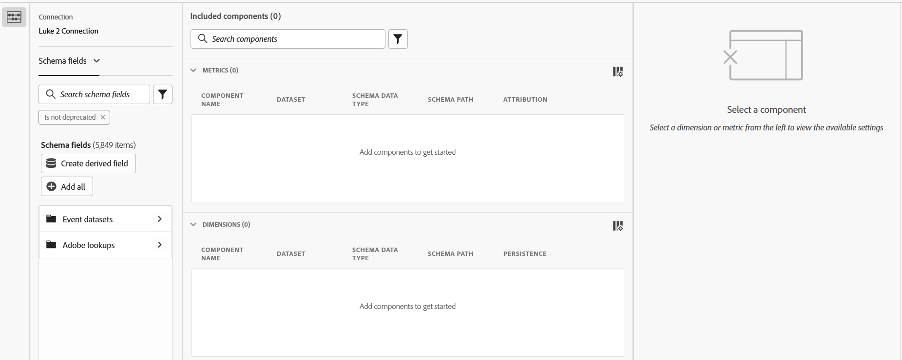

# Editor di componenti condivisi

L’editor dei componenti condivisi consente di creare o modificare dimensioni e metriche condivise. Condivide molti elementi dell&#39;interfaccia utente quando [crea o modifica una visualizzazione dati](/help/data-views/create-dataview.md), ma queste interfacce sono distinte nello scopo:

* L’editor dei componenti della visualizzazione dati consente di creare e modificare componenti specifici di tale visualizzazione dati. Non è possibile modificare le dimensioni o le metriche condivise nell’editor dei componenti della visualizzazione dati. In questa interfaccia, le dimensioni e le metriche condivise possono essere identificate da un&#39;icona  accanto al nome del componente.
* L’editor dei componenti condivisi consente di creare e modificare dimensioni e metriche condivise. Non è possibile modificare i componenti che appartengono a una singola visualizzazione dati nell’editor di componenti condivisi.

In alto a destra sono presenti tre pulsanti:

* **[!UICONTROL Chiudi]** o **[!UICONTROL Annulla]**: se tutte le modifiche vengono salvate, il pulsante **[!UICONTROL Chiudi]** chiude l&#39;editor. Se sono presenti modifiche non salvate, il pulsante **[!UICONTROL Annulla]** chiude l&#39;editor senza salvare le modifiche.
* **[!UICONTROL Salva]**: salva tutti i componenti e mantiene aperto l&#39;editor.
* **[!UICONTROL Salva e termina]**: salva tutti i componenti e chiude l&#39;editor.

L’interfaccia include tre colonne/sezioni principali:

* **Selettore campo schema**: individua i campi schema desiderati e trascinali nell&#39;area dei componenti inclusi.
   * **Connessione**: la connessione attiva. Cambia la connessione attiva in [Gestione metriche e dimensioni condivise](smd-overview.md).
   * **Elenco componenti**: puoi scegliere se selezionare [!UICONTROL Campi schema] (al netto di nuove dimensioni e metriche condivise) o [!UICONTROL Metriche e dimensioni] (componenti condivisi esistenti) dal menu a discesa.
   * **Ricerca**: utilizza la ricerca di testo  per individuare il campo dello schema desiderato o il componente condiviso per nome. È inoltre possibile utilizzare i filtri  per limitare l&#39;elenco dei componenti. Il filtro `Is not deprecated` è attivo per impostazione predefinita.
   * **Crea campo derivato**: consente di [creare un campo derivato](/help/data-views/derived-fields/derived-fields.md).
* **Componenti inclusi**: i componenti configurati per essere condivisi. Durante la creazione di componenti condivisi, puoi trascinare più di un campo schema in quest’area per creare più componenti contemporaneamente. Quando modifichi i componenti condivisi, puoi selezionare più componenti da modificare, in cui sono elencati tutti i componenti selezionati in quest’area.
* **Impostazioni componente**: quando si seleziona un componente nell&#39;area Componenti inclusi, è possibile configurare in questa colonna tutte le impostazioni disponibili. Vedere [Impostazioni dei componenti](/help/data-views/component-settings/overview.md) per tutte le opzioni disponibili per dimensioni e metriche. Maiusc + clic su più elementi nell’area dei componenti inclusi consente di modificare contemporaneamente tutti i campi più comuni.
