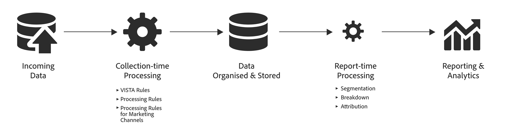

# Confronta l’elaborazione dei dati in Adobe Analytics e Customer Journey Analytics.

Spesso è necessario poter elaborare i dati prima che sia utile per la generazione di rapporti. Puoi elaborare tali dati in diverse fasi del percorso, dalla raccolta dei dati alla generazione del rapporto o della visualizzazione.

In Adobe Analytics la maggior parte di tale elaborazione avviene immediatamente dopo la raccolta dei dati. Funzionalità come Regole VISTA, Regole di elaborazione e Regole di elaborazione dei canali di marketing sono disponibili per supportare questo **elaborazione a tempo di raccolta**.
I dati vengono quindi memorizzati e, al momento del rapporto, puoi applicare un’elaborazione aggiuntiva. Ad esempio, suddividi dimensioni, applica segmentazione o seleziona un modello di attribuzione diverso. Questo **elaborazione a tempo di report** succede al volo.

In Adobe Analytics, l’elaborazione dei tempi di report solitamente rappresenta una quantità di elaborazione inferiore a quella che si verifica al momento della raccolta.

Al contrario, Customer Journey Analytics (CJA) è progettato per richiedere un’elaborazione in tempo reale minima prima che i dati vengano organizzati e archiviati. L’architettura sottostante di CJA è più progettata per lavorare con i dati memorizzati in fase di report e offre la sua potente funzionalità di elaborazione in fase di report non solo in Workspace ma anche, cosa ancora più importante, attraverso la definizione di [componenti](/help/data-views/component-settings/overview.md) e [campi derivati](/help/data-views/derived-fields/derived-fields.md) nelle visualizzazioni dati.

Comprendere le differenze nell’elaborazione dei dati delle varie funzioni di reporting è utile per capire quali metriche sono disponibili e dove e perché possono differire.

Ad esempio, poiché “visite” come metrica in Adobe Analytics viene definita al momento dell’elaborazione dei dati e “sessioni” come metrica in CJA viene calcolata al momento dell’elaborazione del rapporto, le due metriche possono differire in base alle regole utilizzate per la definizione della sessione all’interno della visualizzazione dati di CJA.

Inoltre, né visite né sessioni sono disponibili come metriche nei set di dati creati dal connettore di origine di Analytics e pertanto è necessario definire la sessione nella logica di query per poter eseguire dei confronti.

## Terminologia {#terms}

La tabella seguente definisce la terminologia dei diversi tipi di logica di elaborazione applicati ad Adobe Analytics e CJA:

| Termine | Definizione | Note |
| --- | --- | --- |
| Elaborazione in fase di raccolta | Logica che viene eseguita quando i dati vengono raccolti ed elaborati, prima di essere memorizzati a scopo di reporting e analisi. | Questa logica viene incorporata nei dati storici e in genere non può essere modificata facilmente. |
| Elaborazione a tempo di rapporto | Logica eseguita al momento dell’esecuzione di un rapporto. | Questa logica può essere applicata ai dati futuri e storici in fase di esecuzione del report in modo non distruttivo. |
| Logica a livello di hit | Logica applicata a livello di riga per riga. | Esempi: regole di elaborazione, VISTA, determinate regole dei canali di marketing. |
| Logica a livello di visita | Logica applicata a livello di visita. | Esempi: definizione di visita e sessione. |
| Logica a livello di visitatore | Logica applicata a livello di visitatore. | Esempio: unione di visitatori tra dispositivi e canali. |
| Logica di segmento (filtro) | Valutazione delle regole del segmento (filtro) hit/visita/visitatore (evento/sessione/persona). | Esempio: persone che hanno acquistato delle scarpe rosse. |
| Metriche calcolate | Valutazione delle metriche personalizzate create dai clienti che possono essere basate su formule complesse, inclusi segmenti e filtri. | Esempio: numero di persone che hanno acquistato delle scarpe rosse. |
| Logica di attribuzione | Logica per il calcolo dell’attribuzione. | Esempio: persistenza eVar. |
| Impostazioni dei componenti | Applicazione di personalizzazioni a metriche o dimensioni come attribuzione, comportamento, formato e altri | Esempio: divisione in blocchi dei valori per combinare valori numerici in base a un intervallo |
| Campi personalizzati | La logica si applica ai campi dello schema o standard come parte della definizione dei componenti in una visualizzazione dati. | Esempio: creazione di una nuova dimensione del canale di marketing |

{style="table-layout:auto"}

Nel tempo, Adobe Analytics e ora Customer Journey Analytics hanno migliorato la loro flessibilità consentendo l’esecuzione della logica dei dati a livello di visita e visitatore in fase di esecuzione dei rapporti.

## Tipi di elaborazione dei dati {#types}

I passaggi di elaborazione dei dati eseguiti per Adobe e CJA e le tempistiche di tali passaggi variano in base alla funzione di Analytics. La tabella seguente fornisce un riepilogo dei tipi di elaborazione dei dati di ciascuna funzione di Analytics e indica quando viene applicata l’elaborazione dei dati.

| Funzione | Applicata al momento dell’elaborazione | Applicata al momento del reporting | Non disponibile | Note |
| --- | --- | --- | --- | --- |
| Reporting [core di AA](https://experienceleague.adobe.com/docs/analytics.html?lang=it) (escluse le suite di rapporti virtuali o Attribution IQ con elaborazione al momento del reporting) | <ul><li>[Regole di elaborazione](https://experienceleague.adobe.com/docs/analytics/admin/admin-tools/processing-rules/processing-rules.html?lang=it)</li><li>[Regole VISTA](https://experienceleague.adobe.com/docs/analytics/technotes/terms.html?lang=it)</li><li>[Regole dei canali di marketing](https://experienceleague.adobe.com/docs/analytics/admin/admin-tools/manage-report-suites/edit-report-suite/marketing-channels/c-rules.html?lang=it) a livello di hit</li><li>Regole dei canali di marketing a livello di visita (vedi nota)</li><li>Definizione di visita</li><li>Logica di attribuzione</li></ul> | <ul><li>Logica di segmento</li><li>Metriche calcolate</li></ul> | <ul><li>Analytics tra dispositivi (vedi nota)</li></ul> | <ul><li>CDA richiede l’utilizzo di suite di rapporti virtuali con elaborazione al momento del reporting.</li><li>Le “regole dei canali di marketing a livello di visita” includono: **Is First Page of Visit** (È la prima pagina della visita), **Override Last-Touch Channel** (Sovrascrivi canale di ultimo contatto) e **Marketing Channel Expiration** (Scadenza canale di marketing). Consulta la [documentazione](https://experienceleague.adobe.com/docs/analytics-platform/using/cja-usecases/marketing-channels.html?lang=it).</li></ul> |
| [Data Warehouse](https://experienceleague.adobe.com/docs/analytics/export/data-warehouse/data-warehouse.html?lang=it) core di AA | <ul><li>Regole di elaborazione</li><li>Regole VISTA</li><li>Regole dei canali di marketing a livello di hit</li><li>Regole dei canali di marketing a livello di visita</li><li>Definizione di visita</li><li>Logica di attribuzione</li></ul> | <ul><li>Logica di segmento</li></ul> | <ul><li>Metriche calcolate</li><li>Analytics tra dispositivi</li></ul> |  |
| [Feed dati](https://experienceleague.adobe.com/docs/analytics/export/analytics-data-feed/data-feed-overview.html?lang=it) core di AA | <ul><li>Regole di elaborazione</li><li>Regole VISTA</li><li>Regole dei canali di marketing a livello di hit</li><li>Regole dei canali di marketing a livello di visita</li><li>Definizione di visita (campo visitnum)</li><li>Logica di attribuzione (nelle colonne successive)</li></ul> |  | <ul><li>Logica di segmento</li><li>Metriche calcolate</li><li>Analytics tra dispositivi</li></ul> | <ul><li>Le mappature ID di alcune colonne relative ai canali di marketing nei feed dati non sono incluse nei feed dati. Consulta la [documentazione sui feed dati](https://experienceleague.adobe.com/docs/analytics/export/analytics-data-feed/data-feed-contents/datafeeds-reference.html?lang=it).</li></ul> |
| [Livestream](https://github.com/AdobeDocs/analytics-1.4-apis/blob/master/docs/live-stream-api/getting_started.md) core di AA | <ul><li> Regole di elaborazione</li><li>Regole VISTA</li><ul> |  | <ul><li>Regole dei canali di marketing a livello di hit</li><li>Regole dei canali di marketing a livello di visita</li><li>Logica di visita</li><li>Logica di attribuzione</li><li>Logica di segmento</li><li>Metriche calcolate</li><li>Analytics tra dispositivi</li></ul> |  |
| [Attribution IQ](https://experienceleague.adobe.com/docs/analytics/analyze/analysis-workspace/attribution/overview.html?lang=it) core di AA | <ul><li>Regole di elaborazione</li><li>Regole VISTA</li><li>Definizione di visita (vedi nota)</li><li>Analytics tra dispositivi (vedi nota)</li></ul> | <ul><li>Regole dei canali di marketing a livello di hit (vedi nota)</li><li>Regole dei canali di marketing a livello di visita (vedi nota) Logica di attribuzione</li><li>Logica di segmento</li><li>Metriche calcolate</li></ul> |  | <ul><li>CDA richiede l’utilizzo di suite di rapporti virtuali con elaborazione al momento del reporting.</li><li>Attribution IQ in Analytics core utilizza canali di marketing derivati completamente al momento del reporting (ovvero valori medi derivati).</li><li>Attribution IQ utilizza una definizione di visita al momento dell’elaborazione, tranne quando utilizzato in una suite di rapporti virtuali con elaborazione al momento del reporting.</li></ul> |
| Suite di rapporti virtuali con [elaborazione al momento del reporting](https://experienceleague.adobe.com/docs/analytics/components/virtual-report-suites/vrs-report-time-processing.html?lang=it) (VRS RTP) core di AA | <ul><li>Regole di elaborazione</li><li>Regole VISTA</li><li>[Analytics tra dispositivi](https://experienceleague.adobe.com/docs/analytics/components/cda/overview.html?lang=it)</li></ul> | <ul><li>Definizione di visita</li><li>Logica di attribuzione</li><li>Logica di segmento</li><li>Metriche calcolate</li><li>Altre impostazioni delle suite di rapporti virtuali con elaborazione al momento del reporting</li></ul> | <ul><li>Regole dei canali di marketing a livello di hit</li><li>Regole dei canali di marketing a livello di visita</li></ul> | <ul><li>Consulta la [documentazione](https://experienceleague.adobe.com/docs/analytics/components/virtual-report-suites/vrs-report-time-processing.html?lang=it) relativa alle suite di rapporti virtuali con elaborazione al momento del reporting.</li></ul> |
| Dataset basato sul [connettore di origine di Analytics](https://experienceleague.adobe.com/docs/experience-platform/sources/connectors/adobe-applications/analytics.html?lang=it) nel data lake di AEP | <ul><li>Regole di elaborazione</li><li>Regole VISTA</li><li>Regole dei canali di marketing a livello di hit</li><li>Unione basata sui campi (vedi nota)</li></ul> |  | <ul><li>[Regole dei canali di marketing a livello di visita](https://experienceleague.adobe.com/docs/analytics-platform/using/cja-usecases/marketing-channels.html?lang=it)</li><li>Logica di visita</li><li>Logica di attribuzione</li><li>Logica di filtro</li></ul> | <ul><li>È necessario applicare la propria logica di filtro e le metriche calcolate</li><li>L’unione basata sui campi crea un set di dati unito distinto, in aggiunta a quello creato dal connettore di origine di Analytics.</li></ul> |
| Reporting di [Customer Journey Analytics](https://experienceleague.adobe.com/docs/analytics-platform/using/cja-landing.html?lang=it) | <ul><li>Implementata come parte della raccolta dati di Adobe Experience Platform</li></ul> | <ul><li>Definizione di sessione</li><li>Impostazioni della [visualizzazione dati](https://experienceleague.adobe.com/docs/analytics-platform/using/cja-dataviews/data-views.html?lang=it)<li>Logica di attribuzione</li><li>Metriche calcolate</li><li>Logica di filtro</li></ul> | <ul><li>Regole dei canali di marketing a livello di visita</li></ul> | <ul><li>Per sfruttare le analisi multicanale, è necessario utilizzare set di dati con unione.</li></ul> |

{style="table-layout:auto"}
