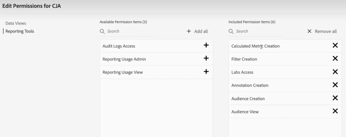

# Controllo degli accessi a CJA

Il Customer Journey Analytics (CJA) è governato da tre livelli di accesso o da tre ruoli: Ruolo di amministratore del prodotto, ruolo di amministratore del profilo di prodotto e accesso a livello di utente. Questo argomento spiega questi ruoli in modo più dettagliato.

## Ruolo di amministratore prodotto

Gli amministratori di prodotto dispongono delle autorizzazioni per completare qualsiasi attività necessaria all’interno di CJA. Devi essere aggiunto come amministratore di prodotto al **Profilo prodotto Customer Journey Analytics** in [Admin Console](https://adminconsole.adobe.com/enterprise/) in Customer Journey Analytics > scheda Amministratori > Aggiungi amministratore. Gli amministratori di prodotto dispongono delle seguenti autorizzazioni:

* Creare/aggiornare/eliminare connessioni o visualizzazioni dati
* Aggiornare o eliminare progetti, filtri, metriche calcolate o filtri creati da altri utenti
* Condividere progetti Workspace con tutti gli utenti

Per poter creare, aggiornare o eliminare una connessione, non è sufficiente diventare amministratore di prodotto in Customer Journey Analytics. Per creare una connessione a un set di dati di Experience Platform, è necessario disporre anche di autorizzazioni Experience Platform. In particolare, devi far parte di un **profilo di prodotto Experience Platform** che ti fornisca le seguenti autorizzazioni:

* Modellazione dati: visualizzare schemi, gestire schemi
* Gestione dati: visualizzare i set di dati, gestire i set di dati
* Acquisizione dei dati: gestisci origini
* Visualizzare gli spazi dei nomi delle identità

Per ulteriori informazioni sulle autorizzazioni di Experience Platform, consulta [Controllo degli accessi in Adobe Experience Platform](https://experienceleague.adobe.com/docs/experience-platform/access-control/home.html?lang=it).

## Ruolo amministratore del profilo di prodotto

Questo ruolo è simile all’amministratore di prodotto, ma ha un ambito più limitato. Un profilo di prodotto è un insieme di autorizzazioni. Ad esempio, un amministratore del profilo di prodotto può concedere l’accesso a tutte le visualizzazioni di dati o a specifiche per i membri di un profilo di prodotto. Per gli strumenti di reporting, questi amministratori possono aggiungere le seguenti autorizzazioni:

## Accesso a livello di utente

Gli amministratori non di prodotto (utenti) nel Customer Journey Analytics non possono creare, modificare o visualizzare visualizzazioni dati o connessioni. Gli utenti possono creare filtri, progetti, tipi di pubblico e metriche calcolate con autorizzazioni speciali nell’Admin Console.

## Cura dei progetti Workspace

Per ulteriori informazioni su come limitare i componenti (dimensioni, metriche, segmenti, intervalli di date) a livello di progetto Workspace e come la cura è associata alle visualizzazioni dati, consulta [Cura progetti](/help/analysis-workspace/curate-share/curate.md).

## Consentire l’accesso a singole metriche o dimensioni

Non puoi concedere o negare autorizzazioni sulle singole metriche o dimensioni in Customer Journey Analytics, come invece puoi fare in Adobe Analytics. Le metriche e le dimensioni possono essere modificate nelle [visualizzazioni dati](/help/data-views/data-views.md) e sono quindi soggette a modifiche in CJA, con conseguenti modifiche retroattive nella generazione di rapporti.

