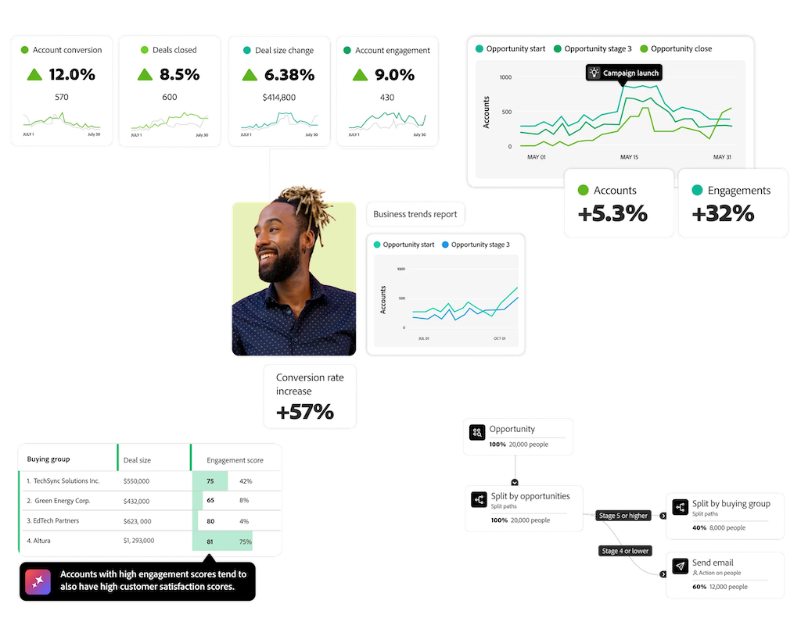

# Customer Journey Analytics B2B Edition

{{b2b-edition}}

Adobe Analytics è nato come strumento di analisi web e digitale per i marketer, mentre Customer Journey Analytics ha ampliato l’ambito per includere dati multicanale, offline e multipiattaforma.  Entrambi gli strumenti aiutano le aziende B2C (Business to Consumer) ad analizzare e ottimizzare le proprie attività di marketing e le esperienze della clientela. Inoltre, sono incentrati sul **reporting e l’analisi basati su persona**: comprendono il percorso cliente, ovvero la persona che interagisce con il tuo brand su più canali.

Customer Journey Analytics B2B edition aggiunge **reporting e analisi basati sull&#39;account**. Nelle vendite B2B (business-to-business), il percorso di acquisto coinvolge più parti, punti di contatto, online e offline, e fasi chiave prima della conclusione di un’affare. Le aziende B2B hanno bisogno di tracciare tutte queste interazioni in un percorso unificato, così da analizzare e ottimizzare in modo efficace le attività di marketing e le esperienze degli account.

Le caratteristiche tipiche della vendita B2B sono:

* importi elevati delle transazioni
* cicli di vendita lunghi
* più responsabili decisionali e influencer, i quali in genere costituiscono il “gruppo acquisti”
* acquirenti più istruiti
* maggiore importanza alla fidelizzazione della clientela e vendite in upselling
* acquirenti B2B Millennial, con l’esigenza di un’esperienza di acquisto più fluida, in quanto “consumatori digitali”

Il marketing B2B è incentrato sull’ottimizzazione dei punti di contatto e sulla riduzione del ciclo di acquisto e considerazione. Poiché i cicli di vendita B2B si basano fortemente su riunioni di persona, interazioni offline come eventi dal vivo, e utilizzando gruppi acquisti, i soli dati digitali basati sulla persona non sono sufficienti. Le organizzazioni B2B completano questo processo con i dati provenienti dai sistemi CRM e da soluzioni specializzate. Tuttavia, i componenti di marketing B2C tradizionali, le campagne, i canali e i visitatori del sito, svolgono ancora un ruolo cruciale nel marketing B2B.

Le vendite e il marketing B2B si sono evoluti oltre i tradizionali funnel di generazione dei lead, incentrandosi sui cicli di vita della clientela e sui gruppi acquisti. Questo cambiamento rispecchia la natura mutevole degli acquisti B2B, dove le decisioni coinvolgono più stakeholder attraverso vari punti di contatto. Gli attuali acquirenti B2B seguono un processo decisionale complesso e non lineare. Come la clientela B2C, preferiscono svolgere ricerche in modo indipendente prima di interagire con i team di vendita. Il passaparola e i social media oggi giocano un ruolo chiave nel determinare le loro decisioni di acquisto.

I marketer B2B affrontano una pressione crescente per dimostrare in che modo le relative attività contribuiscono alla generazione di ricavi.  Anche se è fondamentale allineare le attività di marketing agli obiettivi aziendali e misurare l’impatto sui ricavi, molti strumenti di misurazione sono progettati per scenari B2C. Di conseguenza, i marketer B2B stanno cercando strumenti dedicati che forniscono informazioni accurate e sono in linea con i loro obiettivi specifici.

Customer Journey Analytics B2B Edition aiuta le aziende B2B ad allineare i team di marketing, vendita e prodotto fornendo insight sugli account da utilizzare per stimolare la crescita dei ricavi. Collocando l’account al centro del modello dati, tutte le analisi si concentrano sul suo percorso. L’aggiunta di un nuovo livello di entità (account, opportunità e gruppi acquisti), oltre a eventi basati su persona e tempo, crea un quadro completo del ciclo di vita di marketing e ricavi B2B.

>[!MORELIKETHIS]
>
>Concetti e funzionalità di [B2B](cja-b2b-concepts-features.md)
>[Guida rapida B2B](cja-b2b-quick-start-guide.md)
>[Guida alla transizione B2B](cja-b2b-transition.md)
>[Casi d’uso B2B](/help/use-cases/b2b/b2b-edition/use-cases-overview.md)
>
