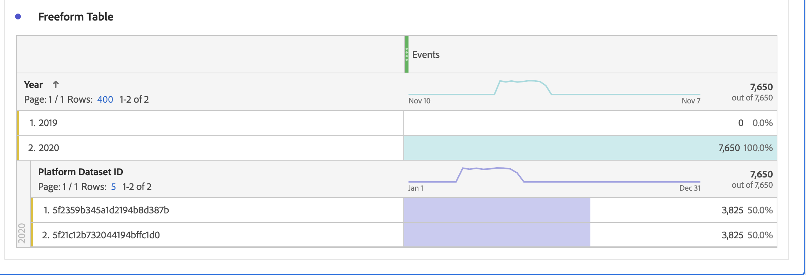

# Domande frequenti

Adobe Customer Journey Analytics è il nostro prodotto di analisi di nuova generazione. Di seguito sono riportate le risposte alle domande più frequenti sul Customer Journey Analytics. Per ulteriori informazioni, consulta [Supporto delle funzioni di Customer Journey Analytics](/help/getting-started/aa-vs-cja/cja-aa.md).

## 1. Prerequisiti {#prerequisites}

+++**Sono necessari [!UICONTROL Private Device Graph] o [!UICONTROL Device Coop] per [!UICONTROL Customer Journey Analytics]?**

No, [!UICONTROL Private Device Graph] o [!UICONTROL Device Coop] non sono necessari per [!UICONTROL Customer Journey Analytics]. Al momento non sono ancora supportati.

+++

+++**È necessario [!UICONTROL Experience Cloud ID] (ECID) per [!UICONTROL Customer Journey Analytics]?**

No, [!UICONTROL Customer Journey Analytics] supporta qualsiasi ID in un set di dati, sia che si tratti di [!UICONTROL ECID] o di qualsiasi altro ID scelto.

+++

+++**In che modo si possono effettuare operazioni di ETL (Extract, Transform, Load, ovvero Estrai, Trasforma, Carica) sui dati prima di inserirli in [!UICONTROL Customer Journey Analytics]?**

Customer Journey Analytics include funzionalità di [Preparazione dati](https://experienceleague.adobe.com/docs/experience-platform/data-prep/api/overview.html?lang=it) per trasformare i dati prima di inserirli nel data lake di Adobe Experience Platform. Se hai bisogno di ETL dopo che i dati sono già stati acquisiti, [Adobe Experience Platform Query Service](https://experienceleague.adobe.com/docs/platform-learn/tutorials/queries/understanding-query-service.html?lang=it#queries) offre alcune opzioni limitate; tieni presente che potrebbe comportare costi aggiuntivi.

+++

## 2. Unione dei dati {#stitching}

+++**[!UICONTROL Customer Journey Analytics] può unire per dispositivi o per set di dati?**

Sì. [!UICONTROL Customer Journey Analytics] ha [Stitching](../stitching/overview.md) funzionalità che funziona tra eventi autenticati e non autenticati all’interno di un set di dati. Questo consente di risolvere record diversi in un singolo ID unito, per l’analisi tra dispositivi a livello di persona.
Inoltre, quando un ID dello spazio dei nomi comune (ID persona) viene utilizzato tra set di dati all’interno di un [Connessione](/help/connections/overview.md), potrai eseguire l’analisi su una combinazione perfetta di più set di dati, &quot;uniti&quot; a livello di persona.

+++

+++**L&#39;unione da un comportamento anonimo a un comportamento autenticato è supportata?**

Sì. [Stitching](../stitching/overview.md) esamina i dati utente provenienti da sessioni autenticate e non autenticate per generare un ID unico.

+++

+++**Come funziona la &quot;ripetizione&quot; nell’unione?**

L’unione di dati di &quot;ripetizione&quot; si basa su identificatori univoci appresi. La riproduzione ha lo scopo di unire gli eventi inizialmente non autenticati da dispositivi che sono stati identificati nel frattempo. [Ulteriori informazioni](../stitching/explained.md)

+++

+++**Come funziona l’unione dei dati storici (retrocompilazione)?**

Quando CCA è attivato per la prima volta, Adobe fornisce la retrocompilazione dei dati uniti che risalgono all’inizio del mese precedente (fino a 60 giorni). Per eseguire questa operazione di recupero, l’ID transitorio deve esistere nei dati non uniti che risalgono al periodo precedente. [Ulteriori informazioni](../stitching/explained.md)

+++

+++**Qual è il comportamento previsto per i record di set di dati di profilo non uniti?**

**Scenario di esempio**: unisci 2 set di dati in una connessione di Customer Journey Analytics utilizzando `CRMid` come ID persona. Uno è un set di dati dell’evento web con `CRMid` in tutti i record, mentre l’altro è un set di dati di profilo CRM. Il 40% del set di dati CRM ha `CRMid` presente nel set di dati dell’evento web. L’altro 60% non è presente nel set di dati dell’evento web: questi record vengono visualizzati nel reporting in Analysis Workspace?
 **Risposta**: le righe di profilo senza eventi associati a esse vengono memorizzate nel Customer Journey Analytics. Tuttavia, non le puoi visualizzare in Analysis Workspace finché non viene visualizzato un evento associato a tale ID.

+++

## 3. Come inserire dati in [!UICONTROL Customer Journey Analytics] {#ingest}

+++**È possibile combinare i dati di diverse sandbox di [!UICONTROL Adobe Experience Platform] in una connessione [!UICONTROL Customer Journey Analytics]?**

No, non è possibile accedere ai dati di sandbox diverse. È possibile combinare solo i set di dati che si trovano all’interno della stessa sandbox. [Ulteriori informazioni](https://experienceleague.adobe.com/docs/analytics-platform/using/cja-connections/create-connection.html?lang=it#select-sandbox-and-datasets)

+++

+++**Come si collegano i dati online ai dati offline in [!UICONTROL Customer Journey Analytics]?**

Se l’ID della persona corrisponde nei diversi set di dati, [!UICONTROL Customer Journey Analytics] può collegare filtri, attribuzione, flusso, abbandono e così via. tra i vari set di dati.

+++

+++**Come posso acquisire dati offline in [!UICONTROL Customer Journey Analytics]?**

La licenza di Customer Journey Analytics consente di acquisire i dati in Experience Platform. Puoi quindi creare connessioni a tali dati e visualizzazioni di dati in [!UICONTROL Customer Journey Analytics], da utilizzare per la generazione di rapporti in Analysis Workspace. Se necessario, il team di Experience Platform che si occupa dell’onboarding dei dati ti può fornire consigli o consulenza.

+++

+++**Come posso inserire i dati di [!UICONTROL Adobe Analytics] in [!UICONTROL Customer Journey Analytics]?**

I dati di [!UICONTROL Adobe Analytics] possono essere collegati a Experience Platform tramite [Adobe Analytics Source Connector](https://experienceleague.adobe.com/docs/experience-platform/sources/connectors/adobe-applications/analytics.html?lang=it). La maggior parte dei campi [!UICONTROL Adobe Analytics] vengono trasferiti in formato XDM, ma alcuni campi non sono ancora disponibili.

+++

+++**Quanto tempo è necessario per assemblare gli elementi dei set di dati in una visualizzazione dati?**

Poche ore per iniziare e qualche giorno per recuperare gli ultimi 13 mesi di dati.

+++

+++**È necessario acquisire i dati PII per stabilire connessioni tra i dati?**

No, puoi utilizzare qualsiasi ID, incluso un hash di un ID cliente, che non è un PII.

+++

+++**Quali sono i limiti per l’acquisizione di date/marche temporali passate o future nei set di dati evento di Customer Journey Analytics?**

<ul><li>Per quanto riguarda le date/marche temporali passate: dati evento fino a 10 anni.</li><li>Per quanto riguarda le date/marche temporali future: dati evento (predittivi) fino a un mese nel futuro.</li></ul>

+++

## 4. Considerazioni sulla latenza {#latency}

>[!NOTE]
>Non esiste una dimensione fissa dei dati nel Customer Journey Analytics e quindi Adobe non può eseguire il commit a un tempo di acquisizione standard. Stiamo lavorando attivamente per ridurre queste latenze attraverso nuovi aggiornamenti e l’ottimizzazione dell’acquisizione.

<ul><li>Dati o eventi live: elaborati e acquisiti entro 90 minuti, una volta che i dati sono disponibili in Adobe Experience Platform. (Dimensione batch &gt; 50 milioni di righe: più di 90 minuti).</li><li>Backfill di piccole dimensioni: entro 7 giorni<li>Backfill ampi: entro 30 giorni</li></ul>

Abbiamo recentemente modificato il modo in cui i dati vengono elaborati nel Customer Journey Analytics:

<ul><li>Viene inviato in streaming qualsiasi dato evento con una marca temporale precedente a 24 ore.</li><li>Qualsiasi dato evento con una marca temporale più vecchia di 24 ore (anche se si trova nello stesso batch dei dati più recenti) viene considerato come backfill e verrà acquisito con una priorità inferiore.</li></ul>

## 5. Finestra continua per la conservazione dei dati [!UICONTROL Connection] {#data-retention}

Il [**[!UICONTROL Enable rolling data window]**impostazione](https://experienceleague.adobe.com/docs/analytics-platform/using/cja-connections/create-connection.html?lang=it#create-connection) consente di definire la conservazione dei dati di Customer Journey Analytics come finestra continua in mesi (3 mesi, 6 mesi, ecc.). È impostata a livello di [!UICONTROL connection], non a livello di [!UICONTROL dataset]. La conservazione dei dati si basa sulle marche temporali dei set di dati dell’evento e si applica solo ai set di dati dell’evento. Non esiste alcuna impostazione di conservazione dei dati per i set di dati di profilo o di ricerca, in quanto non sono disponibili marche temporali applicabili.

Il vantaggio principale consiste nell’archiviare o generare rapporti solo sui dati applicabili e utili, nonché nell’eliminare i dati meno recenti che non sono più utili. Ti aiuta a rispettare i limiti del tuo contratto e riduce il rischio di sovraccosti.

## 6. Implicazioni dell’eliminazione di componenti dati {#deletion}

Per quanto riguarda l’eliminazione dei dati, ci occupiamo di 6 tipi di componenti: sandbox, schema, set di dati, connessione, visualizzazione dati e progetto Workspace. Di seguito sono riportati alcuni possibili scenari relativi all’eliminazione di uno di questi componenti:

| Azione | Risultato |
| --- | --- |
| Eliminare una sandbox in [!UICONTROL Adobe Experience Platform] | L’eliminazione di una sandbox interrompe il flusso di dati a qualsiasi connessione [!UICONTROL Customer Journey Analytics] per il set di dati in tale sandbox. Attualmente, [!UICONTROL Connections] nel Customer Journey Analytics associato alla sandbox eliminata non vengono eliminati automaticamente. |
| Eliminare uno schema in [!UICONTROL Adobe Experience Platform], ma non i set di dati associati a tale schema | [!UICONTROL Adobe Experience Platform] non consente di eliminare gli [!UICONTROL schemas] a cui sono associati uno o [!UICONTROL datasets]. Tuttavia, un amministratore che dispone delle autorizzazioni appropriate può prima eliminare i set di dati, e quindi eliminare lo schema. |
| Eliminare un set di dati nel data lake di [!UICONTROL Adobe Experience Platform] | L’eliminazione di un set di dati nel data lake di Adobe Experience Platform interrompe il flusso di dati da tale set di dati a qualsiasi connessione di Customer Journey Analytics che lo include. Tutti i dati provenienti da tale set di dati vengono eliminati automaticamente dalle connessioni di Customer Journey Analytics associate. |
| Eliminare un set di dati in [!UICONTROL Customer Journey Analytics] | Contatta il team dell’account Adobe per avviare la procedura di eliminazione di un set di dati all’interno di una connessione salvata. |
| Eliminare un batch da un set di dati (in [!UICONTROL Adobe Experience Platform]) | Se un batch viene eliminato da un [!UICONTROL Adobe Experience Platform] lo stesso batch verrà rimosso da tutte le connessioni di Customer Journey Analytics che contengono tale batch specifico.  Il Customer Journey Analytics riceve una notifica dell&#39;eliminazione del batch in [!UICONTROL Adobe Experience Platform]. |
| Eliminare un batch **durante l’acquisizione** in [!UICONTROL Customer Journey Analytics] | Se nel set di dati è presente un solo batch, in [!UICONTROL Customer Journey Analytics] non verranno visualizzati dati o dati parziale da tale batch. L’acquisizione verrà annullata e verrà ripristinato lo stato precedente. Se, ad esempio, nel set di dati sono presenti 5 batch e 3 di essi sono già stati acquisiti al momento dell’eliminazione del set di dati, i dati di tali 3 batch vengono visualizzati in [!UICONTROL Customer Journey Analytics]. |
| Eliminare una connessione in [!UICONTROL Customer Journey Analytics] | Un messaggio di errore indica che:<ul><li>Tutte le visualizzazioni dati create per la connessione eliminata non funzioneranno più.</li><li> Analogamente, tutti i progetti Workspace che dipendono dalle visualizzazioni dati nella connessione eliminata cesseranno di funzionare.</li></ul> |
| Eliminare una visualizzazione di dati in [!UICONTROL Customer Journey Analytics] | Un messaggio di errore indica che tutti i progetti Workspace dipendenti da questa visualizzazione dati eliminata cesseranno di funzionare. |

## 7. Considerazioni durante l’unione delle suite di rapporti nel Customer Journey Analytics {#merge-reportsuite}

Se prevedi di acquisire dati Adobe Analytics tramite il [connettore di origine Adobe Analytics](https://experienceleague.adobe.com/docs/experience-platform/sources/connectors/adobe-applications/analytics.html?lang=it), considera queste ramificazioni quando unisci 2 o più suite di rapporti Adobe Analytics.

| Problema | Considerazione |
| --- | --- |
| Variabili | Le variabili come [!UICONTROL eVars] potrebbero non essere allineate tra le diverse suite di rapporti. Ad esempio, nella suite di rapporti 1 la variabile eVar1 può fare riferimento a **[!UICONTROL Page]**. Nella suite di rapporti 2, la variabile eVar1 può invece fare riferimento a **[!UICONTROL Internal Campaign]**. In tal caso verranno generati rapporti con valori misti e imprecisi. |
| Conteggi di [!UICONTROL Sessions] e [!UICONTROL People] | Vengono deduplicati in tutte le suite di rapporti. Di conseguenza, i conteggi potrebbero non corrispondere. |
| Deduplicazione delle metriche | Deduplica le istanze di una metrica (ad esempio, [!UICONTROL Orders]) se più righe hanno lo stesso ID transazione (ad esempio, [!UICONTROL Purchase ID]). Questo impedisce che il conteggio delle metriche chiave risulti superiore ai dati effettivi. Di conseguenza, le metriche come [!UICONTROL Orders] potrebbero non corrispondere tra suite di rapporti diverse. |
| Valuta | La conversione della valuta non è ancora supportata nel Customer Journey Analytics. Se le suite di rapporti che stai tentando di unire utilizzano valute di base diverse, potrebbero verificarsi dei problemi. |
| [!UICONTROL Persistence] | La [persistenza ](../data-views/component-settings/persistence.md) si estende alle varie suite di rapporti, il che ha un impatto su [!UICONTROL filters], [!UICONTROL attribution] e così via. È possibile che i numeri non corrispondano correttamente. |
| [!UICONTROL Classifications] | I dati di [!UICONTROL Classifications] non vengono deduplicati automaticamente durante l’unione di suite di rapporti. Quando si combinano più file di classificazione in un unico [!UICONTROL lookup] set di dati, potrebbero verificarsi dei problemi. |

## 8. [!UICONTROL Adobe Analytics] componenti

+++**Posso condividere/pubblicare? [!UICONTROL filters] da [!DNL Customer Journey Analytics] ad Experienci Platform Real-Time CDP o ad altre applicazioni Experienci Cloud?**

Non ancora, ma stiamo mettendo a punto questa funzionalità.

+++

+++**Cos’è successo alla mia vecchia impostazione [!UICONTROL eVar]?**

[!UICONTROL eVars], [!UICONTROL props], e [!UICONTROL events] nel senso di Adobe Analytics non esiste più in [!UICONTROL Customer Journey Analytics]. Sono disponibili elementi schema illimitati (dimensioni, metriche, campi elenco). Di conseguenza, tutte le impostazioni di attribuzione che si applicavano durante il processo di raccolta dei dati vengono ora applicate al momento della query.

+++

+++**Dove sono ora tutte le impostazioni di persistenza relative alla sessione e alle variabili?**

[!UICONTROL Customer Journey Analytics] applica tutte queste impostazioni al momento di creazione del rapporto ed esse si trovano ora nelle visualizzazioni dati. Le modifiche a queste impostazioni sono ora retroattive e puoi avere più versioni utilizzando più visualizzazioni dati.

+++

+++**Cosa succede ai segmenti o alle metriche calcolate esistenti?**

[!UICONTROL Customer Journey Analytics] Al posto di eVar, prop o eventi, utilizza qualsiasi schema Adobe Experience Platform. Ciò significa che nessuno dei segmenti o delle metriche calcolate esistenti è compatibile con [!UICONTROL Customer Journey Analytics].

+++

+++**In che modo [!UICONTROL Customer Journey Analytics] gestisce i limiti di `Uniques Exceeded`?**

[!UICONTROL Customer Journey Analytics] non ha limiti di valore univoci, quindi non è necessario preoccuparsene.

+++

+++**Se sono già un cliente di [!DNL Data Workbench], posso passare subito a [!UICONTROL Customer Journey Analytics]?**

Dipende dal tuo caso d’uso: collabora con il team del tuo account Adobe. I tuoi casi d’uso attuali potrebbero già essere gestiti con Customer Journey Analytics!

+++

## 9. Stimare la dimensione della connessione {#estimate-size}

Consulta la sezione [Stimare e gestire l’utilizzo](/help/admin/estimate-usage.md).

## 10. Superamento del limite di utilizzo {#overage}

I limiti di utilizzo vengono regolarmente monitorati da Adobe, per verificarne il rispetto. Il numero consentito di “Rows of Data” (Righe di dati) si riferisce alla media giornaliera di righe di dati disponibili per l’analisi in Customer Journey Analytics.

Supponiamo ad esempio che il tuo contratto ti dia diritto a un milione di righe di dati. Supponiamo poi che il giorno 1 di utilizzo di Customer Journey Analytics vengano caricati due milioni di righe di dati. Il giorno 2, elimini 1 milione di righe e mantieni l’utilizzo entro il massimo consentito (ovvero, un milione di righe di dati) per il resto del periodo di licenza. A seconda dei termini contrattuali, è comunque possibile che vengano applicate tariffe di utilizzo eccessivo proporzionati per il giorno 1, quando è stato superato il limite di righe di dati consentito dalla tua licenza.

## 11. Diagnosticare le discrepanze nei dati {#discrepancies}

In alcuni casi, puoi notare che il numero totale di eventi acquisiti dalla connessione è diverso dal numero di righe nel set di dati in [!UICONTROL Adobe Experience Platform]. In questo esempio, il set di dati “Impressione B2B” ha 7650 righe, ma il set di dati contiene 3830 righe in [!UICONTROL Adobe Experience Platform]. Ci sono diversi motivi per cui possono verificarsi discrepanze e possono essere adottate le seguenti misure per diagnosticare:

1. Suddividi questa dimensione per **[!UICONTROL Platform Dataset ID]** e noterai due set di dati con le stesse dimensioni ma diversi **[!UICONTROL Platform Dataset IDs]**. Ogni set di dati ha 3825 record. Ciò significa che [!UICONTROL Customer Journey Analytics] ha ignorato 5 record a causa di ID persona mancanti o marche temporali mancanti:

   

1. Inoltre, se controlliamo in [!UICONTROL Adobe Experience Platform], non esiste un set di dati con ID &quot;5f21c12b732044194bffc1d0&quot;, quindi qualcuno ha cancellato questo particolare set di dati da [!UICONTROL Adobe Experience Platform] quando è stata creata la connessione iniziale. In seguito, è stato aggiunto di nuovo al Customer Journey Analytics, ma un [!UICONTROL Platform Dataset ID] è stato generato da [!UICONTROL Adobe Experience Platform].

Per ulteriori informazioni, leggi la sezione sulle [implicazioni dell’eliminazione di set di dati e connessioni](https://experienceleague.adobe.com/docs/analytics-platform/using/cja-overview/cja-faq.html?lang=it#implications-of-deleting-data-components) in [!UICONTROL Customer Journey Analytics] e [!UICONTROL Adobe Experience Platform].
