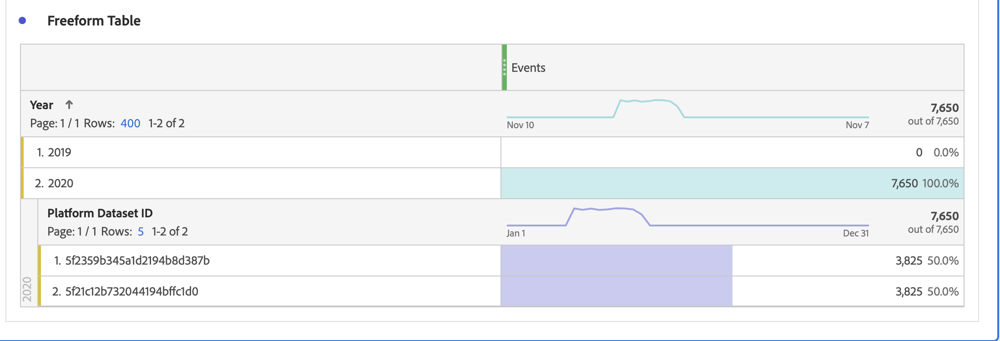

# Domande frequenti

Adobe Customer Journey Analytics è il nostro prodotto di analisi di nuova generazione. Questo articolo fornisce le risposte alle domande più frequenti su Customer Journey Analytics. Per ulteriori informazioni, consulta [Supporto delle funzioni di Customer Journey Analytics](/help/getting-started/aa-vs-cja/cja-aa.md).

## &#x200B;1. Prerequisiti {#prerequisites}

+++**Sono necessari [!UICONTROL Device Graph privato] o [!UICONTROL Device Coop] per utilizzare [!UICONTROL Customer Journey Analytics]?**

No, per utilizzare [!UICONTROL Customer Journey Analytics] non sono necessari [!UICONTROL Device Graph privato] o [!UICONTROL Device Coop]. Al momento non sono ancora supportati.

+++

+++**È necessario [!UICONTROL Experience Cloud ID] (ECID) per utilizzare [!UICONTROL Customer Journey Analytics]?**

No, [!UICONTROL Customer Journey Analytics] supporta qualsiasi ID in un seti di dati, sia esso [!UICONTROL ECID] o qualsiasi altro ID scelto.

+++

+++**In che modo posso effettuare operazioni di ETL (Extract, Transform, Load, ovvero Estrai, Trasforma, Carica) sui dati prima di inserirli in [!UICONTROL Customer Journey Analytics]?**

Customer Journey Analytics include funzionalità di [Preparazione dati](https://experienceleague.adobe.com/docs/experience-platform/data-prep/api/overview.html?lang=it) per trasformare i dati prima di inserirli nel data lake di Adobe Experience Platform. Se hai bisogno di ETL dopo che i dati sono già stati acquisiti, [Query Service di Adobe Experience Platform](https://experienceleague.adobe.com/docs/platform-learn/tutorials/queries/understanding-query-service.html?lang=it#queries) offre alcune opzioni limitate; tieni presente che potrebbe comportare costi aggiuntivi.

+++

## &#x200B;2. Unione dei dati {#stitching}

+++**[!UICONTROL Customer Journey Analytics] può effettuare l&#39;unione tra dispositivi o tra set di dati??**

Sì. [!UICONTROL Customer Journey Analytics] dispone della funzionalità di [Unione](../stitching/overview.md) che funziona tra eventi autenticati e non autenticati all’interno di un set di dati. Questa unione consente di risolvere record diversi in un singolo ID unito, per l’analisi cross-device a livello di persona.
Inoltre, quando un ID dello spazio dei nomi comune (ID persona) viene utilizzato tra set di dati all’interno di una [Connessione](/help/connections/overview.md), puoi eseguire l’analisi direttamente su una combinazione di più set di dati, “uniti” a livello di persona.

+++

+++**L&#39;unione da un comportamento anonimo a un comportamento autenticato è supportata?**

Sì. L’[unione](../stitching/overview.md) esamina i dati utente provenienti da sessioni autenticate e non autenticate per generare un ID unito.

+++

+++**Come funziona la “ripetizione” nell’unione?**

L’unione “ripete” i dati in base a identificatori univoci appresi. La ripetizione ha lo scopo di unire gli eventi inizialmente non autenticati da dispositivi che nel frattempo sono stati identificati. [Ulteriori informazioni](../stitching/overview.md)

+++

+++**Come funziona l’unione dei dati storici (retrocompilazione)?**

Quando è attivato per la prima volta, Adobe fornisce la retrocompilazione dei dati uniti che risale fino a quanto selezionato (fino a un massimo di 25 mesi, a seconda del pacchetto di Customer Journey Analytics a cui hai diritto). Per eseguire questa operazione di recupero, l’ID transitorio deve esistere nei dati non uniti che risalgono al periodo precedente. [Ulteriori informazioni](../stitching/overview.md)

+++

+++**Qual è il comportamento previsto per i record di set di dati di profilo non uniti?**

**Scenario di esempio**: unisci due set di dati in una connessione Customer Journey Analytics utilizzando `CRMid` come ID persona. Uno è un set di dati dell’evento web con `CRMid` in tutti i record, mentre l’altro è un set di dati di profilo CRM. Il 40% del set di dati CRM ha `CRMid` presente nel set di dati dell’evento web. L’altro 60% non è presente nel set di dati dell’evento web: questi record vengono visualizzati nel reporting in Analysis Workspace?
 **Risposta**: le righe di profilo senza eventi associati vengono memorizzate in Customer Journey Analytics. Tuttavia, non le puoi visualizzare in Analysis Workspace finché non viene visualizzato un evento associato a tale ID.

+++

## &#x200B;3. Come inserire dati in [!UICONTROL Customer Journey Analytics] {#ingest}

+++**Posso combinare i dati di diverse sandbox di [!UICONTROL Adobe Experience Platform] in una connessione [!UICONTROL Customer Journey Analytics]?**

No, non è possibile accedere ai dati di sandbox diverse. È possibile combinare solo i set di dati che si trovano all’interno della stessa sandbox. [Ulteriori informazioni](https://experienceleague.adobe.com/docs/analytics-platform/using/cja-connections/create-connection.html?lang=it#select-sandbox-and-datasets)

+++

+++**Come posso collegare i dati online ai dati offline in [!UICONTROL Customer Journey Analytics]?**

Finché l’ID della persona corrisponde tra i set di dati, [!UICONTROL Customer Journey Analytics] può collegare segmenti, attribuzione, flusso, fallout e così via tra i set di dati.

+++

+++**Come posso acquisire dati offline in [!UICONTROL Customer Journey Analytics]?**

La licenza di Customer Journey Analytics consente di acquisire i dati in Experience Platform. Puoi quindi creare connessioni a tali dati e visualizzazioni dati in [!UICONTROL Customer Journey Analytics], da utilizzare per il reporting in Analysis Workspace. Se necessario, il team di Experience Platform che si occupa dell’onboarding dei dati ti può fornire consigli o consulenza.

+++

+++**Come posso inserire i dati di [!UICONTROL Adobe Analytics] in [!UICONTROL Customer Journey Analytics]?**

Puoi collegare i dati di [!UICONTROL Adobe Analytics] a Experience Platform tramite [Connettore di origine di Analytics](https://experienceleague.adobe.com/docs/experience-platform/sources/connectors/adobe-applications/analytics.html?lang=it). La maggior parte dei campi di [!UICONTROL Adobe Analytics] vengono trasferiti in formato XDM, ma alcuni campi non sono ancora disponibili.

+++

+++**Quanto tempo è necessario per assemblare gli elementi dei set di dati in una visualizzazione dati?**

Poche ore per iniziare e qualche giorno per recuperare gli ultimi 13 mesi di dati.

+++

+++**È necessario acquisire i dati PII per stabilire connessioni tra i dati?**

No, puoi utilizzare qualsiasi ID, incluso un hash di un ID cliente, che non è un PII.

+++

+++**Quali sono i limiti per l’acquisizione di date/marche temporali passate o future nei set di dati evento di Customer Journey Analytics?**

* Per quanto riguarda le date/marche temporali passate: dati evento fino a 10 anni.
* Per quanto riguarda le date/marche temporali future: dati evento (predittivi) fino a un mese nel futuro.

+++

## &#x200B;4. Considerazioni sulla latenza {#latency}

>[!NOTE]
>
>Non esiste una dimensione fissa dei dati in Customer Journey Analytics e pertanto Adobe non può eseguire il commit per un tempo di acquisizione standard. Adobe sta lavorando attivamente per ridurre queste latenze attraverso nuovi aggiornamenti e l’ottimizzazione dell’acquisizione.

* Dati o eventi live: elaborati e acquisiti entro 90 minuti, una volta che i dati sono disponibili in Adobe Experience Platform. (Dimensione batch > 50 milioni di righe: più di 90 minuti). Se l’unione è abilitata, l’acquisizione può richiedere fino a 4 ore. Per ulteriori dettagli, consulta [Guardrail](https://experienceleague.adobe.com/it/docs/analytics-platform/using/technotes/guardrails).
* Backfill di piccole dimensioni: entro sette giorni
* Backfill di grandi dimensioni: entro 30 giorni

Di recente, Adobe ha modificato il modo in cui i dati vengono elaborati in Customer Journey Analytics.

* I dati evento per il giorno “corrente” vengono inviati in streaming come dati live. Tutti i dati con un orario di evento precedente alle 23:59:59 23:59:59 del giorno precedente vengono trattati come retrocompilazione.
* Qualsiasi dato evento con una marca temporale antecedente alle 24 ore (anche fa parte dello stesso batch di dati più recenti) viene considerato come retrocompilazione ed acquisito con una priorità inferiore.

## &#x200B;5. Impostare l’intervallo continuo per la conservazione dei dati della [!UICONTROL connessione] {#data-retention}

L’impostazione [**[!UICONTROL Abilita intervallo dati continuo ]**](https://experienceleague.adobe.com/docs/analytics-platform/using/cja-connections/create-connection.html?lang=it#create-connection) consente di definire la conservazione dei dati di Customer Journey Analytics come intervallo continuo in mesi (tre mesi, sei mesi, ecc.). È impostato a livello di [!UICONTROL connessione], non a livello di [!UICONTROL set di dati]. La conservazione dei dati si basa sulle marche temporali dei set di dati dell’evento e si applica solo ai set di dati dell’evento. Non esiste alcuna impostazione di conservazione dei dati per i set di dati di profilo o di ricerca, in quanto non sono disponibili marche temporali applicabili.

Il vantaggio principale consiste nell’archiviare o generare rapporti solo sui dati applicabili e utili, nonché nell’eliminare i dati meno recenti che non sono più utili. Ti aiuta a rispettare i limiti del tuo contratto e riduce il rischio di sovraccosti.

## &#x200B;6. Implicazioni dell’eliminazione di oggetti o componenti {#deletion}

Consulta [Implicazioni dell’eliminazione e del ripristino](/help/technotes/deletion.md) per una panoramica delle implicazioni relative all’eliminazione o al ripristino di oggetti o componenti Customer Journey Analytics o Experience Platform.

<!-- 
Refer to deletion guide 

For data deletion, you should be concerned about six types of components: sandbox, schema, dataset, connection, data view, and Workspace project. Here are some possible scenarios around deleting any of these components:

| If you... | This happens... |
| --- | --- |
| Delete a sandbox in [!UICONTROL Adobe Experience Platform] | Deleting a sandbox stops the data flow to any [!UICONTROL Customer Journey Analytics] connections to datasets in that sandbox. Connections, data views, metrics and dimensions related to this deleted sandbox will also be deleted. |
| Delete a schema in [!UICONTROL Adobe Experience Platform], but not the dataset/s associated with this schema | [!UICONTROL Adobe Experience Platform] does not allow for the deletion of [!UICONTROL schemas] that have one or more [!UICONTROL datasets] associated with them. However, an Admin with the appropriate set of rights can delete the datasets first and then delete the schema. |
| Delete a dataset in the [!UICONTROL Adobe Experience Platform] data lake | Deleting a dataset in Adobe Experience Platform data lake stops data flow from that dataset to any Customer Journey Analytics Connections that include that dataset. Any data from that dataset is automatically deleted from the associated Customer Journey Analytics connections. |
| Delete a dataset in [!UICONTROL Customer Journey Analytics] | Contact your Adobe Account Team to set in motion the process for deleting a dataset within a connection that has been saved. |
| Delete a batch from a dataset (in [!UICONTROL Adobe Experience Platform]) | If a batch is deleted from an [!UICONTROL Adobe Experience Platform] dataset, the same batch is removed from any Customer Journey Analytics connections that contain that specific batch. Customer Journey Analytics is notified of batch deletions in [!UICONTROL Adobe Experience Platform]. |
| Delete a batch **while it is being ingested** into [!UICONTROL Customer Journey Analytics] | If there is only one batch in the dataset, no data or partial data from that batch appears in [!UICONTROL Customer Journey Analytics]. The ingestion is rolled back. For example, if there are five batches in the dataset and three of them have already been ingested when the dataset was deleted, data from those 3 batches appears in [!UICONTROL Customer Journey Analytics]. |
| Delete a connection in [!UICONTROL Customer Journey Analytics] | An error message indicates that:<ul><li>Any data views created for the deleted connection will no longer work.</li><li> Similarly, any Workspace projects that depend on data views in the deleted connection stops working.</li></ul> |
| Delete a data view in [!UICONTROL Customer Journey Analytics] | An error message indicates that any Workspace projects that depend on this deleted data view will stop working. |

-->

## &#x200B;7. Considerazioni durante l’unione delle suite di rapporti in Customer Journey Analytics {#merge-reportsuite}

Se prevedi di acquisire dati Adobe Analytics tramite il [connettore di origine Adobe Analytics](https://experienceleague.adobe.com/docs/experience-platform/sources/connectors/adobe-applications/analytics.html?lang=it), considera queste ramificazioni quando unisci 2 o più suite di rapporti Adobe Analytics.

| Problema | Considerazione |
| --- | --- |
| Variabili | Le variabili come [!UICONTROL eVars] potrebbero non essere allineate tra le diverse suite di rapporti. Ad esempio, nella suite di rapporti 1, la variabile eVar1 può fare riferimento a **[!UICONTROL Pagina]**. Nella suite di rapporti 2, la variabile eVar1 può fare riferimento a **[!UICONTROL Campagna interna]**. In tal caso verranno generati rapporti con valori misti e imprecisi. |
| Conteggi di [!UICONTROL Sessioni] e [!UICONTROL Persone] | Vengono deduplicati in tutte le suite di rapporti. Di conseguenza, i conteggi potrebbero non corrispondere. |
| Deduplica delle metriche | Deduplica le istanze di una metrica (ad esempio, [!UICONTROL Ordini]) se più righe hanno lo stesso ID transazione (ad esempio, [!UICONTROL ID di acquisto]).  Questo impedisce che le metriche chiave vengano contate più volte. Di conseguenza, le metriche come [!UICONTROL Ordini] potrebbero non corrispondere tra suite di rapporti diverse. |
| Valuta | La conversione della valuta non è ancora supportata in Customer Journey Analytics. Se le suite di rapporti che stai tentando di unire utilizzano valute di base diverse, potrebbero verificarsi dei problemi. |
| [!UICONTROL Persistenza] | La [persistenza](../data-views/component-settings/persistence.md) si estende alle varie suite di rapporti, il che ha un impatto su [!UICONTROL segmenti], [!UICONTROL attribuzione] e così via. I numeri potrebbero non sommarsi correttamente. |
| [!UICONTROL Classificazioni] | Le [!UICONTROL classificazioni] non vengono deduplicate automaticamente durante l’unione di suite di rapporti. Quando si combinano più file di classificazione in un singolo set di dati di [!UICONTROL ricerca], si potrebbero riscontrare dei problemi. |

## &#x200B;8. Componenti di [!UICONTROL Adobe Analytics]

+++**Posso condividere/pubblicare [!UICONTROL tipi di pubblico] da [!DNL Customer Journey Analytics] a Experience Platform Real-Time CDP o altre applicazioni Experience Cloud?**

Puoi [creare e pubblicare i tipi di pubblico](https://experienceleague.adobe.com/it/docs/analytics-platform/using/cja-components/audiences/publish) identificati in Customer Journey Analytics su Profilo cliente in tempo reale in Adobe Experience Platform per la personalizzazione e il targeting della clientela.

+++

+++**Cos’è successo alla mia vecchia impostazione [!UICONTROL eVar]?**

[!UICONTROL eVars], [!UICONTROL prop], ed [!UICONTROL eventi] nel senso tradizionale di Adobe Analytics non esistono più in [!UICONTROL Customer Journey Analytics].  Sono disponibili elementi schema illimitati (dimensioni, metriche, campi elenco). Di conseguenza, tutte le impostazioni di attribuzione che si applicavano durante il processo di raccolta dei dati vengono ora applicate al momento della query.

+++

+++**Dove sono ora tutte le impostazioni di persistenza relative alla sessione e alle variabili?**

[!UICONTROL Customer Journey Analytics] applica tutte queste impostazioni al momento della creazione del rapporto ed esse si trovano ora nelle visualizzazioni dati. Le modifiche a queste impostazioni sono ora retroattive e si possono avere più versioni utilizzando più visualizzazioni dati.

+++

+++**Cosa succede ai segmenti o alle metriche calcolate esistenti?**

Al posto di eVar, prop o eventi, [!UICONTROL Customer Journey Analytics] utilizza qualsiasi schema Adobe Experience Platform. Ciò significa che nessuno dei segmenti o delle metriche calcolate esistenti è compatibile con [!UICONTROL Customer Journey Analytics].

+++

+++**In che modo [!UICONTROL Customer Journey Analytics] gestisce le limitazioni di `Uniques Exceeded`?**

[!UICONTROL Customer Journey Analytics] non ha limiti di valore univoci, quindi non è necessario preoccuparsene.

+++

+++**Se sono già un cliente [!DNL Data Workbench], posso passare subito a [!UICONTROL Customer Journey Analytics]?**

Dipende dal caso d’uso: collabora con il team Adobe Account. I casi d’uso attuali potrebbero già essere adatti per Customer Journey Analytics

+++

## &#x200B;9. Stimare la dimensione della connessione {#estimate-size}

Consulta [Utilizzo delle connessioni](/help/connections/manage-connections.md#usage).

## &#x200B;10. Superamento del limite di utilizzo {#overage}

I limiti di utilizzo vengono regolarmente monitorati da Adobe, per verificarne il rispetto. Il numero consentito di “Rows of Data” (Righe di dati) si riferisce alla media giornaliera di righe di dati disponibili per l’analisi in Customer Journey Analytics.

Ad esempio il tuo contratto ti dà diritto a un milione di righe di dati. Supponiamo poi che il giorno 1 di utilizzo di Customer Journey Analytics vengano caricati due milioni di righe di dati. Il giorno 2, elimini 1 milione di righe e mantieni l’utilizzo entro il massimo consentito (ovvero, un milione di righe di dati) per il resto del periodo di licenza. A seconda dei termini contrattuali, è comunque possibile che vengano applicate tariffe di utilizzo eccessivo proporzionati per il giorno 1, quando è stato superato il limite di righe di dati consentito dalla tua licenza.

## &#x200B;11. Diagnosticare le discrepanze nei dati {#discrepancies}

A volte, potresti notare che il numero totale di eventi acquisiti dalla connessione è diverso dal numero di righe nel set di dati in [!UICONTROL Adobe Experience Platform].  In questo esempio, il set di dati “Impressione B2B” ha 7650 righe, ma il set di dati contiene 3830 righe in [!UICONTROL Adobe Experience Platform].  Ci sono diversi motivi per cui possono verificarsi discrepanze e per diagnosticarle è possibile seguire i passaggi riportati di seguito:

1. Suddividi questa dimensione per **[!UICONTROL ID set di dati della piattaforma]** e noterai due set di dati con le stesse dimensioni ma **[!UICONTROL ID set di dati della piattaforma]** diversi. Ciascun set di dati presenta 3825 record. Ciò significa che [!UICONTROL Customer Journey Analytics] ha ignorato 5 record a causa di ID persona mancanti o marche temporali mancanti:

   

1. Inoltre, se verifichi in [!UICONTROL Adobe Experience Platform], non esiste un set di dati con ID “5f21c12b732044194bffc1d0”, quindi qualcuno ha cancellato questo particolare set di dati da [!UICONTROL Adobe Experience Platform] quando è stata creata la connessione iniziale. Successivamente, è stato aggiunto di nuovo a Customer Journey Analytics, ma [!UICONTROL Adobe Experience Platform] ha generato un diverso [!UICONTROL ID set di dati della piattaforma].

Ulteriori informazioni sulle [implicazioni dell&#39;eliminazione del set di dati e della connessione](https://experienceleague.adobe.com/docs/analytics-platform/using/cja-overview/cja-faq.html?lang=it#implications-of-deleting-data-components) in [!UICONTROL Customer Journey Analytics] e [!UICONTROL Adobe Experience Platform].

## &#x200B;12. Raccolta dati regionali

Adobe Experience Cloud utilizza la raccolta dati regionali (Regional Data Collection, RDC) in modo che le interazioni tra i visitatori e le soluzioni Adobe e non Adobe si verifichino il più vicino possibile ai visitatori. Una volta raccolti i dati a livello regionale in un centro di raccolta dati (Data Collection Center, DCC, noto anche come sito Edge, parte della rete Edge di Platform), questi vengono inoltrati tramite una connessione sicura alle soluzioni pertinenti in base alla configurazione dello stream di dati e/o all’inoltro eventi.

Il processo di raccolta dati regionali utilizza i seguenti passaggi:

1. il DNS risolve automaticamente il nome host della raccolta nell’indirizzo IP del centro di raccolta dati più vicino al visitatore.
1. Il visitatore invia i dati a tale posizione.
1. I dati vengono inoltrati immediatamente tramite una connessione sicura alle soluzioni definite dalla configurazione dello stream di dati o dell’inoltro eventi.

L’utilizzo della raccolta dati regionali offre diversi vantaggi:

* **Prestazioni**: con la raccolte dati regionali, i visitatori si connettono al centro raccolta dati più vicino. Questa ottimizzazione fornisce il tempo di risposta più veloce e di conseguenza un tracciamento più preciso e tempi di caricamento più rapidi.
* **Ridondanza**: in caso di interruzione delle comunicazioni tra il DCC e il DPC, l’infrastruttura RDC di Adobe salva i dati localmente e li inoltra al DPC quando le comunicazioni vengono ripristinate.

Attualmente la raccolta dati regionali include le seguenti posizioni (soggette a modifica):

| tipo di RDC | Centri di raccolta dati |
| --- | --- |
| Globale (per impostazione predefinita) | Oregon, Virginia, Irlanda, Parigi, Mumbai, Singapore, Tokyo, Sydney |
| Solo America | Oregon, Virginia |
| Solo Europa | Irlanda, Parigi |
| Solo Asia Pacifico | Mumbai, Singapore, Tokyo, Sydney |

{style="table-layout:auto"}

Quando i dati raggiungono il data center regionale, la configurazione dello stream di dati determina il modo in cui i dati vengono ulteriormente instradati.

Customer Journey Analytics richiede set di dati da Adobe Experience Platform, pertanto la configurazione dello stream di dati/inoltro eventi richiede l’indirizzamento dei dati da parte del servizio Adobe Experience Platform dal centro dati regionale a quello in cui si trova l’istanza Adobe Experience Platform. Customer Journey Analytics e i relativi servizi e infrastrutture di supporto vengono distribuiti nella stessa istanza di Adobe Experience Platform.

Per ulteriori informazioni sul processo di raccolta dei dati oltre la rete Edge di Adobe Experience Platform e i relativi centri dati nelle diverse aree geografiche, consulta la [Panoramica sulla raccolta dati](https://experienceleague.adobe.com/docs/experience-platform/collection/home.html?lang=it).
