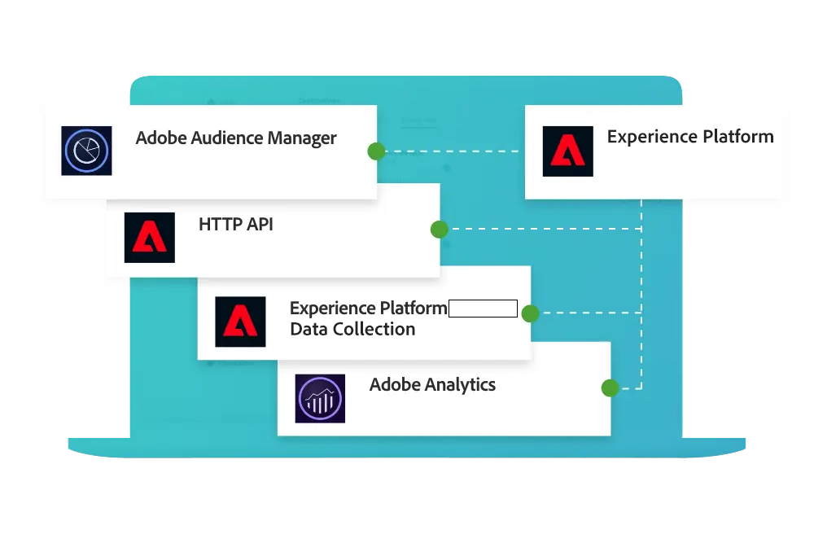

# Guida di Customer Journey Analytics

Questa guida alla documentazione tecnica fornisce supporto autonomo per Customer Journey Analytics. Customer Journey Analytics consente di importare in Adobe Experience Platform i dati del cliente da qualsiasi canale (online e offline). Puoi quindi analizzarli così come faresti con i dati digitali esistenti utilizzando Analysis Workspace.

Con Customer Journey Analytics puoi definire come collegare i dati online e offline in Analysis Workspace su qualsiasi ID cliente comune per poter poi eseguire attività di attribuzione, filtri, flusso, abbandono, e così via, tra i dati cliente.

## Novità

Dai un’occhiata ai miglioramenti più recenti apportati al prodotto e alla documentazione di Customer Journey Analytics. Per un elenco completo delle funzioni, dei miglioramenti e delle correzioni, consulta le [Note sulla versione](../release-notes/latest.md) dettagliate. Visita la [pagina di aggiornamenti della documentazione](../release-notes/doc-changes.md) per conoscere le ultime modifiche.

>[!BEGINTABS]

>[!TAB Assistente AI]

L’Assistente AI è un’esperienza di conversazione che consente ai professionisti di eseguire attività a ritmo veloce, sia che si tratti della comprensione dei concetti, della risoluzione dei problemi o della ricerca di informazioni. Consente inoltre ai non esperti di svolgere compiti di esperti e migliora la qualità complessiva del lavoro.

>[!TAB Ricerche B2B]

Come parte della configurazione di una connessione, puoi trasformare i set di dati per schemi di ricerca B2B specifici per supportare meglio le ricerche basate su persone sui dati B2B.

>[!TAB Campi derivati]

Sono ora disponibili nuove funzioni derivate per i campi (Matematica, Successivo o Precedente) e modelli di funzioni aggiuntivi (come Bounces, Friendly Dataset Name, Holiday Season, Monthly Goals, Simple Bot Detection e altri).

>[!TAB Estensione BI*]

L&#39;estensione BI consente a SQL di accedere alle visualizzazioni dati definite in Customer Journey Analytics. Ora puoi utilizzare il tuo strumento BI preferito per creare rapporti e dashboard basati sulle stesse visualizzazioni dati utilizzate dagli utenti di Customer Journey Analytics con i loro progetti Analysis Workspace.

*_Per utilizzare l’estensione BI, devi disporre del pacchetto Select o versione successiva._

<!--
>[!TAB Improved Audience Publising] 

Audiences that are published from Customer Journey Analytics are now available in the new **Audiences** section in Adobe Experience Platform. Audiences are now available in Experience Platform seconds after they are published from Customer Journey Analytics. Improved sorting and filter options in Experience Platform for Customer Journey Analytics audiences. 

-->

>[!TAB Previsione]

La previsione è una funzione di Analysis Workspace che consente di prevedere una metrica standard o calcolata con qualsiasi granularità temporale supportata (oraria, giornaliera, settimanale, mensile e annuale). La previsione è disponibile solo per i dati relativi alle serie temporali.

>[!TAB Nuova documentazione]

Sono ora disponibili nuove sezioni della documentazione su:<ul><li>Come effettuare l’aggiornamento da Adobe Analytics a Customer Journey Analytics.</li><li>Casi d’uso sull’esportazione dati e sulle relative funzionalità di Experience Platform e Customer Journey. </li></ul>Seleziona **[!UICONTROL Learn more]** per questo e altri aggiornamenti della documentazione.

>[!ENDTABS]

## Inizia con le nozioni di base

Inizia consultando il materiale incluso nei collegamenti riportati di seguito per acquisire familiarità con le caratteristiche e le funzionalità di Customer Journey Analytics.

<table style="table-layout:fixed">
  <tr style="border: 0;">
    <td>
    
    
<strong>Oltre i dati online</strong>  Scopri il confronto tra Customer Journey Analytics e Adobe Analytics, quali funzioni condividono e come utilizzare i dati di Analytics.

    </td>
    <td>
    
    
<strong>Acquisire e utilizzare i dati</strong> Scopri le opzioni disponibili per acquisire i dati in Experience Platform e utilizzarli per l’analisi e il reporting in Customer Journey Analytics.

    </td>
    <td>
    
    
<strong>Analisi guidata</strong>  Scopri come utilizzare i flussi di lavoro per ottenere dati e approfondimenti sull’esperienza cliente con i prodotti. Product Analytics tramite analisi guidata...
    

    </td>
    <td>
    
    
<strong>Analysis Workspace</strong>  Utilizza Analysis Workspace per eseguire analisi di base e avanzate, come diagrammi di attribuzione, di flusso e di fallout e analisi dettagliate delle dimensioni.

    </td>
  </tr>
  <tr style="border: 0;">
    <td align="center"></td>
    <td align="center"></td>
    <td align="center"></td>
    <td align="center"></td>
    </tr>
</table>

## Esplora la documentazione

Confronto tra Customer Journey Analytics e Adobe Analytics. Come inserire i dati nella soluzione e quindi preparare, visualizzare, analizzare e democratizzare tali dati e le analisi e i rapporti risultanti.

<table style="table-layout:fixed">
  <tr style="border: 0;">
    <td>
       
      <strong>Confronto con Adobe Analytics</strong> <a href="/help/getting-started/aa-vs-cja/overview.md">Panoramica</a> - <a href="/help/getting-started/aa-to-cja.md">Evoluzione</a> - <a href="/help/getting-started/aa-vs-cja/aa-data-in-cja.md">Utilizzo dei dati di Adobe Analytics</a> - <a href="/help/getting-started/aa-vs-cja/cja-aa.md">Funzionalità supportate</a> - <a href="/help/getting-started/aa-vs-cja/terminology.md">Terminologia</a> - <a href="/help/getting-started/aa-vs-cja/data-processing-comparisons.md">Elaborazione dati</a>
    </td>
    <td>
       
      <strong>Connessioni</strong> <a href="/help/connections/overview.md">Panoramica</a> - <a href="/help/connections/create-connection.md">Crea</a> - <a href="/help/connections/manage-connections.md">Gestisci</a> - <a href="/help/stitching/overview.md">Unisci</a> - <a href="/help/connections/combined-dataset.md">Set di dati evento combinati</a> - <a href="/help/connections/standard-lookups.md">Ricerche standard</a>
    </td>
     <td>
       
      <strong>Visualizzazioni dati</strong> <a href="/help/data-views/data-views.md">Panoramica</a> - <a href="/help/data-views/create-dataview.md">Crea o modifica</a> - <a href="/help/data-views/session-settings.md">Impostazioni sessione</a> - <a href="/help/data-views/derived-fields/derived-fields.md">Campi derivati</a> - <a href="/help/data-views/component-reference.md">Riferimento componente</a>
    </td>

</tr>
  <tr style="border: 0;">
    <td>
       
      <strong>Progetti Workspace</strong> <a href="/help/analysis-workspace/home.md">Analysis Workspace</a> - <a href="/help/analysis-workspace/perform-basic-analysis.md">Analisi di base </a> e <a href="/help/analysis-workspace/perform-adv-analysis.md">avanzata</a> - <a href="/help/analysis-workspace/build-workspace-project/freeform-overview.md">Progetti</a> - <a href="/help/analysis-workspace/visualizations/freeform-analysis-visualizations.md">Visualizzazioni</a> - <a href="/help/analysis-workspace/c-panels/freeform-panel.md">Pannelli</a>
    </td>
    <td>
       
      <strong>Analisi guidata</strong> <a href="/help/guided-analysis/overview.md">Panoramica</a> - <a href="/help/guided-analysis/types/active.md">Crescita utenti</a> - <a href="/help/guided-analysis/types/usage.md">Tendenze</a> - <a href="/help/guided-analysis/types/friction.md">Funnel</a> - <a href="/help/guided-analysis/types/release.md">Impatto</a> - <a href="/help/guided-analysis/industry-use-cases.md">Casi d’uso del settore</a>
    </td>
    <td>
       
      <strong>Condivisione, esportazione, integrazione</strong> <a href="/help/analysis-workspace/curate-share/share-projects.md">Progetti</a> - <a href="/help/mobile-app/home.md">Dashboard di Analytics</a> - <a href="/help/report-builder/report-buider-overview.md">Report Builder</a>  - <a href="/help/integrations/overview.md">Integrazioni</a>
    </td>
  </tr>
</table>

## Risorse aggiuntive

<table style="table-layout:fixed"><tr style="border: 0;">
<td><strong>Customer Journey Analytics</strong> 
<a href="https://experienceleague.adobe.com/it/docs/customer-journey-analytics-learn/tutorials/overview" target="_blank">Tutorials</a> - <a href="https://helpx.adobe.com/it/legal/product-descriptions/customer-journey-analytics.html" target="_blank">Descrizione del prodotto del Customer Journey Analytics</a> - <a href="https://helpx.adobe.com/it/legal/product-descriptions/adobe-analytics-addon-customer-journey-analytics.html" target="_blank">Descrizione del prodotto Adobe Analytics (componente aggiuntivo per Customer Journey Analytics)</a> - <a href="https://developer.adobe.com/cja-apis/docs/" target="_blank">API di Customer Journey Analytics</a> - <a href="/help/ai-assistant.md">Assistente AI</a>
</td>
<td><strong>Acquisizione dei dati</strong> <a href="/help/data-ingestion/data-ingestion.md">Panoramica</a> - <a href="/help/data-ingestion/analytics.md">Analytics</a> - <a href="/help/data-ingestion/aepwebsdk.md">Web SDK</a> - <a href="/help/data-ingestion/aepmobilesdk.md">Mobile SDK</a> - <a href="/help/data-ingestion/batch.md">Batch</a> - <a href="/help/data-ingestion/streaming.md">Streaming</a> - <a href="/help/data-ingestion/sources.md">Origini</a> - <a href="/help/data-ingestion/serverapi.md">API server</a>
</td>
</tr>
</table>

<table style="table-layout:auto" class="tablelayout-is-fixed"><tbody><tr style="border: 0;"><td></td><td>
<b>Rimani aggiornato, contribuisci alla community e migliora la tua esperienza di Customer Journey Analytics.</b> Visita la community di Adobe Analytics per discutere delle funzionalità con altri professionisti. <a href="https://experienceleaguecommunities.adobe.com/t5/adobe-analytics/ct-p/adobe-analytics-community">Iscriviti alla community oggi stesso!</a></td></tr></tbody></table>
