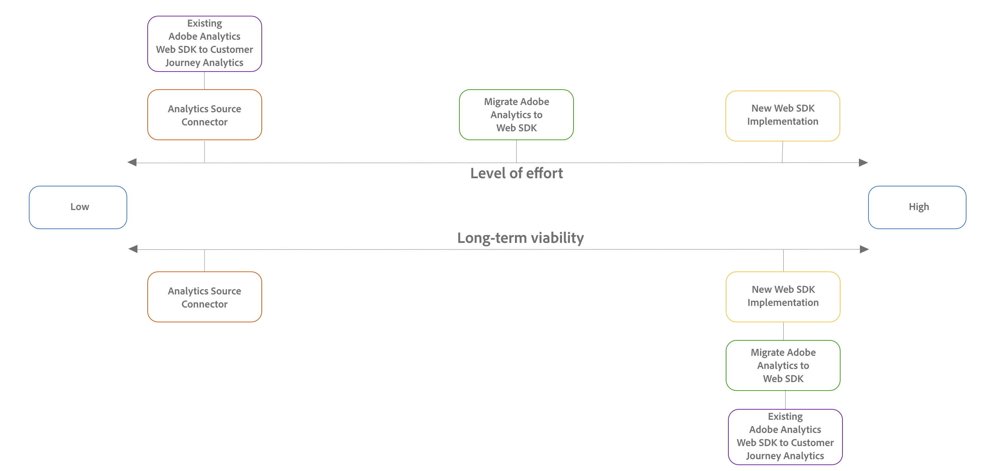

# Passaggio 2: scegliere il percorso di migrazione

+++Espandi questa sezione per vedere dove le informazioni su questa pagina si inseriscono nel processo di migrazione più ampio. Assicurati che tutti i passaggi di migrazione precedenti siano stati completati.

Prima di continuare con questa sezione, assicurati di aver completato tutte le attività di migrazione precedenti.

Le informazioni in questa pagina descrivono il passaggio 2 della migrazione, come evidenziato nella tabella seguente:

| Attività di migrazione | Dettagli |
|---------|----------|
| **Passaggio 1: [Introduzione alla migrazione](/help/getting-started/cja-migration/cja-migration-getstarted.md)** | Scopri i vantaggi della migrazione ad Adobe Analytics e il processo di migrazione di base. |
| **Passaggio 2: scegliere il percorso di migrazione** | Sono disponibili diversi metodi per la migrazione al Customer Journey Analytics. Scegli il metodo migliore per la tua organizzazione, in base all’ambiente Adobe Analytics corrente e agli obiettivi a lungo termine. |
| **Passaggio 3: [Inviare dati a Adobe Experience Platform](/help/getting-started/cja-migration/cja-migration-send-to-platform.md)** | Il processo di invio dei dati a Adobe Experience Platform varia a seconda del percorso di migrazione scelto nel passaggio 2. |
| **Passaggio 4: [Conserva dati storici](/help/getting-started/cja-migration/cja-migration-historical-data.md)** | La maggior parte delle organizzazioni deve conservare i dati storici di Adobe Analytics per un certo periodo di tempo. Sono disponibili varie opzioni per eseguire questa operazione. |
| **Passaggio 5: [Eseguire ulteriori attività di implementazione](/help/getting-started/cja-getting-started.md)** | A questo punto del processo di migrazione, è necessario eseguire varie attività prima che l’ambiente del Customer Journey Analytics sia pronto per l’uso.
Queste attività aggiuntive riguardano le migrazioni da Adobe Analytics e le nuove implementazioni di Customer Journey Analytics.

Queste attività includono:
<ul><li>Experience Platform di altri dati</li><li>Creazione di connessioni tra set di dati di Platform e Customer Journey Analytics</li><li>Creazione di visualizzazioni dati</li><li>Portare l’utilizzo dell’API di reporting</li><li>Contabilità per feed di dati e Data Warehouse</li><li>Migrazione di progetti e componenti</li><li>Onboarding degli utenti di Planning</li></ul> 
Per ulteriori informazioni, consulta [Guida introduttiva al Customer Journey Analytics](/help/getting-started/cja-getting-started.md). |

{style="table-layout:auto"}

+++

Dopo aver deciso di eseguire la migrazione al Customer Journey Analytics, devi determinare il percorso di migrazione ottimale per la tua organizzazione.

Il percorso scelto per la migrazione da Adobe Analytics a Customer Journey Analytics dipende dai seguenti fattori:

* Implementazione di Adobe Analytics esistente

* I tuoi obiettivi per il futuro

Utilizza le informazioni in questa pagina per determinare quale percorso di migrazione di Customer Journey Analytics si allinea meglio agli obiettivi futuri e all’implementazione corrente della tua organizzazione.

Per determinare il percorso di migrazione ottimale per la tua organizzazione, le seguenti sezioni devono essere lette in sequenza:

1. In primo luogo, [comprendere i percorsi di migrazione disponibili](#understand-migration-methods).

1. Allora, [valutare quali percorsi di migrazione sono disponibili](#assess-the-migration-methods-available-to-you-based-on-your-current-adobe-analytics-implementation).

1. E infine... [valutare i vantaggi e gli svantaggi di ciascun percorso di migrazione](#weigh-the-advantages-and-disadvantages-of-the-migration-methods-available-to-you).

## Comprendere i percorsi di migrazione

Esistono diversi percorsi di migrazione per la migrazione da Adobe Analytics a Customer Journey Analytics.

In generale, ogni percorso di migrazione varia in base al livello di impegno richiesto per l’esecuzione della migrazione e alla redditività a lungo termine raggiunta al termine della migrazione.

Nella tabella seguente sono elencati i percorsi di migrazione, il livello di impegno e la fattibilità a lungo termine:

| Percorso di migrazione | Livello di impegno | Redditività a lungo termine |
|---------|----------|---------|
| **Nuova implementazione di Experienci Platform Web SDK**  Anche se tecnicamente non si tratta di una migrazione, puoi iniziare a utilizzare il Customer Journey Analytics effettuando una nuova implementazione dell’SDK web per Experienci Platform. Questo ti consente di iniziare a inviare dati a Adobe Experience Platform Edge Network e Customer Journey Analytics. 
Per le organizzazioni che non utilizzano ancora l’SDK per web, questo percorso di migrazione è forse il più semplice per ottenere dati da Edge Network, perché richiede il minor numero di passaggi; tuttavia, poiché tutto il lavoro è svolto in anticipo (ad esempio la creazione dello schema XDM), richiede uno sforzo iniziale maggiore.

I passaggi di base sono i seguenti:
<ol><li>Crea uno schema XDM per la tua organizzazione.</li><li>Implementa l’SDK per web.</li><li>Invia dati a Platform.</li></ol> | Alta | Alta |
| **Migrare l’implementazione di Adobe Analytics per utilizzare l’SDK per web**  Se la tua implementazione di Adobe Analytics è AppMeasurement o l’estensione Analytics, puoi migrarla per utilizzare Adobe Experience Platform Web SDK per iniziare a inviare dati ad Edge Network e Adobe Analytics, prima di inviarli al Customer Journey Analytics.
Per le organizzazioni che non utilizzano ancora il Web SDK, questo è il modo più semplice e fluido per portare i dati a Edge Network; richiede più passaggi, ma offre una transizione più metodica da Adobe Analytics al Customer Journey Analytics, con tappe più tangibili.

I passaggi di base sono i seguenti:
<ol><li>Sposta l’implementazione Adobe Analytics esistente nell’SDK per web e verifica che tutto funzioni in Adobe Analytics.</li><li>Crea uno schema XDM per la tua organizzazione non appena hai tempo.</li><li>Utilizza la mappatura dello stream di dati per mappare tutti i campi nell’oggetto dati sullo schema XDM.</li><li>Invia dati a Platform.</li></ol> | Modera | Alta |
| **Configurare l’implementazione di Adobe Analytics Web SDK esistente**  Se la tua implementazione di Adobe Analytics utilizza già Adobe Experience Platform Web SDK, puoi iniziare a inviare dati al Customer Journey Analytics con il minimo sforzo.
Prima di inviare i dati al Customer Journey Analytics, è consigliabile aggiornare lo schema di Adobe Analytics in base alle esigenze specifiche dell’organizzazione e di qualsiasi altra applicazione Platform utilizzata.

I passaggi di base sono i seguenti:
<ol><li>Inizia a inviare dati al Customer Journey Analytics.<!-- What's involved here? Just point it at CJA? --></li><li>(Facoltativo) Crea uno schema XDM per la tua organizzazione non appena hai tempo.</li><li>(Condizionale) Se hai creato uno schema XDM, utilizza la mappatura dello stream di dati per mappare tutti i campi nell’oggetto dati sullo schema XDM.</li></ol> | Bassa | Alta |
| **Utilizzare il connettore di origine di Analytics**  Se la tua implementazione di Adobe Analytics è AppMeasurement o l’estensione Analytics, puoi iniziare a inviare dati a una visualizzazione dati nel Customer Journey Analytics.
Questo è il modo più semplice per portare i dati al Customer Journey Analytics, ma è il metodo meno efficace a lungo termine.
 | Bassa | Bassa |

{style="table-layout:auto"}

Utilizza il diagramma seguente per visualizzare in che modo ogni percorso di migrazione rientra nello spettro in termini di livello di impegno e sostenibilità a lungo termine:

## Valuta i percorsi di migrazione disponibili in base all’implementazione Adobe Analytics corrente

Non tutti i percorsi di migrazione sono disponibili per ciascun tipo di implementazione di Adobe Analytics.

Utilizza le informazioni riportate di seguito per capire quale percorso di migrazione è più appropriato per la tua organizzazione.

Se hai bisogno di consigli, indicazioni o supporto più specifici, contatta il rappresentante del tuo Adobe.

| Implementazione di Adobe Analytics esistente | Percorsi di migrazione disponibili |
|---------|----------|
| AppMeasurement | <ul><li>Nuova implementazione di Experienci Platform Web SDK</li><li>Migrare da Adobe Analytics a Web SDK</li><li>Connettore di origine di Analytics</li></ul> |
| Estensione Adobe Analytics | <ul><li>Nuova implementazione di Experienci Platform Web SDK</li><li>Migrare da Adobe Analytics a Web SDK</li><li>Connettore di origine di Analytics</li></ul> |
| Web SDK | <ul><li>Configurare l’implementazione di Adobe Analytics Web SDK per inviare dati al Customer Journey Analytics</li></ul> |

{style="table-layout:auto"}

## Valuta i vantaggi e gli svantaggi dei percorsi di migrazione disponibili

I vantaggi e gli svantaggi di un determinato percorso di migrazione dipendono dall’implementazione di Adobe Analytics esistente.

Prima di utilizzare le informazioni riportate di seguito per determinare il percorso di migrazione più appropriato, esaminare le informazioni in [Comprendere i percorsi di migrazione](#understand-migration-methods) se non lo hai già fatto.

### Per le implementazioni di Adobe Analytics che utilizzano: estensione AppMeasurement e Adobe Analytics

Di seguito sono riportati i percorsi di migrazione disponibili per le organizzazioni che hanno implementato Adobe Analytics con AppMeasurement o l’estensione Adobe Analytics. Espandi ogni sezione per visualizzare i vantaggi e gli svantaggi di ciascun percorso di migrazione.

#### Percorsi di migrazione

+++Nuova implementazione di Experienci Platform Web SDK

| Vantaggi | Svantaggi |
|----------|---------|
| <ul><li>**Offre tutti i vantaggi dell’hosting dei dati in Experience Edge Network**: 
Questi vantaggi includono:
<ul><li>Rapporti e disponibilità dei dati ad alte prestazioni perché Adobe Experience Platform è progettato per [casi di utilizzo della personalizzazione in tempo reale](https://experienceleague.adobe.com/docs/experience-platform/destinations/ui/activate/configure-personalization-destinations.html?lang=it)</li><li>Consolidamento dell’implementazione per la raccolta dati di Adobe Experience Cloud tra altri prodotti Experience Cloud (AJO, RTCDP e così via)</li><li>Non si basa sulla nomenclatura di Adobe Analytics (prop, eVar, evento e così via)</li></ul></li><li>**Scalabile**: gli aggiornamenti futuri dell’implementazione sono più facili.</li></ul> | <ul><li>**Richiede una nuova implementazione da zero**: l’obbligo di eseguire una nuova implementazione da zero comporta i seguenti svantaggi: </li><ul><li>**Lunga durata**: si tratta del percorso di migrazione più lungo ed impegnativo, in quanto richiede una nuova implementazione.</li><li>**È necessario ricreare lo schema completo in XDM**: prima di iniziare a implementare l’SDK per web, devi ricreare lo schema completo in XDM.</li><li>**È necessario ricreare regole ed elementi dati**: prima di poter iniziare a implementare l’SDK web, devi ricreare tutte le condizioni e gli elementi dati delle regole dall’implementazione di Adobe Analytics.</li></ul></ul> |

{style="table-layout:auto"}

+++

+++Migrare da Adobe Analytics a Experienci Platform Web SDK

| Vantaggi | Svantaggi |
|----------|---------|
| <ul><li>**Offre tutti i vantaggi dell’hosting dei dati in Experience Edge Network**: 
Questi vantaggi includono:
<ul><li>Rapporti e disponibilità dei dati ad alte prestazioni perché Adobe Experience Platform è progettato per [casi di utilizzo della personalizzazione in tempo reale](https://experienceleague.adobe.com/docs/experience-platform/destinations/ui/activate/configure-personalization-destinations.html?lang=it)</li><li>Consolidamento dell’implementazione per la raccolta dati di Adobe Experience Cloud tra altri prodotti Experience Cloud (AJO, RTCDP e così via)</li><li>Non si basa sulla nomenclatura di Adobe Analytics (prop, eVar, evento e così via)</li></ul><li>**Utilizza l’implementazione esistente**: sebbene questo approccio richieda alcune modifiche di implementazione, non richiede un’implementazione completamente nuova da zero. Puoi utilizzare il livello dati e il codice esistenti con modifiche minime alla logica di implementazione senza influire sui rapporti di Adobe Analytics esistenti.</li><li>**Offre flessibilità per creare uno schema XDM per la tua organizzazione in un secondo momento**: puoi migrare l’implementazione Adobe Analytics esistente per utilizzare l’SDK per web e verificare che tutto funzioni in Adobe Analytics, quindi creare lo schema XDM. Questa flessibilità consente una migrazione più metodica e ponderata.</li></ul> | <ul><li>**Richiede la mappatura per inviare dati a Platform**: quando l’organizzazione è pronta per utilizzare il Customer Journey Analytics, è necessario inviare dati a un set di dati in Adobe Experience Platform. Questa azione richiede che ogni campo nell’oggetto dati sia una voce nello strumento di mappatura dello stream di dati che lo assegna a un campo di schema XDM. La mappatura deve essere eseguita una sola volta per questo flusso di lavoro e non richiede l’apporto di modifiche all’implementazione. Si tratta tuttavia di un passaggio aggiuntivo non richiesto per l’invio di dati in un oggetto XDM.</li><li>**Debito tecnico**: poiché questo approccio utilizza una forma modificata dell’implementazione esistente, può essere più difficile tracciare la logica di implementazione ed eseguire modifiche in futuro quando necessario. </li></ul> |

{style="table-layout:auto"}

+++

+++Utilizzare il connettore di origine di Analytics

| Vantaggi | Svantaggi |
|----------|---------|
| <ul><li>Percorso di migrazione meno lungo e impegnativo. 
Migrazione rapida dei dati al Customer Journey Analytics con un investimento minimo
</li></ul> | <ul><li>**I dati non vengono inviati all’Edge Network**: 
Ciò comporta i seguenti svantaggi:
<ul><li>Livello massimo di [latenza](/help/technotes/guardrails.md#latencies) nei rapporti per tutti i percorsi di migrazione; non ottimizzato per i casi di utilizzo di personalizzazione in tempo reale.</li><li>I dati non possono essere condivisi con altre applicazioni Adobe Experience Platform, ma solo con il Customer Journey Analytics</li><li>Dipende dalla nomenclatura di Adobe Analytics (prop, eVar, evento e così via)</li></ul><li>**Difficoltà nel passare al Web SDK in futuro**: </li><li>**Utilizza il gruppo di campi Evento esperienza di Analytics nello schema**: questo gruppo di campi aggiunge molti eventi Adobe Analytics che non sono necessari nello schema del Customer Journey Analytics.  Questo può portare a uno schema più disordinato e complesso di quanto sia altrimenti necessario per il Customer Journey Analytics.</li></ul> |

{style="table-layout:auto"}

+++

### Per le implementazioni di Adobe Analytics che utilizzano: SDK web

Il seguente percorso di migrazione è disponibile per le organizzazioni che hanno implementato Adobe Analytics con Experienci Platform Web SDK.

Quando scegli questo percorso di migrazione, devi anche scegliere lo schema.

#### Percorso di migrazione

+++Configurare l’implementazione di Adobe Analytics Web SDK per inviare dati al Customer Journey Analytics

| Vantaggi | Svantaggi |
|----------|---------|
| Questo è il percorso di migrazione preferito se l’implementazione di Adobe Analytics utilizza già l’SDK web.<ul><li>**Offre tutti i vantaggi dell’hosting dei dati in Experience Edge Network**: 
Questi vantaggi includono:
<ul><li>Rapporti e disponibilità dei dati ad alte prestazioni perché Adobe Experience Platform è progettato per [casi di utilizzo della personalizzazione in tempo reale](https://experienceleague.adobe.com/docs/experience-platform/destinations/ui/activate/configure-personalization-destinations.html?lang=it)</li><li>Consolidamento dell’implementazione per la raccolta dati di Adobe Experience Cloud tra altri prodotti Experience Cloud (AJO, RTCDP e così via)</li><li>Non si basa sulla nomenclatura di Adobe Analytics (prop, eVar, evento e così via)</li></ul><li>**Utilizza l’implementazione esistente**: sebbene questo approccio richieda alcune modifiche di implementazione, non richiede un’implementazione completamente nuova da zero. Puoi utilizzare il livello dati e il codice esistenti con modifiche minime alla logica di implementazione senza influire sui rapporti di Adobe Analytics esistenti.</li><li>**Fornisce un’opzione per utilizzare uno schema XDM**: puoi scegliere di utilizzare lo schema Adobe Analytics esistente o creare uno schema XDM e mappare i campi nell’oggetto dati allo schema XDM. [Schemi XDM](https://experienceleague.adobe.com/en/docs/experience-platform/xdm/home#xdm-schemas) sono uno schema flessibile per definire tutti i campi necessari e solo quelli rilevanti. 
Consulta &quot;Utilizzo del tuo schema XDM&quot; di seguito per ulteriori informazioni sui vantaggi dell’utilizzo del tuo schema XDM.
</li><li>**Mantiene regole ed elementi dati**: anche se richiede nuove azioni della regola, puoi riutilizzare gli elementi dati e le condizioni della regola esistenti con modifiche minime.</li><li>**Scalabile**: se scegli di utilizzare un tuo schema XDM, gli aggiornamenti di implementazione futuri saranno più facili.</li></ul> | Nessuno |

{style="table-layout:auto"}

+++

#### Scegli lo schema

Se hai scelto il percorso di migrazione che ti consente di configurare l’implementazione di Adobe Analytics Web SDK per inviare dati al Customer Journey Analytics, puoi scegliere lo schema da utilizzare.

Puoi scegliere se utilizzare lo schema Adobe Analytics esistente oppure se eseguire l’aggiornamento allo schema XDM per allinearlo meglio alle esigenze della tua organizzazione quando inizi a utilizzare altri servizi Platform.

+++Utilizzare lo schema Adobe Analytics con l’implementazione di Adobe Analytics Web SDK

| Vantaggi | Svantaggi |
|----------|---------|
| 
I vantaggi dell’utilizzo dello schema Adobe Analytics includono:
<ul><li>Facilità di migrazione
Se invii già dati ad Adobe Analytics con Adobe Experience Platform Web SDK, puoi aggiungere un servizio aggiuntivo allo stream di dati per inviare dati a Adobe Experience Platform (che può quindi essere utilizzato nella configurazione del Customer Journey Analytics).
</li></ul> | 
Gli svantaggi dell’utilizzo dello schema Adobe Analytics includono:
<ul><li>Anche se l’utilizzo dello schema Adobe Analytics non ti limita in termini di come può essere utilizzato con altre applicazioni Platform, si ottiene uno schema più complesso di quanto potrebbe essere altrimenti. Questo perché lo schema di Adobe Analytics contiene molti oggetti specifici di Adobe Analytics che è improbabile vengano utilizzati dalla tua organizzazione.
Quando sono necessarie modifiche allo schema, è necessario esaminare migliaia di campi inutilizzati per trovare il campo che richiede l’aggiornamento.
</li></ul> |

+++

+++Utilizza il tuo schema XDM con l’implementazione di Adobe Analytics Web SDK.

| Vantaggi | Svantaggi |
|----------|---------|
| <ul>
I vantaggi dell’aggiornamento allo schema XDM includono:
<ul><li>Schema semplificato personalizzato in base alle esigenze della tua organizzazione e alle specifiche applicazioni Platform utilizzate.</li>
Quando sono necessarie modifiche allo schema, non è necessario esaminare migliaia di campi inutilizzati per trovare il campo che richiede l’aggiornamento.
</ul> | 
Gli svantaggi dell’aggiornamento allo schema XDM includono:
<ul><li>L’aggiornamento dello schema è un processo che richiede molto tempo prima di iniziare a inviare dati al Customer Journey Analytics.</li></ul> |

+++

## Quindi, invia i dati a Adobe Experience Platform

Dopo aver utilizzato le informazioni precedenti per scegliere un percorso di migrazione, scopri come [inviare dati a Adobe Experience Platform](/help/getting-started/cja-migration/cja-migration-send-to-platform.md) a seconda del percorso di migrazione scelto.
