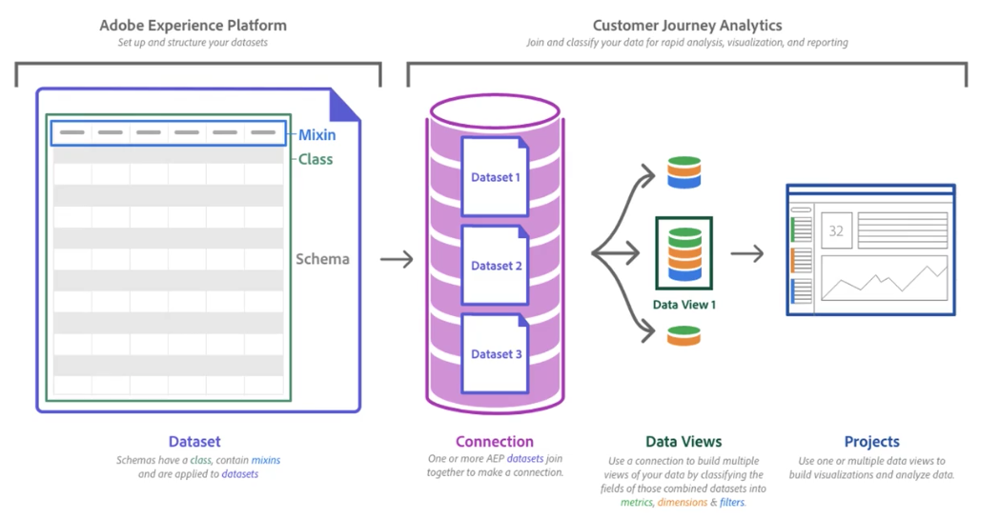

# Panoramica di Customer Journey Analytics

Customer Journey Analytics è la soluzione di analisi di prossima generazione di Adobe che consente di sfruttare l’efficacia di Analysis Workspace insieme ai dati di Adobe Experience Platform. Tale funzionalità può suddividere, filtrare, eseguire query e visualizzare anni di dati e si abbina alla capacità della Platform di contenere tutti i tipi di schemi e di tipologie di dati. Utilizzando **Experience Data Model (XDM)**, i dati possono essere rappresentati e organizzati in modo uniforme, per poi eseguirne la combinazione e l’esplorazione. **Servizio query Adobe Experience Platform** consente di utilizzare strumenti e framework compatibili con SQL per eseguire query e manipolazioni di tutti i dati.

L’architettura di Customer Journey Analytics di alto livello è mostrata qui:

Ecco una panoramica video di Customer Journey Analytics:

>[!VIDEO](https://video.tv.adobe.com/v/30090/?quality=12)

## Confronto tra Customer Journey Analytics e Adobe Analytics tradizionale

Customer Journey Analytics estende l’ambito di Adobe Analytics con funzionalità cross-channel facili da usare. Inoltre, rimuove le limitazioni presenti nelle versioni precedenti di Adobe Analytics. Alcuni importanti miglioramenti sono i seguenti:

* **Variabili ed eventi illimitati**: i concetti di eVar, prop ed eventi non esistono più. I dati sono principalmente incentrati su dimensioni e metriche. I set di dati possono disporre di un numero illimitato di metriche e dimensioni univoche.
* **Valori univoci illimitati**: Adobe Experience Platform non è vincolata ad alcun limite univoco.
* **Modifica dei dati storici**: con Adobe Experience Platform è possibile rimuovere o correggere i dati.
* **Dati di più suite di rapporti**: su Platform è possibile combinare le implementazioni esistenti da più set di dati.

>[!TIP]
>
>Se stai utilizzando Adobe Analytics e desideri utilizzare i tuoi dati di Adobe Analytics in Customer Journey Analytics, consulta la guida rapida [Acquisizione e utilizzo dei dati dal tradizionale Adobe Analytics](../data-ingestion/analytics.md), all’interno della sezione [Acquisizione dei dati](../data-ingestion/data-ingestion.md).

La versione iniziale del Customer Journey Analytics include molte delle funzioni incluse in Adobe Analytics. Per un elenco completo, consulta il [supporto delle funzioni di Customer Journey Analytics](/help/getting-started/aa-vs-cja/cja-aa.md).

## Casi d’uso principali

Customer Journey Analytics ti consente di:

* **Collocare il cliente in un contesto di customer journey**: puoi visualizzare e analizzare i dati in sequenza e su più canali. I dati provenienti dal call center, dai sistemi POS e dalle proprietà online possono essere combinati in un’unica visualizzazione di reporting.
* **Rendere gli insights disponibili a tutti**: semplifica l’accesso ai dati e consenti a più persone di prendere decisioni aziendali sulla base degli insights derivanti dai dati. Qualsiasi membro dell’organizzazione che è in qualche modo responsabile della customer experience può prendere decisioni concrete in tempi rapidi, sulla base di dati più completi.
* **Sfruttare la potenza della data science per i tuoi analisti**: Customer Journey Analytics consente alle persone comuni di avvalersi della data science per acquisire analisi e insights approfonditi.
* **Visualizzare e interagire con i set di dati utilizzando reporting on-demand**: Workspace può sfruttare qualsiasi set di dati di Adobe Experience Platform che risulti conforme ad alcune regole di base.
* **Visualizzare dati non adatti per il web**: Workspace non è più limitato a una definizione rigida di hit o evento. Gli schemi personalizzati consentono il controllo completo dei dati e delle definizioni.
* **Esercitare un controllo maggiore sulla manipolazione dei dati**: modifica i dati caricati, crea set di dati e importali all’interno di Workspace. Adobe Experience Platform fornisce strumenti di query, estrazione, trasformazione e caricamento tramite Experienci Platform Query Service.

## Prerequisiti

Prima di iniziare a utilizzare Customer Journey Analytics, è necessario soddisfare i seguenti prerequisiti:

* La tua organizzazione dispone di un contratto attivo con Adobe Analytics per la versione Select, Prime o Ultimate con il componente aggiuntivo Customer Journey Analytics. Se non sei sicuro del tipo di contratto che hai stipulato o se hai il componente aggiuntivo di Customer Journey Analytics, contatta il team del tuo account di Adobe.
* È stato eseguito il provisioning della tua organizzazione per Adobe Experience Platform.
* Puoi anche acquistare Customer Journey Analytics come prodotto standalone, senza bisogno di Adobe Analytics.

## Controllo degli accessi

Fai riferimento all’argomento [Controllo degli accessi](/help/admin/cja-access-control.md).

## Aggiornamenti terminologici

Rispetto alla versione tradizionale di Adobe Analytics, diverse funzioni del Customer Journey Analytics sono state rinominate per allinearsi agli standard di settore. Alcuni termini aggiornati includono:

* I segmenti sono ora noti come “Filtri”.
* Le suite di rapporti virtuali sono ora denominate &quot;Visualizzazioni dati&quot;.
* Le classificazioni sono ora note come “Set di dati di ricerca”.
* Gli attributi cliente sono ora detti “Dataset di profilo”.
* I contenitori degli hit sono ora noti come contenitori “Evento”.
* I contenitori delle visite sono ora noti come contenitori “Sessione”.
* I contenitori dei visitatori sono ora noti come contenitori “Persona”.

## Altre funzionalità integrate in Adobe Experience Platform

Customer Journey Analytics è una delle funzionalità incentrate su Adobe Experience Platform. Numerose altre funzionalità, basate anch’esse su Experience Platform, ti consentono di sfruttare al massimo i tuoi dati.

Adobe Experience Platform ti permette di centralizzare e standardizzare i dati e i contenuti dei clienti da qualsiasi sistema, oltre che di applicare la data science e l’apprendimento automatico al fine di migliorare la progettazione e l’erogazione di esperienze personalizzate. In Platform i dati del cliente vengono memorizzati come set di dati, costituiti da uno schema e da un batch di dati. Per ulteriori informazioni su Platform, consulta [Panoramica dell’architettura di Adobe Experience Platform](https://experienceleague.adobe.com/docs/platform-learn/tutorials/intro-to-platform/basic-architecture.html?lang=it).

Dall’inserimento dati all’accesso diretto a SQL, numerosi componenti di Experience Platform sono centrali per Customer Journey Analytics e sono complementari a esso:

* [Servizio query Experienci Platform](https://experienceleague.adobe.com/docs/experience-platform/query/home.html?lang=it): utilizza SQL standard per recuperare i dati da Adobe Experience Platform, ad esempio i dati della soluzione Adobe, i dati 1st-party del cliente o qualsiasi altro dato relativo alla Platform. Si tratta di uno strumento privo di server che consente di unire qualsiasi set di dati e di acquisire i risultati della query sotto forma di nuovo set di dati da utilizzare nel reporting o da acquisire in Profile Service. Puoi utilizzare Experienci Platform Query Service per creare ecosistemi di analisi dei dati, creando un’immagine dei consumatori attraverso i loro vari canali di interazione. Tali canali possono includere sistemi POS, web, mobile, sistemi di gestione delle relazioni con i clienti e così via.
* [Profilo del cliente in tempo reale](https://experienceleague.adobe.com/docs/experience-platform/profile/home.html?lang=it):
* [Servizio identità](https://experienceleague.adobe.com/docs/experience-platform/identity/home.html?lang=it)

## Video

* Utilizzo dei dati in Customer Journey Analytics:

  >[!VIDEO](https://video.tv.adobe.com/v/32112/?quality=12)

* Architettura e integrazioni di Customer Journey Analytics:

  >[!VIDEO](https://video.tv.adobe.com/v/32483/?quality=12)

