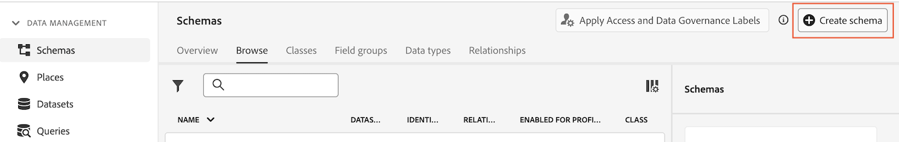
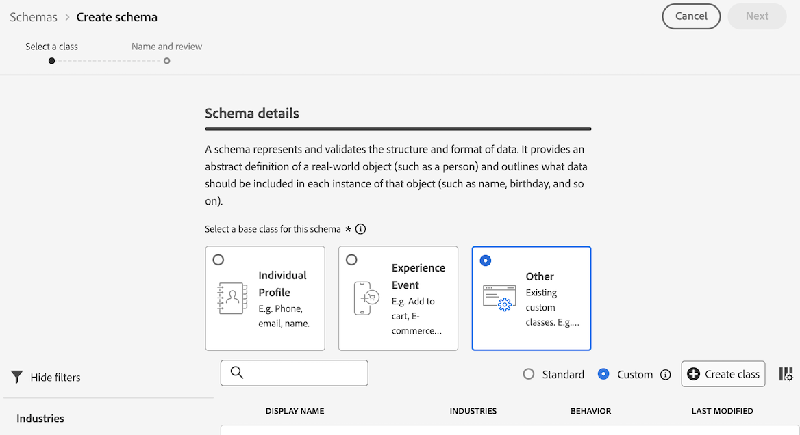
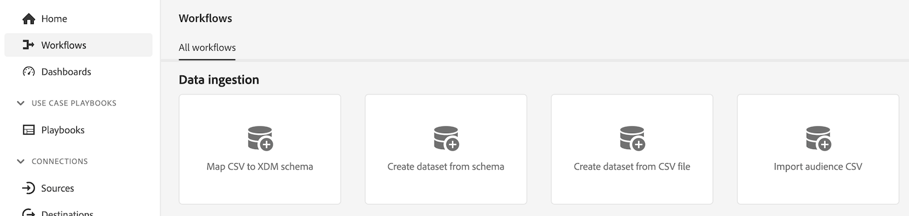
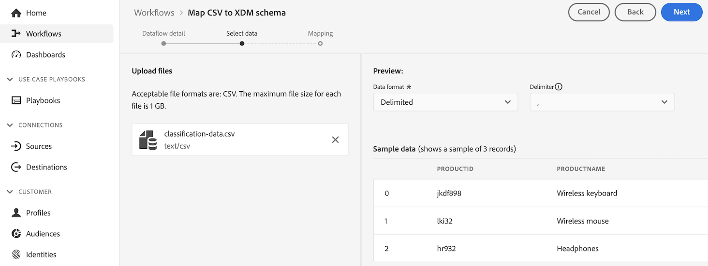

# Creare set di dati di ricerca per classificare i dati in Customer Journey Analytics {#upgrade-lookup-dataset}

<!-- markdownlint-disable MD034 -->

>[!CONTEXTUALHELP]
>id="cja-upgrade-lookup-dataset-create"
>title="Creare un set di dati di ricerca per ogni dimensione contenente dati di classificazione"
>abstract="Simili ai dati delle classificazioni in Adobe Analytics, i set di dati di ricerca costituiscono il metodo con cui vengono classificati i dati in Customer Journey Analytics."

<!-- markdownlint-enable MD034 -->

{{upgrade-note-step}}

Simili ai dati delle classificazioni in Adobe Analytics, i set di dati di ricerca costituiscono il metodo con cui vengono classificati i dati in Customer Journey Analytics.

Quando utilizzi il connettore di origine di Analytics, alcuni set di dati di ricerca standard vengono applicati automaticamente al momento del rapporto. Per ulteriori informazioni, consulta [Aggiungere ricerche standard ai set di dati](/help/connections/standard-lookups.md).

Per classificare i dati in Customer Journey Analytics quando utilizzi Experience Platform Web SDK, devi creare uno schema personalizzato e un set di dati di ricerca per ogni dimensione che contiene i dati da classificare.

## Creare uno schema personalizzato da utilizzare con il set di dati di ricerca

Crea un nuovo schema personalizzato per ogni dimensione che contiene i dati da classificare in Customer Journey Analytics. Il set di dati di ricerca creato in un passaggio successivo, farà riferimento a questo schema.

Ripeti questo processo per ogni dimensione che contiene i dati da classificare.

Per creare uno schema da utilizzare con un set di dati di ricerca in Customer Journey Analytics:

1. In Adobe Experience Platform, seleziona **[!UICONTROL Schemi]** nella sezione **[!UICONTROL Gestione dati]** nella barra a sinistra.

1. Seleziona **[!UICONTROL Crea schema]**.

   

1. Seleziona **[!UICONTROL Manuale]**. Questo ti consente di aggiungere manualmente campi e gruppi di campi allo schema. Scegliere **[!UICONTROL Seleziona]** per passare alla pagina successiva della procedura guidata di creazione.

1. Nella pagina **[!UICONTROL Dettagli schema]**, seleziona **[!UICONTROL Altro]**, quindi **[!UICONTROL Personalizzato]**.

   

1. Selezionare **[!UICONTROL Crea classe]**.

   <!-- add screenshot -->

1. Nella finestra di dialogo **[!UICONTROL Crea classe]**, specifica un nome e una descrizione per lo schema, seleziona **[!UICONTROL Record]**, quindi seleziona **[!UICONTROL Crea]**.

1. Continua con [Creare un set di dati di ricerca](#create-a-lookup-dataset).

## Creare un set di dati di ricerca

Dopo aver [creato uno schema personalizzato](#create-a-custom-schema-to-use-with-the-lookup-dataset) da utilizzare per un set di dati di ricerca, devi creare il set di dati di ricerca e mapparlo allo schema.

Ripeti questo processo per ogni dimensione che contiene i dati da classificare.

Per creare un set di dati di ricerca da utilizzare con uno schema in Customer Journey Analytics:

>[!NOTE]
>
>Il processo seguente utilizza un file CSV per creare il set di dati. Puoi anche utilizzare qualsiasi altro metodo disponibile per importare dati in Experience Platform, ad esempio la configurazione di un flusso di dati.

1. In Adobe Experience Platform, seleziona **[!UICONTROL Flussi di lavoro]** nella barra a sinistra.

   

1. Seleziona **[!UICONTROL Mappa CSV su schema XDM]**, quindi seleziona **[!UICONTROL Avvia]**.

1. Nella sezione **[!UICONTROL Dettagli set di dati]**, seleziona **[!UICONTROL Nuovo set di dati]**.

1. Specifica un nome e una descrizione per il set di dati.

1. Nel campo **[!UICONTROL Schema]** selezionare lo schema creato per i set di dati di ricerca, come descritto in [Creare uno schema per i set di dati di ricerca](#create-a-schema-for-lookup-datasets).

1. Seleziona **[!UICONTROL Avanti]**.

1. Nella pagina **[!UICONTROL Mappa i file CSV su schema XDM]**, nella sezione **[!UICONTROL Carica file]**, seleziona **[!UICONTROL Scegli i file]**, quindi cerca nel file system il file che contiene le informazioni sulla classificazione per la dimensione per la quale desideri applicare i dati di classificazione. Ad esempio, potrebbe trattarsi di un foglio di calcolo che elenca gli ID dei campi e i nomi corrispondenti. <!-- correct? How can I better explain what this file is?-->

   

1. Seleziona **[!UICONTROL Avanti]**

1. Dopo il caricamento del file, controlla le mappature per assicurarti che siano accurate. Le colonne del file CSV sono elencate in **[!UICONTROL Dati Source]** e i campi dello schema XDM corrispondenti sono elencati in **[!UICONTROL Campo di destinazione]**.

   Platform fornisce automaticamente consigli intelligenti per campi mappati automaticamente in base allo schema o al set di dati di destinazione selezionato. Puoi regolare manualmente le regole di mappatura in base ai tuoi casi d’uso.

   Per ulteriori informazioni sul processo di mappatura, consulta [Mappare un file CSV su uno schema XDM esistente](https://experienceleague.adobe.com/it/docs/experience-platform/ingestion/tutorials/map-csv/existing-schema) nella documentazione di Experience Platform.

1. Seleziona **[!UICONTROL Fine]**.

1. Continua con [Aggiungere il set di dati di ricerca alla connessione in Customer Journey Analytics](#add-the-lookup-dataset-to-your-connection-in-customer-journey-analytics).

## Aggiungere il set di dati di ricerca alla connessione in Customer Journey Analytics

Dopo aver [creato uno schema personalizzato](#create-a-custom-schema-to-use-with-the-lookup-dataset) e [creato un set di dati di ricerca](#create-a-lookup-dataset), devi aggiungere il set di dati di ricerca alla connessione in Customer Journey Analytics.

Ripeti questo processo per ogni dimensione che contiene i dati da classificare.

Per aggiungere il set di dati di ricerca alla connessione in Customer Journey Analytics:

1. In Customer Journey Analytics, seleziona **[!UICONTROL Connessioni]**, facoltativamente da **[!UICONTROL Gestione dati]**, nel menu principale.

1. Seleziona  accanto alla connessione in cui desideri aggiungere il set di dati di ricerca, quindi seleziona **[!UICONTROL Modifica]**.

   <!-- add screenshot -->

1. Seleziona **[!UICONTROL Aggiungi set di dati]**.

1. Nella finestra di dialogo **[!UICONTROL Aggiungi set di dati]**, seleziona il set di dati di ricerca creato, quindi seleziona **[!UICONTROL Successivo]**.

1. Nel campo **[!UICONTROL ID persona]**, seleziona un ID persona dalle identità disponibili definite nello schema del set di dati configurato in Experience Platform. <!-- fill out other fields? -->

1. Seleziona **[!UICONTROL Aggiungi set di dati]**, quindi seleziona **[!UICONTROL Salva]**.

   <!-- is there a step right in between here where you select the dataset -->

1. Utilizzando il campo **[!UICONTROL Chiave]** e il campo **[!UICONTROL Chiave corrispondente]**, crea una correlazione tra il campo nel set di dati di ricerca e quello nel set di dati evento o di riepilogo.

1. Ripeti questo processo fino a quando tutti i set di dati di ricerca non vengono aggiunti alla connessione in Customer Journey Analytics.

{{upgrade-final-step}}

