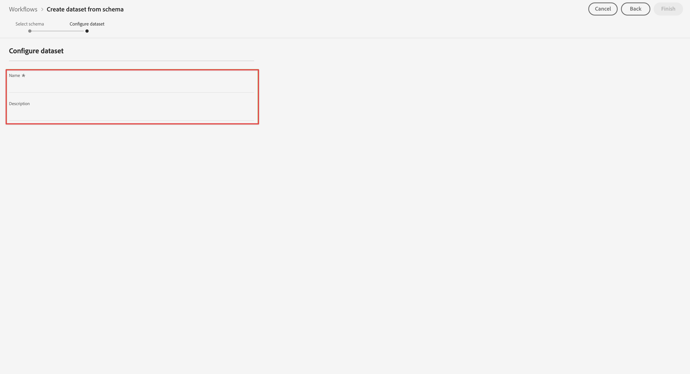

# Creare un set di dati da utilizzare con Customer Journey Analytics {#upgrade-create-dataset}

<!-- markdownlint-disable MD034 -->

>[!CONTEXTUALHELP]
>id="cja-upgrade-dataset-create"
>title="Creare un set di dati in Adobe Experience Platform"
>abstract="Un set di dati è una posizione in cui si trovano i dati raccolti. Crea questa posizione in Adobe Experience Platform.  La creazione di un set di dati con uno schema richiede solo alcuni minuti."

<!-- markdownlint-enable MD034 -->

>[!NOTE]
> 
>Segui i passaggi descritti in questa pagina solo dopo aver completato tutti i passaggi di aggiornamento precedenti. Puoi seguire i [passaggi di aggiornamento consigliati](/help/getting-started/cja-upgrade/cja-upgrade-recommendations.md#recommended-upgrade-steps-for-most-organizations) oppure i passaggi di aggiornamento generati in modo dinamico per la tua organizzazione con il [questionario di aggiornamento da Adobe Analytics a Customer Journey Analytics](https://gigazelle.github.io/cja-ttv/).
>
>Dopo aver completato i passaggi descritti in questa pagina, continua seguendo i passaggi di aggiornamento consigliati o generati in modo dinamico.

<!-- Should we single source this instead of duplicate it? The following steps were copied from: /help/data-ingestion/aepwebsdk.md-->

Un set di dati è il costrutto che memorizza e gestisce i dati raccolti in Adobe Experience Platform.

Per creare un set di dati:

1. In Adobe Experience Platform, nella barra a sinistra, seleziona **[!UICONTROL Datasets]** entro [!UICONTROL DATA MANAGEMENT].

1. Seleziona **[!UICONTROL Create dataset]** (Crea set di dati).

   

1. Seleziona **[!UICONTROL Create dataset from schema]** (Crea set di dati da schema).

   

1. Seleziona lo schema creato in precedenza e seleziona **[!UICONTROL Next]** (Avanti).

1. Assegna un nome al set di dati e (facoltativamente) fornisci una descrizione.

   

1. Seleziona **[!UICONTROL Finish]** (Fine).

1. Seleziona il pulsante **[!UICONTROL Profile]** (Profilo).

   Viene richiesto di abilitare il set di dati per il profilo. Una volta attivato, il set di dati arricchisce i profili dei clienti in tempo reale con i relativi dati inseriti.

   >[!IMPORTANT]
   >
   >    Puoi abilitare un set di dati per il profilo solo quando lo schema a cui aderisce il set di dati è abilitato anche per il profilo.

   

   Per ulteriori informazioni su come visualizzare, visualizzare in anteprima, creare ed eliminare un set di dati, consulta la [guida dell&#39;interfaccia utente per i set di dati](https://experienceleague.adobe.com/docs/experience-platform/catalog/datasets/user-guide.html?lang=it). Scopri anche come abilitare un set di dati per Real-Time Customer Profile.

1. Continua seguendo i [passaggi di aggiornamento consigliati](/help/getting-started/cja-upgrade/cja-upgrade-recommendations.md#recommended-upgrade-steps-for-most-organizations) o i [passaggi di aggiornamento generati dinamicamente](https://gigazelle.github.io/cja-ttv/).
