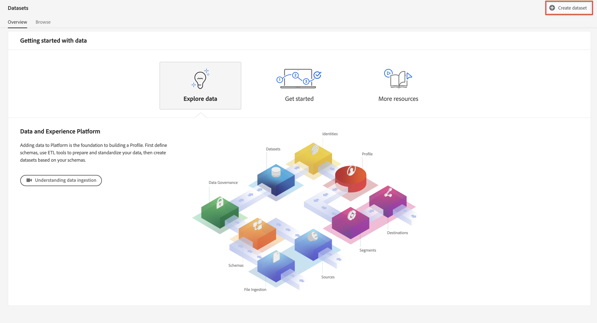
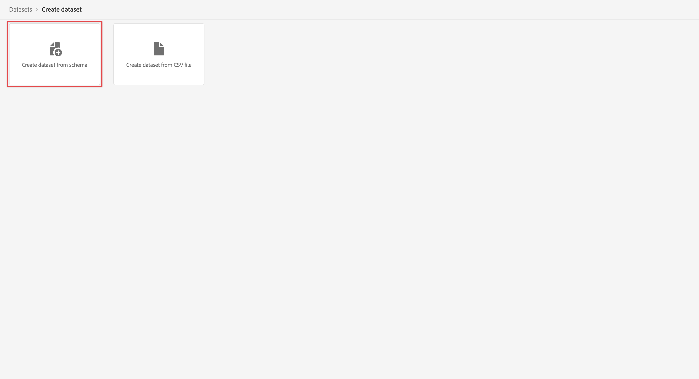

# Creare un set di dati da utilizzare con Customer Journey Analytics {#upgrade-create-dataset}

<!-- markdownlint-disable MD034 -->

>[!CONTEXTUALHELP]
>id="cja-upgrade-dataset-create"
>title="Creare un set di dati in Adobe Experience Platform"
>abstract="Per set di dati si intende la posizione in cui si trovano i dati raccolti. Crea questa posizione in Adobe Experience Platform.  La creazione di un set di dati con uno schema richiede solo alcuni minuti."

<!-- markdownlint-enable MD034 -->

{{upgrade-note-step}}

<!-- Should we single source this instead of duplicate it? The following steps were copied from: /help/data-ingestion/aepwebsdk.md-->

Un set di dati è il costrutto che memorizza e gestisce i dati raccolti in Adobe Experience Platform.

Per creare un set di dati:

1. In Adobe Experience Platform, nella barra a sinistra, seleziona **[!UICONTROL Set di dati]** in [!UICONTROL GESTIONE DATI].

1. Seleziona **[!UICONTROL Crea set di dati]**.

   

1. Seleziona **[!UICONTROL Crea set di dati dallo schema]**.

   

1. Seleziona lo schema creato in precedenza e seleziona **[!UICONTROL Successivo]**.

1. Assegna un nome al set di dati e (facoltativamente) fornisci una descrizione.

   

1. Seleziona **[!UICONTROL Fine]**.

1. Selezionare l&#39;opzione **[!UICONTROL Profilo]**.

   Viene richiesto di abilitare il set di dati per il profilo. Una volta abilitato, il set di dati arricchisce i profili dei clienti in tempo reale con i relativi dati inseriti.

   >[!IMPORTANT]
   >
   >    Puoi abilitare un set di dati per il profilo solo quando lo schema a cui aderisce il set di dati è abilitato anche per il profilo.

   

   Per ulteriori informazioni su come visualizzare, visualizzare in anteprima, creare o eliminare un set di dati, consulta la sezione [Guida all’interfaccia utente dei set di dati](https://experienceleague.adobe.com/docs/experience-platform/catalog/datasets/user-guide.html?lang=it). Puoi anche scoprire come abilitare un set di dati per il profilo cliente in tempo reale.

{{upgrade-final-step}}
