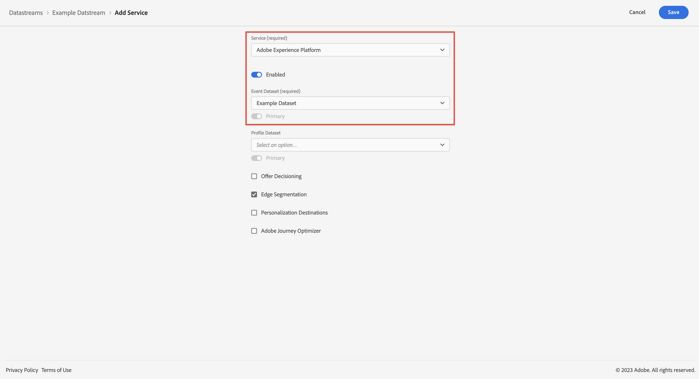

# Aggiungere Platform come servizio a uno stream di dati {#upgrade-addplatform-datastream}

<!-- markdownlint-disable MD034 -->

>[!CONTEXTUALHELP]
>id="cja-upgrade-addplatform-datastream"
>title="Aggiungere Adobe Experience Platform come servizio allo stream di dati"
>abstract="Uno stream di dati richiede uno o più servizi a cui inviare i dati. Configura Adobe Experience Platform come servizio nel tuo stream di dati.  L’aggiunta di servizi a uno stream di dati è un processo semplice che richiede solo pochi minuti."

<!-- markdownlint-enable MD034 -->

{{upgrade-note-step}}

<!-- Should we single source this instead of duplicate it? The following steps were copied from: /help/data-ingestion/aepwebsdk.md-->

Prima di completare i passaggi descritti in questa sezione, deve esistere già un flusso di dati. La data e la modalità di creazione dello stream di dati dipendono dall’implementazione di Adobe Analytics, come segue:

* Se l’implementazione di Adobe Analytics utilizza Web SDK o l’estensione Web SDK, lo stream di dati era disponibile per il tuo ambiente Adobe Analytics prima del processo di aggiornamento.

* Per altre implementazioni di Adobe Analytics, la creazione di uno stream di dati fa parte del processo di aggiornamento, come descritto in [Creare uno stream di dati da utilizzare con Customer Journey Analytics](/help/getting-started/cja-upgrade/cja-upgrade-datastream.md).

Con lo stream di dati disponibile, devi aggiungere Platform as a service:

1. Nell&#39;interfaccia utente di Adobe Experience Platform, seleziona **[!UICONTROL Datastreams]** da [!UICONTROL DATA COLLECTION] nella barra a sinistra.

1. Seleziona lo stream di dati configurato in precedenza. <!--true?-->

1. Selezionare **[!UICONTROL Aggiungi servizio]**.

1. Nella schermata [!UICONTROL Aggiungi servizio]:

   1. Selezionare **[!UICONTROL Adobe Experience Platform]** dall&#39;elenco [!UICONTROL Service].

   1. Assicurarsi che **[!UICONTROL Enabled]** sia selezionato.

   1. Seleziona il set di dati dall&#39;elenco [!UICONTROL Set di dati evento].

      

   1. Lascia le altre impostazioni e seleziona **[!UICONTROL Salva]** per salvare lo stream di dati.

   Il flusso di dati è ora configurato per inoltrare i dati raccolti dal sito Web al set di dati in Adobe Experience Platform.

   Per ulteriori informazioni su come configurare un flusso di dati e come gestire i dati sensibili consulta la sezione [Panoramica dei flussi di dati](https://experienceleague.adobe.com/docs/experience-platform/datastreams/overview.html?lang=it).

{{upgrade-final-step}}
