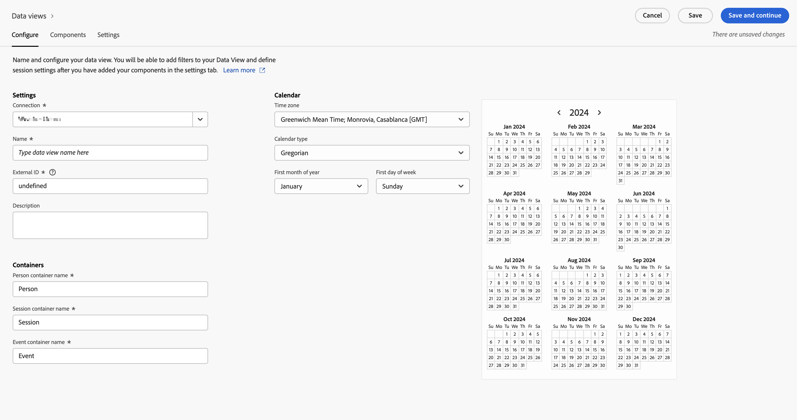

# Creare una visualizzazione dati in Customer Journey Analytics {#upgrade-create-dataview}

<!-- markdownlint-disable MD034 -->

>[!CONTEXTUALHELP]
>id="cja-upgrade-dataview"
>title="Creare una visualizzazione dati in Customer Journey Analytics"
>abstract="Una visualizzazione dati è un contenitore specifico di Customer Journey Analytics che consente di determinare come interpretare i dati da una connessione.  Mentre la creazione iniziale della visualizzazione dati richiede alcuni minuti, la configurazione di ogni dimensione e metrica con le impostazioni dei componenti desiderate può richiedere alcuni giorni. La modifica di queste impostazioni viene applicata retroattivamente, in modo che l’organizzazione possa perfezionarle nel tempo."

<!-- markdownlint-enable MD034 -->

{{upgrade-note-step}}

<!-- Should we single source this instead of duplicate it? The following steps were copied from: /help/data-views/create-dataview.md -->

Per creare una visualizzazione dati occorre creare metriche e dimensioni dagli elementi dello schema o utilizzare componenti standard. Gli elementi dello schema sono prevalentemente dimensioni o metriche, a seconda dei requisiti aziendali. Una volta trascinato un elemento schema in una visualizzazione dati, a destra vengono visualizzate le opzioni con cui è possibile regolare il funzionamento della dimensione o metrica in Customer Journey Analytics.

Per creare una visualizzazione dati:

1. Accedi a [Customer Journey Analytics](https://analytics.adobe.com) e seleziona **[!UICONTROL Visualizzazioni dati]**, facoltativamente da **[!UICONTROL Gestione dati]**, nel menu superiore.

1. Selezionare **[!UICONTROL Crea nuova visualizzazione dati]**. In alternativa, puoi selezionare una visualizzazione dati esistente dal relativo elenco per modificarla.

1. Nella scheda [!UICONTROL **Configura**], specifica un nome per la visualizzazione dati e configurane le impostazioni di base, i componenti e le opzioni di calendario.

   Per informazioni dettagliate su ciascun campo, consulta [Configurare](/help/data-views/create-dataview.md#configure) in [Creare o modificare una visualizzazione dati](/help/data-views/create-dataview.md).

   

1. Seleziona la scheda [!UICONTROL **Componenti**].

   La scheda [!UICONTROL **Componenti**] è quella in cui puoi impostare i componenti di una visualizzazione dati e quindi creare metriche e dimensioni dagli elementi dello schema. Puoi anche utilizzare i componenti standard.

   

1. Dalla scheda [!UICONTROL **Componenti**], trascina gli elementi dello schema dalla barra a sinistra alla sezione [!UICONTROL **Metriche**] o alla sezione [!UICONTROL **Dimensioni**]. Gli elementi dello schema aggiunti diventano metriche o dimensioni nella visualizzazione dati.

   Per informazioni dettagliate sulle opzioni disponibili quando si aggiungono componenti a una visualizzazione dati, consulta [Componenti](/help/data-views/create-dataview.md#components) in [Creare o modificare una visualizzazione dati](/help/data-views/create-dataview.md).

1. Seleziona la scheda [!UICONTROL **Impostazioni**]. Da qui, puoi configurare i segmenti da applicare all’intera visualizzazione dati e configurare il timeout e le metriche della sessione.

   Per informazioni dettagliate sulle opzioni disponibili durante la configurazione delle impostazioni per una visualizzazione dati, consulta [Impostazioni](/help/data-views/create-dataview.md#settings) in [Creare o modificare una visualizzazione dati](/help/data-views/create-dataview.md).

1. Seleziona **[!UICONTROL Salva]** per salvare la configurazione per la visualizzazione dati.

1. Dopo aver specificato tutte le impostazioni desiderate, selezionare **[!UICONTROL Salva e termina]**.

{{upgrade-final-step}}
