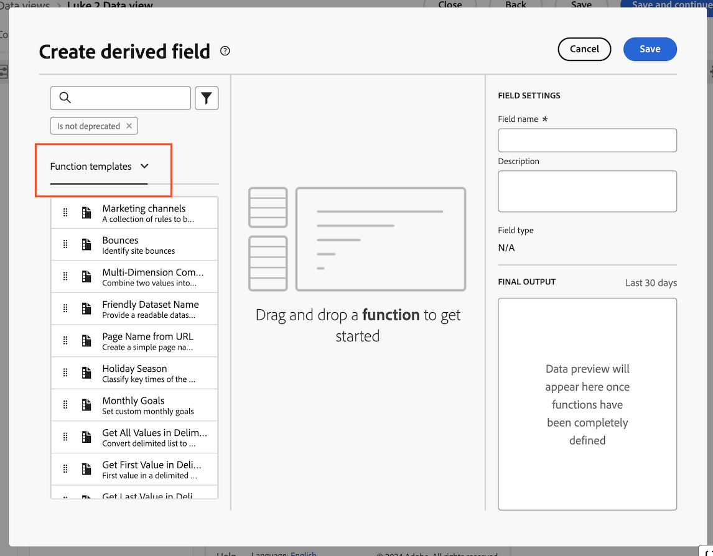

# Creazione di un campo derivato dal canale di marketing per il Customer Journey Analytics {#create-marketing-channel-derived-field}

<!-- markdownlint-disable MD034 -->

>[!CONTEXTUALHELP]
>id="cja-upgrade-marketing-channel"
>title="Creare un campo derivato dal canale di marketing"
>abstract="I campi derivati vengono creati all’interno di una visualizzazione dati.  L&#39;utilizzo di una configurazione del canale di marketing predefinita richiede solo alcuni minuti. La creazione di una configurazione del canale di marketing altamente personalizzata potrebbe richiedere alcune ore."

<!-- markdownlint-enable MD034 -->

>[!NOTE]
> 
>Segui i passaggi descritti in questa pagina solo dopo aver completato tutti i passaggi di aggiornamento precedenti. Puoi seguire i [passaggi di aggiornamento consigliati](/help/getting-started/cja-upgrade/cja-upgrade-recommendations.md#recommended-upgrade-steps-for-most-organizations), oppure puoi seguire i passaggi di aggiornamento generati in modo dinamico per la tua organizzazione con il [questionario di aggiornamento da Adobe Analytics a Customer Journey Analytics](https://gigazelle.github.io/cja-ttv/).
>
>Dopo aver completato i passaggi descritti in questa pagina, continua seguendo i passaggi di aggiornamento consigliati o generati in modo dinamico.

Quando utilizzi il connettore di origine di Analytics, i dati dei canali di marketing fluiscono nel Customer Journey Analytics attraverso tale connettore. Le regole del canale di marketing vengono configurate nella versione tradizionale di Adobe Analytics e alcune regole non sono supportate. Per ulteriori informazioni, vedere [Utilizzare le dimensioni del canale di marketing](/help/use-cases/aa-data/marketing-channels.md).

Per utilizzare i canali di marketing nel Customer Journey Analytics quando si utilizza Experience Platform Web SDK, è possibile utilizzare i campi derivati in una visualizzazione dati per ricreare gli stessi canali di marketing e le stesse regole di elaborazione per il Customer Journey Analytics.

1. In Customer Journey Analytics, seleziona la visualizzazione dati in cui desideri aggiungere canali di marketing.

1. Nella visualizzazione dati, selezionare la scheda **[!UICONTROL Components]**.

1. Seleziona **[!UICONTROL Create derived field]** (Elementi dati) nella barra a sinistra.

1. Nella finestra di dialogo **[!UICONTROL Create derived field]**, selezionare **[!UICONTROL Function templates]** dal menu a discesa.

   

1. Trascinare il modello **[!UICONTROL Marketing channels]** nell&#39;area di lavoro vuota.

1. Personalizza la logica per ciascun canale di marketing per assicurarti che corrisponda alla logica utilizzata per identificare ogni canale nell’ambiente Adobe Analytics.

   Puoi modificare i nomi dei canali di output o aggiungere una logica per identificare canali aggiuntivi specifici dell’organizzazione.

1. Nella colonna di destra, specifica un nome e una descrizione per il canale di marketing.

1. Seleziona **[!UICONTROL Save]**.

   Il nuovo campo derivato viene aggiunto al contenitore Campi derivati >, come parte dei campi Schema nella barra a sinistra della visualizzazione Dati.

1. Continua seguendo i [passaggi di aggiornamento consigliati](/help/getting-started/cja-upgrade/cja-upgrade-recommendations.md#recommended-upgrade-steps-for-most-organizations) o i [passaggi di aggiornamento generati dinamicamente](https://gigazelle.github.io/cja-ttv/).
