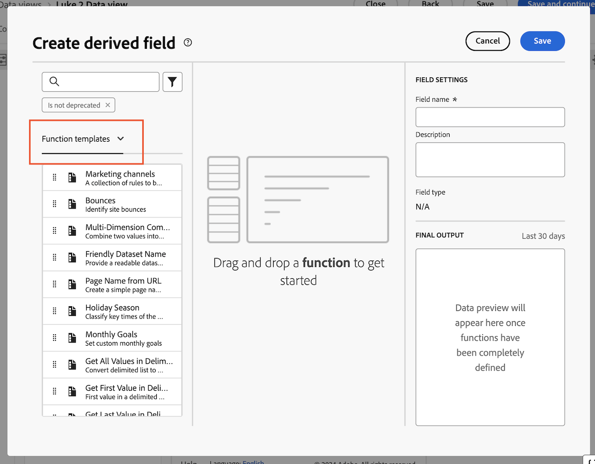

# Creare un campo derivato da un canale di marketing per Customer Journey Analytics {#create-marketing-channel-derived-field}

<!-- markdownlint-disable MD034 -->

>[!CONTEXTUALHELP]
>id="cja-upgrade-marketing-channel"
>title="Creare un campo derivato dal canale di marketing"
>abstract="I campi derivati vengono creati all’interno di una visualizzazione dati.  L’utilizzo di una configurazione predefinita per il canale di marketing richiede solo alcuni minuti, mentre la creazione di una configurazione altamente personalizzata potrebbe richiedere alcune ore."

<!-- markdownlint-enable MD034 -->

{{upgrade-note-step}}

Utilizzando il connettore di origine di Analytics, i dati dei canali di marketing fluiscono in Customer Journey Analytics attraverso tale connettore. Le regole del canale di marketing vengono configurate nella versione tradizionale di Adobe Analytics e alcune regole non sono supportate. Per ulteriori informazioni, consulta [Utilizzare le dimensioni del canale di marketing](/help/use-cases/aa-data/marketing-channels.md).

Per utilizzare i canali di marketing in Customer Journey Analytics quando si utilizza Experience Platform Web SDK, è possibile utilizzare campi derivati in una visualizzazione dati per ricreare gli stessi canali di marketing e le stesse regole di elaborazione per Customer Journey Analytics.

1. In Customer Journey Analytics, seleziona la visualizzazione dati in cui desideri aggiungere canali di marketing.

1. Nella visualizzazione dati, selezionare la scheda **[!UICONTROL Componenti]**.

1. Seleziona **[!UICONTROL Crea campo derivato]** nella barra a sinistra.

1. Nella finestra di dialogo **[!UICONTROL Crea campo derivato]**, seleziona **[!UICONTROL Modelli di funzione]** dal menu a discesa.

   

1. Trascina il modello **[!UICONTROL Canali di marketing]** nell&#39;area di lavoro vuota.

1. Personalizza la logica per ciascun canale di marketing, per assicurarti che corrisponda alla logica utilizzata per identificare ogni canale nell’ambiente Adobe Analytics.

   Puoi modificare i nomi dei canali di output o aggiungere una logica per identificare canali aggiuntivi specifici dell’organizzazione.

1. Nella colonna di destra, specifica un nome e una descrizione per il canale di marketing.

1. Seleziona **[!UICONTROL Salva]**.

   Il nuovo campo derivato viene aggiunto ai Campi derivati > contenitore, come parte dei campi Schema nella barra a sinistra della visualizzazione Dati.

{{upgrade-final-step}}
