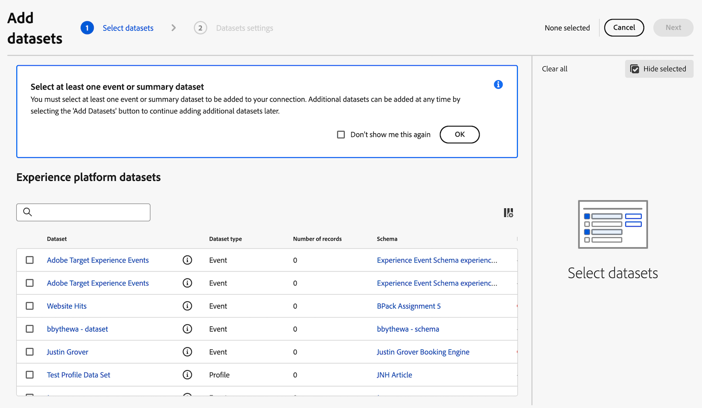

# Aggiungi il set di dati del connettore di origine di Analytics alla connessione

>[!NOTE]
> 
>Segui i passaggi descritti in questa pagina solo dopo aver completato tutti i passaggi di aggiornamento precedenti. Puoi seguire i [passaggi di aggiornamento consigliati](/help/getting-started/cja-upgrade/cja-upgrade-recommendations.md#recommended-upgrade-steps-for-most-organizations), oppure puoi seguire i passaggi di aggiornamento generati in modo dinamico per la tua organizzazione con il [questionario di aggiornamento da Adobe Analytics a Customer Journey Analytics](https://gigazelle.github.io/cja-ttv/).
>
>Dopo aver completato i passaggi descritti in questa pagina, continua seguendo i passaggi di aggiornamento consigliati o generati in modo dinamico.

Dopo aver [creato un connettore di origine Analytics per i dati storici](/help/getting-started/cja-upgrade/cja-upgrade-source-connector.md), viene automaticamente creato un set di dati per i dati di Analytics.

Devi aggiungere questo set di dati creato automaticamente alla stessa connessione creata per l’implementazione dell’SDK web. In questo modo, i dati di Analytics verranno inseriti nella stessa visualizzazione dati di Customer Journey Analytics dei dati dell’SDK per web.

Per aggiungere il set di dati creato automaticamente alla stessa connessione creata per l’implementazione dell’SDK web:

1. In Customer Journey Analytics, seleziona la scheda **[!UICONTROL Connections]**.

1. Seleziona la connessione [creata per l&#39;implementazione dell&#39;SDK Web](/help/getting-started/cja-upgrade/cja-upgrade-connection.md).

1. Seleziona **[!UICONTROL Edit]**.

   

1. Seleziona **[!UICONTROL Add datasets]** in alto a destra.

   

1. Scorri fino al set di dati creato automaticamente al momento della creazione del connettore di origine di Analytics o esegui una ricerca per esso.

   Il nome di questo set di dati è il nome della suite di rapporti, seguito da `midValues`. Ad esempio: `My report suite midValues`

1. Selezionare la casella di controllo accanto al nome del set di dati, quindi selezionare **[!UICONTROL Next]**.

   

1. Specifica le seguenti informazioni:

   <!-- Copied from help/connections/create-connection.md. Should we single source? -->

   | Impostazione | Descrizione |
   | --- | --- |
   | **[!UICONTROL Person ID]** | Disponibile solo per i set di dati evento e profilo. Seleziona un ID persona dall’elenco a discesa delle identità disponibili. Queste identità sono state definite nello schema del set di dati in Experience Platform. Vedi di seguito per informazioni su come utilizzare Identity Map come ID persona.
Se non è presente alcun ID persona tra cui scegliere, significa che uno o più ID persona non sono stati definiti nello schema. Consulta [Definire i campi di identità nell’interfaccia utente](https://experienceleague.adobe.com/it/docs/experience-platform/xdm/ui/fields/identity) per ulteriori informazioni. 
Il valore per l’ID persona selezionato è considerato sensibile a maiuscole e minuscole. Ad esempio: `abc123` e `ABC123` sono due valori diversi. |
   | **[!UICONTROL Timestamp]** | Solo per i set di dati evento e riepilogo, questa impostazione viene settata automaticamente sul campo marca temporale predefinito dagli schemi basati su eventi in Experience Platform. |
   | **[!UICONTROL Timezone]** | Disponibile solo per i dati di riepilogo. Seleziona il fuso orario appropriato per i dati di riepilogo delle serie temporali. |
   | **[!UICONTROL Data source type]** | Seleziona un tipo di origine dati.  I tipi di origini dati includono: <ul><li>[!UICONTROL Web data]</li><li>[!UICONTROL Mobile App data]</li><li>[!UICONTROL POS data]</li><li>[!UICONTROL CRM data]</li><li>[!UICONTROL Survey data]</li><li>[!UICONTROL Call Center data]</li><li>[!UICONTROL Product data]</li><li> [!UICONTROL Accounts data]</li><li> [!UICONTROL Transaction data]</li><li>[!UICONTROL Customer Feedback data]</li><li> [!UICONTROL Other]</li></ul>Questo campo viene utilizzato per esaminare i tipi di origini dati in uso. |

   {style="table-layout:auto"}

1. Nella sezione **[!UICONTROL Import new data]**, lascia disabilitata l&#39;opzione **[!UICONTROL Import all new data]**.

   Poiché utilizzi il set di dati del connettore di origine di Analytics per i dati storici, non desideri trasferire in questo set di dati i dati futuri raccolti.

1. Nella sezione **[!UICONTROL Dataset backfill]**, selezionare **[!UICONTROL Request backfill]**.

1. Definire il periodo da includere nella retrocompilazione immettendo le date di inizio e di fine o selezionando l&#39;icona del calendario .

   Il connettore origine di Analytics importa fino a 13 mesi di dati (indipendentemente dalle dimensioni) per le sandbox di produzione. La retrocompilazione nelle sandbox non di produzione è limitata a 3 mesi.

   >[!IMPORTANT]
   >
   >Indica in modo esplicito le date della richiesta di backfill. La data di fine deve essere la data in cui hai iniziato a raccogliere i dati con l’implementazione dell’SDK web.
   >
   >In alternativa, puoi scegliere una data poco dopo la data in cui hai iniziato a raccogliere i dati con l’implementazione dell’SDK web, quindi utilizzare i segmenti per filtrare i dati sovrapposti.

   <!-- Include any of the following?  Make sure you're explicit as to the dates you request backfill to. You want to request it to the date that you start gathering data with your Web SDK implementation. Also possibly include segments for any overlapping date. So you could request everything and then use a segment to exclude data that you don't want. That way if you need to move up the date, then you could change the date in the filter. Downside would be that you might pay for double rows.  When they do that, they're going to see all schema fields from both their custom schema and their Analytics schema. So they'll need to be cognizant to select the right fields, and never select any Analytics fields, because they will be mapped as part of the source connector. Never select any Analytics field group fields because they'll be mapped.  -->

1. Seleziona **[!UICONTROL Queue backfill]**.

1. Seleziona **[!UICONTROL Add datasets]**, quindi seleziona **[!UICONTROL Save]** per salvare la connessione.

1. Continua seguendo i [passaggi di aggiornamento consigliati](/help/getting-started/cja-upgrade/cja-upgrade-recommendations.md#recommended-upgrade-steps-for-most-organizations) o i [passaggi di aggiornamento generati dinamicamente](https://gigazelle.github.io/cja-ttv/).

