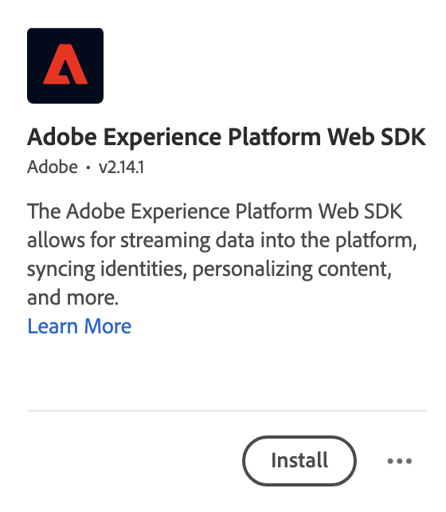
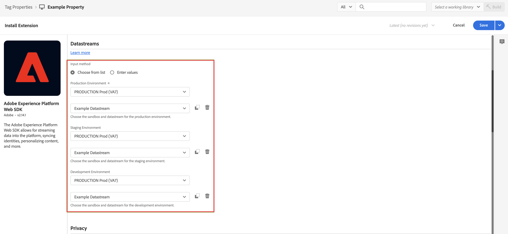

# Aggiungere l’estensione Web SDK al tag {#upgrade-tag-extension}

<!-- markdownlint-disable MD034 -->

>[!CONTEXTUALHELP]
>id="cja-upgrade-tag-extension"
>title="Aggiungere l’estensione Web SDK alla proprietà tag"
>abstract="Aggiungi l’estensione Adobe Experience Platform Web SDK alla tua proprietà tag. L’aggiunta dell’estensione Web SDK alla proprietà tag è semplice e richiede solo pochi minuti per essere completata."

<!-- markdownlint-enable MD034 -->

{{upgrade-note-step}}

Puoi utilizzare la funzione Tags (Tag) in Adobe Experience Platform per implementare sul tuo sito il codice necessario per raccogliere i dati. Questa soluzione per la gestione dei tag consente di implementare il codice e altri requisiti di assegnazione dei tag. I tag offrono un’integrazione diretta con Adobe Experience Platform tramite l’estensione dell’SDK per Web di Adobe Experience Platform.

Le informazioni seguenti descrivono come aggiungere l’estensione Web SDK al tag. Per ulteriori informazioni, consulta [Configurare l’estensione tag Web SDK](https://experienceleague.adobe.com/en/docs/experience-platform/tags/extensions/client/web-sdk/web-sdk-extension-configuration) nella documentazione di Experience Platform. Il Web SDK include il servizio Experience Platform Identity, pertanto non è necessario aggiungere l&#39;estensione del servizio [!UICONTROL Experience Cloud ID] al tag.

Dopo aver [creato un tag](/help/getting-started/cja-upgrade/cja-upgrade-tag-property.md), è necessario configurarlo con l’estensione Adobe Experience Platform Web SDK. In questo modo potrai inviare dati ad Adobe Experience Platform (tramite lo stream di dati).

Per aggiungere l’estensione Web SDK al tag

1. Accedi a experience.adobe.com utilizzando le credenziali Adobe ID.

1. In Adobe Experience Platform, vai a **[!UICONTROL Raccolta dati]** > **[!UICONTROL Tag]**.

1. Seleziona il tag appena creato dall&#39;elenco di [!UICONTROL Proprietà tag] per aprirlo.

1. Seleziona **[!UICONTROL Estensioni]** nella barra a sinistra.

1. Seleziona **[!UICONTROL Catalogo]** nella barra superiore.

1. Cerca o scorri fino all&#39;estensione **[!UICONTROL Adobe Experience Platform Web SDK]**, quindi seleziona **[!UICONTROL Installa]** per installarla.

   

1. Seleziona la sandbox e lo stream di dati creato in precedenza per il tuo [!UICONTROL ambiente di produzione] e (facoltativo) [!UICONTROL ambiente di staging] e [!UICONTROL ambiente di sviluppo].

   

1. Seleziona **[!UICONTROL Salva]**.

{{upgrade-final-step}}
