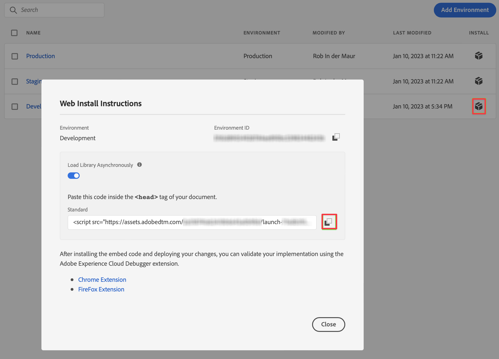

# Implementare il tag loader per l’estensione Web SDK {#upgrade-tag-loader}

<!-- markdownlint-disable MD034 -->

>[!CONTEXTUALHELP]
>id="cja-upgrade-tag-loader"
>title="Implementare il tag di caricamento sul sito"
>abstract="Collabora con il team di sviluppo del tuo sito web per installare il tag di caricamento in ogni pagina del sito.<br><br>Il tempo di completamento di questa attività dipende maggiormente dal tempo di risposta del team di progettazione con cui collabori per distribuire il codice. Alcune organizzazioni che dispongono di team di progettazione altamente adattivi possono completare questo passaggio in alcuni giorni, mentre i team di progettazione con un ampio arretrato di attività potrebbero richiedere un mese o più."

<!-- markdownlint-enable MD034 -->

{{upgrade-note-step}}

Devi installare il tag sul sito web che desideri monitorare, il che implica il posizionamento del codice nel tag di intestazione del modello del sito web.

Il processo seguente descrive come ottenere il codice che fa riferimento al tag. Per ulteriori informazioni, consulta le [Guide all’implementazione per tag e inoltro eventi](https://experienceleague.adobe.com/it/docs/experience-platform/tags/get-started/implementation-guides) nella documentazione di Experience Platform.

Per ottenere il codice che fa riferimento al tag:

1. Accedi a experience.adobe.com utilizzando le credenziali Adobe ID.

1. In Adobe Experience Platform, vai a **[!UICONTROL Raccolta dati]** > **[!UICONTROL Tag]**.

1. Nella pagina **[!UICONTROL Proprietà tag]**, seleziona il tag appena creato dall&#39;elenco delle proprietà per aprirlo.

1. Seleziona **[!UICONTROL Ambienti]** nella barra a sinistra.

1. Dall’elenco degli ambienti, seleziona il pulsante di installazione (casella) corretto.

   Nella finestra di dialogo [!UICONTROL Istruzioni di installazione Web], seleziona il pulsante Copia accanto al codice di script che dovrebbe essere simile al seguente:

   ```
   <script src="https://assets.adobedtm.com/2a518741ab24/.../launch-...-development.min.js" async></script>>
   ```

   

1. Seleziona **[!UICONTROL Chiudi]**.

   Invece del codice per l’ambiente di sviluppo, potresti aver selezionato un altro ambiente (gestione temporanea, produzione) in base al punto in cui stai distribuendo l’SDK Web di Adobe Experience Platform.

   Per ulteriori informazioni, consulta la sezione [Ambienti](https://experienceleague.adobe.com/docs/experience-platform/tags/publish/environments/environments.html?lang=it).

{{upgrade-final-step}}
