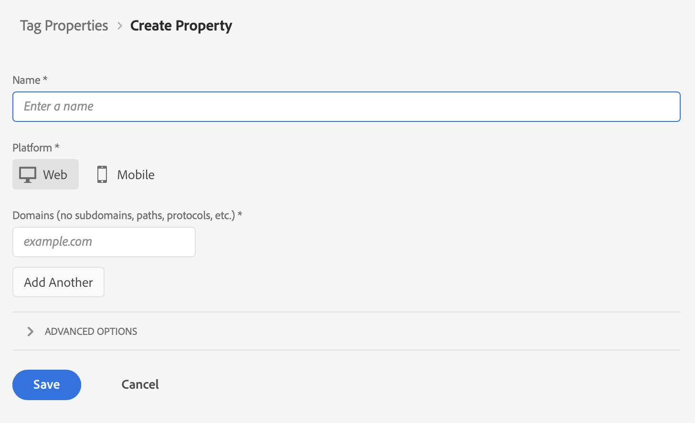

# Creare un tag per la proprietà {#upgrade-tag-property}

<!-- markdownlint-disable MD034 -->

>[!CONTEXTUALHELP]
>id="cja-upgrade-tag-property"
>title="Creare una proprietà tag nella raccolta dati di Adobe Experience Platform"
>abstract="L’utilizzo dei tag è lo standard tipico per la raccolta dei dati. Crea un tag nell’interfaccia di Adobe Experience Platform in modo da poter aggiornare le variabili di raccolta dati in qualsiasi momento.  La creazione di una proprietà tag può essere completata in pochi clic e richiede solo pochi minuti."

<!-- markdownlint-enable MD034 -->

{{upgrade-note-step}}

Puoi utilizzare la funzione Tags (Tag) in Adobe Experience Platform per implementare sul tuo sito il codice necessario per raccogliere i dati. Questa soluzione per la gestione dei tag consente di implementare il codice e altri requisiti di assegnazione dei tag. I tag offrono un’integrazione diretta con Adobe Experience Platform tramite l’estensione dell’SDK per Web di Adobe Experience Platform.

Le informazioni seguenti descrivono come creare un tag per la proprietà. Per ulteriori informazioni, consulta [Configurare l’estensione tag Web SDK](https://experienceleague.adobe.com/en/docs/experience-platform/tags/extensions/client/web-sdk/web-sdk-extension-configuration) nella documentazione di Experience Platform. Il Web SDK include il [!UICONTROL servizio Adobe Experience Cloud ID] in modo nativo, pertanto non è necessario aggiungere l&#39;estensione del servizio ID al tag.

Una proprietà è fondamentalmente un contenitore che riempi con estensioni, regole, elementi dati e librerie durante la distribuzione di tag sul sito. Molte persone creano una proprietà per ciascun sito Web (o gruppo di siti strettamente correlati) in cui desiderano distribuire lo stesso set di tag. Per ulteriori informazioni sulle proprietà, consulta [Proprietà](https://experienceleague.adobe.com/it/docs/experience-platform/tags/admin/companies-and-properties) nella documentazione sulla raccolta dati di Experience Platform.

Per creare un tag per la proprietà:

1. Accedi a experience.adobe.com utilizzando le credenziali Adobe ID.

1. In Adobe Experience Platform, vai a **[!UICONTROL Raccolta dati]** > **[!UICONTROL Tag]**.

1. Seleziona **[!UICONTROL Nuova proprietà]**.

   Assegna un nome al tag, seleziona **[!UICONTROL Web]** e immetti un nome di dominio. Seleziona **[!UICONTROL Salva]** per continuare.

   

{{upgrade-final-step}}
